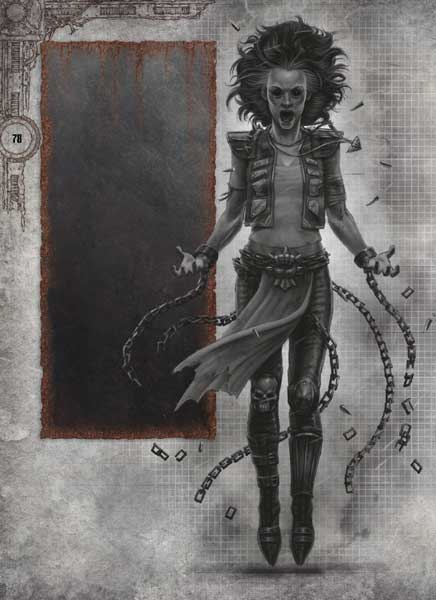
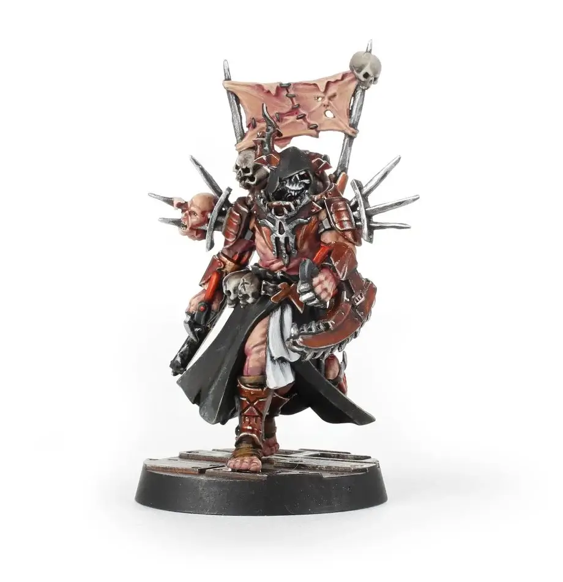
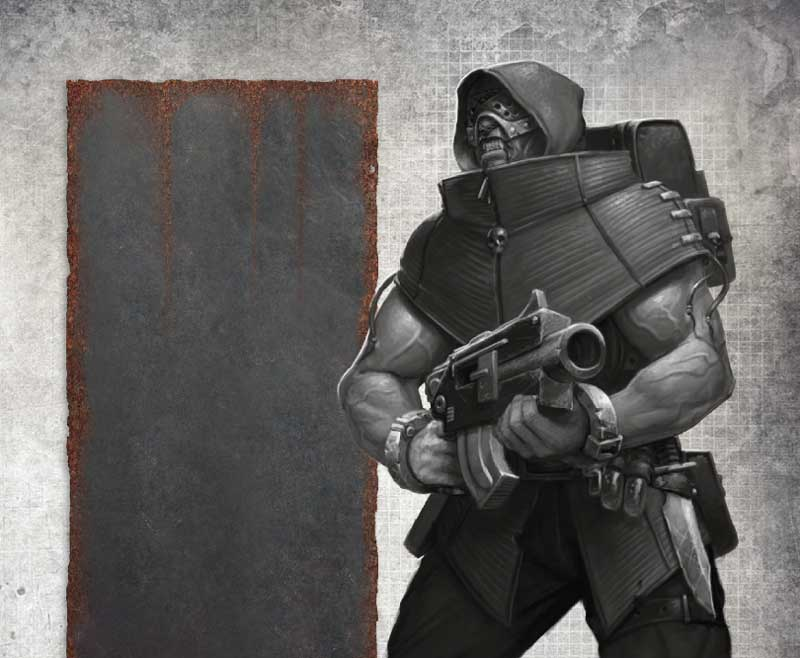
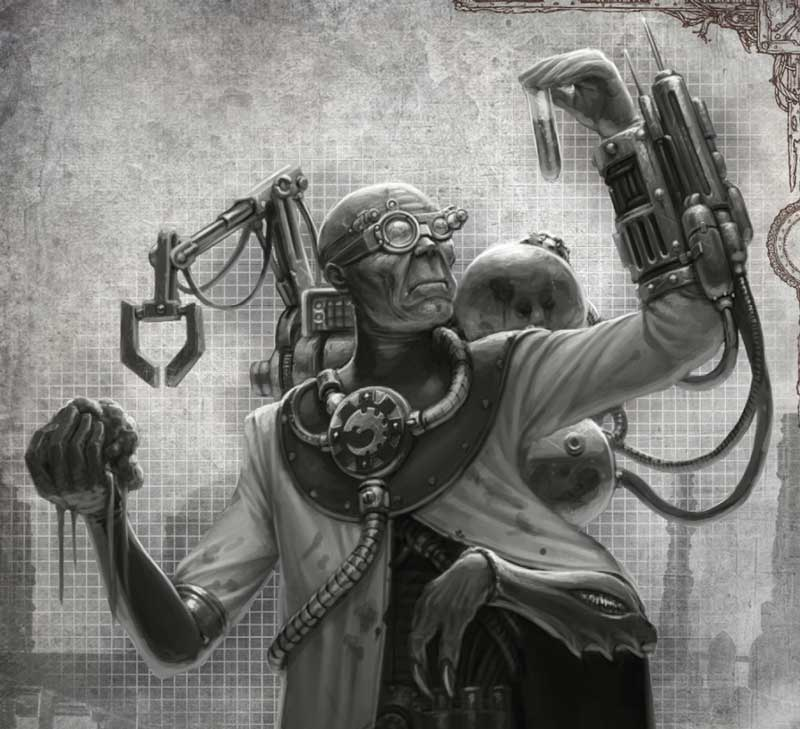
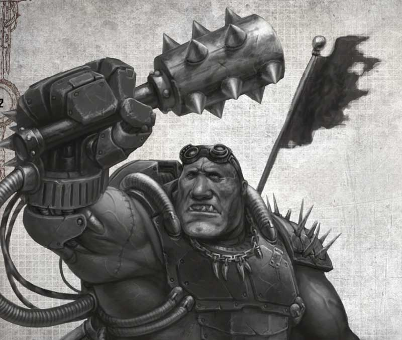
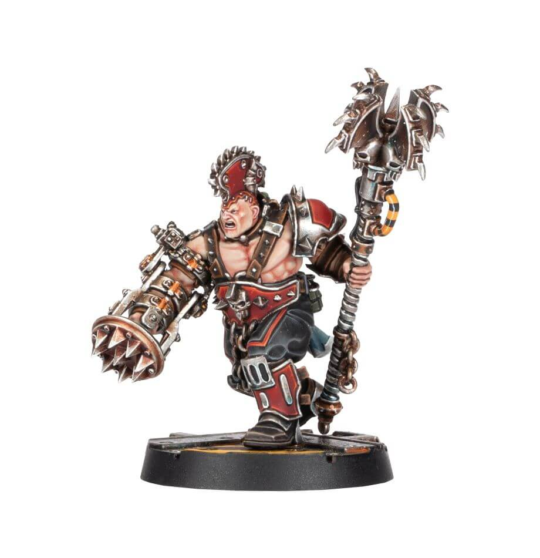

# Outlaw Bounty Hunters

An Outlaw gang can recruit 0-1 Outlaw Bounty Hunter at a time.

<FighterCard cost="165">

## Alyce Shivver

_One of Slate Merdena’s twelve daughters, Alyce was destined to take her place among the hierarchy of the House of Iron. Her gang, the Wasteland Wolves, ranged further from the Spider Points than any of her peers, raiding ash waste nomad settlements and bringing in ore trains from as far afield as Guntown and Big Hole. It was Alyce’s thirst for adventure that was to be her undoing. Out in the wastes her gang found a pentagrammic casket containing a daemonic entity known as the Shivver. The Daemon ravaged her gang, feasting on their souls and corrupting their flesh until Alyce alone remained. It had not counted upon the tenacity of Slate’s daughter, however, and when it sought to turn her into its puppet, Alyce instead made the Daemon hers. _

_Alyce’s victory was not without cost. In taming the Daemon within, Alyce became a possessed creature, half human, half warp spawn. Her ambition was magnified and where once she saw a life as an Orlock Road Boss, she now coveted complete control of the House of Iron. The piteous whispers of the Shivver also taught Alyce dark new powers and woke within her a dormant psychic spark. By the time Alyce returned to Hive Primus, it was as the master of an outlaw gang of deviants and malcontents, bound together by the Shivver’s potent telepathic chains. So began Alyce’s war against the Clan Houses, one she has been waging ever since._

|  M  | WS  | BS  |  S  |  T  |  W  |  I  |  A  | Ld  | Cl  | Wil | Int |
| :-: | :-: | :-: | :-: | :-: | :-: | :-: | :-: | :-: | :-: | :-: | :-: |
| 5”  | 3+  | 4+  |  3  |  3  |  2  | 3+  |  2  | 6+  | 5+  | 7+  | 6+  |

<WeaponStats>

| Weapon                        |    Rg S    |     Rg L     |    Ac S    |   Ac L   |    S     |    AP    |    D     |     Am     | Traits                                                                                                                                                                                                                                                 |
| :---------------------------- | :--------: | :----------: | :--------: | :------: | :------: | :------: | :------: | :--------: | :----------------------------------------------------------------------------------------------------------------------------------------------------------------------------------------------------------------------------------------------------- |
| Stub gun - dumdum rounds | 6" 5" | 12" 10" | +2 +1 | - - | 3 4 | - - | 1 1 | 4+ 4+ | <Tooltip type="traits" content="plentiful">Plentiful</Tooltip>, <Tooltip type="traits" content="sidearm">Sidearm</Tooltip> <Tooltip type="traits" content="limited">Limited</Tooltip>, <Tooltip type="traits" content="sidearm">Sidearm</Tooltip> |
| Fighting Knife                |     -      |      E       |     -      |    -     |    S     |    -1    |    1     |     -      | <Tooltip type="traits" content="backstab">Backstab</Tooltip>. <Tooltip type="traits" content="melee">Melee</Tooltip>                                                                                                                                   |

</WeaponStats>

**Skills:** [Headbutt](/docs/gang-fighters-and-their-weaponry/skills/#4-headbutt), [True Grit](/docs/gang-fighters-and-their-weaponry/skills/#5-true-grit).  
**Wargear:** [Mesh armour](/docs/armoury/armour#mesh-armour), [respirator](/docs/armoury/personal-equipment#respirator), [photo-goggles](/docs/armoury/personal-equipment#photo-goggles).

#### Wyrd Powers (Unsanctioned)

**Telekenesis - Assail (Basic):** Alyce Shivver uses the force of her
will to push enemies and objects from their path. Immediately make a ranged attack against an enemy
fighter within 12" and line of sight. If hit, move the
target D3" in any direction – if they were Standing, they become Prone and Pinned after moving. If they
come into base contact with a Standing fighter or
any terrain, they stop moving and suffer a Strength
3, Damage 1 hit. If they come into base contact with
another fighter, that fighter also suffers a Strength 3, Damage 1 hit, and becomes Prone and Pinned.

**Telekenesis - Levitation (Basic), Continuous Effect:** Alyce
Shivver rises upon invisible aetheric updrafts, floating
just above ground level as she is held aloft by a
writhing curtain of warp energy. For as long as this
Wyrd Power is maintained, Alyce Shivver’s Movement
is increased by 3" and she ignores all terrain, may
move freely between levels without restriction,
and can never fall. She may not however ignore
impassable terrain or walls, and may not end her
movement with her base overlapping an obstacle or
another fighter’s base. Furthermore, she cannot be
Pinned. As she is only levitated a few inches above
the ground, this ability does not affect lines of sight or
the use of cover.

**Telepathy - Maddening Visions (Basic):** Nearby enemies find
themselves struck by nightmarish apparitions as
Alyce Shivver becomes a conduit for unfettered warp
energy. Until the End phase of this round, make a
Willpower check for any enemy fighter who ends their
turn within 3" of Alyce Shivver. If the check is failed,
the fighter is driven temporarily insane and becomes
subject to the Insane Condition.

#### Special Rules

**Bounty Hunter:** As a Bounty Hunter, Alyce Shivver is subject to the Dead, Not Alive, Claiming Bounties and “We’ll Get Our Bit…” special rules.

**Outlaw:** Alyce Shivver is an Outlaw Hired Gun.

_Source: The Book of Ruin_

</FighterCard>

<FighterCard cost="205">

## Eightfold Harvest Lord

**_Chaotic only_**

_Even on a world as violent as Necromunda the crimes of the Eightfold Harvest Lord have turned the stomachs of hardened Enforcers and jaded Guilders. The arrival of the Harvest Lord always precedes the spreading of starvation, madness and cannibalism. During the fall of Hive Arcos, it was the Harvest Lord who spread terror among Hive City preceding the uprising, decorating the Eight Points with the skins of its victims. Even after law and order broke down, it still hunted the survivors among the shadows of Arcos, dissecting its victims in their hundreds and leaving the remains hanging like gory banners from dome supports._

_It is unlikely the Harvest Lord is human, or if it was once mortal it has long since transformed into something else. It moves with an unnatural stuttering gait, like a vid missing frames, its tall lanky form wrapped in fluttering strips of human skin. As it advances upon its prey, the Harvest Lord’s bladed fingers click and twitch; its head, face hidden behind a hideous mask and too-wide daemonic grin, twisting fromside to side. It is said that the Harvest Lord is drawn to the most vicious acts of murder, eager to spread the blood of the living, and on Necromunda there is no shortage of blood to be spilled._

|  M  | WS  | BS  |  S  |  T  |  W  |  I  |  A  | Ld  | Cl  | Wil | Int |
| :-: | :-: | :-: | :-: | :-: | :-: | :-: | :-: | :-: | :-: | :-: | :-: |
| 5”  | 2+  | 6+  |  4  |  4  |  3  | 3+  |  3  | 7+  | 5+  | 6+  | 7+  |

<WeaponStats>

| Weapon                      | Rg S | Rg L | Ac S | Ac L |  S  | AP  |  D  | Am  | Traits                                                                                                                                                                   |
| :-------------------------- | :--: | :--: | :--: | :--: | :-: | :-: | :-: | :-: | :----------------------------------------------------------------------------------------------------------------------------------------------------------------------- |
| Paired heavy chain cleavers |  -   |  E   |  -   |  +1  | S+2 | -2  |  2  |  -  | <Tooltip type="traits" content="melee">Melee</Tooltip>, <Tooltip type="traits" content="paired">Paired</Tooltip>, <Tooltip type="traits" content="sever">Sever</Tooltip> |
| Fighting Knife              |  -   |  E   |  -   |  -   |  S  | -1  |  1  |  -  | <Tooltip type="traits" content="backstab">Backstab</Tooltip>. <Tooltip type="traits" content="melee">Melee</Tooltip>                                                     |

</WeaponStats>

**Skills:** [Avatar of Blood](/docs/gang-fighters-and-their-weaponry/skills/gang-specific-skills#1-avatar-of-blood), [Killing Blow](/docs/gang-fighters-and-their-weaponry/skills/gang-specific-skills#5-killing-blow), [Slaughterborn](/docs/gang-fighters-and-their-weaponry/skills/gang-specific-skills#6-slaughterborn).  
**Wargear:** [Butcher’s mask](/docs/gangs/gang-lists/corpse-grinder-cult/#butcher-leader), [plate mail armour](/docs/armoury/armour#plate-mail), [Corpse Grinder Cult icon](/docs/armoury/personal-equipment#cult-icon-corpse-grinder).

#### Special Rules

**Bounty Hunter:** As a Bounty Hunter, the Eightfold Harvest Lord is subject to the Dead, Not Alive, Claiming Bounties and “We’ll Get Our Bit…” special rules

**Outlaw:** The Eightfold Harvest Lord is an Outlaw Hired Gun (see page 38 of Necromunda: The Book of Judgement).

**Chaotic:** The Eightfold Harvest Lord can only be hired by Corpse Grinder Cult, Chaos Cult or Chaos Corrupted gangs.

_Source: The Book of Ruin_

</FighterCard>

<FighterCard cost="220">

## Czarn the Cyberoth, Outlaw Outcasts Leader

:::note DESIGNER’S COMMENTARY: NEW RULES FOR OUTCAST GANGS

Presented below are the rules for a new Dramatis Personae that will allow you to recreate the events described in Daemons of Meridian. If the Arbitrator wishes, this Dramatis Personae may be used during a campaign.

:::

|  M  | WS  | BS  |  S  |  T  |  W  |  I  |  A  | Ld  | Cl  | Wil | Int |
| :-: | :-: | :-: | :-: | :-: | :-: | :-: | :-: | :-: | :-: | :-: | :-: |
| 4”  | 3+  | 5+  |  5  |  5  |  3  | 4+  |  2  | 7+  | 5+  | 6+  | 7+  |

**Skills:** [Bull Charge](/docs/gang-fighters-and-their-weaponry/skills/#1-bull-charge), [Crushing Blow](/docs/gang-fighters-and-their-weaponry/skills/#3-crushing-blow), [Unstoppable](/docs/gang-fighters-and-their-weaponry/skills/#6-unstoppable).  
**Weapons:** Warp Flamer Claws.  
**Wargear:** [Light carapace armour](/docs/armoury/armour#carapace).  
**Special Rules:** Warp Corrupted Abomination, Automated Repair Systems, Outlaw Outcasts Leader, Outlaw.

Special Rules

**Warp Corrupted Abomination:** Czarn may only be hired by an Outcasts, Helot Chaos Cults or Chaos Corrupted gang.

**Automated Repair Systems:** By tapping directly into a power source, Czarn is capable of repairing almost any level of damage that he has taken. He may attempt to repair himself as a Post-battle action – in order to do so, roll a D6. On a 3+ all Lasting Injuries are removed from this fighter.

**Outlaw Outcasts Leader:** This fighter may either be selected as an Outcasts Leader when making an Outcasts gang (see Book of the Outcast), replacing the normal option for an Outcasts Leader, or may be hired as a Bounty Hunter, following all the normal rules for Hired Guns.

**Outlaw:** Czarn is an Outlaw Hired Gun.

Designer’s Note: Modelling Czarn The Cyberoth

When modelling Czarn for use in your games of Necromunda, you may use a standard Ambot to represent him shortly after his transformation. Alternatively, if wishing to show him later on when the Warp has twisted and altered his form, there is almost no limit to the possibilities for converting him – feel free to let your imagination run wild!

_Source: Apocrypha: Daemons of Meridian_

</FighterCard>

<FighterCard cost="250">

## Vandoth the Fallen

**_Non-chaotic only_**

_Vandoth is a figure of legend on Necromunda and stories are told of his deeds from the sky-hives of the Stormlands to the toxic shores of the Great Scavvie Sea. A giant of a man bound in layers of crimson muscle, Vandoth can crush a man’s skull with one hand and turn aside blades with his hardened skin. Most disturbing of all though are the tales of Vandoth’s unquenchable thirst for blood. It is said that hidden behind his mask are long canine fangs, and after he kills, the gigantic warrior stoops over his prey to drain them dry. Outlaws sometimes pay for Vandoth’s aid with the promise of coin, weapons or glory, though the giant mostly does as he pleases, aiding others when his interests align with theirs. _

_There are conflicting accounts as to where Vandoth comes from and who (or even what) he is. Some insist the massive warrior was once a Goliath, somehow corrupted in the vat with tainted blood. Others believe Vandoth was once one of Lord Helmawr’s personal guards, until he was genetically altered into a vampiric beast for the ruler of Necromunda’s amusement. Then there are the stories that the massive fighter is a thing of Chaos, though the savagery Vandoth shows to those corrupted by the Dark Gods would seem to discount this. All that is known for sure is Vandoth has wandered Necromunda for centuries at least, his face hidden behind a mask and an ancient oversized boltgun at his side._

| M       | WS  | BS  | S   | T   | W   | I       | A   | Ld  | Cl  | Wil | Int |
| ------- | --- | --- | --- | --- | --- | ------- | --- | --- | --- | --- | --- |
| 5” (4”) | 3+  | 3+  | 4   | 4   | 3   | 3+ (4+) | 3   | 7+  | 5+  | 6+  | 7+  |

<WeaponStats>

| Weapon         | Rg S | Rg L | Ac S | Ac L |  S  | AP  |  D  | Am  | Traits                                                                                                               |
| :------------- | :--: | :--: | :--: | :--: | :-: | :-: | :-: | :-: | :------------------------------------------------------------------------------------------------------------------- |
| Boltgun        | 12"  | 24"  |  +1  |  -   |  4  | -1  |  2  | 4+  | <Tooltip type="traits" content="rapid-fire">Rapid Fire (1)</Tooltip>                                                 |
| Fighting Knife |  -   |  E   |  -   |  -   |  S  | -1  |  1  |  -  | <Tooltip type="traits" content="backstab">Backstab</Tooltip>. <Tooltip type="traits" content="melee">Melee</Tooltip> |

</WeaponStats>

**Skills:** [Crushing Blow](/docs/gang-fighters-and-their-weaponry/skills/#3-crushing-blow), [Fearsome](/docs/gang-fighters-and-their-weaponry/skills/#2-fearsome), [Hurl](/docs/gang-fighters-and-their-weaponry/skills/#5-hurl), [Spring Up](/docs/gang-fighters-and-their-weaponry/skills/#5-spring-up)  
**Wargear:** [Heavy carapace armour](/docs/armoury/armour#carapace), [respirator](/docs/armoury/personal-equipment#respirator), [stimm-slug stash](/docs/armoury/personal-equipment#stimm-slug-stash)

#### Second Profile

The profile in parentheses is modified by Carapace (heavy).

#### Special Rules

**Bounty Hunter:** As a Bounty Hunter, Vandoth the Fallen is subject to the Dead, Not Alive, Claiming Bounties and “We’ll Get Our Bit…” special rules.

**Outlaw:** Vandoth the Fallen is an Outlaw Hired Gun.

**Agent of Order:** Vandoth the Fallen may not be hired by Helot Chaos Cults, Corpse Grinder Cult or Chaos Corrupted gangs.

_Source: The Book of Ruin_

</FighterCard>

<FighterCard cost="310">

## The Hermaphage Magos

_When the heretic Hermiatus was brought to justice, he left behind a legacy of genetic crimes. The greatest of these was the Genestealer strain he set loose upon Necromunda, though no less damning were the genetic gifts he passed on to the xenos cult of Secundus. For though Hermiatus himself has been captured and purged by the Inquisition, fragments of his DNA live on in the species he had sought to eradicate. The Hermaphage Magos is the purest expression of this, a psychic being dredged up from the xeno-racial memory and drawn to Necromunda to complete the heretical magos’ work. If the Hermaphage is an aberration within its own kind, or perhaps merely the first stage of some kind of profane evolution, is unclear, however, the creature seems to enjoy an elevated position within the xenos cults of Necromunda, and is powerfully psychic._

_When the Hermaphage Magos finds a proto-cult within the depths of a hive it is as if the hybrid creatures recognise their genetic father and immediately subsume themselves to his will. In truth, the creature is primarily an amplifier for the psychic strain spread by the alien lord of Hive Secundus; a vessel through which that dark thing might see beyond the walls of its radioactive prison. This has made the Hermaphage a prize hunted by countless bounty hunters and the best of Lord Helmawr’s agents, the Imperial House rightly fearful of what the coming of such a creature could mean for the future of its world._

|  M  | WS  | BS  |  S  |  T  |  W  |  I  |  A  | Ld  | Cl  | Wil | Int |
| :-: | :-: | :-: | :-: | :-: | :-: | :-: | :-: | :-: | :-: | :-: | :-: |
| 5”  | 3+  | 4+  |  4  |  3  |  3  | 3+  |  3  | 7+  | 6+  | 6+  | 7+  |

<WeaponStats>

| Weapon             | Rg S | Rg L | Ac S | Ac L |  S  | AP  |  D  | Am  | Traits                                                                                                                    |
| :----------------- | :--: | :--: | :--: | :--: | :-: | :-: | :-: | :-: | :------------------------------------------------------------------------------------------------------------------------ |
| Las pistol         |  8"  | 12"  |  +1  |  -   |  3  |  -  |  1  | 2+  | <Tooltip type="traits" content="sidearm">Sidarm</Tooltip>, <Tooltip type="traits" content="plentiful">Plentiful</Tooltip> |
| Razor-sharp talons |  -   |  E   |  -   |  -   | S+1 | -2  |  3  |  -  | <Tooltip type="traits" content="melee">Melee</Tooltip>, <Tooltip type="traits" content="rending">Rending</Tooltip>        |

</WeaponStats>

**Skills:** [Crushing Blow](/docs/gang-fighters-and-their-weaponry/skills/#3-crushing-blow), [Fearsome](/docs/gang-fighters-and-their-weaponry/skills/#2-fearsome), [Hurl](/docs/gang-fighters-and-their-weaponry/skills/#5-hurl), [Spring Up](/docs/gang-fighters-and-their-weaponry/skills/#5-spring-up)  
**Wargear:** [Hardened flak](/docs/armoury/armour#flak-hardened-layered), [respirator](/docs/armoury/personal-equipment#respirator).

#### Wyrd Powers (Unsanctioned)

**Telepathy - Hypnosis (Basic):** With little more than a piercing
stare, the Hermaphage Magos can dominate the
minds of the weaker-willed. Select an enemy fighter
that has not yet activated this round within 9" and line
of sight of the Hermaphage Magos. If the Willpower
check to perform this action is successful, that fighter
may only perform a single Move (Simple) action when
activated this round.

**Telepathy - Mind Control (Basic):** Twitching and spasming
under the control of the Hermaphage Magos, an
enemy fighter is forced to slowly raise their weapon
and take aim upon one of theqir friends. Select an
enemy fighter that is within 9" of the Hermaphage
Magos. That fighter immediately makes a Shoot
(Basic) action, even if they have already activated
this round, targeting an eligible fighter from
their gang, chosen by the player controlling the
Hermaphage Magos.

**Telekenesis - Force Blast (Basic):** Any enemy fighters within 3" of this Psyker are immediately pushed D3+1" directly
away. If this movement would push a fighter from a
platform or into a pitfall, stop at the edge and take an
Initiative test for them. If the test is passed, they are
placed Prone at the edge. If the test is failed, they will
fall. If this movement is interrupted by a wall or other
impassable terrain, the fighter is immediately Pinned
and takes a hit with a Strength equal to the number of
inches rolled for the push distance.

#### Special Rules

**Bounty Hunter:** As a Bounty Hunter, the Hermaphage Magos is subject to the Dead, Not Alive, Claiming Bounties and “We’ll Get Our Bit…” special rules.

**Outlaw:** The Hermaphage Magos is an Outlaw Hired Gun.

_Source: The Book of Ruin_

</FighterCard>

<FighterCard cost="320">

## T.H.R.U.G. 12 'Sparky'

**_Goliath or Slave Ogryns only_**

_Unlike humans, a servitor Ogryn retains most of their mind when augmented for mono-task duties – there simply isn’t that much to excise in the first place! T.H.R.U.G. 12 was a servitor for House Van Saar, toiling within the Archetek Helix workshops of Hive Primus. For his duties, T.H.R.U.G. was augmented with a voltrik harness and an arc-welder, a halo of sparking energy surrounding him as he worked on the think-synths and storm-chambers of the Helix. A freak accident, however, was to alter the Ogryn. While hauling massive MIU cables for a Clan Archetek, a power surge tore through from the spire, rippling out throughout Hive City. Everywhere systems overloaded and workers were fried at their stations, while in the Helix, green bolts of lightning danced among the primary cogitators. One of these bolts struck T.H.R.U.G., carrying with it the collected knowledge of the Van Saar home-engrams. The Ogryn rose smoking from the floor of Helix, his tiny brain buzzing with new thoughts and ideas… one word among them booming out above the others: “Freedom!”._

_After the accident, the Ogryn proved too unpredictable for the Helix, so the Clan sent T.H.R.U.G. down- hive to fight with one of the House gangs – the Daeyglow Dragons. The Ogryn fought well in the clan’s gang wars, but each cycle the word kept coming back into his mind. It was not until the Daeyglow Dragons brought on a Ratling slopper that things finally clicked for T.H.R.U.G., however. The slopper, Epyff Anyi, simply pointed out that given the Ogryn’s size and strength he should be in charge. After the ensuing violence abated, T.H.R.U.G. and Anyi were the only ones left standing, and the abhuman uprising had begun._

_It was not long before other slave Ogryns, and even Beastmen, mutants and more than a few bored Ratlings were following T.H.R.U.G. around, dubbing the unusually intelligent Ogryn ‘Sparky’ or ‘Smarticus.’ Rival gangs, corrupt crime lords and outland monsters were not enough to bring the big man down. Now the Merchants Guild have taken notice of T.H.R.U.G.’s rebellion, and bounty posters plaster the underhive offering huge rewards for his capture – or execution._

|  M  | WS  | BS  |  S  |  T  |  W  |  I  |  A  | Ld  | Cl  | Wil | Int |
| :-: | :-: | :-: | :-: | :-: | :-: | :-: | :-: | :-: | :-: | :-: | :-: |
| 5”  | 2+  | 5+  |  5  |  5  |  3  | 3+  |  3  | 7+  | 5+  | 7+  | 6+  |

**Skills:** [Headbutt](/docs/gang-fighters-and-their-weaponry/skills/#4-headbutt), [Inspirational](/docs/gang-fighters-and-their-weaponry/skills/#2-inspirational), [True Grit](/docs/gang-fighters-and-their-weaponry/skills/#5-true-grit).  
**Weapons:** Las cutter, augmetic fist, Maul (club).  
**Wargear:** [Light carapace armour](/docs/armoury/armour#carapace), [photo-goggles](/docs/armoury/personal-equipment#photo-goggles), [stimm-slug stash](/docs/armoury/personal-equipment#stimm-slug-stash).

#### Group Activation (1)

Only applies to friendly Faction fighters when hired by a Slave Ogryn gang.

#### Runaway

If captured and Sold to the Guilders, the capturing gang receives +D6x10 credits

_Source: House of Chains_

</FighterCard>

<FighterCard cost="225">

## Durgan Kill-Fist

_Before the Great Darkness, little was known about Durgan Kill-Fist. A rabble rouser and outlaw pit fighter, his reputation was built upon what little information leaked out of the underhives of Hive Trazior. Stories had him as a rebel leader of an outlaw Goliath gang, more interested in turning the hive into their own personal fighting arena than doing anything for House Goliath or its allies. In the mayhem that followed the ‘death’ of Lord Helmawr, Durgan emerged from the shadows to tame the cultist uprisings in the bowels of Hive Traizor. With an army of ‘Knuckle’ boys, he turned the tide in confrontations such as the battle for the Blistering Waysand the defence of Boneyard IX. Outcasts flocked to Durgan’s banner; many disenfranchised nobles, guildersand even other clanners were drawn to the big man’s powerful charisma and animal violence._

_After Trazior, Durgan and his boys headed out into the wastes and came to the aid of Cinderak City during the first great Ash Waste Nomad raids. Here, Durgan made a stand in the Brokebone Fighting Pits, opening its doors to the wastes and welcoming any challengers to join him on the killing floor. It was during this period of extreme close quarters violence that Durgan earned the title Champion of the Brokebone, Goliath gangers from all across the wastes praising his strength and fury. However, when the Over-tyrant called on Durgan to attack Cinderak City and drive out the Escher, he once again turned his back on his clan, taking his outcasts and heading out into the wilderness._

|  M  | WS  | BS  |  S  |  T  |  W  |  I  |  A  | Ld  | Cl  | Wil | Int |
| :-: | :-: | :-: | :-: | :-: | :-: | :-: | :-: | :-: | :-: | :-: | :-: |
| 5”  | 3+  | 3+  |  4  |  5  |  2  | 3+  |  3  | 4+  | 4+  | 8+  | 7+  |

**Skills:** [Inspirational](/docs/gang-fighters-and-their-weaponry/skills/#2-inspirational), [Unstoppable](/docs/gang-fighters-and-their-weaponry/skills/#6-unstoppable).  
**Weapons:** Kill-fist, Cruncher.  
**Wargear:** Frag Grenades, Furnace plates.  
**Special Rules:** Outcast Leader, Outlaw.

#### Outcasts Leader

This fighter may either be selected
as an Outcasts Leader when making an Outcasts gang, replacing the
normal option for an Outcasts Leader, or may be hired
as a Bounty Hunter, in which case he is subject to the
“You Get What You Pay For”, Dead, Not Alive, Claiming
Bounties and “We’ll Get Our Bit…” special rules.

#### Outlaw

Durgan Kill-Fist is an Outlaw Hired Gun.

_Source: The Aranthian Succession: Vaults of Temenos_

</FighterCard>
