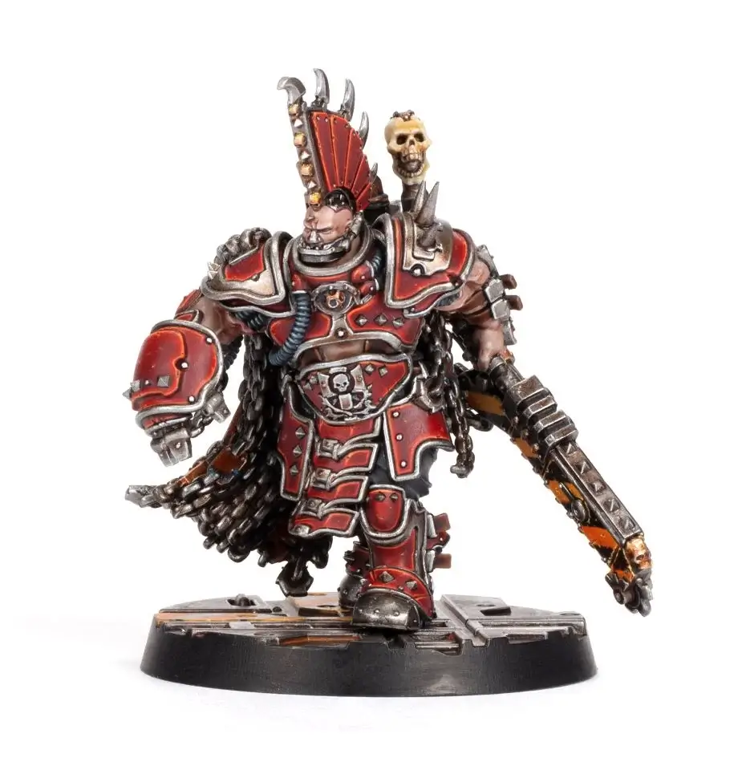
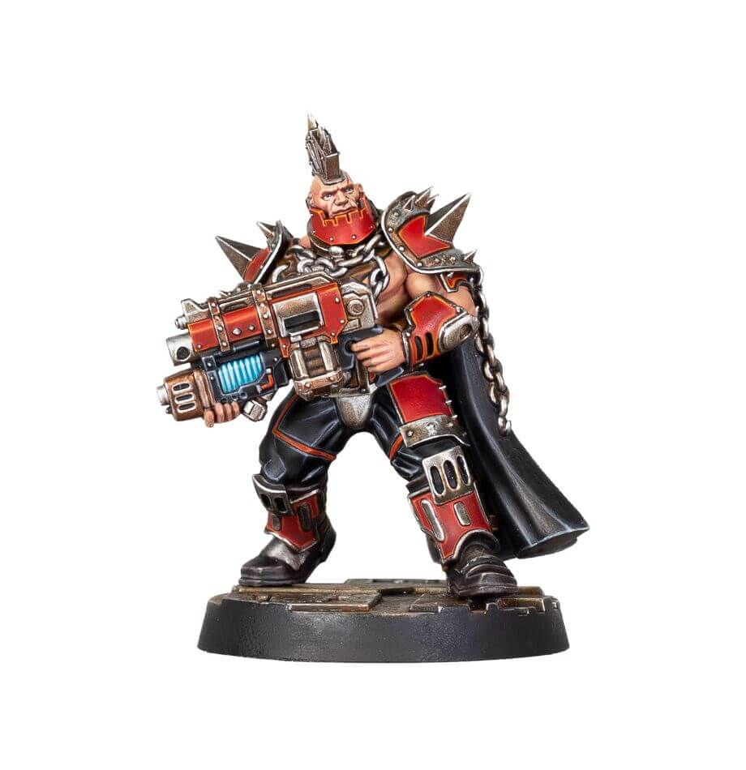

import Tabs from '@theme/Tabs';
import TabItem from '@theme/TabItem';

# Agents

<FighterCard cost="*">

## 0-1 House Agents

A gang can recruit no more than one House Agent at a time. To represent the variety
of renowned champions within each House, the recruiting player chooses one of the
following profiles to use:

<Tabs>
<TabItem value="cawdor" label="Cawdor" default>

|  M  | WS  | BS  |  S  |  T  |  W  |  I  |  A  | Ld  | Cl  | Wil | Int |
| :-: | :-: | :-: | :-: | :-: | :-: | :-: | :-: | :-: | :-: | :-: | :-: |
| 5"  | 4+  | 3+  |  3  |  3  |  2  | 4+  |  1  | 4+  | 6+  | 5+  | 6+  |
| 5"  | 3+  | 5+  |  3  |  3  |  2  | 3+  |  2  | 5+  | 6+  | 4+  | 7+  |
| 4"  | 3+  | 4+  |  3  |  4  |  1  | 4+  |  2  | 7+  | 6+  | 7+  | 8+  |

</TabItem>
<TabItem value="delaque" label="Delaque" default>

|  M  | WS  | BS  |  S  |  T  |  W  |  I  |  A  | Ld  | Cl  | Wil | Int |
| :-: | :-: | :-: | :-: | :-: | :-: | :-: | :-: | :-: | :-: | :-: | :-: |
| 5"  | 4+  | 3+  |  3  |  3  |  2  | 4+  |  1  | 4+  | 6+  | 5+  | 6+  |
| 5"  | 3+  | 5+  |  3  |  3  |  2  | 3+  |  2  | 5+  | 6+  | 4+  | 7+  |
| 4"  | 3+  | 4+  |  3  |  4  |  1  | 4+  |  2  | 7+  | 6+  | 7+  | 8+  |

</TabItem>
<TabItem value="escher" label="Escher" default>

|  M  | WS  | BS  |  S  |  T  |  W  |  I  |  A  | Ld  | Cl  | Wil | Int |
| :-: | :-: | :-: | :-: | :-: | :-: | :-: | :-: | :-: | :-: | :-: | :-: |
| 5"  | 3+  | 3+  |  3  |  3  |  2  | 3+  |  2  | 5+  | 6+  | 6+  | 7+  |
| 5"  | 2+  | 4+  |  3  |  3  |  2  | 3+  |  3  | 7+  | 6+  | 8+  | 8+  |
| 5"  | 2+  | 4+  |  3  |  3  |  2  | 2+  |  2  | 6+  | 5+  | 8+  | 8+  |

</TabItem>
<TabItem value="goliath" label="Goliath" default>

|  M  | WS  | BS  |  S  |  T  |  W  |  I  |  A  | Ld  | Cl  | Wil | Int |
| :-: | :-: | :-: | :-: | :-: | :-: | :-: | :-: | :-: | :-: | :-: | :-: |
| 4"  | 3+  | 3+  |  4  |  4  |  2  | 4+  |  2  | 7+  | 6+  | 9+  | 9+  |
| 4"  | 2+  | 5+  |  4  |  4  |  2  | 4+  |  2  | 7+  | 5+  | 9+  | 9+  |
| 4"  | 5+  | 2+  |  4  |  4  |  2  | 4+  |  2  | 7+  | 6+  | 9+  | 9+  |

</TabItem>
<TabItem value="orlock" label="Orlock" default>

|  M  | WS  | BS  |  S  |  T  |  W  |  I  |  A  | Ld  | Cl  | Wil | Int |
| :-: | :-: | :-: | :-: | :-: | :-: | :-: | :-: | :-: | :-: | :-: | :-: |
| 5"  | 3+  | 3+  |  3  |  3  |  3  | 4+  |  2  | 5+  | 5+  | 5+  | 7+  |
| 4"  | 2+  | 5+  |  4  |  3  |  2  | 3+  |  2  | 6+  | 6+  | 6+  | 7+  |
| 4"  | 5+  | 2+  |  3  |  4  |  2  | 3+  |  2  | 5+  | 6+  | 6+  | 7+  |

</TabItem>
<TabItem value="vansaar" label="Van Saar">

|  M  | WS  | BS  |  S  |  T  |  W  |  I  |  A  | Ld  | Cl  | Wil | Int |
| :-: | :-: | :-: | :-: | :-: | :-: | :-: | :-: | :-: | :-: | :-: | :-: |
| 4"  | 4+  | 2+  |  3  |  3  |  2  | 5+  |  1  | 4+  | 5+  | 6+  | 6+  |
| 5"  | 3+  | 4+  |  3  |  3  |  2  | 4+  |  2  | 5+  | 6+  | 6+  | 5+  |
| 5"  | 4+  | 3+  |  3  |  3  |  2  | 4+  |  1  | 6+  | 5+  | 5+  | 4+  |

</TabItem>

</Tabs>

**Special Rules:** \*Petition, Gang Hierarchy (Champion), Group Activation (1), “You Get What You Pay For”.

Special Rules

**\*Petition:** A gang does not simply hire a House Agent. Instead, a House Agent may
be dispatched to aid a gang when a petition is made by a gang leader. If a gang
wishes to hire a House Agent, the controlling player must roll on the following table
during the appropriate step of the pre-battle sequence:

| D6+Rep | Result                                                                                                                                                                                                                                         |
| :----: | :--------------------------------------------------------------------------------------------------------------------------------------------------------------------------------------------------------------------------------------------- |
|  1-5   | The House heeds the gang’s plea for aid and a House Agent is dispatched. The gang may hire a House Agent for this battle for **40 credits**.                                                                                                   |
|  6-10  | The House reluctantly agrees to send aid to the gang, but it will cost them. The gang may hire a House Agent for this battle for **80 credits**.                                                                                               |
| 11-15  | The House feels the gang is capable of fighting its own battles. The gang may not hire a House Agent for this battle.                                                                                                                          |
|  16+   | The House is angered that such a capable and notorious gang would petition for further aid. The gang may not hire a House Agent for this battle and must pay a fine of 2D6x10 credits to the House as punishment for making foolish petitions. |

Note that a gang may make a petition to hire a House Agent or it may roll on the
House Favours table. It may not do both.

**Gang Hierarchy (Champion):** During a battle, should this fighter pass a Bottle test,
friendly Van Saar fighters without this special rule that have not already taken a
Bottle test this round and that are within 6" of this fighter will automatically pass
their Bottle test for that round.

**Group Activation (1):** When a fighter with this special rule is activated, their
controlling player can choose to activate a number of additional Ready friendly Van
Saar fighters equal to the number shown in brackets that are within 3" of this fighter
as part of a ‘Group Activation’:

- The controlling player must nominate all of the fighters who will be activated in this way before any of them are activated.
- Once all participants of the Group Activation have been nominated, the controlling player selects one and activates them as normal, fully resolving their activation before selecting and activating the next. Each fighter activates individually; groups do not activate simultaneously.

Additional fighters with this special rule activated in this way may not themselves use
this special rule during this activation.

**“You Get What You Pay For”:** Unlike other fighters, House Agents are not counted
during the Choose Crew step of the pre-battle sequence. Instead, at the end of this
step, any House Agents available to the gang may be added to the crew, regardless
of the Crew Selection method in use. This may take the number of fighters in a
starting crew above the number specified by the scenario.

Skills

A House Agent may take either three skills determined at random, or one skill
determined at random and one skill chosen by the recruiting player. Each skill is
chosen from the following skill sets: Brawn, Combat, Ferocity, Leadership, Tech or
Shooting (as described in the Necromunda Rulebook). To determine a random skill,
the player declares which skill set they are generating the skill from and rolls a D6,
re-rolling if the House Agent already has that skill. Choosing a skill is a simple matter
of picking the desired skill from the sets available.

Equipment

A House Agent may be equipped with up to 150 credits worth of weapons and Wargear chosen for free from your house equipment list. They may be armed with up to three weapons, only one of which may have the Unwieldy trait, and this counts as two weapon choices. Note that the value of these weapons and Wargear should be included when determining Gang Rating.

Lore

_The Clan Houses of Necromunda are at once dependent upon one another for their mutual prosperity and deadly rivals that seek to damage or destroy one another. Each controls its own share of the industry and resource that makes Necromunda so vital to the Imperium, jealously guarding its rights and power against rivals and enemies._

_Often in the long history of Necromunda such rivalries have exploded into harmful civil wars, wars that damage industry and commerce. In the millennia since the ascendancy of House Helmawr such wars have been… discouraged, and Houses that would take up arms and threaten the status quo dealt with harshly. Yet war and conflict are only natural. The Clan Houses fulfil their need to draw one another’s blood through the eternal struggle of the gangs, proxy warfare in the cramped habs and manufactoria replacing open battle and keeping the wide avenues and clan residences of the upper hive safe._

_Many loyal scions of the Clan Houses have risen to positions of power and influence as gang fighters of great renown. Such famed warriors are often deployed as agents by the lords they serve, sent to aid gangs beset by enemies. These agents can be considered as both weapons of their masters’ will and demonstrations of their power. Their arrival in the midst of a raging gang war sows fear in both allies and enemies alike, for their presence represents not just the interests of their masters, but highlights the failings of the local gangs to protect those interests…_

_Source: Published in all House of X books_

</FighterCard>

## List of Law-abiding Agents

<FighterCard cost="40/80">

### 0-1 Generic (Cawdor)

|  M  | WS  | BS  |  S  |  T  |  W  |  I  |  A  | Ld  | Cl  | Wil | Int |
| :-: | :-: | :-: | :-: | :-: | :-: | :-: | :-: | :-: | :-: | :-: | :-: |
| 5"  | 4+  | 3+  |  3  |  3  |  2  | 4+  |  1  | 4+  | 6+  | 5+  | 6+  |
| 5"  | 3+  | 5+  |  3  |  3  |  2  | 3+  |  2  | 5+  | 6+  | 4+  | 7+  |
| 4"  | 3+  | 4+  |  3  |  4  |  1  | 4+  |  2  | 7+  | 6+  | 7+  | 8+  |

**Law Abiding:**

- **Pious:** Can re-roll Rally tests if the result is 2 (before modifiers).
- Choose equipment from Cawdor leader's list.

</FighterCard>

<FighterCard cost="40/80">

### 0-1 Generic (Delaque)

|  M  | WS  | BS  |  S  |  T  |  W  |  I  |  A  | Ld  | Cl  | Wil | Int |
| :-: | :-: | :-: | :-: | :-: | :-: | :-: | :-: | :-: | :-: | :-: | :-: |
| 5"  | 4+  | 3+  |  3  |  3  |  2  | 4+  |  1  | 4+  | 6+  | 5+  | 6+  |
| 5"  | 3+  | 5+  |  3  |  3  |  2  | 3+  |  2  | 5+  | 6+  | 4+  | 7+  |
| 4"  | 3+  | 4+  |  3  |  4  |  1  | 4+  |  2  | 7+  | 6+  | 7+  | 8+  |

#### Psychoteric Mastery (+30)

Can be recruited as an Unsanctioned Psyker (with 1 Psychoteric Wyrd Power). This cost affects gang rating and must also be paid on top of the standard petition fee (even if it is free).

</FighterCard>
<FighterCard cost="40/80">

### 0-1 Generic (Escher)

|  M  | WS  | BS  |  S  |  T  |  W  |  I  |  A  | Ld  | Cl  | Wil | Int |
| :-: | :-: | :-: | :-: | :-: | :-: | :-: | :-: | :-: | :-: | :-: | :-: |
| 5"  | 3+  | 3+  |  3  |  3  |  2  | 3+  |  2  | 5+  | 6+  | 6+  | 7+  |
| 5"  | 2+  | 4+  |  3  |  3  |  2  | 3+  |  3  | 7+  | 6+  | 8+  | 8+  |
| 5"  | 2+  | 4+  |  3  |  3  |  2  | 2+  |  2  | 6+  | 5+  | 8+  | 8+  |

</FighterCard>

<FighterCard cost="40/80">

### 0-1 Generic (Goliath)

|  M  | WS  | BS  |  S  |  T  |  W  |  I  |  A  | Ld  | Cl  | Wil | Int |
| :-: | :-: | :-: | :-: | :-: | :-: | :-: | :-: | :-: | :-: | :-: | :-: |
| 4"  | 3+  | 3+  |  4  |  4  |  2  | 4+  |  2  | 7+  | 6+  | 9+  | 9+  |
| 4"  | 2+  | 5+  |  4  |  4  |  2  | 4+  |  2  | 7+  | 5+  | 9+  | 9+  |
| 4"  | 5+  | 2+  |  4  |  4  |  2  | 4+  |  2  | 7+  | 6+  | 9+  | 9+  |

</FighterCard>

<FighterCard cost="40/80">

### 0-1 Generic (Orlock)

**Cost:** 40/80

|  M  | WS  | BS  |  S  |  T  |  W  |  I  |  A  | Ld  | Cl  | Wil | Int |
| :-: | :-: | :-: | :-: | :-: | :-: | :-: | :-: | :-: | :-: | :-: | :-: |
| 5"  | 3+  | 3+  |  3  |  3  |  3  | 4+  |  2  | 5+  | 5+  | 5+  | 7+  |
| 4"  | 2+  | 5+  |  4  |  3  |  2  | 3+  |  2  | 6+  | 6+  | 6+  | 7+  |
| 4"  | 5+  | 2+  |  3  |  4  |  2  | 3+  |  2  | 5+  | 6+  | 6+  | 7+  |

**Legendary Names:** 2 random (re-roll duplicates) or 1 custom.

</FighterCard>

<FighterCard cost="40/80">

### 0-1 Generic (Van Saar)

|  M  | WS  | BS  |  S  |  T  |  W  |  I  |  A  | Ld  | Cl  | Wil | Int |
| :-: | :-: | :-: | :-: | :-: | :-: | :-: | :-: | :-: | :-: | :-: | :-: |
| 4"  | 4+  | 2+  |  3  |  3  |  2  | 5+  |  1  | 4+  | 5+  | 6+  | 6+  |
| 5"  | 3+  | 4+  |  3  |  3  |  2  | 4+  |  2  | 5+  | 6+  | 6+  | 5+  |
| 5"  | 4+  | 3+  |  3  |  3  |  2  | 4+  |  1  | 6+  | 5+  | 5+  | 4+  |

</FighterCard>

<FighterCard cost="100/200">

### Ajex Gorgoth

**_Goliath only_**

_The Fist of Hive Primus is the largest Goliath enclave on Necromunda, and Ajex Gorgoth is its master. One of the eight Alphas of Hive Primus, he serves Over-tyrant Varran Gor by ruling the manufactorums, slave pits, fighting arenas and forges of the Fist. Unlike his counterparts in other Clan Houses, Ajex is far from some middling bureaucrat or hive overseer, content to live his life counting quotas and gathering up tithe chits. The Lord of the Fist is a far more ‘hands on’ master, either fighting in the House of Pain – the Fist’s largest fighting pit – or descending into the underhive to expand the territories of the clan and gather slaves for its factories._

_Ajex’s long and bloody history began in the forge pits of Vat City, gathering up molten- slag spilled from the great weapon presses. A Natborn, Ajex’s cunning was apparent even then, the future Alpha using cast-off metal to fashion his own weapons. Over the following years, Ajex fought his way up to lead the Forge Lords gang, augmenting his body with home-made bionics and blades, including replacing his nose when it was bitten off in a fight. His ‘powered’ armour is something he fashioned himself, the weight far beyond what most normal fighters couldhope to carry. Fed on dirty promethium, it emits clouds of greasy black smoke, but also gives his servo claw the strength to rip off an Ambot’s head. Ajex eventually became the ruler of the Fist when he defeated its previous Alpha, whose skull he still carries around on a trophy rack fixed to his back. Varran Gor is watching Ajex’s career with great interest, lest Gor’s skull also end up adorning the Alpha’s armour._

| M       | WS  | BS  | S   | T   | W   | I       | A   | Ld  | Cl  | Wil | Int |
| ------- | --- | --- | --- | --- | --- | ------- | --- | --- | --- | --- | --- |
| 4" (3") | 2+  | 5+  | 5   | 4   | 3   | 3+ (4+) | 4   | 8+  | 5+  | 6+  | 7+  |

_\*Numbers is brackets are due to wearing Heavy Carapace armour._

**Skills:** [Bull Charge](/docs/gang-fighters-and-their-weaponry/skills/#1-bull-charge), Immovable Stance, Naaargah!  
**Weapons:** Powered servo claw, great chainsword.  
**Wargear:** Carapace (heavy), [respirator](/docs/armoury/personal-equipment#respirator).

_Source: House of Chains_

</FighterCard>

<FighterCard cost="100/200">

### Arachnotek Golem

**_Van Saar only_**

|  M  | WS  | BS  |  S  |  T  |  W  |  I  |  A  | Ld  | Cl  | Wil | Int |
| :-: | :-: | :-: | :-: | :-: | :-: | :-: | :-: | :-: | :-: | :-: | :-: |
| 5"  | 3+  | 3+  |  5  |  5  |  3  | 3+  |  3  |  ?  |  ?  |  ?  |  ?  |

<WeaponStats>

| Weapon                     | Rg S | Rg L | Acc S | Acc L | Str | Ap  |  D  | Ammo | Traits                                                                                                                                                                                     |
| :------------------------- | :--: | :--: | :---: | :---: | :-: | :-: | :-: | :--: | :----------------------------------------------------------------------------------------------------------------------------------------------------------------------------------------- |
| 'Hystrar' energy projector |  8"  | 16"  |  +1   |   -   |  5  | -1  |  1  |  3+  | <Tooltip type="traits" content="rapid-fire">Rapid Fire (3)</Tooltip>, <Tooltip type="traits" content="reckless">Reckless</Tooltip>, <Tooltip type="traits" content="shock">Shock</Tooltip> |
| Shock claw                 |  -   |  E   |   -   |   -   | S+1 | -1  |  2  |  -   | <Tooltip type="traits" content="melee">Melee</Tooltip>, <Tooltip type="traits" content="power">Power</Tooltip>, <Tooltip type="traits" content="shock">Shock</Tooltip>                     |

</WeaponStats>

**Skills:** As host, plus: [Catfall](/docs/gang-fighters-and-their-weaponry/skills/#1-catfall), [Clamber](/docs/gang-fighters-and-their-weaponry/skills/#2-clamber), [Cold & Calculating](/docs/gang-fighters-and-their-weaponry/skills/gang-specific-skills#1-cold--calculating), [Mental Mastery](/docs/gang-fighters-and-their-weaponry/skills/gang-specific-skills#3-mental-mastery), [Rad-phaged](/docs/gang-fighters-and-their-weaponry/skills/gang-specific-skills#5-rad-phaged).  
**Wargear:** [Light carapace (4+)](/docs/armoury/armour#carapace), [[bio-booster](/docs/armoury/personal-equipment#bio-booster)](/docs/armoury/personal-equipment#bio-booster), [respirator](/docs/armoury/personal-equipment#respirator).  
**Special Rules:** \*Petition, Combined Consciousness, Abominable Intelligence, Seemingly Invulnerable.

Special Rules

**\*Petition:** A Van Saar gang does not simply hire the Arachnotek Golem. Instead, it may agree to aid a gang when
a petition is made by a gang leader. If a gang wishes to hire the Arachnotek Golem, the controlling player must roll on the following table during the appropriate step of the prebattle sequence:

**Combined Consciousness:** The Arachnotek Golem does not have a consciousness of its own, as others might understand such things, and relies instead upon the thoughts and memories of others to give it a semblance of self-awareness.

Therefore, when it joins a gang, the controlling player must choose a fighter to loan their consciousness to it. This can even be a fighter that is currently In Recovery. This donor fighter is effectively removed from the gang for the duration of the battle and replaced by the Arachnotek Golem.

For the duration of the battle, all characteristics on the Arachnotek Golem’s profile which are presented as a question mark (?) are replaced by the characteristics of the donor fighter. For the duration of the battle, the Arachnotek Golem gains the skills of the donor fighter.

**Abominable Intelligence:** Should the gang the Arachnotek Golem has joined win the battle, the donor fighter is returned with their faculties intact. However, should the gang lose the battle, the Arachnotek Golem deems them worthless and leaves immediately, taking its new-found memories with it. The donor fighter is left a drooling imbecile – their Leadership, Cool, Willpower and Intelligence characteristics are all reduced to 12+.

**Seemingly Invulnerable:** The Arachnotek Golem itself feels no pain. The Arachnotek Golem may make a 5+ save roll against any attack made against it. This save cannot be modified by a weapon’s Armour Piercing value.

Lore

_The Arachnotek Golem is a technological horror born from the deranged imagination of the Archeotek, Sater Davos. It began its existence as a means for the Van Saar to cheat death. This was in the centuries before the clan perfected their environment suits, and Davos dabbled in full cybernetica bodies as replacements for the failing flesh of his people. It is said that dead and dying Van Saar Archeoteks were brought before the Golem, where they breathed their last upon its iron skin, and gave over their fading engrams to the mechanical man. The theory was that they would live on as ghosts in the machine spirit of the Golem, and the great minds of the Van Saar might somehow be preserved. Like so many things devised by the Archeoteks, the Arachnotek Golem was both a great success and a great failure for the clan. Unfortunately for Davos, and all who would come after him, the engramic coding imprinted on the Golem could never find purchase, and so the mind of the deceased would live on in the machine for a time before fading – meaning more dead and dying had to be brought before it so it might enjoy some semblance of life. Of course, even in this damaged state the Golem found its place within the clan._

_Centuries later, the Arachnotek Golem is a tool of revenge. Its body has been added to over the years to make it a device of war, towering over most mortal hivers, its armoured torso held aloft on spider legs and armed with an assortment of archaeo-arcane weaponry created by some of the most powerful Archeoteks to have ever lived. Bold Van Saar gangs might petition the services of the Golem by offering up one of their brothers or sisters so the machine might absorb their engramic spirit for a time – such a melding is not without its risks, however, and can leave the donor little more than a blithering idiot._

_Source: House of Artifice_

</FighterCard>

<FighterCard cost="40/80">

### Athera & Stix

**_Escher & Lady Credo's Rebellion only_**

### Athera

|  M  | WS  | BS  |  S  |  T  |  W  |  I  |  A  | Ld  | Cl  | Wil | Int |
| :-: | :-: | :-: | :-: | :-: | :-: | :-: | :-: | :-: | :-: | :-: | :-: |
| 5"  | 2+  | 3+  |  3  |  3  |  2  | 2+  |  3  | 7+  | 5+  | 6+  | 7+  |

<WeaponStats>

| Weapon                       | Rg S | Rg L | Acc S | Acc L | Str | Ap  |  D  | Ammo | Traits                                                                                                                                                                                                                                                                                                         |
| :--------------------------- | :--: | :--: | :---: | :---: | :-: | :-: | :-: | :--: | :------------------------------------------------------------------------------------------------------------------------------------------------------------------------------------------------------------------------------------------------------------------------------------------------------------- |
| Master-crafted Chainaxe |  -   |  E   |   -   |  +1   | S+1 | -1  |  1  |  -   | <Tooltip type="traits" content="disarm">Disarm</Tooltip>, <Tooltip type="traits" content="master-crafted">Master-crafted</Tooltip>, <Tooltip type="traits" content="melee">Melee</Tooltip>, <Tooltip type="traits" content="parry">Parry</Tooltip>, <Tooltip type="traits" content="rending">Rending</Tooltip> |
| Plasma Pistol                |
| - low                        |  6"  | 12"  |  +2   |   -   |  5  | -1  |  2  |  5+  | <Tooltip type="traits" content="scarce">Scarce</Tooltip>, <Tooltip type="traits" content="sidearm">Sidearm</Tooltip>                                                                                                                                                                                           |
| - maximal                    |  6"  | 12"  |  +1   |   -   |  7  | -2  |  3  |  5+  | <Tooltip type="traits" content="scarce">Scarce</Tooltip>, <Tooltip type="traits" content="sidearm">Sidearm</Tooltip>, <Tooltip type="traits" content="unstable">Unstable</Tooltip>                                                                                                                             |

</WeaponStats>

**Skills:** [Acrobatic](/docs/gang-fighters-and-their-weaponry/skills/gang-specific-skills#1-acrobatic), [Combat Master](/docs/gang-fighters-and-their-weaponry/skills/#2-counter-attack).  
**Wargear:** [Light carapace (4+)](/docs/armoury/armour#carapace).

#### Adina's Champion

- After deployment, challenge an enemy fighter.
- Gain the following until attacking any other model:
  - +1 A & [Spring Up](/docs/gang-fighters-and-their-weaponry/skills/#5-spring-up) (Agility).

#### Favoured of Stix

Stix is always deployed within 3" (Exotic Beast).

#### Petition

A gang allied with the Lady Credo's Rebellion can petition to have her join them. Roll on the generic Agent petition table before the battle.

### Stix (Caryatid)

|  M  | WS  | BS  |  S  |  T  |  W  |  I  |  A  | Ld  | Cl  | Wil | Int |
| :-: | :-: | :-: | :-: | :-: | :-: | :-: | :-: | :-: | :-: | :-: | :-: |
| 6"  | 5+  |  -  |  2  |  2  |  1  | 2+  |  1  | 7+  | 7+  | 8+  | 8+  |

**Weapons:** None (always make unarmed attacks).

#### Omen of Fortune

While within 3" of its owner, the owner may pass a Willpower test to avoid being hit (once per activation). Make the test immediately after a successful roll to hit has been made against the fighter. The attack counts as missed. Place Templates and Blasts as normal for the purposes of determining hits against other models, but the owner is assumed to have dodged clear.

:::danger House Rule (Necrodamus)

Save can be made only once per round.

:::

#### Precognition

- 3+ save (unmodifiable by AP).
- 4+ save (bonus, invulnerable) against Blast/Template only. If successful, this fighter does not count as being hit.

#### Flight

Ignores all terrain, moves freely between levels without restriction and can never fall. May not ignore impassable terrain or walls and may not end its movement with its base overlapping an obstacle or the base of another fighter.

_The gene-sister of Adina, Athera has stood at the side of the Matriarch Primus since Adina’s ascension to the Council of Crones. A clone child of Queen Vhoadycia, Athera was hoped by the Chymist Covens, much like Adina, to be a cure for the Flesh Curse. Also like Adina, she failed in that regard, though grew into a woman of exceptional skill and willpower. The Matriarch Primus trusts Athera more than any other of her entourage, and far more than the bickering members of the Council of Crones. Athera is never far from Adina’s side, unless the Matriarch has dispatched her on some task or other, and the two share a special bond that goes beyond the sisterhood of the House of Blades. More than just Adina’s bodyguard, Athera is the Matriarch’s champion – sometimes called the Matriarch’s Blade – and has stood as proxy for Adina in many matters of honour both within and without the Clan House. More than one opponent of Adina has openly backed down from an argument or a threat upon seeing Athera step out of the shadows, casually balancing her chain axe on her shoulder._

_Athera, already a powerful figure in House Escher, was further blessed when a Caryatid sought her out while she was operating in the underhive of Hive Primus. The diminutive blue creature landed on her shoulder, and has been at her side ever since, bringing her good fortune. Athera named the creature Stix, after the chem river that runs through Rust Town where she first encountered it. She has been known to converse with the creature, often while interrogating or negotiating, much to the unease of her opponents as she tells Stix all the ways she is going to ‘deal’ with them._

_Source: The Aranthian Succession: Cinderak Burning_

</FighterCard>

<FighterCard cost="100/200">

### Cyniss, the Mother of Poisons

**_Escher only_**

_Of all the Prymari Wytches, Mother Cyniss is by far the most respected and feared. She has a seat on the Council of Crones and, if it is to be believed, the ear of Matriarch Primus Adina herself. Cyniss’ power comes from her control of the Hive Primus Chymist Cults and the Prymari Death-maidens. Old, even by the standards of the Council of Crones, Cyniss has maintained her youthful appearance through countless rejuve treatments, her timeless appearance concealing her extreme age. Despite having led the Prymari Wytches for almost two centuries, Cyniss still ventures out into the underhive in search of promising candidates for the Death-maidens, or rare ingredients for her potions._

_Given her importance and power, she usually travels in the company of Death-maidens or with a loyal Escher gang. The benefits of helping Cyniss on one of her expeditions are the finest chems for the gang, sharpening their senses and increasing their reflexes far beyond what youth and muscle alone could achieve. Cyniss herself is no easy target either. Beneath her Clan Chymist’s robe she hides a wealth of poisons and chems to feed her wrist-mounted needle pistols. With a contemptuous gesture, Cyniss can unleash a flurry of these darts, paralysing, rendering unconscious, or even killing her foes. And should a round or blade find its way into Cyniss’ flesh, subdermal chem-pumps stand ready to flood her system with stimms or hyper-coagulants, preserving her from harm and giving Cyniss time to make whoever wounded her pay for their mistake._

|  M  | WS  | BS  |  S  |  T  |  W  |  I  |  A  | Ld  | Cl  | Wil | Int |
| :-: | :-: | :-: | :-: | :-: | :-: | :-: | :-: | :-: | :-: | :-: | :-: |
| 5"  | 4+  | 4+  |  3  |  3  |  2  | 3+  |  1  | 6+  | 5+  | 6+  | 6+  |

**Skills:** [Medicae](/docs/gang-fighters-and-their-weaponry/skills/#4-medicae).  
**Weapons:** Wrist-mounted needler.  
**Wargear:** [Mesh armour](/docs/armoury/armour#mesh-armour), [respirator](/docs/armoury/personal-equipment#respirator).

#### Master Clan Chymist

When activating, can apply 1 Chem-alchemy Toxin effect the wrist-mounted needler (lasts for this round).

_Source: House of Blades_

</FighterCard>

<FighterCard cost="40/80">

### Lady Haera

**_Imperial House only_**

|  M  | WS  | BS  |  S  |  T  |  W  |  I  |  A  | Ld  | Cl  | Wil | Int |
| :-: | :-: | :-: | :-: | :-: | :-: | :-: | :-: | :-: | :-: | :-: | :-: |
| 5"  | 2+  | 3+  |  3  |  3  |  2  | 3+  |  3  | 5+  | 5+  | 6+  | 6+  |

<WeaponStats>

| Weapon      | Rg S | Rg L | Acc S | Acc L | Str | Ap  |  D  | Ammo | Traits                                                                                                                                                                         |
| :---------- | :--: | :--: | :---: | :---: | :-: | :-: | :-: | :--: | :----------------------------------------------------------------------------------------------------------------------------------------------------------------------------- |
| Phase sword |  -   |  E   |   -   |   -   | S+1 |  -  |  2  |  -   | <Tooltip type="traits" content="melee">Melee</Tooltip>, <Tooltip type="traits" content="parry">Parry</Tooltip>, <Tooltip type="traits" content="phase">Phase</Tooltip>         |
| Power spear |
| - melee     |  E   |  2"  |   -   |   -   |  S  | -2  |  1  |  -   | <Tooltip type="traits" content="melee">Melee</Tooltip>, <Tooltip type="traits" content="power">Power</Tooltip>, <Tooltip type="traits" content="versatile">Versatile</Tooltip> |
| - ranged    |  4"  |  8"  |  +1   |   -   |  4  | -2  |  2  |  \*  | <Tooltip type="traits" content="knockback">Knockback</Tooltip>                                                                                                                 |

</WeaponStats>

**Skills:** [Backstab](/docs/gang-fighters-and-their-weaponry/skills/#1-backstab), [Dodge](/docs/gang-fighters-and-their-weaponry/skills/#3-dodge).  
**Wargear:** [Light carapace (4+)](/docs/armoury/armour#carapace), [refractor field](/docs/armoury/field-armour#refractor-field).

#### Homing Teleport

Each time the power spear is used to make a ranged attack, roll a 3+, otherwise the the spear can only be used once more as a ranged attack (it runs out of charge after returning to the owner). If thrown without a charge, it cannot be used again for the rest of the battle.

#### Watch-skulls

360° vision arc.

#### Petition

A gang allied with the Imperial House can petition to have her join them. Roll on the generic Agent petition table before the battle.

_Even by the grim standards of Necromunda’s nobility, Haera is a sociopath and a backstabbing murderer. Before she was old enough to leave her nursery chambers, Haera was manipulating and torturing her servants. One of her favourite games was making up some imagined crime to place upon a newly arrived nanny or guard and then forcing them to frame one of her other keepers for the offence, lest she reveal their ‘secret’. It was excellent training for the life she would lead as one of Lord Helmawr’s Trueborn children and a claimant to the Helmawr throne. Some say old Gerontius Helmawr only named her Trueborn because her mother, the consort Junos Gileain Ulanti, reminded him of his own mother. Though others say it was because he recognised Haera’s talent for treachery early on and thought naming her Trueborn would keep his other children on their toes._

_Haera has grown into a dangerous young woman, as deadly as any underhive ganger and just as mean. Her most fearsome attribute, however, is her mind; long before the Great Darkness, she was exploiting her siblings and turning them against each other for her own amusement. Those who have thought to move against her more directly have discovered she is also far from helpless when it comes to personal danger – trained by the finest blademasters of the spire, she is easily the equal of any noble swordsman or swordswoman. The fabulous wealth of the Helmawr family affords her exceptional weapons and wargear; her refractor field infused carapace armour and watch-skulls protecting her while she dispatches foes withher phase sword and power spear._

_Source: The Aranthian Succession: Cinderak Burning_

</FighterCard>

<FighterCard cost="100/200">

### Margo Merdena

**_Orlock only_**

_The seventh daughter of Slate Merdena, Margo runs the Dustsea road crews for Clan Orlock. Young for a Road Boss – still shy of her 30th grand cycle – she has nonetheless garnered a lot of respect from her peers for opening up the Dustsea road to Hive Rothgol. For years, the Dustsea, Deadsea and Drysea crews were at odds, their fractious gangs fighting for control of the vast wasteland off the western edge of the Palatine Plateau. While they struggled, Ash Waste Nomad tribes, mutie packs, wasteland critters and other clan gangs raided the roads between Hive Primus and the western hive clusters. Margo changed all that. In brutal succession she bested a dozen Orlock gang bosses, uniting their riders under her control, and launching a raid against the largest Ash Waste Nomad settlement in the Deadsea. During the savage battle a Dust Stalker tore off her legs, Margo killing the beast with her harpoon gun and using its coil to staunch the bleeding. For an hour she lay in a pool of her own blood, killing anything that was foolish enough to try to finish her off. And afterwards she fashioned new legs from the wheel blades and axle springs of her wrecked ash-runner. After that, the rest of the gangs fell into line and her influence continued to spread._

_Margo moves terrifyingly fast for a woman with cyber-augmented legs, often dashing across the ash in a blur of movement to hack someone apart with an axe kick. To help her get around on her rig, she has created a gauntlet-mounted harpoon gun, firing a spear into her intended target and then dragging it, or herself to where she needs to be. This comes in especially handy when boarding enemy vehicles, but no less so when it comes to climbing through the tangled ruin of the underhive._

|  M  | WS  | BS  |  S  |  T  |  W  |  I  |  A  | Ld  | Cl  | Wil | Int |
| :-: | :-: | :-: | :-: | :-: | :-: | :-: | :-: | :-: | :-: | :-: | :-: |
| 5"  | 2+  | 3+  |  3  |  3  |  3  | 2+  |  3  | 5+  | 6+  | 6+  | 7+  |

**Skills:** Bring It On!, [Clamber](/docs/gang-fighters-and-their-weaponry/skills/#2-clamber), [Spring Up](/docs/gang-fighters-and-their-weaponry/skills/#5-spring-up), [Sprint](/docs/gang-fighters-and-their-weaponry/skills/#6-sprint).  
**Weapons:** Leg blades, harpoon fist.  
**Wargear:** Flak, [respirator](/docs/armoury/personal-equipment#respirator).

#### Queen of the Road

All Faction fighters on the battlefield can use this fighter’s Cool characteristic instead of their own.

_Source: House of Iron_

</FighterCard>

<FighterCard cost="100/200">

### Necrana

**_Escher only_**

_No one remembers Necrana’s real name. All those who knew her when she was alive have long since died, and Necrana herself rarely speaks, if she speaks at all. Wrapped in stained and torn robes, the Death-maiden ancient is a nightmare given form to the gangs of Hive Ceres and beyond. Years of battle have left her flesh pocked with bullet wounds and scarred by blades, the punishment far more than anything living could survive. And yet Necrana endures, her face slowly rotting away beneath her mask of stained bandages. While age has slowed Necrana’s reactions, the embalming toxins that fill her body have made her far more resilient to compensate. As her enemies will attest, the Death-maiden has risen from kill-shots, and supposedly fatal blows, time and time again._

_There are those within the Moraegan who have argued to let Necrana be put to rest – it being well-known that should a Death-maiden stop receiving her regular treatments she will die for good. These other Death-maidens believe to keep one of their own active for so long is an affront to the laws of the House, and an act of extreme cruelty. The Ceres Chymist Cult who minister to Necrana argue that Necrana continues to hunt for the clan willingly._

_What they haven’t told anyone, however, is Necrana hasn’t taken their elixirs for years..._

|  M  | WS  | BS  |  S  |  T  |  W  |  I  |  A  | Ld  | Cl  | Wil | Int |
| :-: | :-: | :-: | :-: | :-: | :-: | :-: | :-: | :-: | :-: | :-: | :-: |
| 5"  | 2+  | 4+  |  3  |  4  |  3  | 4+  |  3  | 8+  | 4+  | 7+  | 7+  |

**Skills:** Hit & Run, [Rain of Blows](/docs/gang-fighters-and-their-weaponry/skills/#5-rain-of-blows).  
**Weapons:** Needle pistol, venom claw.  
**Wargear:** [Mesh armour](/docs/armoury/armour#mesh-armour), [respirator](/docs/armoury/personal-equipment#respirator).

#### Immortal Death-Maiden

- Unaffected by Coup de Grace (Simple) action.
- Treats any Out of Action as Serious Injury instead.
- Does not roll Injury dice in the Recovery phase. Instead, roll equal to or less than the Toughness to recover (suffering a Flesh Wound as normal).
- Goes Out of Action when Toughness is reduced to 0 (as normal).

_Source: House of Blades_

</FighterCard>

<FighterCard cost="100/200">

### Orrin Grimjarl, Last Charter Lord of Jardlan

_During the Great Darkness, Jardlan’s Holdfast was destroyed by the Tsun’ghar and only a handful of Jardlan Squats remained – among them, the outcast engineer Orrin Grimjarl. Many squats so shamed by the destruction of their people would take an oath of vengeance and spend what days they had left hunting down the enemies of the mining clans. Not so Orrin. Determined that Jardlan should not fade into history like so many clans before it, he vowed to restore the ancestral hold of his people, no matter the kinds of allies he must make to see it come to pass._

_A brilliant, if somewhat eccentric, engineer, Orrin is an outcast from the technical doctrines of his clan and he has created all manner of bespoke wargear and weaponry for his own personal use. The most unusual of these is without a doubt his ‘fractal pulse beamer’ – a negative energy laser weapon made up of dozens of opposable lenses – capable of cutting down into rich mineral seams or just as equally carving limbs off troublesome wasters._

|  M  | WS  | BS  |  S  |  T  |  W  |  I  |  A  | Ld  | Cl  | Wil | Int |
| :-: | :-: | :-: | :-: | :-: | :-: | :-: | :-: | :-: | :-: | :-: | :-: |
| 4"  | 3+  | 3+  |  3  |  4  |  3  | 4+  |  2  | 5+  | 5+  | 5+  | 6+  |

<WeaponStats>

| Weapon                     | Rg S | Rg L | Acc S | Acc L | Str | Ap  |  D  | Ammo | Traits                                                                                                                                                                                  |
| :------------------------- | :--: | :--: | :---: | :---: | :-: | :-: | :-: | :--: | :-------------------------------------------------------------------------------------------------------------------------------------------------------------------------------------- |
| Fractal  pulse beamer |  3"  |  8"  |   -   |  +1   |  9  | -4  |  3  |  5+  | <Tooltip type="traits" content="melta">Melta</Tooltip>, <Tooltip type="traits" content="scarce">Scarce</Tooltip>                                                                        |
| Rock-drill                 |  -   |  E   |   -   |   -   |  3  | -2  |  1  |  -   | <Tooltip type="traits" content="melee">Melee</Tooltip>, <Tooltip type="traits" content="power-pack">Power Pack</Tooltip>                                                                |
| Ironhead  autopistol  |  4"  | 12"  |  +1   |   -   |  3  |  -  |  1  |  4+  | <Tooltip type="traits" content="rapid-fire">Rapid Fire (2)</Tooltip>, <Tooltip type="traits" content="sidearm">Sidearm</Tooltip>                                                        |
| Frag  grenades        |  -   | Sx3  |   -   |   -   |  3  |  -  |  1  |  4+  | <Tooltip type="traits" content="blast">Blast (3")</Tooltip>, <Tooltip type="traits" content="grenade">Grenade</Tooltip>, <Tooltip type="traits" content="knockback">Knockback</Tooltip> |
| Krak  grenades        |  -   | Sx3  |   -   |  -1   |  6  | -2  |  2  |  4+  | <Tooltip type="traits" content="demolition">Demolitions</Tooltip>, <Tooltip type="traits" content="grenade">Grenade</Tooltip>                                                           |
| Smoke  grenades       |  -   | Sx3  |   -   |   -   |  3  |  -  |  1  |  4+  | <Tooltip type="traits" content="blast">Blast (\*")</Tooltip>, <Tooltip type="traits" content="grenade">Grenade</Tooltip>, <Tooltip type="traits" content="smoke">Smoke</Tooltip>        |

</WeaponStats>

**Skills:** Stubborn to the Last.  
**Wargear:** [Mesh armour](/docs/armoury/armour#mesh-armour), [respirator](/docs/armoury/personal-equipment#respirator), Techmite Exovator.

#### Petition

A gang does not simply hire Orrin Grimjarl.
Instead, he may agree to aid a gang when a petition
is made by a gang leader. If a gang wishes to hire
Orrin Grimjarl, the controlling player must roll on the
following table during the appropriate step of the
pre-battle sequence:

| D6+Rep | Result                                                                                                                               |
| :----: | :----------------------------------------------------------------------------------------------------------------------------------- | ---------------------------------------------------------------------------------------------------------------- |
|  1-8   | Orrin Grimjarl heeds the gang’s plea for aid. The gang may hire him for this battle for 100 credits.                                 |
|  9-15  | Orrin Grimjarl reluctantly agrees to aid the gang, but it will cost them. The gang may hire him for this battle for 200 credits. 16+ | Orrin Grimjarl feels the gang is capable of fighting its own battles. The gang may not hire him for this battle. |

Note that a gang may make a petition to hire a House Agent, or it may roll on the House Favours table. It may not do both.

#### Last Charter Lord of the Jardlan

Any friendly fighter within 9" of Orrin Grimjarl may use his Cool characteristic when making a Cool test.

#### Stubborn To The Last

When this fighter is taken Out of Action, before being removed from the table they may immediately make either a Shoot (Basic)
or Fight (Basic) action even if they do not have a Ready marker.

_Source: The Aranthian Succession: Ruins of Jardlan_

</FighterCard>

<FighterCard cost="100/200">

### Servant of the Silent Ones

**_Delaque only_**

_The Servant is a creature built of memory, plasteel and genetic scraps. It began as a collective dream experienced by the Star Chamber, dozens of powerful Delaque leaders feeling the will of the Psychoterica impressed down upon them. Like some sleeping giant trying to rise from the depths, the Servant took shape from this dream, much as the stalkers are shaped by the psychic talents of a Whisperer into a tool for the clan. Unlike the Piscean and Cephalopod Stalkers, however, the Servant is no mere animal guided by the mental commands of its controller. Rather, not long after its shell was created to match the vision of the Star Chamber, and a cultured cranial soup poured into its cortex, it became self-aware. Guided by ancient memories, some echoing down across the aeons from the Silent Ones, others fresher, coming from its Piscean heritage, the Servant has become an effective tool of the Star Chamber in its plans to awaken the original Necromundans._

_Held aloft on a bundle of mechanical tendrils, the Servant can stand taller than an Ogryn or flatten itself out until it is only a few spans above the ground. The spherical jaws that make up its body and protect its ‘brain’ are in constant motion, giving the appearance of some grim cross between octopus and shark – not that most Necromundans would know what either of these Ancient Terran beasts actually look like. It can also move with surprising speed, using the bundles of its tendrils to run along dome ceilings or dash up ladders. In the service of the House, it can also be quite deadly, its tendrils charged with electricity and its ‘mouth’ able to emit a stunning wail._

| M       | WS  | BS  | S   | T   | W   | I       | A   | Ld  | Cl  | Wil | Int |
| ------- | --- | --- | --- | --- | --- | ------- | --- | --- | --- | --- | --- |
| 8” (7”) | 4+  | 4+  | 4   | 5   | 3   | 4+ (5+) | 5   | 7+  | 4+  | 5+  | 7+  |

**Skills:** [Clamber](/docs/gang-fighters-and-their-weaponry/skills/#2-clamber), [Infiltrate](/docs/gang-fighters-and-their-weaponry/skills/#4-infiltrate), [Sprint](/docs/gang-fighters-and-their-weaponry/skills/#6-sprint).  
**Weapons:** Subsonic wail, electro-tendril.  
**Wargear:** Carapace (heavy), [bio-scanner](/docs/armoury/personal-equipment#bio-scanner), [respirator](/docs/armoury/personal-equipment#respirator).

#### Psychoteric Echo Chamber

Once per round, if a friendly Faction Psyker within 12" uses a Wyrd Power, this fighter can make the same Wyrd Power (resolved one after the other, starting with the active fighter). This fighter does not count as being active or activated (does not lose Ready).

_Source: House of Shadow_

</FighterCard>

## List of Outlaw Agents

<FighterCard cost="40/80">

### 0-1 Generic (Cawdor)

|  M  | WS  | BS  |  S  |  T  |  W  |  I  |  A  | Ld  | Cl  | Wil | Int |
| :-: | :-: | :-: | :-: | :-: | :-: | :-: | :-: | :-: | :-: | :-: | :-: |
| 5"  | 4+  | 3+  |  3  |  3  |  2  | 4+  |  1  | 4+  | 6+  | 5+  | 6+  |
| 5"  | 3+  | 5+  |  3  |  3  |  2  | 3+  |  2  | 5+  | 6+  | 4+  | 7+  |
| 4"  | 3+  | 4+  |  3  |  4  |  1  | 4+  |  2  | 7+  | 6+  | 7+  | 8+  |

**Outlaw:**

- **Fanatical:** Can re-roll Nerve tests if the result is 2 (before modifiers).
- Choose equipment from Redemptionist leader's list.

</FighterCard>

<FighterCard cost="*">

### Axon Hammer

**_Goliath only_**

_A hero among the Goliath of the Ash Wastes, Axon Hammer is the brutal leader of the Irontree Reavers. A Natborn from Cinderak City, Axon was brought up among Ash Waste Nomad raids and toxic dust storms. Even from his early days as a prospect, Axon’s talents leaned not just into killing outlanders and winning fist fights, but also working on the Maulers, rigs and runners of his Clan. While still a member of the Redroad Brotherhood gang, he built his custom Cargo-8 from the wreckage of a Mercator Gelt Ridgerunner. Covered in armoured plates, spikes and rivet cannon, he dubbed it the Behemoth and set about carving out a bloody name for himself and his gang in the Great Crater and beyond._

_Today, Axon is an adventurer and road warrior who stalks the Spider Points in the shadow of the Palatine Cluster. He plagues the Orlock trade routes − so much so that the Clan House has placed a massive bounty on his head − and operates out of both Primus and Traizor for his Goliath masters. He also ranges far and wide across the Great Equatorial Wastes, is reputed to have explored the warrens beneath the Cinderdeeps and even as far as the tunnels that connect the Dust Wall to the ruins of Hive Secundus. During the Great Darkness, Axon joined with Gorshiv in the attack on Cinderak City and the ash gates, personally scouring the Spider Points of Escher outriders. With the war between the Clans just getting started, Axon is now turning his attention to the growing battle for Hive Temenos and the Saints Waste − the loyal brothers of the Irontree Reavers at his back._

|  M  | WS  | BS  |  S  |  T  |  W  |  I  |  A  | Ld  | Cl  | Wil | Int |
| :-: | :-: | :-: | :-: | :-: | :-: | :-: | :-: | :-: | :-: | :-: | :-: |
| 4"  | 3+  | 3+  |  4  |  4  |  3  | 4+  |  3  | 5+  | 4+  | 7+  | 6+  |

**Skills:** Fists of Steel, [Hip Shooting](/docs/gang-fighters-and-their-weaponry/skills/#3-hip-shooting).  
**Weapons:** Boltgun / plasma gun (combi).  
**Wargear:** Frag grenades, Furnace plates, [refractor field](/docs/armoury/field-armour#refractor-field).  
**Special Rules:** Petition, Fists of Steel, Wastes' Most Wanted, "You Get What You Pay For", Outlaw.

#### \*Petition

A Goliath gang does not simply hire Axon.
Instead, he may agree to aid a gang when a petition is
made by a gang leader. If a gang wishes to hire Axon,
the controlling player must roll on the following table
during the appropriate step of the pre-battle sequence:

| D6+Rep | Result                                                                                                                 |
| :----: | :--------------------------------------------------------------------------------------------------------------------- |
|  1-8   | Axon heeds the gang’s plea for aid. The gang may hire him for this battle for 100 credits.                             |
|  9-15  | Axon reluctantly agrees to aid the gang, but it will cost them. The gang may hire him for this battle for 200 credits. |
|  16+   | Axon feels the gang is capable of fighting its own battles. The gang may not hire him for this battle.                 |

#### Fists of Steel

Unarmed attacks made by Axon count as having +2 Strength, have no AP and have a Damage of 2.

#### Wastes’ Most Wanted

Axon Hammer has one of the highest bounties on his head of any raider in the
wastes. If a gang gets either a Memorable Death result
when taking Axon Out of Action (66 on the Lasting
Injury table) or captures him, they add 200 credits
to their Stash during the battle’s End phase as they
collect the bounty.

#### “You Get What You Pay For”

Unlike other fighters, Axon Hammer is not counted during the Choose Crew step of the pre-battle sequence. Instead, at the end of
this step, he may be added to the crew, regardless of
the Crew Selection method in use. This may take the number of fighters in a starting crew above the number specified by the scenario.

#### Outlaw

Axon Hammer is an Outlaw Hired Gun.

_Source: The Aranthian Succession: Vaults of Temenos_

</FighterCard>

<FighterCard cost="100/200">

### Klovis the Redeemer & Malakev

**_Cawdor only_**

_The Redeemer is a legend among the people of Necromunda – a furious firebrand and fanatical warrior, whose devotion to the Redemption is unmatched by his peers. Once he was a noble of Clan Cawdor known as Lord Klovis, and enjoyed the wealth of the clan’s upper classes in Hive Primus. Some even say he could have taken up the mantle of Thane, should he have wanted it, but instead chose a different path. Casting off the trappings of nobility, the Redeemer set out into the underhive to purge the unclean and spread the word of the Redemption. It was not long before he had drawn a band of zealous followers, fighters drawn to the strength of his convictions and the brutal methods he favoured. Deacon Malakev, a diminutive servoscribe, is perhaps the most well-known of these. A devoted member of the faith turned into a servitor, he follows the Redeemer on his crusades diligently recording his great deeds, as well as carrying the Liber Excruciatus, Klovis’ infamous book of tortures._

_A lifetime of bringing the righteous Redemption to the outcasts and heretics of Necromunda has hardened the Redeemer against such petty notions as pity or mercy, and those who face him know they can expect no quarter from the zealous warrior._

_To further terrify his foes, the Redeemer wears a flaming crown upon his head, its blazing fires spitting and sparking as his furious gaze burns into his enemies. His former wealth as a noble, and his connections to the upper circles of House Cawdor, afford him weapons and wargear of exceptional quality. His crimson robes hide quilted mesh armour able to stop auto rounds and las blasts, while he favours well-maintained chain weapons like his custom eviscerator, known as the Sword of Persecution. Rumour has it that he has even built a fortress somewhere out in the Ash Wastes, and has his own armoured transport that he uses to purge the wilds of mutants, monsters and other heretics._

_The greatest strength of the Redeemer, however, is not his considerable skill as a warrior, or the unique weapons he carries, but rather the strength of his faith. In many ways he is the embodiment of the Redemption, a pure expression of religious fury given form. Followers of the Redemption fight harder under his gaze, just as enemies of the faith quail in fear – a terror only reinforced by the Redeemer’s methods for ‘cleansing’ the souls of unbelievers through torture. As the Redeemer himself likes to say: ‘If it doesn’t hurt, it doesn’t count!’_

### Klovis the Redeemer

|  M  | WS  | BS  |  S  |  T  |  W  |  I  |  A  | Ld  | Cl  | Wil | Int |
| :-: | :-: | :-: | :-: | :-: | :-: | :-: | :-: | :-: | :-: | :-: | :-: |
| 5"  | 3+  | 6+  |  3  |  3  |  3  | 3+  |  3  | 7+  | 5+  | 6+  | 8+  |

**Skills:** Devotional Frenzy, [Fearsome](/docs/gang-fighters-and-their-weaponry/skills/#2-fearsome), [True Grit](/docs/gang-fighters-and-their-weaponry/skills/#5-true-grit), Restless Faith (only applies to Outcast Leader).  
**Weapons:** Eviscerator (master-crafted).  
**Wargear:** Flak, incombustible hauberk, Book of the Redemption, pyromantic mantle.

#### Fearsome Reputation (Same as Terrifying)

Pass a Willpower test to target this fighter with a Fight (Basic) or Shoot (Basic) action, or the action ends immediately (wasted).

#### Articles of Faith (3)

- Generates a number of Faith dice (as shown in parentheses) in the same ways as any other Faction fighter.
- Can perform Articles of Faith (Path of the Redeemer).

#### The Liber Excruciatus

If both fighters are Active and within 1" of each other, Klovis can spend a Basic action (Know your Fate):
D3 enemies (chosen by Klovis) with LOS to Klovis and
within 9" of Klovis must make a Nerve test with a -1 modifier.

:::note

Restless Faith is completely useless on an Agent.

:::

### Malakev

|  M  | WS  | BS  |  S  |  T  |  W  |  I  |  A  | Ld  | Cl  | Wil | Int |
| :-: | :-: | :-: | :-: | :-: | :-: | :-: | :-: | :-: | :-: | :-: | :-: |
| 4"  | 5+  | 6+  |  2  |  4  |  2  | 5+  |  1  | 7+  | 6+  | 7+  | 8+  |

**Skills:** [Evade](/docs/gang-fighters-and-their-weaponry/skills/#3-evade), [Lie Low](/docs/gang-fighters-and-their-weaponry/skills/#5-lie-low).
**Weapons:** None.
**Wargear:** [Light carapace armour](/docs/armoury/armour#carapace) (4+).

#### Bodyguard (Klovis)

If the other fighter is within 2" and hit by a ranged attack, the hit and all its effects can be transferred to this fighter.

#### Dedicated Follower

- Included with Klovis (cannot be hired on his own).
- Must be deployed within 3" of Klovis (at the start of the battle).

#### Scribe

- +D3 Reputation to the hiring gang if both Malakev & Klovis are on the battlefield (not Seriously Injured) at the end of a battle.

:::danger House Rule (Necrodamus)

Malakev is probably not an agent, and should instead have the following attributes:

- Outlaw Faction fighter (Hired Fighter).
- Generates no Faith dice.
- Cannot perform any Articles of Faith.

:::

_Source: House of Faith_

</FighterCard>

<FighterCard cost="*">

### The Prophet

_The Prophet − as he became widely known to his followers and foes alike − emerged from the ruins of Cinderak City in the wake of the battle between the Goliaths and Escher. On a planet overrun with madmen and hive preachers, he might well have become just one more crazed voice in the crowd, had it not been for the strange relic he carried. The ancient remains of a Redemptor Priest held aloft on a pole, the relic was surrounded by a palpable aura of devotion, and those who looked upon it felt as if the God-Emperor Himself stood before them, such was the faith it inspired. Among his followers, the Prophet is variously believed to be a reincarnation of Encorderius Brayne − the first leader of the Redemption, or perhaps a manifestation of the Lost Saint to whom many Redemptionists offer up their prayers − sent to carry the relic, and the word, to the people. To his enemies, he is denounced as a Daemon masquerading as a leader of the faith, or a xenos infiltrator working psychic magic upon his flock. The truth, as is often the case, might lie somewhere between the two. It is said that the Prophet speaks to the relic. Pilgrims often observe the two conversing, albeit with the Prophet doing most of the talking. The word of the Prophet, the blessed voice that can sway crowds and turn the faithless into the faithful, is believed to come from this relic._

_Though he carries only the skeletal remains of the saint and the banner they rest atop, the Prophet can walk into battle with little fear for his life. Enemies that try to bring him harm find themselves overcome by his divine presence and either lower their weapons or shoot wide at the last moment. Such is his power, that he can direct an enemy with a word and only the most strong willed can resist. In this way, his followers have observed him turn grizzled gang leaders against their own, or even stay rabid animals intent only on slaughter. The greatest strength the Prophet possesses, however, is doubtless the zealousness he inspires in those around him. To simply stand in the presence of the Prophet and his relic is to know utter conviction and devotion to the Redemption, such that choosing to give up one’s life to save that of their holy leader is a decision made with no thought or reservation at all._

|  M  | WS  | BS  |  S  |  T  |  W  |  I  |  A  | Ld  | Cl  | Wil | Int |
| :-: | :-: | :-: | :-: | :-: | :-: | :-: | :-: | :-: | :-: | :-: | :-: |
| 8”  | 4+  | 4+  |  5  |  4  |  2  | 4+  |  1  | 5+  | 6+  | 6+  | 6+  |

**Skills:** [Iron Will](/docs/gang-fighters-and-their-weaponry/skills/#3-iron-will), [Overseer](/docs/gang-fighters-and-their-weaponry/skills/#5-overseer), [Unstoppable](/docs/gang-fighters-and-their-weaponry/skills/#6-unstoppable).  
**Weapons:** None.
**Wargear:** Servo harness (benefitws already included in fighter profile).  
**Special Rules:** Petition, Blessed by the Lost Saint, Beacon of Redemption, Articles of Faith, Outlaw.

#### \*Petition

A House Cawdor, Crusading gang or gang
allied to Lady Credo’s Rebellion does not simply hire
the Prophet. Instead, he may come to the aid of a gang
when a petition is made by a gang’s Leader. If a gang
wishes to hire the Prophet, the controlling player must
roll on the following table during the appropriate step
of the pre-battle sequence:

| D6+Rep | Result                                                                                                                        |
| :----: | :---------------------------------------------------------------------------------------------------------------------------- |
|  1-8   | The Prophet heeds the gang’s plea for aid. The gang may hire him for this battle for 80 credits.                              |
|  9-15  | The Prophet reluctantly agrees to aid the gang, but it will cost them. The gang may hire him for this battle for 160 credits. |
|  16+   | The Prophet feels the gang is capable of fighting its own battles. The gang may not hire him for this battle.                 |

Note that a gang may make a petition to hire the
Prophet, or it may roll on their House Favours table.
They may not do both. Only House Cawdor gangs,
Crusading gangs or gangs allied to Lady Credo’s
Rebellion may petition the Prophet.

#### Blessed by the Lost Saint

The Prophet seems to lead a blessed life; none can act against him, either
looking upon him with awe or finding they purposefully miss. If an enemy model wishes to make a Fight
(Basic) or Shoot (Basic) action that targets the Prophet,
they must make a Willpower check. If the check is failed, they cannot perform the action and their action ends immediately.

In addition, the Prophet has a 3+ save that cannot be modified or ignored by any rule.

#### Beacon of Redemption

Any friendly fighter that can draw a line of sight to the Prophet may apply a +2 modifier to Cool and Willpower checks.

#### Articles of Faith

If hired by a House Cawdor gang, the Prophet generates Faith dice as a normal House Cawdor fighter. However, his faith is such that in each End phase, his controlling player rolls four D6 for him, rather than the usual one. He follows the Path of the Fanatic.

#### Outlaw

The Prophet is an Outlaw Hired Gun.

_Source: The Aranthian Succession: Vaults of Temenos_

</FighterCard>
