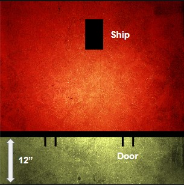

---
tags:
  - scenario
  - sector-mechanicus
  - zone-mortalis
  - endgame
  - multi-player
---

# 32. Blaze of Glory: Escape The Hive

_Having outgrown life in the Underhive, a powerful gang has decided to follow rumours of a more bountiful home amongst the stars. Their many long-time enemies decide that now is their last chance to settle some scores in this exclusive scenario - Escape the Hive._

**Source: White Dwarf, December 2020**

:::note Multi-player Games

End Game Scenarios work best when they are multi-player games. While it might be appropriate for a single powerful gang to see if they can break free of the underhive, take down the local warlord or escape into the wastes, these games will be more memorable and more exciting if all the players have a stake in the outcome rather than watching from the sidelines. Fortunately, Necromunda is a game that lends itself well to multi-player games, and guidelines for running Necromunda with more than two players can be found in the rules, covering such things as determining Priority when there is more than two players and limiting the number of fighters each player can field in especially large games in order to keep the action moving. The End Game Scenarios presented in this article are all designed witrh multi-player gaming in mind.

:::

## Attacker & Defender

The gang going out in a Blaze of Glory is the attacker. The other gang(s) are the defender(s).

The attacker is attempting to board the ship and escape Necromunda for a new life somewhere in the stars. The defender is trying to stop them.

## Battlefield

Standard. Add key points shown below. The spaceport walls should be impossible to cross except by the 2 doors. The doors begin locked and have access terminals on both sides. Ladders can be placed on the inside of the wall to allow defenders to scale onto the top of the walls. The defender then places a ship anywhere on the battlefield more than 6” from a board edge and more than 12” from the Spaceport Walls.

Only barricades and crates can be placed on the access road. No large structures can be placed within 12” of the ship.

## Crews

- **Attacker:** Entire gang (including In Recovery and Hangers-on).
- **Defender:** Random (10) + Reinforcements.

If this is a multi-player battle, each defending gang has Random (5) + Reinforcements instead.

## Tactics Cards

- **Attacker:** Custom (2).

## Deployment

Defending crew(s):

- Outside 12” of the attacker’s edge (Access Road).
- Outside 3” of an already-deployed fighter.

Attacker:

- Within 3” of the attacker’s edge (Access Road).

## Reinforcements

- Defender D3.
- Start of each End phase (starting on the 3rd round).
- Deployed by the controlling gang.

## Stolen Access Codes

The attackers have obtained the access codes for the starport doors, but there is always an outside chance these are out of date or simply false.

When making Access Terminal (Basic) action, roll a D6. On a 2+, the door is opened without the need to make an Intelligence test. Otherwise the codes for that door are useless and it can only be opened by making a Force Door (Basic) action.

## Blasting Off

Any attacking fighter within 1” of the ship at the start of any End Phase can board the ship (even if Seriously Injured). At the start of any round, one fighter that has boarded the ship can make an Intelligence test with a -5 modifier, and a +1 modifier for every 3 additional friendly fighters who have boarded the aircraft. If passed, the ship is powered up and blasts off during the End Phase of that turn.

From the moment the ship is boarded, the defenders know the situation has slipped outside their control and order the Hangar Doors to close. The attackers only have 2 rounds with 2 attempts at starting the ship. Once closed, the ship can't take off. All boarding attackers are placed within 2” of the ship - they have nothing left to do but fight to the end.

## Guard It With Your Life

The defender automatically passes any Bottle tests.

## Ending the Battle

The battle ends when at least 1 condition is true:

- Only attackers or defenders have fighters remaining.
- The ship blasts off.

## Victory

The attacker wins if the ship blasts off. Otherwise, the defender wins.

## Rewards

There is only one reward - escape. If the attacking gang is victorious, they’ll blast off, hoping to evade the guns of the Eye of Selene above Necromunda. If not, the survivors will be hunted down and brought to justice, no matter how far they run. This is the end for the gang, for good or for ill.

#### Experience

Standard rewards:

- +1 for taking an enemy Out of Action.
- +1 for taking an enemy Leader or Champion Out of Action.
- +1 for killing an enemy (during the battle).
- +1 for Rallying.
