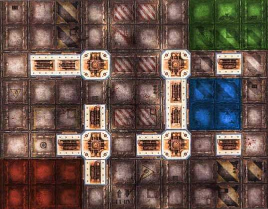

---
tags:
  - Zone Mortalis
---

# 77. Stronghold Assault

_Seizing upon their advantage, a gang launches a deadly assault upon the territory of a rival gang._

**Source: Hive War Rulebook 2021**

## Attacker & Defender

The winner of a roll-off chooses whether to be the attacker or defender.

## Battlefield

20"x16" as shown (each square is approximately 2"x2").

## Crews

- Random (5).

## Tactics Cards

- Draw 2, keep 1.

## Deployment

- **Defender:** Green.
- **Attacker:** Red.

## Seize The Gatehouse

The attackers are attempting to storm and seize the gatehouse to the enemy's stronghold. The defenders are trying to keep them out.

The gatehouse is marked in blue (used for win condition).

## Ending the Battle

The battle ends when only one gang has fighters remaining on the battlefield.

## Victory

Win conditions:

- The last remaining gang is the winner.
- Attacker: At least 1 friendly fighter in the gatehouse at the end of the battle and no defending fighters in the gatehouse.

Otherwise it is a draw.

## Rewards

#### Experience

Standard rewards:

- +1 for taking an enemy Out of Action.
- +1 for taking an enemy Leader or Champion Out of Action.
- +1 for killing an enemy (during the battle).
- +1 for Rallying.

:::info Linked Rewards

Hive War Rulebook (N21) has a simplified 'linked' campaign. This campaign only has the following reward:

- +1 crew size in the next battle.

:::
