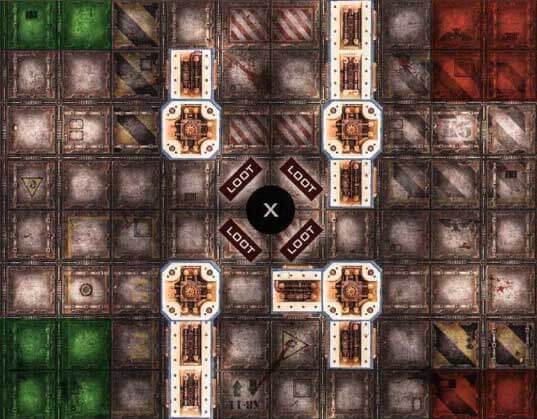

---
tags:
  - Zone Mortalis
---

# 81. Riches in the Dark

_Sometimes, the rumour of a newly discovered tunnel sprawl packed with discarded riches will spread around the underhive. Such rumours are sure to be investigated._

**Source: Hive War Rulebook 2021**

## Battlefield

20"x16" as shown (each square is approximately 2"x2").

The Beast's Lair is at the centre surrounded by 4 Loot.

`X` = Beast's Lair  
`LOOT` = Loot Casket

## Crews

- Custom (5) + Reinforcements.

## Reinforcements

- D3 per gang.
- Start of each round (starting on the 2nd round).

## Tactics Cards

- Draw 2, keep 1.

## Deployment

The winner of a roll-off starts each of the following steps:

- Chooses deployment zones (red or green).
- Take turns placing 1 fighter at a time within the deployment zone (until all fighters are deployed).

## Pitch Black

Use the [Pitch Black special rule](/docs/battlefield-setup/scenario-rules#pitch-black--visibility).

## The Beast's Lair

Use the [Beast's Lair special rule](/docs/battlefield-setup/scenario-rules#the-beasts-lair).

## Grab The Loot

Each gang is trying to grab as much Loot as possible back to their deployment zones. Note that only unopened loot are used for the win condition and rewards (any opened loot are left behind).

Gangs can score the following points:

- 2 per unopened loot that is secured.
- 1 per enemy fighter Out of Action.
- D3 to the last remaining gang.

## Ending the Battle

The battle ends if any of the following are true:

- Only one gang has fighters remaining on the battlefield.
- End of the 6th round.

## Victory

The gang that scored the most points is the winner. In case of a tie, the gang that secured the most loot is the winner.

Otherwise it is a draw.

## Rewards

#### Experience

Standard rewards:

- +1 for taking an enemy Out of Action.
- +1 for taking an enemy Leader or Champion Out of Action.
- +1 for killing an enemy (during the battle).
- +1 for Rallying.

:::info Linked Rewards

Hive War Rulebook (N21) has a simplified 'linked' campaign. This campaign only has the following reward:

- 100 credits per unopened loot returned to the deployment zone.

:::
