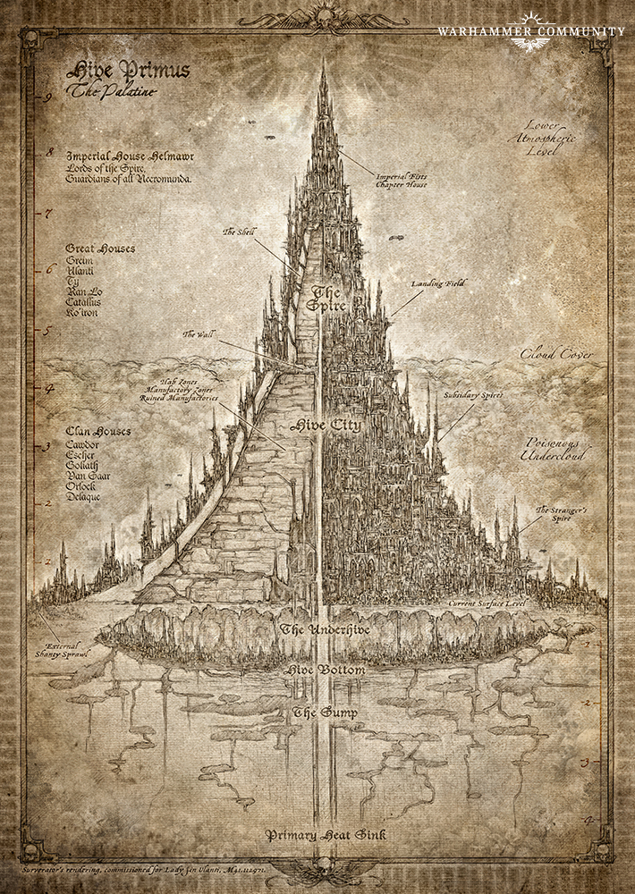
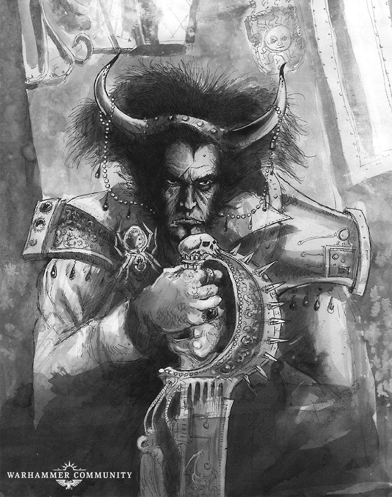
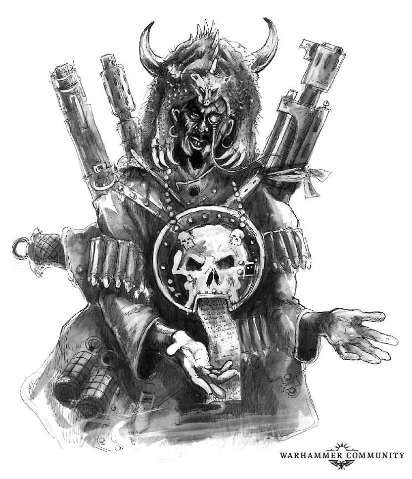
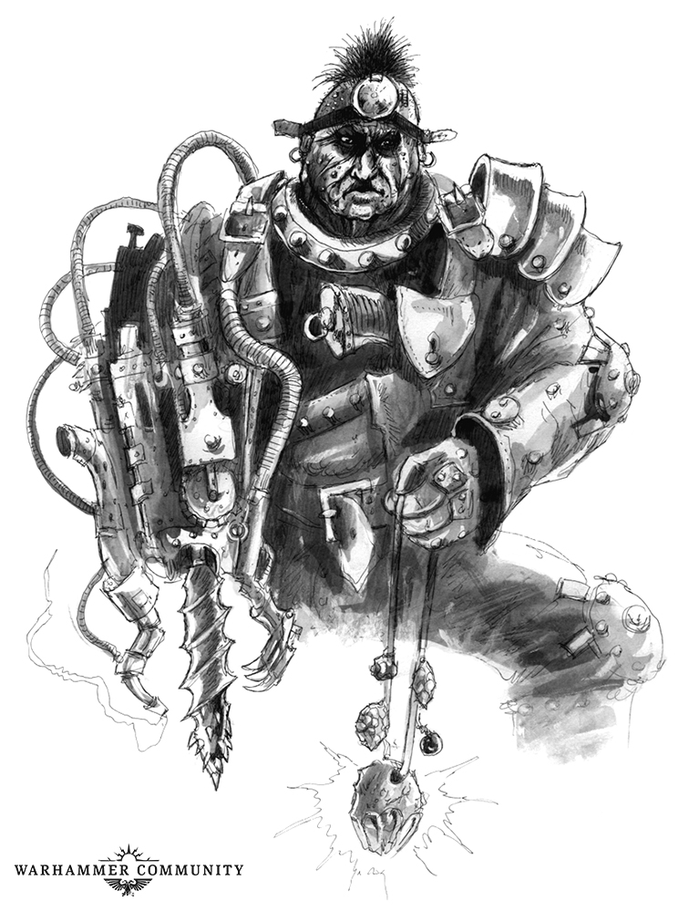

# Apocrypha Necromundus: Hive City

_Necromunda is a world of prodigious industrial output, and no hive is as productive as Hive Primus. In this instalment of the Apocrypha Necromundus, we take a look at Hive City, its beating iron heart._

Source: [Warhammer Community, 16 Jul 2019](https://www.warhammer-community.com/2019/07/16/apocrypha-necromundus-hive-cityfw-homepage-post-2/)

## An Industrial Nightmare

The boundaries of Hive City, as laid out by Helmawr’s Primaria Geograph, state it begins where a man may lay a foot upon the ash of hive base, and ends where one may touch the Imperial seals of the Wall. In reality, it conforms to no absolutely defined borders – parts of it reaching down into the underhive, or crawling up the outside of the hive to cling to the lower levels of the spire. It is home to countless industries, from munitions plants to corpse-reclamation farms. Its residents live with the constant rumble of factories and machines rising through the floors of their habs or echoing down from domes overhead. To live in Hive City is to live in the heart of a great machine.

Though no serious attempt has ever been made to map Hive City, the Clan Houses being somewhat resistant to people poking around their domains,\* it can be broadly divided into a number of regions. The lowest level of Hive City is known as the Circulum Nexus, or Cargo Town to the locals. Here dozens of subterranean maglev train lines converge and scores of great ash gates lead to the wastes. This section rings the outer section of the hive and is dedicated to the receiving, storing and sorting of the endless chain of cargo shipments. Vast warehouses characterise this level, each filled with endless lines of stacked containers, piled so high they reach up out of sight into the gloom. Entire towns exist in the artificial canyons created by these containers, their inhabitants endlessly numbering and checking each container to ensure it reaches its intended destination. At various points, the Nexus breaks through into the underhive below – the most notable of these is Guilder’s Pit, which leads down to Dust Falls.

## Heart of the Hive

Above the Nexus is the region known colloquially as Forge City. Here the heaviest industries operate, smelting ores and cooking chemicals to feed the factorums above. These industries expel a prodigious amount of waste, their runoff cascading down the hive shell to the ash heaps below. As the industrial domes and chambers of Forge City thin out, the Teeming begins. This is the living core of Hive City, where most of its habs and industries reside, each producing everything from lasgun focusing crystals to Adeptus Terra-sanctioned spoons.\*\* Within this tangle of sub-cities there are a number of noteworthy landmarks, such as the Grand Plaza where a massive statue of the Emperor (or is that Lord Helmawr?) holds the dome aloft, or the Lumin Halls, where the master overseers gather to read the endlessly scrolling production numbers of the hive and set their punishing quotas. The Teeming is also home to the Penitent’s Vault. This vast guilder prison houses miscreants and recidivists of all kinds as they await execution, exile or slavery.

Sitting atop the Teeming like a crown is the Primus Spaceport. While hundreds of landing pads and hangers stud the outside of Hive Primus, the largest concentration can be found on the edge of the world’s toxic cloud layer, where Hive City gives way to the Spire. A city in itself, the spaceport never sleeps, with gleaming stratoplanes, massive orbital haulers and sleek landers all endlessly taking off and setting down here. Running along the upper reaches of the Primus Spaceport is the Wall. This is the hard barrier between Hive City and the Spire, dividing the Clan Houses from the Noble Houses, and protecting the privileged elite who dwell above. It is a grave offence for a subject to even approach within sight of the Wall without permission – the punishment inevitably being death.

## Domain of the Clans

An estimated 5 to 10 billion people live and work within Hive City. These range from clanners serving one of the great Clan Houses to the helot workers who make up the hive’s drudging classes. The Clans are the de facto rulers of Hive City and their domains reflect their importance – nation states in their own right, each one dominates a region of Hive City. The Orlocks control much of the Nexus, and many of the ash gates that lead to it, in the name of the Guild of Coin. Goliaths rule Vat City, constantly expanding their realm to make room for even greater furnaces and new arena towns filled with fighting pits. The Van Saar and Escher, as befits their rank as the oldest Clan Houses, dwell largely in the upper reaches of the Teeming, controlling parts of the Spaceport and the domes that cling to the underside of the Wall. Cawdor and Delaque are different in that their Clans can be found almost anywhere in Hive City – the Cawdor thriving in every disused nook and cranny, the Delaque mysteriously appearing where they are least expected.\*\*\*

With so many people and so many competing interests, violence within Hive City is carefully monitored by Lord Helmawr. While the streets of the Teeming, or the cargo canyons of the Nexus are far from safe, there is order of a sort – maintained by the Palanite Enforcers. Thus do the Clan Houses work out their grievances in the lawless expanse of the underhive, lest the precarious and ancient peace of Hive City ever be broken by open warfare, and the whole system come crashing down.

\* It is rumoured when Surverator Sykas Gellen was compiling his legendary Apocrypha he had to complete numerous gruelling dinner engagements just to get even the vaguest information on the domains of the Clan Houses.

\*\* The punishment for making an unsanctioned spoon is swift and harsh – and usually involves the spoon in question.

\*\*\* It is rumoured that the Delaque long ago destroyed all direct links to their parts of Hive City, and even Lord Helmawr doesn’t know precisely where the centre of their power is located.
