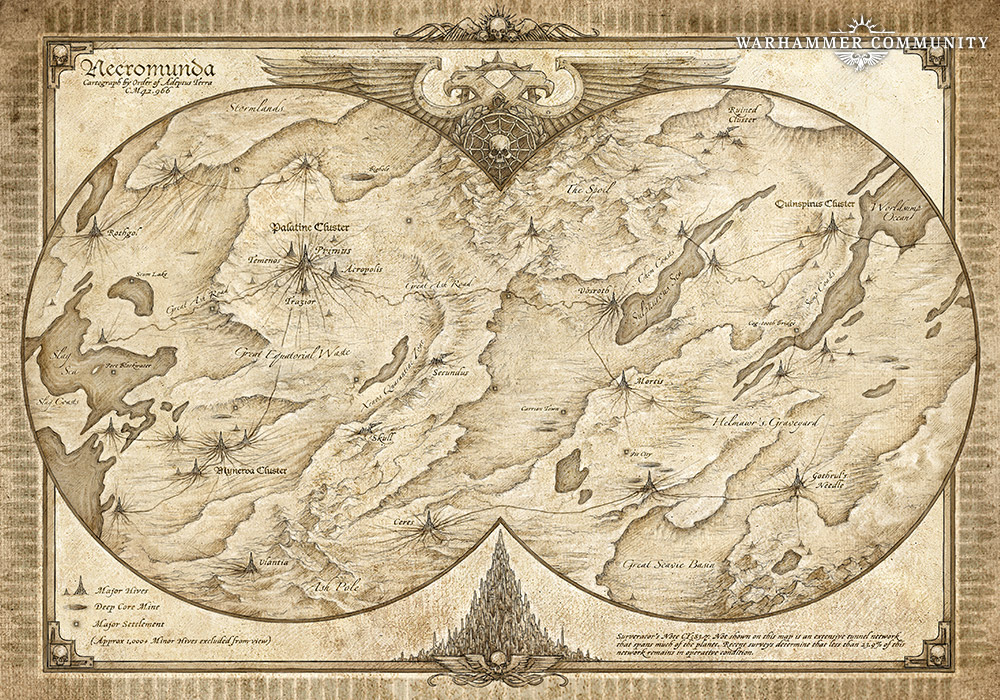
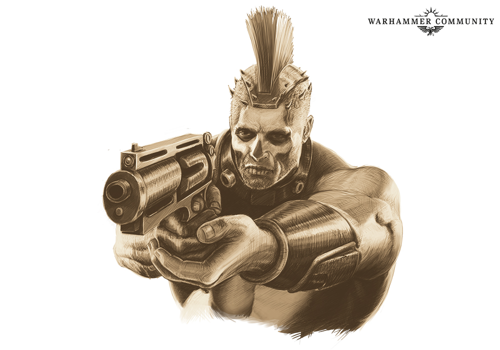
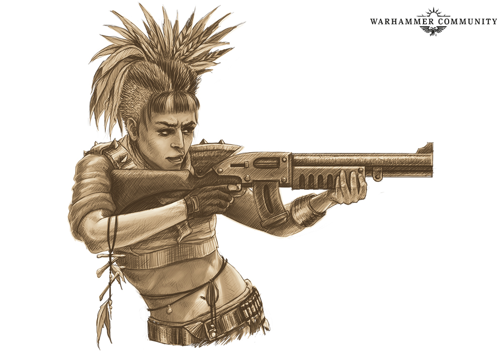
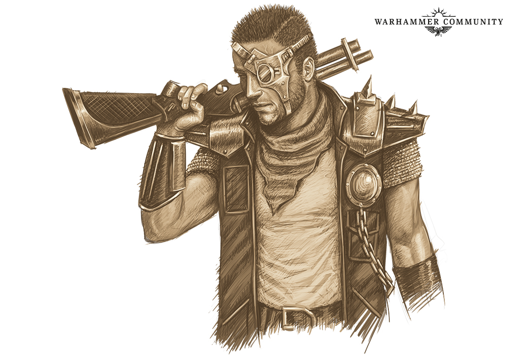
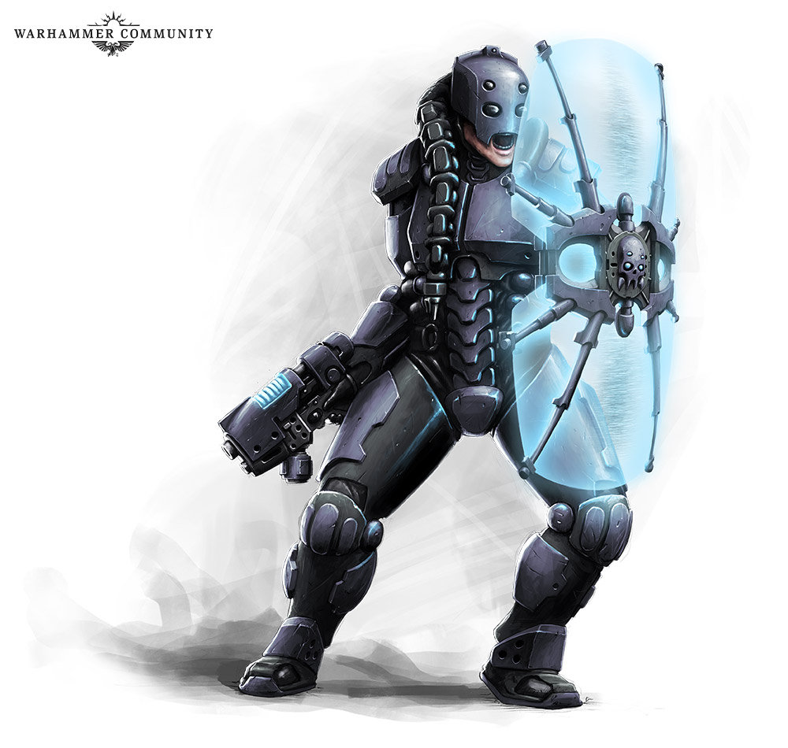
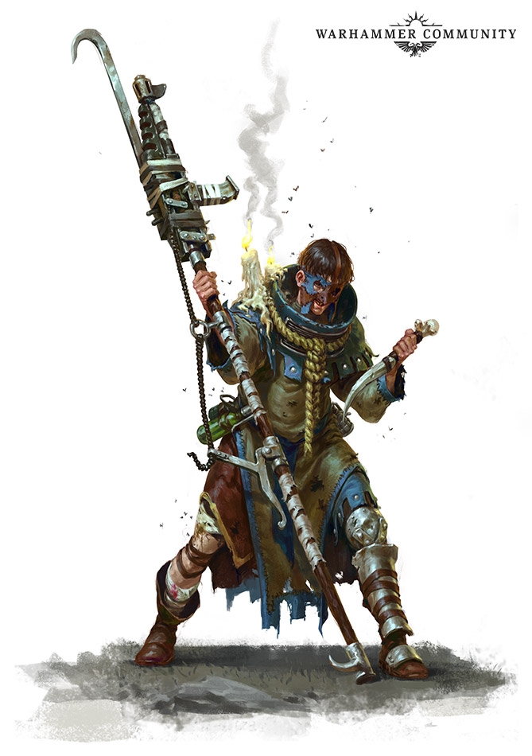
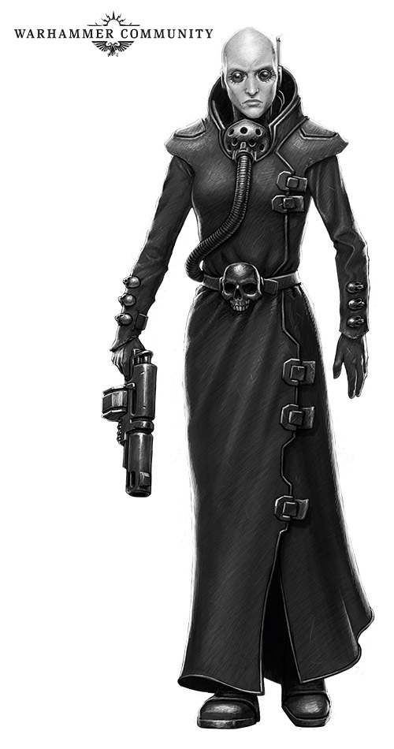

# Apocrypha Necromundus: Lingua Primus

_Do you speak Necromundan? Maybe not as well as you thought… Turns out that there are many tongues in the underhive (as well as the universal language of violence, of course), and this latest instalment of Apocrypha Necromundus takes a look at a few of them._

Source: [Warhammer Community, 21 May 2020](https://www.warhammer-community.com/2020/05/21/apocrypha-necromundus-lingua-primus-part-1gw-homepage-post-3/), [Warhammer Community, 04 Jun 2020](https://www.warhammer-community.com/2020/06/04/apocrypha-necromundus-lingua-primus-part-2gw-homepage-post-4/)

Necromunda is home to thousands of languages and dialects, each hive and region having its own unique version of Imperial Gothic. High Gothic (the language of the Adeptus Terra) is seldom spoken below the spire. Even the various types of Low Gothic (the day-to-day tongue used, with much regional variation, across the Imperium) are typically restricted to Hive City and the Merchants Guild – though most gangers and underhivers know enough to get by. Each clan has its own local dialect based on common clan argot, or words and phrases appropriated from other languages, or a bastardisation of Low Gothic. 

## Goliath Gutter Tongue
House Goliath has a broad vernacular when it comes to clan speak. Common words such as “skinnies” and “starvins” are both terms Goliaths use for non-clanners, though they have their own terms for specific rival clans. “Wastes” is a common Goliath term for Van Saar, while they like to refer to Eschers as “vyps”, “seks” or “vens” because of the all-female clan’s heavy use of poison. Guilders are called “scrugs”, possibly a reference to Hive Lugs, an old term referencing the Merchants Guild’s role in Necromundan society. 

Alphas, the Over-tyrant and Lord Helmawr are all “boss-meyn”, or “korf-boss”, representing a boss or forge boss respectively. Goliaths are also rightly proud of their forge fanes and have their own terms for these sacred places. To a Goliath, his forge is his “korf”, or “meyn-korf” if he wants to accentuate the fact it is his home. His gang is his “korf-broheym”, or forge-brothers. Vatborn, natborn and unborn also have their own terms within the clan, known as “bron-embo”, “bron-tru” and “bron-ost” respectively.

Despite this wealth of distinctive clan words and phrases, Goliaths don’t communicate by spoken language alone. In the deafening roar of the factorum, the Goliath use their own kind of sign language known as Half-hand. Using one hand, the Goliath signs common phrases like “stand back”, “help me” or “fight me”. Gangs have further adapted Half-hand to include their tattoos, the fighters gesturing to body markings with different signs to communicate “enemy ahead”, “bad air” or “scrag ’em!”. This level of sophistication is often lost on their enemies, who think the Goliath are merely slapping their muscles, or making obscene gestures, not communicating battle tactics.

## Escher Clan Argot
Of all the Clan Houses on Necromunda, House Escher is perhaps the most multilingual. High Gothic is spoken within the vaulted chambers of the Council of Crones, and is the favoured language when dealing with the Great Houses or representatives of the Imperium. Meanwhile, Low Gothic is also spoken by the Escher of Hive City, especially those who must deal with off-world merchants or Cold Traders, it being the ‘common tongue’ of the hive world. 

House Escher, because of its long history and dealings with all of the Great Houses, has many groups who speak the noble languages of Necromunda, such as the picture dialects of House Ran Lo or the sprac-speak of House Greim. The largest of these groups, however, know how to speak Ulanti Reg’le Argot, the language of the Regent House of Necromunda. House Escher’s own clan dialect borrows many words from Ulanti Argot, like “dreckos”, the Ulanti word for rubbish or waste, or “carvos”, a specific strike with a narrow bladed weapon. In gang culture, these words are often shortened and mixed in with regular underhive dialects or gutter speak. So for example a “drek” is a “dodgy situation”, as in “she’n stepped proper-right into drek”. 

Individual Escher gangs have their own dialects as well, created to allow a gang’s members to talk to one other without letting their enemies know exactly what they are saying. Metals and gems form a basis for a lot of these dialects, and often each gang might attribute different meanings to them. When one gang says something is all “nickel and gelt” it might mean it is good, while another gang might decide these words are bad. Likewise, a “jade” or “jet” might be a hardened fighter, a useless hiver, or anything in between.

## Orlock Road Slang
House Orlock is a melting pot of dialects and languages from across Necromunda. The far ranging settlements controlled by the Clan House incorporate people from all corners of the world, and its gangers usually talk in a mix of Low Gothic, Waster, Duster or Drudge. 

Duster clan cant is common to those who must traverse the wastes, phrases like “voltrum dai” or “kaeyan dai” used as greetings depending on the season, while Duster hand signs, like the rotated fist that means one cycle, or the splayed fingers swept over the sky indicating a storm front coming in, are used without thought. By contrast, Drudge words are based on a form of pidgin Gothic, the words themselves seldom having more than one syllable.  A “tor”, for instance, is a factorum, while “gids” are Guilders and “seers” are bosses.

Orlock gangs who spend any amount of time outside the hive cities are also likely to pick up Waster, the language of the outlands. Wasters have lots of words for things hivers seldom use, like the sky, as well as almost a hundred different words for ash – ranging from “fuma”, the fine ash that falls like mist and finds its way through the smallest cracks, to “atar”, the burning ash that clings to everything it touches and eats through respirator seals.

## Van Saar Techno-lingua
The House of Artifice prides itself on the sophistication of its communication. While other Clan Houses might engage in crude or base versions of more evolved languages, members of House Van Saar use binary codes and ancient dialect forms to talk to one another. 

Among the Archeoteks, this is especially prevalent as they use a tongue known as Tek-Nik-El. This was handed down through the generations from the first of their kind, who themselves claim descent from those first colonists of Necromunda. Tek-Nik-El is a form of ancient Terran, and uses words like Dosrite – a term to denote someone speaks true – or Harshtarg – a word that can mean ‘everything I say is now connected’ or ‘heed my words for they carry great import’. 

It is from Tek-Nik-El that many Van Saar objects and jobs derive their names, like the Koders who mind-wipe mono-task servitors, or the Tek-Jacks, whose job it is to follow power cables to their true source.

Over the centuries, House Van Saar has also been influenced by its association with the Adeptus Mechanicus and the worship of the Omnissiah. Though the faith is still a small part of the Clan House, and these connections are mostly made through the passing down of archprints to the factorums of Necromunda, some of the tongue of the Red Planet has found a home with the clanners of House Van Saar. 

The most prevalent of these is the binharic cant practised by the lowest echelons of the tech priesthood. Van Saar gangs have adopted this, as it is a code few other gangs can crack – the varying code bursts sound like background noise to the untrained ear. Sometimes the Van Saar even turn the cant into actual words – phrases like all ones and no zeros or two by none are instantly recognisable as terms for untrustworthy fighters or places.

## Cawdor Pilgrim Cant
Even the lowest members of the House of Faith speak in religious phrases and ritual greetings. So ingrained in their culture are these liturgies of the Redemption that they talk in little else, and two Cawdor clanners can carry on a lengthy conversation using nothing but the words of the faith. For example, one might remark ‘On Sentinels Walls did the Golden Giant die, his doom the bell that rings yet still,’ to which the other might say ‘“I hear it tolling” spoke the pilgrim, purged of fear by the Gene-Father, purged of doubt by the World-Master’. 

To outsiders, there seems little meaning in these rote phrases, but to speakers well-versed in the teaching of the faith, they are laden with information. Most seem to allude to the Imperial Creed, as seen through the lens of the Redemption. References to the Father, the Great Deceiver and the Enemy Beyond, can all be found in the works of the Ministorum. Over centuries they have become distorted on Necromunda – the ‘Father’ is sometimes used to refer to Lord Helmawr rather than the God-Emperor, just as the ‘Great Deceiver’ can be any enemy of the faith, not just the ancient enemy of Mankind.

Pilgrim cant is also commonly used by House Cawdor, often mixed in with their own faith speech. The cant is a more religious form of Low Gothic – developed over the millennia by lay priests and missionaries who needed a way of conveying the ideals of the Imperial Creed to the savage populations of far-flung worlds or rallying a diverse people around a single cause. 

In the case of Necromunda, pilgrim cant was brought to the planet by the Ministorum and became popular for those travelling between the hives. For the Cawdor, they enjoy using it when speaking with other Low Gothic speakers as it makes them feel superior to the rest of the population.

## Delaque Dark Tongue
Of all the languages spoken on Necromunda, by far the most unusual is that of the Delaque. While they pride themselves on being multilingual, conversant in the tongues of the other clans so they might better delve into their secrets, the language they speak among themselves is ancient and unknowable by any not within their house. It is whispered that the Delaque Dark Tongue, as outsiders often refer to it, is not a human language at all, but a remnant of a lost age of the galaxy, when speech itself was unknown to men. 

The house also takes great care to limit the use of the language outside the clan, though fragments do sometimes slip through. The phrase ‘Chuhan-R’lega-Niss-Chulua-Riss’ has appeared more than once in spidery script scrawled on the walls in dark corners of the underhive of Hive Primus, and it seems one the Delaque themselves use frequently when greeting each other. 

While it is possible that not even the Delaque know the true translation of the speech, some believe it refers to something ancient on Necromunda itself, and approximately means ‘The Deathless Sleeper Waits, Beneath the Dead World’. Most of the Dark Tongue is like this – the meanings of the words hinted at only in rumour. Those who say they know what they mean are unsure of how they even came by the knowledge, only that they are sure of the truth of what they speak. 

Other phrases, like ‘Shun-akus-Vor-foralonith-Chu-vaya-Chu-vor-Kun’ seem to be invocations. Underhivers have seen the Delaque intoning the words over fallen members of their clan, as if they were commending their bodies to a higher power or giving a dark blessing for some unknown service to the clan. Some of these witnesses, the ones who are still willing to speak of what they saw, swear the Delaque paused as they spoke over these bodies – as if the bodies themselves were speaking back…

