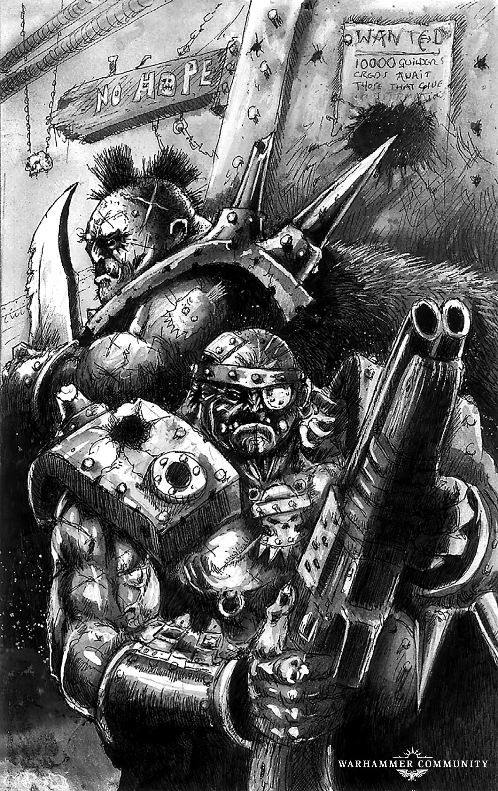
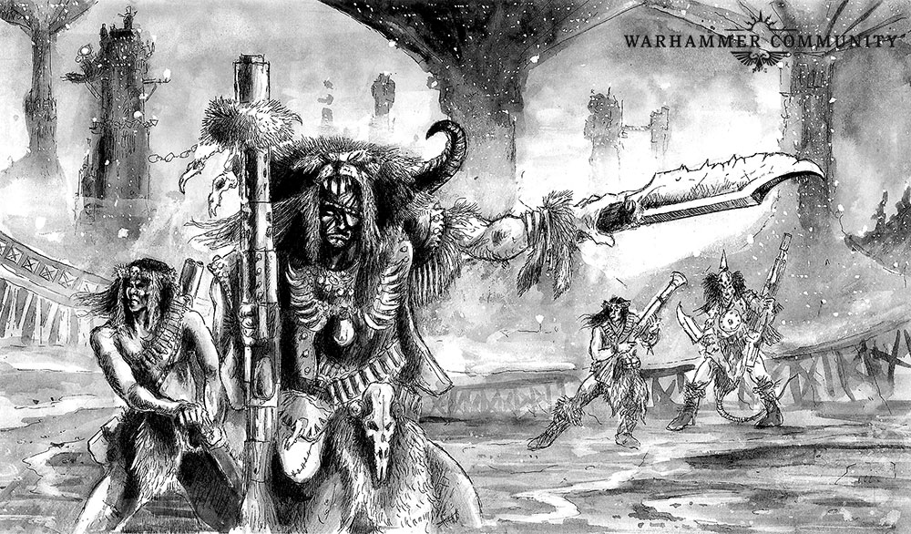
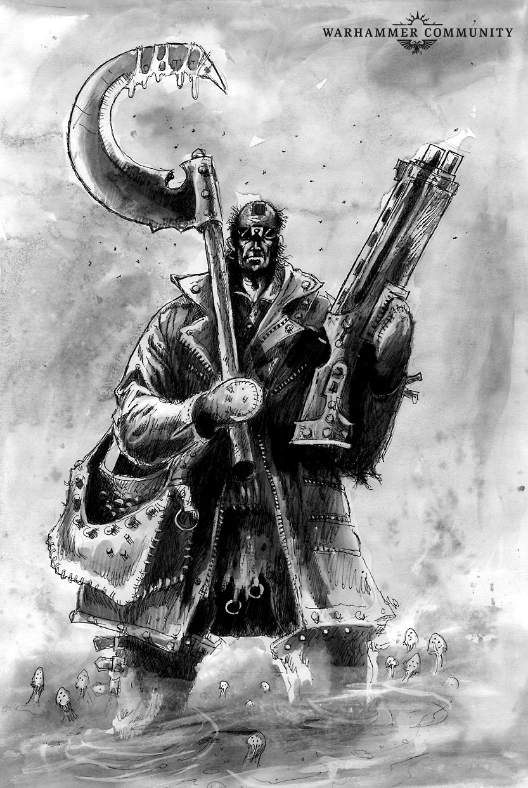

# Apocrypha Necromundus: Navis Mortis

_Necromunda is an ancient world; its endless ash deserts littered with half-buried ruins and lost settlements and only the nomadic tribes and mutant creatures who walk the wastes truly know what lies beyond the walls of the hive cities. However, there are places so infamous, even the Clan gangs know their name – such as the ship graveyard known as the Navis Mortis._

Source: [Warhammer Community, 23 Jul 2019](https://www.warhammer-community.com/2019/07/23/apocrypha-necromundus-navis-mortisfw-homepage-post-1/)

## Ancient Wrecks

Thousands of years before the birth of the current Lord Helmawr, there was a schism within the Imperial House. In 459.M37, Lord Hyrodo Helmawr died suddenly while on a hunting expedition without naming an heir.\* His two eldest children, Lady Cinderak and Lord Gothrul both shared a claim to the mantle of planetary governor and they fought each other bitterly for over a century for the right to rule. Eventually, Cinderak triumphed and imprisoned Gothrul within his hive, the Needle, which had been one of Necromunda’s first spaceports. To cement her control of Necromunda she constructed the Eye of Selene – part space station, part trading hub – and declared all inbound off-world goods and all outbound planetary production would now pass solely through Hive Primus.

In the centuries that followed, hundreds of ship captains thought to brave this blockade and land at the Needle. Cinderak proved the worth of her words and, as the years ground by, the wastes around the Needle grew thick with vessels shot down by the Eye of Selene and the Necromundan system fleet. To the nomads, it was known as the Time of Raining Iron, for not a cycle passed without a flaming wreck falling from the sky, and the growing field of wreckage soon became known as the Navis Mortis. Despite being a rich picking ground, Cinderak declared the region off-limits – she refused to let anyone profit from cargoes carried by the dead captains, and soon the borders of the crash zone were heavily patrolled by the armoured ash runners of the Palanite Enforcers. Of course, where there is loot, there will be looters.

## Lord Helmawr’s Graveyard

As the centuries have slipped by, ship captains no longer try to run the blockade and instead accept the hefty tariffs imposed for passing through the Eye of Selene. Smugglers still attempt to bring illegal goods to Necromunda but usually do so far from the hives. Meanwhile, among the wrecks of the Navis Mortis, an ash waste society has sprung up. From their starship fortresses, tribes wage war on each other and anyone foolish enough to enter the graveyard. Some are settled ash waste tribes who have put down roots, some are muties looking for a safe place to weather the constant ash storms, but many more are outlaws who have been driven out of the hives. Settlements and tribes take their names from the ships they control, like the red-robed Occluddites who live in the broken bowels of the heavy hauler Occluid Dias, the Ash Terrors, who rule the wreck of the fleet monitor Pax Terra,\*\* or the trade-settlement of Pilgrim’s Grave, built beneath the gutted hull of the Ministorum chartist vessel the Solar Pilgrim. Clan House gangs and guilders can also be found in the graveyard, drawn by the chance to find lost treasures. They come up the old scrap roads from Gothrul’s Needle, or down past the ruins of Hive Arcos, or from the north and south around the far edges of the Dust Wall. The Guild of Coin maintains trade towns around the edges of the Navis Mortis, patrolled by Enforcers, ensuring Lord Helmawr gets his cut of everything to come out of the graveyard.

Visitors to the graveyard have to contend with the locals – powerful warlords that rule from the conning towers of their ship-fortresses, commanding the wastes out to the range of their guns. The Noctus-Riders are perhaps the largest of these gangs, their boss, ‘the Humungan’, an eight-foot-tall masked savage, who somehow awakened the Noctus’ void shields. His main rivals, the Occluddites and the Sons of Ash, have at times challenged his rule, capturing nearby wreck-fortresses and turning their guns on the Noctus. Inevitably these ship to ship engagements across the vast desert wastes end in the Noctus’ shields keeping it intact, while ancient lance weapons and macro cannons pound the other wrecks to dust.

War of the Dead
In recent years the tribes, gangs and settlements of the Navis Mortis have been forced to band together against a common foe – the Grave Wyrm. A vast underground brainleaf plant, the wyrm extends out from its nest for hundreds of kilometres, its tendrils reaching up through the ash into dozens of wrecks. During Necromunda’s long winter, the plant slumbers and gangs risk warrens of brainleaf zombies to raid the ships it has infested. A few bold gang leaders, like the Orlock Road Boss Ajax Bones, have even tried to find the heart of the Grave Wyrm and kill it. Ajax, like so many before him, ended up vanishing into the graveyard, though one of his lieutenants, Wall-eyed Joe, was later seen trying to eat someone’s brain.\*\*\*

As the season of fire comes to the graveyard, and Necromunda enters its summer cycle, the wyrm stirs. Amid the seasonal ash storms and burning sun shafts that occasionally break through the planet’s toxic cloud layer, hordes of brainleaf zombies shamble out across the desert. Made up of ash wasters, luckless scavengers and even the long-dead crew of the ships themselves, these hordes seek to spread the dominion of the Grave Wyrm. Five times Pilgrim’s Grave has been attacked, guilders and gangers fighting shoulder to shoulder with outlaws and ash tribesmen to see off the undead. Each time, the hordes were larger and the margin of victory more narrow. About the only place safe from the wyrm seems to be the Noctus, its guns sweeping the desert clear of zombies as the Humungan stands on its battlements laughing.

\* He was hunting servants through the upper levels of the spire when one of his cyber-mastiffs accidentally mistook the Lord of Necromunda for one of his own retainers.

\*\* None of the ‘Terrors’ can actually read, but upon hearing the name of the ship – and assuming it must be full of axes – they made it their hideout.

\*\*\* Witnesses are conflicted as to whether Joe was actually a zombie or just really hungry.
