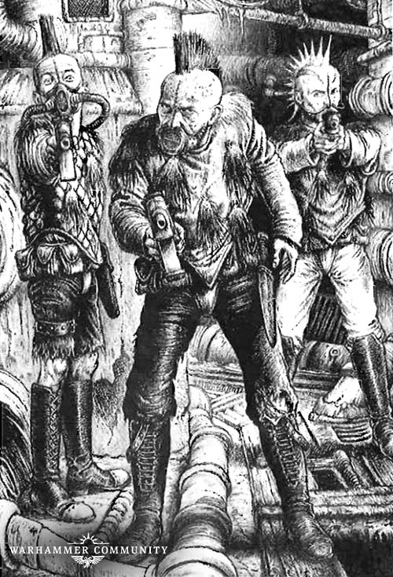
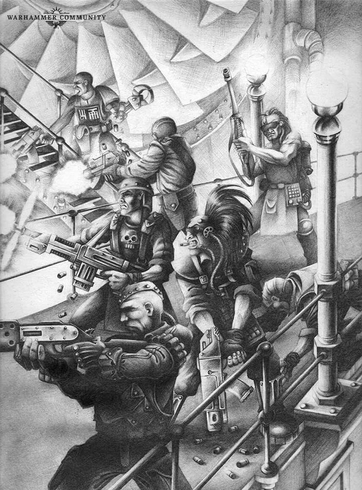
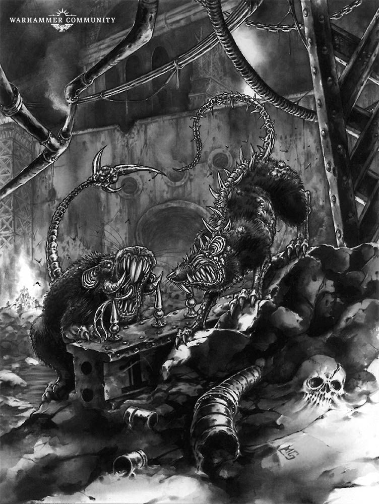

# Apocrypha Necromundus: Rust Town

_Settlements spring up like weeds throughout the underhive, and many perish just as quickly, most surviving for less than a great cycle before returning to the ruins from whence they came. It is therefore rare for a new hole to last, and even rarer for one to last in a place where hivers have no business living. In this instalment of the Apocrypha Necromundus, we take a look at perhaps one of the strangest and most dangerous places in Hive Primus: Rust Town._

Source: [Warhammer Community, 23 Apr 2019](https://www.warhammer-community.com/2019/04/23/apocrypha-necromundus-rust-town/)

## Bald Bryen’s Domain

Quite possibly the oddest thing about Rust Town is not its location in the middle of the Bonedry,\* far from the main tunnels and domes of the underhive, but rather the fact that no one can say for sure how long it’s existed.

Some traders swear the isolated settlement only sprung up a few cycles ago, and claim to have crossed the Bonedry dozens of times without ever laying eyes on it before then. Others reckon it to be among the oldest of the underhive settlements, saying its foundations were laid long before the cataclysm that created Dust Falls, or before Sump City rose from the slime of hive bottom. Why it exists in the middle of what constitutes a man-made desert is unclear, though hivers, Guilders and nobles all make the trek to its gates to trade and visit the court of Bald Bryen.

The enigmatic Bryen, a tall lanky man of indeterminate age and origin, is the self-proclaimed mayor of Rust Town. He rules over a settlement of hivers who are devoted to maintaining the Rust Town Run – Bald Bryen’s deadly dungeon extravaganza. Scrappers and scavengers bring in their finds from the Bonedry, while caravans trade goods from farther afield, but in Rust Town the only thing the locals seem to produce are trinkets associated with their Rust Town Run. These range from Grinning Bryen gun belts and Runner Kill Coins to ‘genuine’ chrono crystal polishing kits. Even the town itself seems to exist solely for the run, its slanting streets and wonky buildings perched upon a plasteel hill containing the run itself.

## The Rust Town Run

While Rust Town might not produce junk rounds, fungi paste, gunk, or any of the other substances useful to underhivers, it does have one thing in abundance – entertainment. The Rust Town Run is legendary throughout the underhive. Even in Hive City and the Spire, people have heard of the run, and challengers from throughout Hive Primus, and even beyond, have been known to make the journey to try their luck in Bryen’s maze.

Each great cycle, Bryen invites challengers to brave his maze, these hopefuls entering into one of the mayor’s lotteries\*\* to see who will be chosen. Even for those who aren’t chosen to run, Bryen offers a chance for glory, this time as hunters. The hunters stalk the maze, trying to stop the runners reaching their goal (one of Bald Bryen’s fabled chrono crystals), and earn creds for each one they can take out.

The run itself changes every time it is used, sometimes in subtle ways, such as a previously safe door now rigged with a deadly booby trap, and sometimes less subtly, like chambers being flooded with toxic chemicals or the entire run being filled with plague zombies. Typically the perils are those gangs might face out in the Badzones, ranging from the grinding teeth of ancient machinery to pitch-black tunnels riddled with pitfalls. All this becomes even more challenging when hunters are shooting at the runners or trying to push them into pits of ripper jacks. While gangs rarely complete the run, each time it is held, the town’s economy booms, and Bryen grows rich on the thousands of creds bet on the outcome.

## Chrono-Cataclysm

Only a handful of gangs and individuals have ever won one of Bald Bryen’s chrono crystals. Some of these crystals are still in the hands of their original owners, though many have been lost, stolen or sold. Hagan’s Hole has one above the bar, sold to Hagan to cover an outlandish drinking tab by a notable underhive bounty hunter. Some drinkers claim the gem does strange things to the flow of time when you look at it – though that might just be the booze.

‘One-Eyed’ Kitty, a blade dancer out of Two Tunnels, has one too, given to her by an admirer. When she dances she wears the crystal in her navel, its sparkle mesmerising the audience. Then there’s the one owned by Caustus the Chain Lord, set into the hilt of his shock lash. Its brilliance forms a stark contrast to the slaver’s grimy appearance and broken grin.

To most hivers, these crystals are nothing more than fancy baubles, and their owners and placement throughout the hive completely random. However, there are those who would argue otherwise.\*\*\* These rumour mongers claim Bald Bryen serves dark masters, and his crystals are part of some far reaching plan to bring about the Chrono-Cataclysm.

What is the Chrono-Cataclysm? Well, that varies depending on which drunken conspiracy theorist you ask. Some will tell you that it is a plot by the Immortal Cult of Necromunda to bring about a psychic awakening of all humanity, or perhaps a plan by the ancient Iron Lords of the Araneus Continuity to free Necromunda from the yoke of the Imperium. Others whisper that Rust Town was created by House Aranthus, that Bryen is in fact Bryen Aranthus, last true heir of his family, and the crystals are intended to turn back time and restore his bloodline. Then there are those who say Bald Bryen isn’t an Aranthus at all, but an agent of the Throne. They suggest that his plans have already come to pass, and they are all living in an alternative reality created by the Ordo Chronos…

\* Bonedry is an old cistern as big as a solar freighter, once completely underwater, now long since turned into a vast open dustbowl

\*\* Bryen’s lotteries are nothing as simple as drawing numbers or casting dice, and usually involve such entertainments as Second Best drinking contests, games of pinfinger or Ran Lo Roulette.

\*\*\* Especially once they’ve downed a few bottles of Wild Snake.
