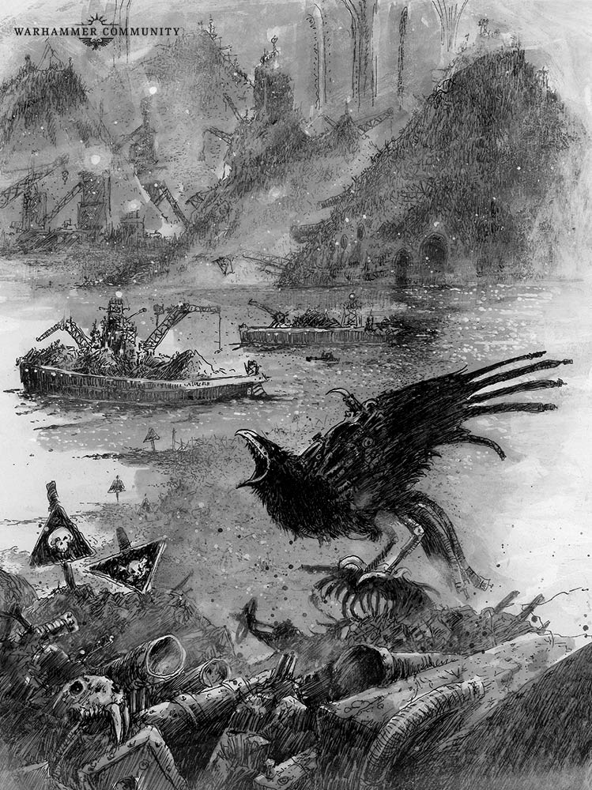
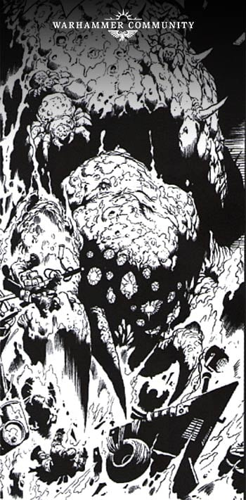
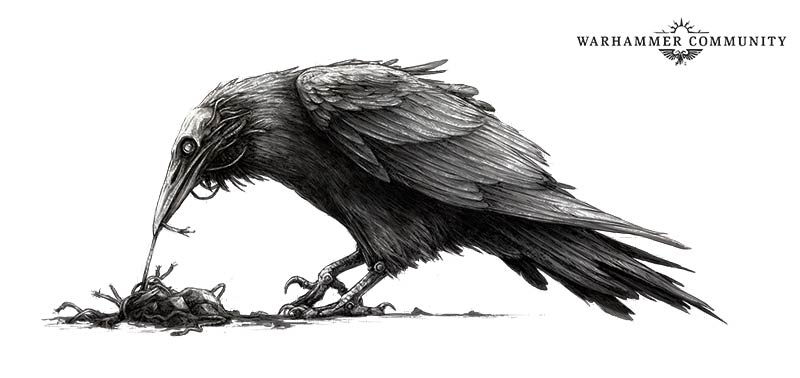

# Apocrypha Necromundus: Sump City

_There is a common saying on Necromunda: ‘Scum always finds its way to the Sump’. This is as true of the billions of litres of human effluent, factorum waste and promethium run-off as it is of hivers. And down in the depths of the hive, where even the weak light of the great lumens doesn’t shine, there are whole towns of scum fighting and scavenging to stay alive. In this Apocrypha Necromundus, we take a look at the den of criminals known as Sump City, the lowest settlement in Hive Primus._

Source: [Warhammer Community, 09 Apr 2019](https://www.warhammer-community.com/2019/04/09/apocrypha-necromundus-sump-city/)

## Bottom of the Hive

Down the Abyss from Dust Falls, past the tunnels to Rust Town, Spoilheap and Port Mad Dog, the underhive grows dark. Deeper still, beneath the Delta-7 Badzones and the old ratskin trail to the White Wastes, the Abyss lives up to its name and the light of Dust Falls is hidden by miles of twisting tunnel. Finally, beyond the road to Two Tunnels and the Tangle, the Abyss reaches its end, opening up over the vastness of the hive bottom, and the frontier settlement of Sump City.

Rising up from the toxic sea around it, Sump City is the last port of call for gangs and guilders, who come here looking to seek wealth out in the midnight expanse of the hive bottom, or to sail out onto the sump sea in search of the sump spiders and their priceless diamond eyes.\* Sump City’s only connection to the underhive is a series of ancient cable cars, the battered gondolas ferrying hivers up into the lowest levels of the Abyss, from where they can make the long journey back up to Dust Falls.

Despite thin, poisonous air, chem-clouds that would make a Goliath’s eyes water, and regular mutie raids, Sump City is almost as prosperous as Dust Falls. The wealth brought in by spider hunters, archeotech scavengers and sump prospectors ensures its scrap markets are filled with rare and valuable items. Traders from Two Tunnels, Port Mad Dog and Dust Falls ferry the best of these goods up the Abyss, and sell it on to the guilds – at a substantial mark-up of course.

This is largely possible because there is no formal Merchant Guild presence in Sump City. Despite agents of the Guild of Coin and Slave Guild frequenting its streets, the settlement has always been run by one gang or another. Up until recently, Sadie ‘Original’ Sinn and the Sump City Sirens did the job, though nobody has seen the Sirens for a while,\*\* and recently the Carrion Queens and the Iron Lords have been duelling over the settlement.

## Great Spider Hunters

One of the principal industries of Sump City is the trade in giant spider eyes. Spire Nobles will pay a small fortune for these precious gems, with the largest worth enough for a slimedrifter captain to move uphive and live out their days in luxury. Harvesting the spider eyes, however, is no easy feat, and the larger the spider, the greater the challenge.

Even an immature sump spider is usually the size of a slave-Ogryn, with the largest as big as an Orlock battle-rig – gun turrets and all. With this in mind, serious hunters sail out in massive armoured scrap-ships, often with flotillas of smaller craft to act as lookouts and bait-men, to herd the spider toward the big ship’s gas-harpoons.

Of course, this is not always enough, and on the docks of Sump City, where hundreds of battered ships, barges and boats of all kinds hang out over the inky blackness of the sump, half-cut sump-sailors like to spin yarns of the ones that got away. The tale of the Hydra, and its captain Haagan Valgotha, is perhaps the most persistent of these.

So the story goes, Valgotha and his ship the Hydra were the greatest spider hunters to ever sail out of Sump City. Each cycle his crew brought in the largest hauls of spider eyes, and the grizzled old veteran could have retired many times over. But Valgotha was hunting a legend – the Great Albino Spider. Time and again the Hydra went out hunting the beast, and time and again its captain returned empty-handed – until one day, when the Hydra was overdue by many cycles, and a member of Valgotha’s crew was found drifting on the sump, all alone and mad with fear. Valgotha had at last found his nemesis, and the man claimed he had seen both gigantic spider and sump captain sink beneath the slime, Valgotha still hacking at the beast’s massive diamond eyes even as the black claimed him.

## Forgotten Riches

While some hivers come to Sump City to crew slimedrifters and trade in spider eyes, many come to hunt for archeotech. It is a widely accepted truth of the underhive that the lower you go, the better your chances of finding great wealth become.\*\*\* Guilders, nobles and crime bosses regularly hire gangs to head out into the wilds of the hive bottom in search of lost treasures. These can be anything from tech left over from centuries past to veins of valuable scrap or pools of concentrated chemicals, rare underhive fungi, or even sump monsters for the fighting pits.

Gangs like the Covenant of Shadows offer protection for archeo-hunters, and claim to know the best places to explore. To no one’s surprise, the Delaque gang seems to use each expedition to somehow advance their own standing in Sump City. Then there are enterprising individuals like ‘Gruesome’ Gale, who professes to be the best Dome Runner in all hive bottom, and guarantees that with her, you’ll come back richer than you went out – or you won’t come back at all.

\* The trick, as any spider hunter will tell you, is getting the spider to part with its eyes.

\*\* Sadie’s gold-plated bolter was seen recently for sale in the Haggle at Dust Falls, so this probably doesn’t bode well for her continued existence.

\*\*\* While it is true that going lower means better loot, it is also means the tentacles don’t have to reach so far…
