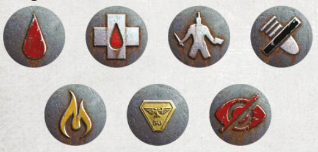
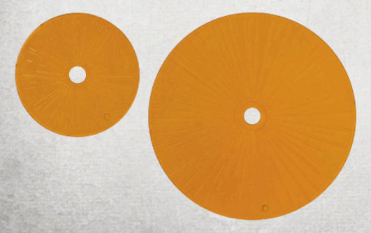
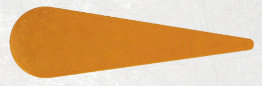
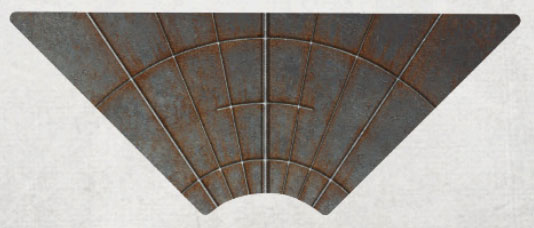
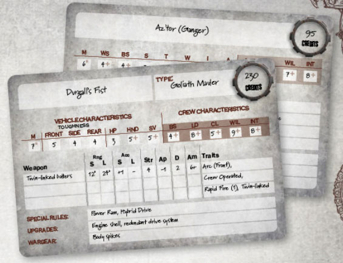
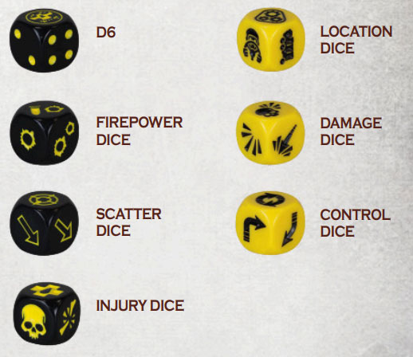

# Weapons of (Gang) War

_Source: Necromunda Core Rulebook (2023)_

The most important elements required to play a game of Necromunda are models to represent the fighters and vehicles, and terrain to build the battlefield. In addition, there are a few other essential items players will need.

## Markers

Markers can be used to represent a model’s [Status](/docs/general-principles/status), to indicate a model is
subject to a [Condition](/docs/general-principles/conditions), or to keep track
of such things as lost Wounds or Hull Points and can
be placed next to them on the battlefield or on their
[Fighter card](/docs/gang-fighters-and-their-weaponry/fighter-profiles#fighter-cards) or [Vehicle card](/docs/gang-fighters-and-their-weaponry/vehicle-profiles#vehicle-cards). Examples
include Ready markers (one of which is placed next to
every model at the start of each round, and removed
after they have been activated), Out of Ammo markers
(used to indicate a weapon has run out of ammunition,
jammed or otherwise malfunctioned) and Blaze
markers (used to indicate a model is on fire or, as
the rules would say ‘subject to the Blaze condition’), amongst others.

## Templates

In Necromunda, templates are used to represent the
effect of certain weapons:

### Blast Markers

A Blast marker is a circular template 3" or 5" in
diameter. They are used most often by weapons
with the [Blast trait](/docs/the-rules/shooting#blast-markers) and
represent such things as shrapnel-filled explosions
caused by detonating shells or grenades, clouds of
smoke and even clouds of toxic gas or radiation.

### Flame Templates

A Flame template is a teardrop-shaped template, approximately 8" in length, which is used most often by weapons with the [Template trait](/docs/the-rules/shooting#flame-templates). Flame templates represent weapons
ranging from those that launch a devastating torrent
of flaming liquid that will burn until all available fuel
is exhausted, to horrific chemical weapons that spew
forth vile concoctions that will dissolve all matter they
come into contact with.

## Ruler/Tape Measure

In games of Necromunda, all distances are measured
in inches (") with a ruler or tape measure. Distances
can only be measured when the rules call for it
(for example, when checking the range between an
attacking model and their target) – on Necromunda
there are very few certainties! Therefore, pre-measuring
distances when making any kind of action is not
allowed. Declare the action and nominate any other
fighters involved before range is measured.

## Vision Arc Template

Each model has a vision arc, representing the area
that is [visible](/docs/general-principles/line-of-sight-and-cover) to them. A Vision Arc template is a triangular template that
can be used to help determine a model’s vision arc
quickly and easily.

## Fighter and Vehicle Cards

Each player’s gang is made up of a number of fighters
and vehicles, each of which is represented by a model
on the battlefield and by a Fighter card or Vehicle card
filled in with their characteristics, equipment and other
useful reference information. During a battle, these
cards provide a handy reference for each model and
a reminder of their equipment and any special rules. During a battle, players can also place markers on
each model’s card rather than next to the model itself
on the battlefield, thus keeping it free from clutter.

:::info Yaktribe

Most campaigns around the world leverage [yaktribe.games](https://yaktribe.games/) to arbritrate their campaign. This includes a gang builder, where players keep a digital record of their fighters.

:::

## Necromunda Dice

Necromunda uses several different types of dice to determine the outcome of various actions and events. These are:

### D6

The most frequently used dice in Necromunda is a
regular six-sided dice, marked 1 to 6. It is common
for the ‘6’ to be replaced by a logo – either that of the
game or a specific gang – on many Necromunda dice.

### D3

The rules might also call for a D3 to be rolled, but an actual three-sided dice is not necessary. To roll a D3, simply roll a D6 and modify the result by halving it, rounding fractions up.

### Firepower Dice

Unique to Necromunda, a Firepower dice is used
whenever a fighter makes a ranged attack. For the
majority of weapons, the Firepower dice is rolled as
there is a chance of the weapon’s ammunition being
depleted or a malfunction occurring. In some cases,
it is rolled to determine how many shots a rapid fire
weapon can make.

### Scatter Dice

This is a six-sided dice, marked with a Hit symbol on
two faces and an arrow on each of the other four. The
Hit symbol also incorporates a small arrow. This dice
is used to determine random directions, and is most
often used when firing weapons that have the Blast
(3"/5"/\*) trait.

### Injury Dice

Another dice unique to Necromunda, Injury dice are
special dice used to determine the severity of the injury
a fighter suffers, ranging from a Flesh Wound all the
way up to being taken Out of Action.

### Location Dice

Location dice are special dice used to determine
exactly where a vehicle is hit when it is damaged by
an attack.

### Damage Dice

Damage dice are special dice used to determine how
severely a vehicle has been damaged, ranging fromGlancing Hits up to Catastrophic Hits.

### Control Dice

The Control dice is a special dice used to determine
what happens when a vehicle loses control.

#fighter #rules #templates

