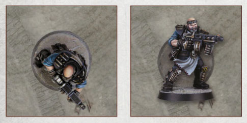

# Measurement

_Source: Necromunda Core Rulebook (2023)_

Necromunda is a game that relies greatly on players
measuring distances, be it between two models when
making a ranged attack, or the distance a model can
move during their activation.

## Measuring Distances

In games of Necromunda, all distances are measured
in inches (") with a range ruler or tape measure. Distances can only be measured when the rules call
for it (for example, when checking the range between
an attacking fighter and their target) – on Necromunda, there are very few certainties! Therefore, pre- measuring distances when making any kind of action
is not allowed – declare the action and nominate any
other models involved before range is measured.

Distances between models and any other battlefield
objects (terrain features, objectives and so forth) are
measured from the closest point of one base to the
closest point of the other. If a model or an object does
not have a base, measure to or from the closest point
of the model or object overall.

When measuring to or from a Prone fighter, assume
that their base occupies the same space as it would if
they were Standing, as shown in the diagram below:

## Measurement & Solid Terrain Features

Some terrain features such as the thick walls that
separate corridors, the floors and ceilings that
separate levels, or large rock formations looming up
from the landscape are defined by the rules as ‘solid’. Unless stated, distances cannot be measured through
any terrain feature defined as being solid.
