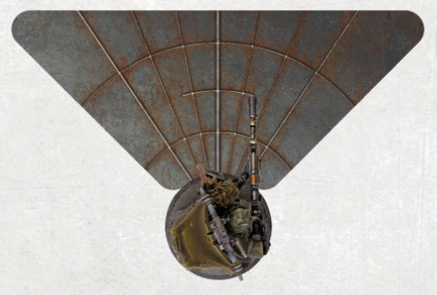
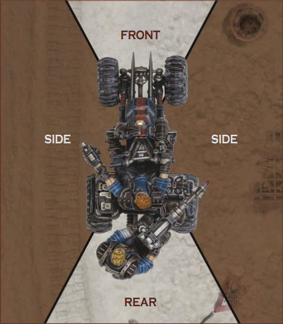
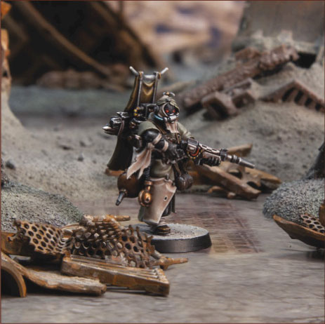
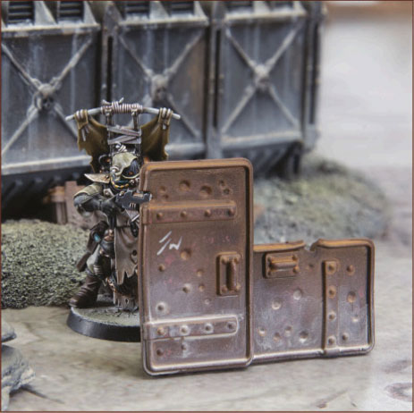
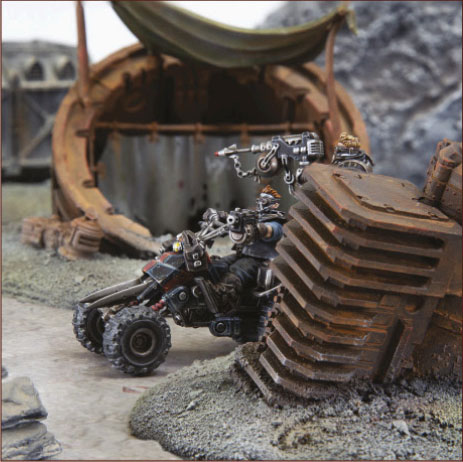
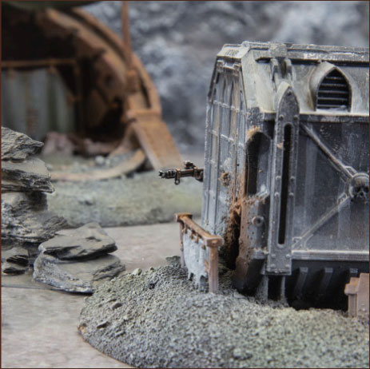

# Line Of Sight & Cover

_Source: Necromunda Core Rulebook (2023)_

Visibility in Necromunda is vitally important; fighters
need to be able to see where their enemies are in
order to shoot at them. But in the dense and dark
terrain of the underhive, or within the thick clouds
of dust and pollution that hang over the ash wastes, a clear and unobstructed line of sight is often hard to find.

## Fighter Vision Arcs

Each fighter has a vision arc, representing the area
that is visible to them. This is 90° to the front of the
model – as determined by the direction the model’s
head is facing or the direction in which its weapon
is pointed, whichever the controlling player prefers –
starting from the centre of their base, as shown in the
diagram below. As mentioned previously, Vision Arc
templates can be used to help determine the extent of
a fighter’s vision arc.

## Vehicle Vision Arcs

Like fighters, vehicles have vision arcs. Where
they differ is that larger vehicles with more crew
may have up to four vision arcs, as shown on the
following diagram. All vehicles have a front vision arc,
representing what the crew can see in the moment.
Those with more than one vision arc will invariably also
have crewed weapons that face into that vision arc.
Where a vehicle does not have a certain vision arc, this
is known as a ‘blind spot’. Determine a vehicle’s vision arc by drawing two
imaginary lines through the corners of the vehicle as
shown below.

### Line Of Sight

While a model’s vision arc is determined by their
facing, their line of sight (i.e., what they can see)
is determined by the presence of terrain and other
models. Unlike measuring distances, which can only be
done when the rules call for it, a model’s line of sight
can be checked at any time.

To check one model’s line of sight to another model, stoop down to look from the first model’s point of view:

- If a straight, uninterrupted line can be drawn fromwithin the first model’s vision arc to any part of the other model\*, the first model has a line of sight to them.
- If no such line can be drawn to the other model due to intervening terrain or the presence of other
  models\*, the first model does not have a line of sight to them.

_\*Excluding their base or any insignificant elements, such as a protruding hairstyle, the barrel of a gun or a spike from their armour, for example._

If players cannot agree whether one model has a line of sight to another, it should be settled by rolling off.

### Line Of Sight & Solid Terrain Features

Solid terrain such as the walls between corridors, the floors and ceilings between levels, or large rock
formations looming up from the landscape are, by their
nature, impossible to see through. Unless stated, a line
of sight can never be drawn through any terrain feature
defined as being solid.

:::note Designer's Note

### Agreeing On Line Of Sight

It pays to be gracious when your opponent claims
line of sight – in other words, if they claim their
model has line of sight and your immediate
thought is anything less than “There is no way that
model has line of sight!”, we recommend allowing
it. If both players take this approach (with both
line of sight and cover), the game will flow more
smoothly and will be much more satisfying.

:::

## Cover

In the majority of cases, the line of sight between one
model and another will be checked for the purposes of
shooting and, in many cases, a model that wishes to
shoot at an enemy model may be able to draw a line of
sight only to part of their intended target.

To see if a target is in cover, stoop down to look
from the attacker’s point of view, in exactly the
same manner as described for checking line of sight.
However, when checking to see if the target is in cover, disregard any friendly fighters in base contact with the attacker – moving them aside temporarily if necessary, as long as they return to the original place (and facing) once the shot has been resolved (note that vehicles in base contact will still block line of sight):

- If the target is fully visible, they are not in cover (i.e., they are ‘in the open’).
- If less than half of the target is obscured by terrain or models, they are in partial cover.
- If at least half of the target is obscured by terrain or models, they are in full cover.

As with line of sight, ignore the target’s base and any
minor elements such as hair, gun barrels and spikes –
and again, if a decision cannot be reached, the players
should roll off.

The benefits of partial and full cover are discussed in
more detail under the rules for Shooting (see [Shooting: Making the Hit Roll](/docs/the-rules/shooting#4-make-the-hit-roll)).

:::tip

_The first example shows a fighter in the open. Even though their base is obscured, a clear, unobstructed line of sight can easily be drawn to them. They are not in cover._

:::

:::tip

_The second example shows a fighter in partial cover. A line of sight can be drawn to them, but they are not in the open._

:::

:::tip

_The third example shows a vehicle in partial cover. A line of sight can be drawn to them, but they are not in the open._

:::

:::tip

_The fourth example shows a fighter in full cover. Whilst a line of sight can be drawn to them, they are mostly obscured by terrain._

:::

:::tip

_In the final example, there is no line of sight to the fighter. Only their weapon can be seen from behind the terrain, and therefore they are considered to be hidden by the terrain._

:::
