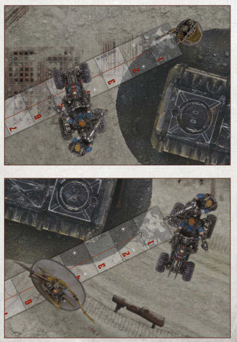
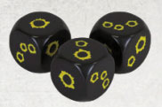
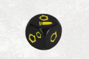

# Shooting

_Source: Necromunda Core Rulebook (2023)_

There are several ways in which a model can make a ranged attack against an enemy model, most frequently by
performing an action that allows it to do so, but certain skills and gang tactics will also allow various models to
make a ranged attack outside of the game’s normal sequence.

Whenever a model makes a ranged attack against one or more enemy models, this sequence is followed:

1. Assess Target Priority
2. Declare the Shot
3. Measure Range
4. Make the Hit Roll
5. Resolve Hits

## 1. Assess Target Priority

When a model makes a ranged attack, it must be
against the closest eligible target. An eligible target is
an enemy model that is within both the vision arc and
line of sight of a fighter, or within the vision arc and line
of sight of the weapon being fired by a vehicle.

:::danger House Rule (Necrodamus, A&A)
You must target the closest visible enemy regardless of facing. This avoids facing fighters in awkward directions to circumvent the cool check for seeing the actual closest enemy.
:::

An enemy model is an eligible target even if it is
engaged by a friendly fighter. However, if the closest
eligible target is Prone and Seriously Injured, Wrecked
or harder to hit than one further away (due to negative
modifiers applied to the Hit roll), the attacking model
may choose to ignore it. Otherwise, to make a ranged
attack against an eligible target that is not the closest,
the attacking model must first pass a Cool test (in the
case of a vehicle, use the Cool characteristic of either
the crew, or the fighter manning the weapon being
used, as appropriate). If this test is passed, the ranged
attacks may be made against any eligible target. If it is
failed, a ranged attack can only be made against the
closest eligible target.

**Fighters in Hiding:** The attacking model cannot target
an enemy fighter if they are both Prone (either Pinned
or Seriously Injured) and in partial or full cover – they
are assumed to be keeping their head very low!

## 2. Declare The Shot

Once target priority has been assessed, choose a
ranged weapon the model is armed with, and nominate
an eligible target to be the target of the ranged attack.

## 3. Measure Range

Next, measure the distance between the model making
the ranged attack and the target, to ensure that the
target is within the range of the weapon. In the case
of a fighter, range is measured from the model to the
nearest point of the target model. In the case of a
vehicle, range is measured from the weapon to the
nearest point of the target model.

If the target is outside the weapon’s Long range, the
attack automatically misses. However, the Firepower
dice must still be rolled.

:::info

_The first example shows the distance measured between a fighter and the closest point of an enemy vehicle. The second example shows the range measured between a weapon mounted on a vehicle and the closest point of an enemy fighter. Note that, in the second example, the weapon itself is not the closest point of the vehicle to the enemy fighter._

:::

## 4. Make The Hit Roll

A Hit roll is a Ballistic Skill test made against the BS
of the model making the shot. In the case of a fighter, use the BS of the fighter. In the case of a vehicle, use
the BS of either the crew, or the fighter manning the
weapon being used, as appropriate. The following
modifiers may apply to the Hit roll:

**In Partial Cover (-1):** If the target is in partial cover (see [Cover](/docs/general-principles/line-of-sight-and-cover#cover)), apply a -1 modifier.

**In Full Cover (-2):** If the target is in full cover (see [Cover](/docs/general-principles/line-of-sight-and-cover#cover)), apply a -2 modifier.

**Accuracy Modifier (+/-?):** If the weapon has an
accuracy modifier on its profile and the target is within
that range, apply the modifier.

**Target is Engaged (-1):** If the target is Standing and
Engaged, apply a -1 modifier.

**Target is Prone (-1, Long Range Only):** If the target
is Prone (either Pinned or Seriously Injured) and the
attacker is firing at Long range, apply a -1 modifier.

**Target is a Point on the Battlefield (-2):** If the target is
a point on the battlefield and the weapon being fired
does not have the Smoke trait, apply a -2 modifier.

**Rolls of a Natural 1:** If, when making a ranged attack, the hit roll is a natural 1, the attack automatically
misses, regardless of any modifiers that may apply.

**Improbable Shots:** If the negative modifiers applied
to a Hit roll mean that it is impossible to score a hit,
the attack is an Improbable Shot. To make a Hit roll
for an Improbable Shot, roll a D6. On a 1-5, the attack
misses. On a 6, there is a chance that it will hit; make
a second Hit roll as normal, using only the fighter’s
Ballistic Skill and ignoring any other modifiers.

### Hit Fighters Become Pinned

The vast majority of fighters, when they find themselves
under enemy fire, will duck for cover and attempt
to keep their head down. To represent this, when a
Standing and Active fighter is hit by a ranged attack, they are automatically placed Prone and Pinned. Players should note that a Standing and Engaged
fighter cannot become Prone and Pinned.

## 5. Resolve Hits

For each BS test that is passed when making a Hit roll, a hit is scored. Each hit scored is resolved as described in [Resolving Hits](/docs/the-rules/resolve-hits).

### Stray Shots

If an attack with a ranged weapon misses, there is
a chance that another fighter, friend or foe, that is
Engaging the target will be hit. Equally, there is a
chance that any model, friend or foe, that is within 1"
of the line along which the range between the attacker
and the target was measured, will be hit.

If the attack misses, roll a D6 for each model that is at
risk of being hit, starting with the model closest to the
attacker. On the roll of 1, 2 or 3, that model is hit by
the attack. On a 4, 5 or 6, the shot misses it – move on
to the next model at risk of being hit.

:::danger House Rule (Necrodamus, A&A)
Stray shots only hit other fighters on a 6+.
:::

If the attack would have caused more than one hit, follow this sequence for every hit.

:::info

### Twin Guns Blazing

If a fighter is armed with two weapons that both
have the Sidearm trait, they can fire both at the
same time, targeting the same enemy model, as
part of a single Shoot (Basic) action. Make the Hit
roll for each weapon being used before resolving
any hits scored. Both attacks must be made
against the same target and the Hit roll for each
suffers a -1 modifier.

:::

### The Firepower Dice

Every time an attack is made with a ranged weapon
(including when using a weapon with the Sidearm
trait in close combat), a Firepower dice must also be
rolled. Even if no Hit roll is made for the attack, and
even if the weapon does not have the Rapid Fire trait,
a Firepower dice must still be rolled.

For example, if the target is found to be out of range
when measuring range, the attack will automatically
miss, but a Firepower dice must still be rolled. Or if
the weapon has the Template trait, meaning models
touched by the Flame template are automatically hit,
a Firepower dice must still be rolled.

If the Ammo symbol is rolled, there is a chance
the weapon has run Out of Ammo, jammed, or
encountered some other malfunction.

Immediately make an Ammo test for the weapon, testing against its Ammo characteristic. If this test
is passed, nothing happens. If this test is failed, the
weapon itself becomes subject to the Out of Ammo
condition. The attack that caused the Ammo test to
be made is then resolved as normal, but the weapon
cannot be used again until it is reloaded by performing
a successful Reload (Simple) action for it.

Most of the faces on the Firepower dice feature a number of bullet holes: one, two or three. In most cases, rolling one of these symbols means the weapon hasn’t run out of ammo, jammed or otherwise malfunctioned. If, however, the weapon being fired has the Rapid Fire (X) trait, the number of bullet holes rolled indicates the number of shots made.

This symbol indicates that the weapon has run out of ammo, jammed or malfunctioned, and that an Ammo roll is required. Rolling this symbol doesn’t mean that the attack itself misses, based on the Ballistic Skill test the attack may still hit its target. However, regardless of the Ballistic Skill test, something has gone wrong and an Ammo test must be made.

:::info

### Multiple Weapon Profiles

Some weapons have more than one weapon profile – shotguns, for example, can be loaded with several
different types of ammunition. When declaring a ranged attack with such a weapon, the player must declare
which profile they will use, chosen from the profiles available. For example, a shotgun may fire ‘solid’ and
‘scatter’ ammo as standard, and may be loaded with and use ‘executioner’ ammo if purchased.

Should a weapon with more than one weapon profile fail an Ammo test for one of its profiles, it is considered
to have failed an Ammo test for all of its profiles.

The weapon cannot be used at all until a Reload (Simple) action has been successfully performed, using any
one of the weapon’s available profiles, chosen by the controlling player.

If a profile that has either the Scarce or Limited trait fails an Ammo test, that profile may not be used for the
remainder of the battle.

:::

### Blast Markers

When making a ranged attack with a weapon that has
the Blast (X) trait, a model may target a point on the
battlefield instead of an eligible target, though if they
do so the shot will have a -2 modifier to hit unless the
weapon also has the Smoke trait:

- Place the appropriately sized Blast marker
  (determined by the number in brackets after the trait
  on the weapon’s profile) so that the central hole is
  anywhere within line of sight of the model making
  the attack.
- Measure the distance between the attacking model
  and the Blast marker. If the central hole is beyond
  the Long range of the weapon, the Blast marker is
  moved directly back towards the attacking model
  until the central hole is within range.
- Make a Hit roll as normal:
  - If the attack hits, the Blast marker stays
    where it is.
  - Otherwise, roll a Scatter dice and a D6. The
    Blast marker moves in the direction shown by
    the Scatter dice (using the small arrow if the Hit
    symbol is rolled) a number of inches equal to the
    number rolled on the D6. The marker will stop
    moving if the central hole comes into contact with
    a solid or impassable feature.
- Once the Blast marker’s position has been
  established, every model (friend or foe) that lies
  beneath the Blast marker (fully or partially) is hit
  by the attack (unless there is a solid terrain feature
  between them and the centre of the Blast marker).
- Follow step 5 of the Shooting sequence as normal for
  each model hit, in an order of the attacking player’s
  choice. Players should note that, after scattering, the
  Blast marker may end beyond the weapon’s range or
  out of line of sight.

**Misfires:** If a Hit is rolled on the Scatter dice and a 1
is rolled on the D6, something has gone wrong. Roll
another D6. On a 2-6, the shot is a dud; the attack
ends and the Blast marker is removed. If the roll is a 1, the weapon has misfired; centre the Blast marker over
the attacking model and resolve the attack as normal.

### Flame Templates

If attacking with any weapon with the Template trait, the weapon will make use of the Flame template to
determine which fighters are hit by the attack:

- Ignore step 1 of the Shooting sequence.
- During step 2 of the Shooting sequence, instead of
  declaring an enemy to be the target of the attack, place the Flame template so that the narrow end is
  touching the attacking fighter’s base and the entire
  template is within their vision arc.
- Ignore steps 3 and 4 of the Shooting sequence.
  Instead, each model (friend or foe) that lies
  beneath the Flame template (fully or partially) is hit
  automatically by the attack (unless there is a solid
  terrain feature between it and the model making
  the attack).
- Follow step 5 of the Shooting sequence as normal
  for each model hit, in an order of the attacking
  player’s choice.

:::danger House Rule (Necrodamus, A&A)

- Do not ignore step 1: Must pass Priority test or touch closest fighter (except Smoke!).
- If an Engaged fighter is hit, any other fighters Engaged with the hit fighter are also hit on a 4+.

:::

#### Blastmarkers, Flame Templates & Cover

Models hit by Blast markers and Flame templates may
gain a positive modifier to their Save roll if they are in
partial or full cover:

- If a fighter hit by a Blast marker is behind partial or
  full cover in relation to the central hole of the Blast
  marker, they will benefit from a positive modifier to
  their Save roll.
- If a fighter hit by a Flame template is behind full or
  partial cover in relation to the fighter making the
  attack, they will benefit from a positive modifier to
  their Save roll.

The modifiers to a fighter’s Save roll for being in
cover against a Blast marker or Flame template are
as follows:

- A fighter in partial cover gains a +1 modifier to their
  Save roll.
- A fighter in full cover gains a +2 modifier to their
  Save roll.

These modifiers do not apply to Field armour.

_For example, if a fighter wearing mesh armour is behind partial cover in relation to the centre of a Blast marker, their armour save will be increased to 4+ against the attack. If the fighter hit was wearing no armour, they would gain a 6+ Save roll against the attack._
