# Badzone: Delta-7

What follows are rules for using the contents of the Badzone Delta-7 set. Players can agree to use them when
setting up a Zone Mortalis battlefield, adding them to the tiles that are available.

In addition you will find a reprint of [The Gauntlet](/docs/scenarios/scenario-list/the-gauntlet) _[added to the Scenarios list]_, a special scenario first published in White Dwarf, which uses multiple Badzone Delta-7 tiles to form what must surely be the most challenging
battlefield any gang could possibly encounter!

:::tip

The Badzone Delta-7 tiles were a stand-alone set of Zone Mortalis tiles, one side featuring Underhive wall layouts, the other featuring layouts with more exotic terrain, detailed below.

:::

## Using These Rules On Sector Mechanicus Battlefields

Many of the rules that follow can easily be adapted
for use on a Sector Mechanicus battlefield. In most cases, this is simply a matter of creating a bespoke
terrain feature of suitable size, shape and appearance to represent the terrain feature as it is portrayed
on the tile; however, if any additional guidelines are needed, they will be found alongside the relevant entry.

## Cult Ritual Chamber

_No world in the vast Imperium is immune to the taint of the Ruinous Powers, and on Necromunda its touch is as likely to be felt in the gilded salons of the spire-palaces as it is in the nighted domes of the underhive and in the overcrowded hab-zones in between. Cultists of the Chaos gods often hide their ritual gatherings by meeting in sectors entombed by rubble and waste from the upper levels or accessible only through hidden openings. Those who discover such chambers are often driven insane by unheard ramblings and scarred by unseen hands. Those few who escape unharmed and with their sanity intact are considered the fortunate ones, no matter how terrified they may be from witnessing their fellows being slowly corrupted by the laughter of thirsting gods…_

If a fighter ends their activation within 6" of the Ritual
Circle, make a Willpower check for them. If the check
is failed, the fighter immediately becomes subject to
the [Insanity condition](/docs/general-principles/conditions#insane).

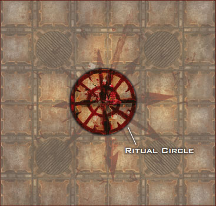

:::note

#### On A Sector Mechanicus Battlefield…

When setting up terrain for a Sector Mechanicus
battlefield, a suitable terrain feature (perhaps
an idol or altar) can be used in place of the
Ritual Circle.

:::

## Collapsed Sections

_While the metres-thick flooring plates of the hive were constructed to remain strong for thousands of years, some sections are often subjected to the touch of harshly corrosive chemicals, the natural traffic of a trade hub or recreational facility or, particularly on the lower levels, cataclysmic hive quakes. Events such as these force entire sectors to be abandoned, thus furthering the growth of the hive as it builds ever skyward. However this section collapsed, and the river of waste from the upper hive has already begun to fill the mostly abandoned lower section and solidify around the fallen ruins in the hive’s twisted self-regeneration. While such abandoned sections can prove valuable to those who would pillage the depths of the hive, these collapsed floors have caused the downfall of entire gangs as the already-weakened floor gives way to their deaths below._

A Collapsed Section features one or more large Pitfalls.

### Pitfalls

Pitfalls are treated just like [gaps](/docs/the-rules/terrain#leaping-gaps). Fighters can
attempt to leap across Pitfalls in exactly the same way
as they would leap across any other gap.

Additionally, Pitfalls are Falling Hazards and a fighter
risks falling into a Pitfall should they go from Standing
to Prone whilst within ½" of a Pitfall. Should this
happen, the fighter must make an Initiative check.
If the check is passed, nothing happens. If the check
is failed or if a natural 1 is rolled, the fighter will fall
into the Pitfall. When a fighter falls into a Pitfall, they
immediately go Out of Action and, during a campaign
game, a single roll is made on the Lasting Injuries
table, representing the fighter falling into a different
level of the underhive.

Finally, if a weapon with the Blast trait is used and
the centre of the Blast marker ends on a Collapsed
Section tile, roll a D6 for each fighter on that tile.
If the test is failed, the floor shifts and the fighter is
moved D3" towards the nearest Pitfall (potentially
falling if they move into it).

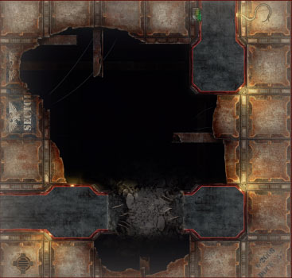
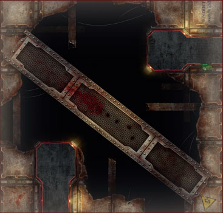

:::note

#### On A Sector Mechanicus Battlefield…

Pitfalls or Collapsed Sections can be represented
on the ground level of a Sector Mechanicus
battlefield. Craters or gratings with sections
missing are an ideal way to represent such
hazards. Players may also wish to set up a
battlefield where there is no ground level; perhaps
all the action could take place on gantries and
walkways, making falling truly hazardous!

:::

## Archaeotech Device

_The sprawl of tunnels that runs the breadth of the underhive is dotted with examples of ancient technology, some of it still working. Often found in chambers bedecked with icons and sigils unknown to all but the adepts of the Adeptus Mechanicus, these relics are valuable resources for any gang with an interest in technology – or with an interest in extorting credits from technology. In most cases these chambers would have been hidden behind multiple security measures, and possibly only accessible by the Adeptus Mechanicus or other apprentices sufficiently blessed to enter, but in the ancient press of the lower hive such measures have long-since been forgotten. Miraculously, some such devices still seem to function, a sign of either the Omnissiah’s continued blessing or, more likely, a valuable hidden power source._

A Standing and Active fighter within 1" of the
Console can perform the following action:

**Activate Device (Basic):** Make an Intelligence check
for the fighter. If it is passed, any weapons carried by
any fighter who is currently standing at least partially
on the Platform of the Archaeotech Device gain the
Shock trait for the remainder of this battle. If the
check is failed, any fighter who is currently standing
at least partially on the Platform of the Archaeotech
Device becomes Pinned then takes D6 hits – resolved
using the following weapon profile:

<WeaponStats>

| Weapon         | Rg S | Rg L | Acc S | Acc L | Str | Ap  |  D  | Ammo | Traits                                                 |
| :------------- | :--: | :--: | :---: | :---: | :-: | :-: | :-: | :--: | :----------------------------------------------------- |
| Electric Shock |  -   |  -   |   -   |   -   |  2  |  -  |  1  |  -   | <Tooltip type="traits" content="shock">Shock</Tooltip> |

</WeaponStats>

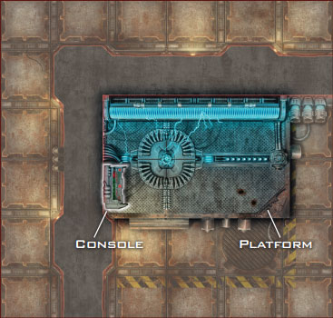

:::note

#### On A Sector Mechanicus Battlefield…

Most importantly, the terrain feature representing
the Archaeotech Device should have a
Console; if it does not, a Door Terminal can be
placed adjacent to the device to count as the
Console. If the terrain feature representing the
Archaeotech Device does not have a ‘Platform’
or something similar, the Activate Console (Basic)
action will affect any fighters that are within 3" of
the terrain feature.

:::

## Furnace Floor

_A completely functional furnace in the underhive is a rare amenity, more so if it hasn’t already been claimed by one of House Goliath’s many gangs. These facilities are prized objectives for any gang looking to extract a deal with House Goliath. Even when contaminated with human remains, effluent or general waste from the hive above, such furnaces have become central to many inter-gang power struggles as deadly torture chambers, disposal units or even to curry favour with House Goliath or those in service to the Great House._

The Furnace is treated in the same way as a Pitfall, as
described above. However, in a campaign battle, no Lasting Injury roll is made for any fighter that falls into a Furnace; this automatically counts as a 61-65 (Critical Injury).

In addition, the heat haze is such that any ranged attacks made across the Furnace suffer an additional
-1 to hit modifier.

:::note

#### On A Sector Mechanicus Battlefield…

A Furnace can be represented in many ways on
a Sector Mechanicus battlefield. What’s more, it
does not have to be at ground level! You could
model a huge furnace several stories high, or
numerous smaller furnaces to represent a busy
smelting works. These could be criss-crossed with
overhead walkways and gantries that fighters
might have to traverse, making the battlefield
very hostile indeed.

:::

## Ventilation Tunnel

_Even when the underhive was fully inhabited and functional, air from the less toxic regions of the atmosphere had to be pumped down to the lowest levels. As these tunnels and ducts were designed to function in low-power environments, in cases of natural disasters, sabotage and industrial failings, most of these systems remain functional, even within sectors that have completely collapsed. However, given their size, these tunnels can make an entire corridor impassable – many an unfortunate ganger has been caught by the airflow and drawn into the blades, and now few dare to move even a footstep closer than they must to pass._

If a fighter ends their activation within 6" of
the Turbine, roll a D6 and add their Strength
characteristic. If the result is 7 or more, they manage
to brace themselves against the rushing wind. If the
result is lower, they are moved D3" towards the
centre of the Turbine.

If a fighter moves into the Turbine, they go Out of
Action immediately. In a campaign battle, D3 Lasting
Injury rolls are made against the fighter rather than
the usual one.

Finally, if a Blast marker that is centred within 6"
of the Turbine scatters, do not roll the Scatter dice
– instead, the marker moves directly towards the
centre of the Turbine.

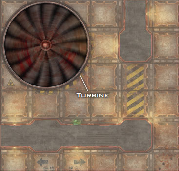

:::note

#### On A Sector Mechanicus Battlefield…

As with a Furnace, there are many ways a Turbine
can be represented on a Sector Mechanicus
battlefield, and what’s more, it doesn’t even
need to be set into the floor. One of the more
interesting options is to have an upright Turbine
mounted in a wall. Such terrain features can be
placed at any level.

:::

## Malfunctioning Generatorium

_The hives of Necromunda are ever-hungry for raw power to drive the ceaseless engines of industry, and once activated, a generator is rarely deactivated, instead functioning until such time as it fails and another is built to make up for the shortfall. Abandoned by their tech-cult custodians, such generators may still be of use to a gang which is bold or foolish enough to attempt to harness the unchained energies they yet produce._

The Generators on this tile block line of sight. While
the Generators are active (i.e., unless they have been
deactivated, as described below), if a fighter moves
between two Generators or ends an action within 1"
of a Generator, they are Pinned by the energy coursing
around them, their activation ends and they suffer D3
hits, resolved using the following weapon profile:

<WeaponStats>

| Weapon             | Rg S | Rg L | Acc S | Acc L | Str | Ap  |  D  | Ammo | Traits                                                 |
| :----------------- | :--: | :--: | :---: | :---: | :-: | :-: | :-: | :--: | :----------------------------------------------------- |
| Arcing Electricity |  -   |  -   |   -   |   -   |  4  |  -  |  1  |  -   | <Tooltip type="traits" content="shock">Shock</Tooltip> |

</WeaponStats>

A fighter within 1" of the Console can perform the
following action:

**Deactivate Generators (Basic):** Make an Intelligence
check for the fighter. If it is passed, the Generators are
deactivated until the end of the round.

:::note

#### On A Sector Mechanicus Battlefield…

As with the Archaeotech Device, it is most
important that the terrain feature representing
the Generators should have a Console; if it does
not, a Door Terminal can be placed adjacent to
the device to count as the Console.
Generators should be placed in pairs – after all
the greatest risk lies in passing between two – but
there is no limit to how many can be placed.

:::

## Sludge Farm

‘Sludge’ is a colloquial term used by underhivers to
describe any unidentifiable or unpleasant biological
run-off from such vital processes as corpse-starch
processing, effluent refining or bulk mycoprotein
cultivation. The area is foul-smelling and dangerous,
yet, as with most things in the underhive, as
potentially valuable as it is perilous.

Sludge Vats follow the rules for Pitfalls;
however, a fighter that falls into a Sludge Vat is not
taken Out of Action. Instead, they become Prone
and Pinned within the Vat, and their activation
ends immediately.

Next time the fighter is activated, they must perform
two Move (Simple) actions to climb out of the Vat.
At the end of this activation, they become Prone and
Pinned at the edge of the Vat.

Lots of things can be found floating in sludge, many
of which are best not examined too closely. However,
sometimes a fighter may come across something
valuable. When a fighter falls into a Sludge Vat, they
will find D3xD3 credits. These are added to the gang’s
Stash immediately after the fighter climbs out of
the Vat.

Note that the Sludge Vats on this tile are set into the
ground, and as such do not block line of sight.

:::note

#### On A Sector Mechanicus Battlefield…

Sludge Vats do not have to be at ground level.
As with other features, they could be modelled
several stories high, or as very large, open
areas. These can be criss-crossed with overhead
walkways, gantries and platforms, with lots of
ladders to different levels, giving fighters easy
access to them.

:::

## Flooded Passage

_While the uphive nobles sip on water imported at staggering expense from sources across the galaxy, downhivers must rely upon liquids recycled countless thousands of times over. The expense of a single flute of quantum-spun Cthellian ice-water would purchase sufficient liquid to sustain the workforce of an entire furnace zone for a whole shift. Even recyc-water has value in the underhives however, and some gangs disrupt vital pipelines and infrastructure as acts of petty sabotage against larger gangs and hated Clan Houses, or set elaborate traps using live power cords or acidic compounds._

At the end of each End phase, roll a D6 for each
Prone and Seriously Injured fighter in the Flood Water.
On a 1, their injuries are too great to keep their head
above the water and the fighter slips beneath the
surface – the fighter immediately goes Out of Action
and, during a campaign game, a single roll is made on
the Lasting Injuries table.

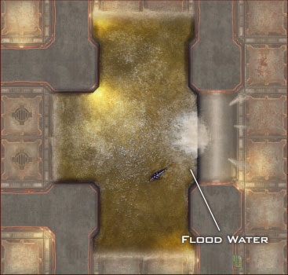

:::note

#### On A Sector Mechanicus Battlefield…

There are many ways to represent Flood Water
on a Sector Mechanicus battlefield. From small
pools of standing water used as scatter terrain,
to large flooded areas, anything is possible, up
to and including having the entire surface area
of the battlefield covered in standing water at
ground level.

:::

## Sewage Channel

_One of the staples of the diet fed to the industrial serfs of the Clan Houses is bulk mycoprotein, a foodstuff derived from fungus grown on the single most plentiful source of protein available in the hives. A constant stream of this biological waste flows downwards to feed the mycoprotein plants, and many gangs use such channels as ideal ambush points or as a convenient means of disposing of the corpse of a scragged rival._

If a fighter moves into the Open Sewer for any reason,
or starts their activation within the Open Sewer, roll a
D6 and add their Strength characteristic. If the result
is 7 or more, the fighter maintains their footing.
If the result is lower, they become Prone and Pinned.
If a fighter began their activation within the Sewage
Channel and was already Prone and Pinned, they
are swept away by the fast-flowing current – the
fighter immediately goes Out of Action and, during a
campaign game, a single roll is made on the Lasting
Injuries table.

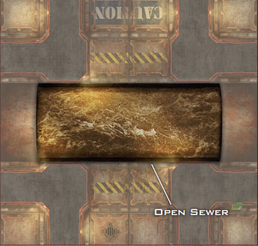

:::note

#### On A Sector Mechanicus Battlefield…

Sewage Channels can be large or small.
They could be simple sections of broken ground,
revealing an open sewer below, or flowing rivers
of effluent fighters must traverse. There is also
no reason for an Open Sewer to be at ground
level; they could be shown as overhead pipes with
broken sections below small gaps or ledges, so
that fighters leaping gaps or climbing between
levels risk landing in an open sewer pipe should
they fall!

:::

## Promethium Cache

_Most gangs in the underhive hoard scavenged materials in hidden corners. These caches can contain anything from food to munitions, but if a firefight breaks out around a promethium stockpile, it’s only a matter of time before a stray shot leads to a massive fireball!_

The Promethium Barrels and Fuel Tank on this tile
can be targeted by ranged attacks as though they
were fighters (they can also be hit by templates,
Blast markers and stray shots – see pages 66 and
67 of the Necromunda Rulebook). If the Barrels and
Fuel Tank are hit, roll a D6 and subtract the attacking
weapon’s Armour Penetration value. If the result is 4
or more, the shot is deflected. If the result is a 3 or
less, a Barrel or the Fuel Tank itself is breached and
there is a huge detonation.

Every fighter within 3" of a Barrel or the Fuel Tank is
immediately Pinned, and suffers one hit – resolved
using the following weapon profile:

<WeaponStats>

| Weapon             | Rg S | Rg L | Acc S | Acc L | Str | Ap  |  D  | Ammo | Traits                                                 |
| :----------------- | :--: | :--: | :---: | :---: | :-: | :-: | :-: | :--: | :----------------------------------------------------- |
| Burning promethium |  -   |  -   |   -   |   -   |  5  |  -  |  2  |  -   | <Tooltip type="traits" content="blaze">Blaze</Tooltip> |

</WeaponStats>

Once there has been a detonation, the Barrels and
Fuel Tank can no longer be hit – however, the space
they occupied, and the Spilled Fuel, are ablaze for the
rest of the battle. If a fighter moves into the blaze,
they suffer a hit using the above profile.

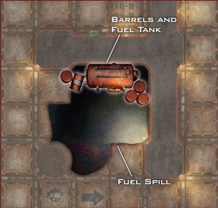

:::note

#### On A Sector Mechanicus Battlefield…

A Promethium Cache can be represented with
any suitable barrels, fuel canisters or large storage
tanks. The important thing is that the terrain
feature should have a clearly defined footprint
which can be used to show the area of burning
promethium that remains after the terrain feature
itself has exploded.

:::

## Unlit Corridor, Unlit Junction And Unlit Crossroad

_Inevitably, generators fail and wiring corrodes, plunging entire sections of the hive into darkness. Lightless corridors can present both a blessing and a curse to gangs in any given sector. While some welcome the darkness and use it as an opportunity to spring elaborate ambushes, cover the setting of booby traps or make their escape, other, typically less experienced gangs foolishly stumble into such traps laid for them in the dark._

The Darkened Corridor, Junction and Crossroad tiles
and fighters within them are subject to the [Pitch Black rules](/docs/battlefield-setup/scenario-rules#pitch-black--visibility).

  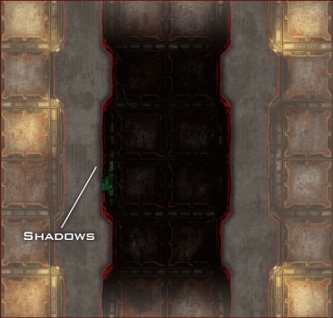

:::note

#### On A Sector Mechanicus Battlefield…

Obviously it is an easy matter to have an entire
battlefield plunged into darkness using the Pitch
Black rules. However, you may wish to experiment
with the idea of having certain areas of the
battlefield be in the dark and others illuminated.
These could be areas behind or beneath other
large terrain features, or secluded corners.

:::

## Secure Vault

_As the hives grow ever upwards, once invaluable assets are abandoned and reclaimed by others. A secure vault might once have housed wealth sufficient to purchase an entire world, and a still functioning vault is of huge value to any underhive gang that can keep hold of it. They may serve as prisons, torture chambers, boltholes or armouries, for once locked from within, they are all-but impervious to intrusion._

When setting up the Secure Vault tile, a Door must be
placed across the Vault’s entrance. There must also be
a Door Terminal on the outside of the Vault. The Vault
Door has a Toughness of 8 and 4 Wounds. Ductways
can never be set up so that they lead into the Vault.

When attempting to open the Vault Door, Force
Door (Basic) actions succeed if the roll is 11 or higher
(rather than the usual 9), and Access Terminal (Basic)
actions suffer a -4 modifier to the Intelligence check
(rather than the usual -2).

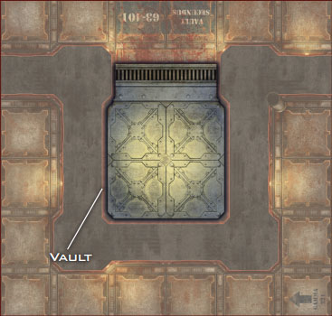

:::note

#### On A Sector Mechanicus Battlefield…

A Secure Vault can be denoted by the presence
of any suitably large and secure door in any
terrain feature. The vault beyond could even
be portrayed by setting up a second, smaller
battlefield (perhaps a Zone Mortalis battlefield),
enabling fighters to enter the vault itself.

:::

## Fungus Sprawl

_The underhives of Necromunda are host to all manner of bizarre mutant flora, with some long-abandoned domes being entirely overrun by twisted forests of weirdly-glowing fungal forms, the air thick with choking clouds of drifting spores. None can say how such strains come into existence, but as with most things in the underhive, they are often put to use by those who live there, in most cases as food, medicine or lethal poison._

If a fighter ends their activation within 2" of the
Fungus Sprawl, they suffer one hit – resolved using
the following weapon profile:

<WeaponStats>

| Weapon        | Rg S | Rg L | Acc S | Acc L | Str | Ap  |  D  | Ammo | Traits                                             |
| :------------ | :--: | :--: | :---: | :---: | :-: | :-: | :-: | :--: | :------------------------------------------------- |
| Fungal Spores |  -   |  -   |   -   |   -   |  -  |  -  |  -  |  -   | <Tooltip type="traits" content="gas">Gas</Tooltip> |

</WeaponStats>

If a fighter has an item of wargear that protects them
against attacks made by weapons with the Gas trait
(such as a respirator or filter plugs), it can be used
as normal.

Additionally, in scenarios using the Sneak Attack
special rules, attackers who are within 2" of a Fungus
Sprawl are easier to see due to the phosphorescent
glow the fungus gives off. Add 1 to the result of the
2D6 roll to see whether they are spotted by a sentry.

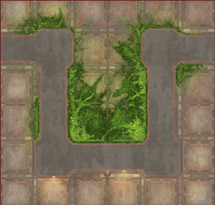

:::note

#### On A Sector Mechanicus Battlefield…

A Fungus Sprawl can be represented by a suitable
piece of scatter terrain, or by fungus modelled
onto any other terrain feature. Provided it is
easy to tell where the fungus begins and ends,
anything goes!

:::

## Waste Compactor

_Though nothing is ever truly disposed of within the hives of Necromunda, unwanted waste is often compacted for later recycling. The mechanisms by which such waste is disposed of are often used by underhive gangs as a means of torturing or executing captured rivals, and are especially useful in disposing of their corpses afterwards._

The Compactor follows the rules for Pitfalls (see
Collapsed Sections); however, if a fighter falls into
it, they are not taken Out of Action. Instead, they
become Prone and Pinned within the Compactor, and
their activation ends immediately.

Next time the fighter is activated, they must perform
two Move (Simple) actions to climb out of the
Compactor. At the end of this activation, they become
Prone and Pinned at the edge of the Compactor.

Additionally, any Standing and Active fighter within
1" of the Console (and not within the Compactor!)
can perform the following action:

**Cycle Waste Compactor (Basic):** Make an
Intelligence check for the fighter. If this check is
passed, the Waste Compactor briefly surges into life
and any fighters in the Compactor are taken Out
of Action. In a campaign battle, no Lasting Injury
roll is made; this automatically counts as a 61-65
(Critical Injury).

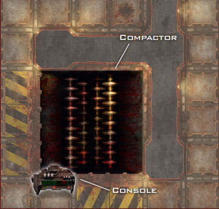

:::note

#### On A Sector Mechanicus Battlefield…

A Waste Compactor can be almost any size or
shape, from a small feature at ground level to a
large feature several storeys high. As with other
similar hazards, such features loan themselves
very well to walkways, ledges and ladders,
increasing the chances of an unwary fighter
falling into the Waste Compactor’s waiting jaws.
What matters most is that the terrain feature
should have a Console; if it does not, a Door
Terminal can be placed adjacent to the device to
count as the Console.

:::

## Xenos Nesting Chamber

_Whether due to the intentional introduction of offworld fauna or the mutation of native lifeforms, the underhives of Necromunda are host to all manner of strange and often lethal strains, many of which lay their eggs in the deepest, darkest corners they can find. Such locations are extremely perilous to the unwary intruder, as quite apart from the biological hazards of contact with alien spores, whatever it was that laid them might return at any time!_

If a fighter ends their activation within 1" of an Egg
Sac, roll a D6. On a 1-3, they are attacked by Xenos
Hatchlings – the fighter immediately becomes Prone
and Pinned, and suffers D6 hits – resolved using the
following weapon profile:

<WeaponStats>

| Weapon           | Rg S | Rg L | Acc S | Acc L | Str | Ap  |  D  | Ammo | Traits                                                     |
| :--------------- | :--: | :--: | :---: | :---: | :-: | :-: | :-: | :--: | :--------------------------------------------------------- |
| Xenos Hatchlings |  -   |  -   |   -   |   -   |  1  |  -  |  1  |  -   | <Tooltip type="traits" content="rending">Rending</Tooltip> |

</WeaponStats>

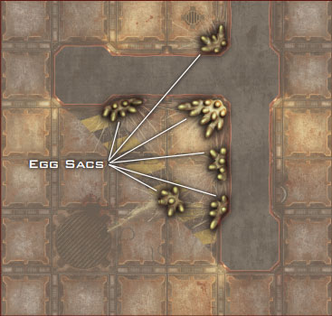

:::note

#### On A Sector Mechanicus Battlefield…

Much like a Fungus Sprawl, the presence of
Xenos Egg Sacs can be represented by any
suitable pieces of scatter terrain, or by egg sacs
modelled onto any other terrain feature. What
matters most is that it should be simple to tell
where the Egg Sacs are, making measurement
between them and any fighters easy.

:::
