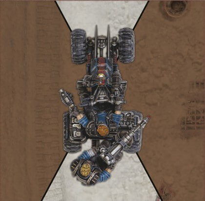

import Tabs from '@theme/Tabs';
import TabItem from '@theme/TabItem';

# Resolving Hits on and by Vehicles

## Vehicles And Ranged Attacks

Vehicles follow the same rules for resolving ranged
attacks as fighters with the following modifications:

### Measuring Range

When resolving a ranged attack with a vehicle, always
measure the distance from the weapon being fired, not
from the vehicle’s base or hull. When resolving ranged
attacks against a vehicle, always measure to the
closest point of the vehicle’s hull. Note that vehicles
gain the same benefits from cover as fighters do.

### Vehicle Vision Arcs

Like fighters, vehicles have vision arcs. Where
they differ is that larger vehicles with more crew
may have up to four vision arcs, as shown on the
following diagram. All vehicles have a front vision arc,
representing what the crew can see in the moment.
Those with more than one vision arc will invariably also
have crewed weapons that face into that vision arc.
Where a vehicle does not have a certain vision arc, this
is known as a ‘blind spot’.

Determine a vehicle’s vision arc by drawing two
imaginary lines through the corners of the vehicle as
shown below.

## Vehicles And Close Combat Attacks

Vehicles can never make close combat attacks.

### Attacking Vehicles

A fighter that is within 1" of a vehicle counts as being
Engaged with that vehicle and may make close combat
attacks against it, however they can freely move
around on the vehicle or away from it without having
to disengage. When a fighter makes a close combat
attack against a vehicle, they may apply a +1 modifier
to the Hit roll. A fighter Engaging a vehicle in close
combat may roll an additional Location dice (see [Multiple Location Dice](/docs/rules/vehicles/vehicle-resolve-hits#multiple-location-dice)), choosing one result to apply and discarding the
other(s).

A vehicle never counts as being Engaged and may
freely move out of engagement range of enemy
fighters, however when it does those fighters may
make an Initiative check, performing Reaction attacks
against the vehicle if they pass.

A fighter attacking a vehicle cannot gain the benefits
of assists. Additionally, vehicles cannot make Reaction
attacks and can never grant assists to friendly fighters.

Any hits scored in close combat are resolved against
the Toughness value of the facing they are in contact
with. If a fighter is on the vehicle, resolve them against
the lowest Toughness. If a fighter wrecks a vehicle, they
may consolidate.

#### Resolving Hits Against Vehicles

When a vehicle suffers a Hit, follow this sequence:

1. Determine Facing of Attack
2. Make Wound Roll
3. Make Save Roll
4. Determine Damage

## 1. Determine Facing Of Attack

As noted under [Vehicle Characteristics](/docs/rules/vehicles/#vehicle-characteristics), all vehicles have three Toughness characteristics: Front, Side
and Rear. Each of these corresponds to the vehicle’s different vision arcs, as shown
in the diagram below.

Every hit a vehicle suffers is resolved against one of these ‘facings’. Which facing
has been hit depends upon where the attacking model is in relation to the vehicle. To determine this, imaginary lines are drawn from the vehicle, as shown in the
diagram; whichever arc the centre of the attacking model’s base (or central hole in
the case of a Blast template) is in is the facing hit.

If there is ever any doubt as to which facing has been hit (for example, if the
imaginary line runs through the centre of the attacking model), the better Toughness
value is always used.

:::info Hull Down Vehicles

Sometimes, the attacking model will not be able to see any of the vehicle facing
whose arc they are in. In these cases the vehicle is said to be hull down, and
gains the benefit of being in Full Cover even if not sufficiently obscured.

:::

## 2. Make Wound Roll

Whenever a Wound roll is made against a vehicle, it is always the opposing player
that makes it. Cross reference the weapon’s Strength with the Toughness of the
facing hit on the vehicle and roll a D6 on the table below to determine if the vehicle
is wounded by the attack:

| Strength vs. Toughness                          | D6 Roll Required |
| ----------------------------------------------- | :--------------: |
| Is the Strength TWICE the Toughness or greater? |        2+        |
| Is the Strength GREATER than the Toughness?     |        3+        |
| Is the Strength EQUAL to the Toughness?         |        4+        |
| Is the Strength LOWER than the Toughness?       |        5+        |
| Is the Strength HALF the Toughness or lower?    |        6+        |

## 3. Make Save Roll

If a hit results in a successful Wound roll, or leads to a Damage roll being made
against the vehicle for any reason, the vehicle may be able to make a Save roll. This
is done in exactly the same way as for fighters.

## 4. Determine Damage

Following an unsuccessful Save roll, instead of inflicting damage as normal, the
opposing player should roll both the Damage dice and Location dice simultaneously.
It is always the opposing player that rolls Damage dice and Location dice.

:::info Vehicle Dice

If you don't have Vehicle dice, use the following tables

<Tabs>
<TabItem value="damage" label="Damage" default>

| D6  | Effect          |
| --- | --------------- |
| 1   | Glancing Hit    |
| 2   | Glancing Hit    |
| 3   | Glancing Hit    |
| 4   | Penetrating Hit |
| 5   | Penetrating Hit |
| 6   | Catastropic Hit |

</TabItem>
<TabItem value="location" label="Location" default>

| D6  | Effect |
| --- | ------ |
| 1   | Body   |
| 2   | Body   |
| 3   | Body   |
| 4   | Crew   |
| 5   | Drive  |
| 6   | Engine |

</TabItem>
<TabItem value="control" label="Control" default>

| D6  | Effect         |
| --- | -------------- |
| 1   | Swerve 45°     |
| 2   | Swerve 45°     |
| 3   | Swerve 45°     |
| 4   | Jack-knife 90° |
| 5   | Jack-knife 90° |
| 6   | Roll           |

- On a 1-3, the vehicle turns left.
- On a 4-6, the vehicle turns right.

</TabItem>
</Tabs>

:::

### A. Location Hit

One or more Location dice are rolled to determine the exact location hit.
In some cases, it will be impossible to hit a certain location from a specific facing
(as described in the vehicle’s special rules). Should it ever occur that an impossible
location has been hit, simply re-roll the Location dice.

### Multiple Location Dice

Players should note that, in some cases, more than one Location dice is rolled. When
this is the case, it is usual for the player that made the roll to choose a single result
to resolve and discard the other dice. Sometimes, however, it may be the player that
controls the vehicle that chooses which result to apply. When this is the case, the
rules will always make it clear.

In some cases, all of the Location dice rolled may be applied. For example, if a
vehicle has suffered several hits at once from a Rapid Fire (X) weapon, a number of
Location dice equal to the number of Hits is rolled. Again, when this is the case, the
rules will always make it clear.

### B. Roll Damage Dice

After a vehicle has been wounded, a number of Damage dice equal to the Damage characteristic are rolled. Unlike when rolling Injury dice for a wounded fighter, this is done every time a vehicle is successfully wounded regardless of Hull Points remaining.

Regardless of how many Damage dice are rolled, only one result is applied against
the vehicle for each hit suffered, the benefit of rolling extra dice is an increased
chance of inflicting significant damage! If more than one Damage dice is rolled for
a hit, one result is chosen and the others are discarded. When this is the case, it
is usual for the player that made the roll to choose a single result to resolve and
discard the other dice. Sometimes, however, it may be the player that controls the
vehicle that chooses which result to apply. When this is the case, the rules will
always make it clear.

In some cases, more than one of the Damage dice rolled for a single hit may be
applied. When this is the case, the rules will always make it clear.

### Damage Tables

Once the Damage dice have been rolled, look up on the following tables the effect of the chosen result(s) against
the location hit. All damage effects applied are cumulative:

### Body Damage Table

| Type of Hit          | Effect                                                                                                                                                                                                                                                                                                                                                                                       |
| -------------------- | -------------------------------------------------------------------------------------------------------------------------------------------------------------------------------------------------------------------------------------------------------------------------------------------------------------------------------------------------------------------------------------------- |
| **Glancing Hit**     | **Crew Shaken:** The vehicle and any fighters on board become subject to the Concussion condition and the vehicle immediately makes a Handling check. If this check is failed, it becomes Stationary and Stalled.                                                                                                                                                                            |
| **Penetrating Hit**  | **Structural Damage:** The vehicle loses one Hull Point and immediately makes a Handling check. If this check is failed, it becomes Stationary and Stalled.                                                                                                                                                                                                                                  |
| **Catastrophic Hit** | **Weapon Destroyed:** One of the vehicle’s weapons (chosen at random) is damaged and cannot be used for the remainder of this battle. In addition, the vehicle loses one Hull Point. If the vehicle has no weapons, it loses two Hull Points instead. Additionally, the vehicle immediately makes a [Loss of Control test](/docs/rules/vehicles/vehicle-resolve-hits#loss-of-control-tests). |

### Engine Damage Table

| Type of Hit          | Effect                                                                                                                                                                                                                                                                                                         |
| -------------------- | -------------------------------------------------------------------------------------------------------------------------------------------------------------------------------------------------------------------------------------------------------------------------------------------------------------- |
| **Glancing Hit**     | **Stutter:** The vehicle immediately becomes Stationary and Stalled.                                                                                                                                                                                                                                           |
| **Penetrating Hit**  | **Loss of Power:** The vehicle loses one Hull Point and for the remainder of this battle it cannot move further than its Movement characteristic during its activation. Additionally, the vehicle immediately makes a [Loss of Control test](/docs/rules/vehicles/vehicle-resolve-hits#loss-of-control-tests). |
| **Catastrophic Hit** | **Belching Smoke & Flame:** The vehicle loses two Hull Points and for the remainder of this battle it cannot move further than its Movement characteristic during its activation. Additionally, the vehicle immediately makes a Loss of Control test with a -1 modifier                                        |

### Crew Damage Table

| Type of Hit          | Effect                                                                                                                                                                                                                                                                                                                                                                                                                                                                                                                                                                                                                                                                                                                                 |
| -------------------- | -------------------------------------------------------------------------------------------------------------------------------------------------------------------------------------------------------------------------------------------------------------------------------------------------------------------------------------------------------------------------------------------------------------------------------------------------------------------------------------------------------------------------------------------------------------------------------------------------------------------------------------------------------------------------------------------------------------------------------------- |
| **Glancing Hit**     | **Crew Shaken:** The vehicle and any fighters on board become subject to the Concussion condition and the vehicle immediately makes a Handling check. If this check is failed, it becomes Stationary and Stalled.                                                                                                                                                                                                                                                                                                                                                                                                                                                                                                                      |
| **Penetrating Hit**  | **Driver Wounded:** The driver suffers a Flesh Wound, causing the vehicle to reduce both its BS and Handling characteristics by 1. In any End phase in which the driver has one or more Flesh Wounds, roll a D6 during Step 3 Recover & Restart:<ul><li>On a 1, the driver succumbs to their wounds and passes out. Immediately apply a Driver Black Out result against this vehicle (see below). Do not roll to see if they recover from it this round.</li><li>On a 2 or 3, the driver grits their teeth and carries on driving through the pain.</li><li>On a 4+, the driver is able to patch up their wounds. Remove one Flesh Wound (and its effects) from the driver.</li></ul>                                                  |
| **Catastrophic Hit** | **Driver Black Out:** The driver briefly loses consciousness. The vehicle immediately loses control as if it had failed a [Loss of Control test](/docs/rules/vehicles/vehicle-resolve-hits#loss-of-control-tests), changes its Status to Stationary and Stalled, and if it has a Ready marker remove it. Do not add a Ready marker to this vehicle during the Ready Models step until the driver regains consciousness. In any End phase where the driver has blacked out, roll a D6 during Step 3 Recover & Restart:<ul><li>On a 1-3, the driver remains unconscious.</li><li>On a 4+, the driver comes round, they then suffer a Driver Wounded result (see above). Do not roll to see if they recover from it this round.</li></ul> |

### Drive Damage Table

| Type of Hit          | Effect                                                                                                                                                                                                            |
| -------------------- | ----------------------------------------------------------------------------------------------------------------------------------------------------------------------------------------------------------------- |
| **Glancing Hit**     | **Tank Slapper:** The vehicle immediately makes a [Loss of Control test](/docs/rules/vehicles/vehicle-resolve-hits#loss-of-control-tests).                                                                        |
| **Penetrating Hit**  | **Blow Out:** The vehicle loses one Hull Point and for the remainder of this battle it suffers a -1 modifier to all Handling tests. Additionally, the vehicle immediately makes a Loss of Control test.           |
| **Catastrophic Hit** | **Major Malfunction:** The vehicle loses two Hull Points and for the remainder of this battle it suffers a -2 modifier to all Handling tests. Additionally, the vehicle immediately makes a Loss of Control test. |

## Wrecked Vehicles

When a vehicle is reduced to 0 Hull Points, or when a
vehicle loses control and Rolls, that vehicle is Wrecked
and will play no further part in the battle.

When this happens, players may wish to leave the
model in place upon the battlefield, or they may wish to
replace the model with a terrain feature representing
a Wrecked vehicle of a similar size. Wrecked vehicles
left in place in this way are treated as flimsy structures
for the remainder of the battle. Alternatively, the
model can simply be removed from play. In any case, the vehicle itself will suffer Lasting Damage, and any
fighters aboard the vehicle will be Thrown Clear.

### Thrown Clear

When a vehicle is Wrecked, any fighters on board it
are thrown clear. When a fighter is thrown clear, they
are placed within 2" of the vehicle and must take an
Initiative check. If this check is passed, the fighter
remains Standing. If, however, this check is failed, the
fighter becomes Prone and Pinned and suffers a Hit as
if they had fallen from the vehicle (see [Vehicles and Falling](/docs/rules/vehicles/vehicle-movement#vehicles-and-falling)), increasing the Strength, AP and Damage of the
hit by 1 if the vehicle was Mobile when Wrecked.

:::note

Vehicles may be crewed by many gangers, however, in the rules we treat all members of
a vehicle’s crew, regardless of number, as a
single entity.

:::

### Injured Crew

Crew can be taken Out of Action just like any
other fighter. If a vehicle is Wrecked, the crew is
automatically taken Out of Action. However, when
rolling for Lasting Injury for the crew, roll on the
following table:

|  D66  | Crew Injury                                                                                                                                                                                                           |
| :---: | --------------------------------------------------------------------------------------------------------------------------------------------------------------------------------------------------------------------- |
|  11   | **Lesson Learned.** The crew goes Into Recovery but gains D3 Experience.                                                                                                                                              |
| 12-26 | **Out Cold.** The crew misses the rest of the battle, but avoids any long term injuries. The crew recovers in time to perform post- battle actions.                                                                   |
| 31-46 | **Grievous Injury.** The crew goes Into Recovery.                                                                                                                                                                     |
| 51-52 | **Humiliated.** The crew goes Into Recovery. In addition, their Leadership and Cool characteristics are each decreased by 1.                                                                                          |
| 53-54 | **Head Injury.** The crew goes Into Recovery. In addition, their Intelligence and Willpower characteristics are each decreased by 1.                                                                                  |
| 55-56 | **Eye Injury.** The crew goes Into Recovery. In addition, their Ballistic Skill characteristic is decreased by 1.                                                                                                     |
| 61-65 | **Critical Injury.** The crew is in a critical condition – if their injuries are not successfully treated by a visit to the Doc (see the Necromunda: Ash Wastes Rulebook) in the post-battle sequence, they will die. |
|  66   | **Memorable Death.** The crew is killed instantly – not even the most talented Doc can save them. If the injury was caused by an Attack action, the attacker gains 1 additional XP.                                   |

## Lasting Damage

Whenever a vehicle is Wrecked, the opposing player
immediately rolls a D6 and looks up the result on the
Lasting Damage table opposite. During Campaign play, all results are applied against the vehicle and a note of
all Lasting Damage sustained made on the gang roster.

In some cases, a vehicle may become Wrecked in
several ways at once (being reduced to 0 Hull Points
before Rolling, for example). In such a case, a separate
roll for each is made on the Lasting Damage table and
each result is applied.

Rolling for Lasting Damage must be done during
Campaign play. Should players wish, they can forgo this
step during Skirmish play.

### Going Into Repair

In some cases, a vehicle will become a Write-off. During Campaign play, this means that the vehicle is
placed In Repair and cannot take part in any battles
until it has been repaired.

The vehicle’s In Repair box on the gang roster is
checked to indicate this. Once the vehicle is repaired, it
becomes available again.

| D6  | Lasting Damage                                                                                                                                                                                                                |
| --- | ----------------------------------------------------------------------------------------------------------------------------------------------------------------------------------------------------------------------------- |
| 1   | **Persistent Rattle.** There’s something not quite right. Apply a +1 modifier on any future Lasting Damage rolls made against this vehicle.                                                                                   |
| 2   | **Handling Glitch.** The vehicle suffers a -1 modifier to its Handling checks.                                                                                                                                                |
| 3   | **Unreliable.** At the start of every battle, roll a D6 for each Unreliable Lasting Damage result this vehicle has sustained. If any of these rolls is a 1, the vehicle won’t start and cannot take part in the battle ahead. |
| 4   | **Loss of Power.** The vehicle’s Movement characteristic is reduced by 1".                                                                                                                                                    |
| 5   | **Damaged Bodywork.** Reduce each of the vehicle’s Toughness characteristics by 1.                                                                                                                                            |
| 6   | **Damaged Frame.** Reduce the vehicle’s Hull Points characteristic by 1. 7+ Write-off. The vehicle is not currently roadworthy and cannot take part in any battles unless it is repaired.                                     |

## Loss Of Control Tests

Several of the vehicle damage effects, as well as some actions, require a player to make a Loss of Control test for
the vehicle. This may be due to an impact with another vehicle or terrain, damage caused to the vehicle by enemy
attacks, or even as a result of the driver falling unconscious at the controls due to injuries sustained. Whatever
the case, failing a Loss of Control test can have dramatic results.

To make a Loss of Control test, make a Handling check for the vehicle, applying any modifiers as required:

- If the check is passed, the driver maintains control of the vehicle and nothing untoward happens.
- If the check is failed, the driver has lost control:
  - If the vehicle was Stationary, the force of the impact may turn the vehicle, causing it to pivot in place or, in extreme cases, to Roll.
  - If the vehicle was Mobile, the impact causes the vehicle to swerve dangerously and veer off course or, in extreme cases, to Roll.

### Losing Control

When a Loss of Control test is failed, the vehicle’s controlling player rolls a D6 and the Control dice:

- If a Swerve is rolled on the Control dice, the vehicle pivots around its central point 45°.
- If a Jackknife is rolled on the Control dice, the vehicle pivots around its central point 90°.
- If a Roll is rolled on the Control dice, the vehicle is flipped over by the force of the impact.

In the case of a Swerve or a Jackknife, the direction the vehicle turns is determined by the D6:

- On a 1-3, the vehicle turns left.
- On a 4-6, the vehicle turns right.

### Swerving And Jackknifing

If a Stationary vehicle Swerves or Jackknifes, it will simply pivot in place, as described above. However,
if a Mobile vehicle Swerves or Jackknifes, it will immediately move a number of inches equal to half its
Movement characteristic.

:::note Fighters On Vehicles Losing Control

If a vehicle Swerves or Jackknifes then any fighters on it, and not in designated transport areas, must test to
avoid [falling](/docs/rules/vehicles/vehicle-movement#vehicles-and-falling).

:::

### Rolling

If a Stationary vehicle Rolls, it will simply flip onto its side or roof in place, as described previously. However, if a Mobile vehicle Rolls, it will roll a number
of times and move a number of inches in a random direction.

When a Mobile vehicle Rolls, the opposing player rolls a Scatter dice and a D3:

- The Scatter dice determines the direction in which the vehicle moves as it Rolls. If a Hit is rolled, use the small arrow to determine direction.
- The D3 determines how many times it rolls before coming to rest. The vehicle moves 2" in the direction determined by the Scatter dice for each roll it makes. During this movement, the vehicle is considered to be moving as if it were an Active model, and the rules for [Vehicle Impacts](/docs/rules/vehicles/vehicle-impacts) are used as required. Note that the rolling vehicle takes no further damage.

Whatever the case, Rolling onto its side or roof is extremely detrimental to a vehicle
and will render it immobile. A vehicle that Rolls is reduced to 0 Hull Points and is
Wrecked. It will take no further part in the battle.

## Nerve Tests

### Fighters And Vehicles

Seeing a vehicle taken out can have a devastating effect on the morale of a fighter. Fighters need to make a Nerve test if a vehicle is Wrecked within 6" of them.

### Vehicles And Nerve Tests

Whilst seeing fighters taken out does not faze the average vehicle driver (after all, they are protected inside their vehicle), they may become panicked upon seeing other vehicles destroyed. Therefore, vehicles have to take a Nerve test whenever a
friendly vehicle is Wrecked with 6" of them. All vehicles must test regardless of their
Status and Secondary Status, though some vehicles may be subject to a special rule
that makes them immune to Nerve tests.

To make a Nerve test, make a Cool check for the vehicle, applying a +1 modifier
for each friendly vehicle within 6" of them that is not Broken and is not Stationary
and Wrecked:

- If the check is passed, nothing happens.
- If the check is failed, the vehicle becomes Broken. Place a Broken marker on their Vehicle card to indicate that the vehicle is subject to the Broken Condition:
  - As soon as a vehicle becomes Broken, they will immediately activate (even if they have already been activated this round) and if mobile make a Break For Air (Double) action, or if Stationary and Stalled make a [Burn Out (Double) action](/docs/rules/vehicles/vehicle-actions#burn-out-double) and then if the vehicle is Ready they lose their Ready marker.
  - Broken vehicles may be rallied in the End phase.
  - When a Broken vehicle activates in a subsequent round, they may not make any actions other than Break For Air (Double) if Mobile or Burn Out (Double) if Stationary and Stalled.
