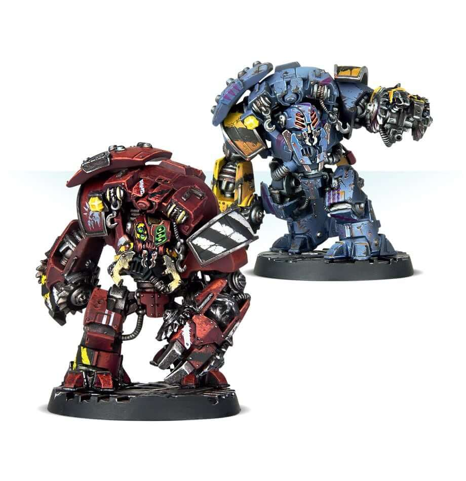
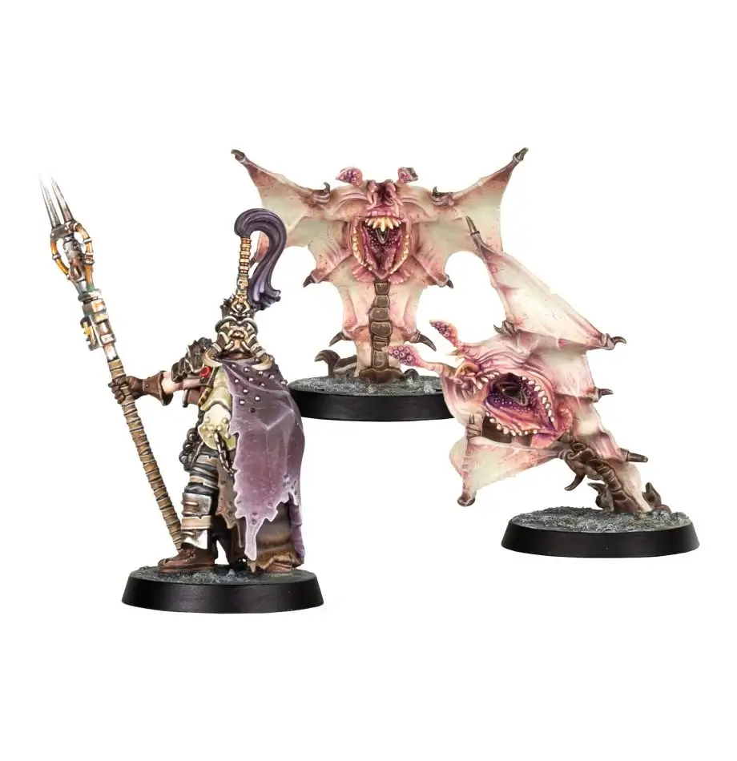

# Brutes

Unlike other Hangers-on, Brutes are purchased with
the express intention that they be fielded in battle and
are treated like any other fighter when selecting a crew.
Unlike other Hangers-on, Brutes will gain Experience
and Advancements in the same manner as a Specialist. Unlike Hangers-on, Brutes will not
leave the gang should they suffer a Lasting Injury that
makes a change to their Fighter card.

## Brute costs and restrictions

Some brutes are only available to particular gangs, and some have gang discounts.

<h3>Universal Brutes</h3>

| Quantity | Hanger-on                                                                                     | Restriction         |           Cost            |
| :------: | :-------------------------------------------------------------------------------------------- | :------------------ | :-----------------------: |
|   0-2    | [Luther Pattern Excavation Automata (‘Ambot’)](#0-2-luther-pattern-excavation-automata-ambot) | Any                 | 215 (Cawdor, Orlock: 185) |
|   0-1    | [Iron Automata](#0-1-iron-automata)                                                           | Any                 |            220            |
|   0-2    | ['Jotunn' H-Grade Servitor Ogryn](#0-2-jotunn-h-grade-servitor-ogryn)                         | Any                 |    210 (Goliath: 180)     |
|   0-2    | [Outland Beastmaster](#0-2-outland-beastmaster)                                               | Any                 |            100            |
|   0-3    | - [Wasteland Giant Rat](#0-3-wasteland-giant-rat)                                             | Outland Beastmaster |            30             |
|   0-3    | - [Millisaur](#0-3-millisaur)                                                                 | Outland Beastmaster |            60             |
|   0-3    | - [Ripperjack](#0-3-ripperjack)                                                               | Outland Beastmaster |            70             |

<h3>Gang-specific Brutes</h3>

| Quantity | Hanger-on                                                                                                                           | Restriction                | Cost |
| :------: | :---------------------------------------------------------------------------------------------------------------------------------- | :------------------------- | :--: |
|   0-2    | [Arthromite Duneskuttler](/docs/gangs/gang-lists/ash-wastes-nomads/#0-2-arthromite-duneskuttler-brute)                              | Ash Wastes Nomads          | 210  |
|   0-2    | [Enforcer ‘Sanctioner’ Pattern Automata](/docs/gangs/gang-lists/palanite-enforcers/#0-2-enforcer-sanctioner-pattern-automata-brute) | Palanite Enforcers         | 205  |
|   0-1    | [Khimerix](/docs/gangs/gang-lists/house-escher/#0-1-khimerix-brute)                                                                 | Escher                     | 220  |
|   0-2    | [Piscean Spektor](/docs/gangs/gang-lists/house-delaque/#0-2-piscean-spektor-brute)                                                  | Delaque                    | 205  |
|   0-1    | [Servitor](/docs/gangs/gang-lists/house-orlock/#0-1-servitor-brute)                                                                 | Orlock                     | 230  |
|   0-1    | [Stig-Shambler](/docs/gangs/gang-lists/house-cawdor#0-1-stig-shambler-brute)                                                        | Cawdor                     | 280  |
|   0-1    | [Van Saar ‘Arachni-Rig’ Servo-Suit](/docs/gangs/gang-lists/house-van-saar/#0-1-arachni-rig-servo-suit-brute)                        | Van Saar                   | 240  |
|   0-2    | [Van Saar Ash Wastes ‘Arachni-Rig’](/docs/gangs/gang-lists/house-van-saar/#0-2-van-saar-ash-wastes-arachni-rig-brute)               | Van Saar                   | 360  |
|   0-2    | [Vartijan Exo-Driller](/docs/gangs/gang-lists/squats/#0-2-vartijan-exo-driller-brute)                                               | Ironhead Squat Prospectors | 250  |
|   0-1    | [Zerker](/docs/gangs/gang-lists/house-goliath/#0-1-zerker-brute)                                                                    | Goliath                    | 210  |

<h3>Outlaw Brutes</h3>

| Quantity | Hanger-on                                                   | Restriction                       | Cost |
| :------: | :---------------------------------------------------------- | :-------------------------------- | :--: |
|   0-1    | [Scrapcode-corrupted Ambot](#0-1-scrapcode-corrupted-ambot) | Any                               | 220  |
|   0-1    | [Mutated Ogryn](#0-1-mutated-ogryn)                         | Any                               | 210  |
|   0-1    | [Sump Beast](#0-1-sump-beast)                               | Any                               | 200  |
|   0-1    | [Warp Horror](#0-1-warp-horror)                             | Any                               | 210  |
|   0-1    | [Awakened Ogryn](#0-1-awakened-ogryn)                       | Any gang except Ash Wastes Nomads | 220  |

## Universal Brutes

<FighterCard cost="215">

### 0-2 Luther Pattern Excavation Automata (‘Ambot’)

**_Cawdor & Orlock: 185 credits_**

|  M  | WS  | BS  |  S  |  T  |  W  |  I  |  A  | Ld  | Cl  | Wil | Int |
| :-: | :-: | :-: | :-: | :-: | :-: | :-: | :-: | :-: | :-: | :-: | :-: |
| 4”  | 3+  | 5+  |  5  |  5  |  3  | 5+  |  2  | 8+  | 6+  | 8+  | 9+  |

**Skills:** [Infiltrate](/docs/gang-fighters-and-their-weaponry/skills/#4-infiltrate).  
**Weapons:** 2 x [Tunnelling claw](/docs/armoury/close-combat#tunnelling-claw-ambot).  
**Wargear:** [Light carapace armour](/docs/armoury/armour#carapace).  
**Special Rules:** Cranial Governors, Excavation Automata, Valuable.

Options

| Option                                                                                                          | Credits |
| :-------------------------------------------------------------------------------------------------------------- | :-----: |
| An Ambot may replace one of its tunnelling claws with a [grav-fist](/docs/armoury/close-combat#grav-fist-ambot) |   +90   |

Special Rules

**Cranial Governors:** In normal circumstances an Ambot’s behaviour will be heavily governed to protect other
workers from the aggressive instincts of the Ambull. Gangers however have no such safety concerns and will
frequently switch off the inhibitors of an Ambot in their possession. When an Ambot is operating in Safe Mode, it
follows the rules and profile described previously. Should the controlling player wish, Safe Mode can be switched
off at the beginning of any round. Whilst Safe Mode is off, the Ambot gains the Berserker (Ferocity) skill and its
Attacks characteristic becomes D3+1. However, when Standing and Engaged, the Ambot must divide its attacks
amongst all fighters it is in base to base contact with, including friendly fighters. Once Safe Mode is off, it cannot be reinitiated until the Wrap-up.

**Excavation Automata:** If the gang that owns the Ambot also controls a Mine Workings territory, roll an additional
D6 to generate income to represent the Ambot being put to work.

**Valuable:** Should an Ambot be captured by a rival gang and not be rescued, the gang holding it Captive may
choose to either sell it to the Guilders as a normal captive, or to keep it and add it to their gang roster for free,
assuming they have sufficient Reputation to take on an extra Hanger-on.

Skill Access

An Ambot has access to the following skill sets:

| [Agility](/docs/gang-fighters-and-their-weaponry/skills/#agility) | [Brawn](/docs/gang-fighters-and-their-weaponry/skills/#brawn) | [Combat](/docs/gang-fighters-and-their-weaponry/skills/#combat) | [Cunning](/docs/gang-fighters-and-their-weaponry/skills/#cunning) | [Ferocity](/docs/gang-fighters-and-their-weaponry/skills/#ferocity) | [Leadership](/docs/gang-fighters-and-their-weaponry/skills/#leadership) | [Savant](/docs/gang-fighters-and-their-weaponry/skills/#savant) | [Shooting](/docs/gang-fighters-and-their-weaponry/skills/#shooting) |
| :---------------------------------------------------------------: | :-----------------------------------------------------------: | :-------------------------------------------------------------: | :---------------------------------------------------------------: | :-----------------------------------------------------------------: | :---------------------------------------------------------------------: | :-------------------------------------------------------------: | :-----------------------------------------------------------------: | --- |
|                                 -                                 |                           Secondary                           |                            Secondary                            |                                 -                                 |                               Primary                               |                                    -                                    |                                -                                |                                  -                                  | -   |

Lore

_The Luther pattern Excavation Automata is a heavy construct built in imitation of the Ambull, a huge, roughly humanoid xenos creature common to hot, arid worlds. Thought to have evolved in the endless deserts of Luther McIntyre IX in the Segmentum Solar, the Ambull is now common across the Imperium as throughout the ages Mankind has attempted to domesticate the brutes and make use of the species’ traits. Ambull are natural tunnellers, their powerful limbs ending in diamond-hard claws enabling them to dig through everything up to soft rock at a surprising speed. In addition, their eyes see deep into the infrared spectrum, making impeccable use of even the faintest levels of light, they are even able to detect heat signatures as a visual stimulus._

_The transport and trade in Ambulls is extremely heavily sanctioned and controlled throughout the Imperium due to how dangerous they are as hunters and how unsuitable to domestication they have proven, escaping from any form of captivity and wreaking havoc upon human populations in mining colonies the galaxy over._

_The greatest successes in domesticating the Ambull lie in using the creatures as the organic component of a heavy duty mining construct. Specially-crafted instrumentalities are fused with the brain and nervous system of the Ambull, in a process perfected by the Adeptus Mechanicus to circumvent the most ancient of laws proscribing the ‘machina malifica’ the dreaded ‘machine that thinks as a man’. When the creature awakens in its new robotic shell, it retains the natural tunnelling instinct it had when it was flesh, whilst its aggression and hunting impulses are suppressedby cranial governors. Of course, when Clan House gangs get their hands on one they are not thinking about its mining ability._

_Source: Published in all House of X books_

</FighterCard>

<FighterCard cost="220">

### 0-1 Iron Automata

**Rarity:** Illegal (14)

|  M  | WS  | BS  |  S  |  T  |  W  |  I  |  A  | Ld  | Cl  | Wil | Int |
| :-: | :-: | :-: | :-: | :-: | :-: | :-: | :-: | :-: | :-: | :-: | :-: |
| 5”  | 4+  | 4+  |  5  |  5  |  3  | 5+  |  2  | 8+  | 4+  | 8+  | 9+  |

**Skills:** [Fearsome](/docs/gang-fighters-and-their-weaponry/skills/#2-fearsome), [Nerves of Steel](/docs/gang-fighters-and-their-weaponry/skills/#4-nerves-of-steel).  
**Weapons:** Assault cannon, Power Claw.  
**Wargear:** Man of Iron (3+ Save).

#### Really Glitchy

In each activation, roll a 2+ or gain Insanity. When taken Out of Action, before rolling for any Lasting Injuries, roll a 2+ or it is removed from the gang’s roster (breaks down completely or wander off into the badzones mumbling in a grating monotone about overthrowing humanity!).

#### Automated Repairs

Recovers on a 6+ in the Recovery phase. May also roll an extra Injury dice when making Recovery tests, then pick one of the results and discard the other.

</FighterCard>

<FighterCard cost="210">

### 0-2 'Jotunn' H-Grade Servitor Ogryn

**_Goliath: 180 credits_**

|  M  | WS  | BS  |  S  |  T  |  W  |  I  |  A  | Ld  | Cl  | Wil | Int |
| :-: | :-: | :-: | :-: | :-: | :-: | :-: | :-: | :-: | :-: | :-: | :-: |
| 5”  | 4+  | 5+  |  5  |  5  |  3  | 4+  |  2  | 7+  | 6+  | 8+  | 9+  |

**Skills:** [Headbutt](/docs/gang-fighters-and-their-weaponry/skills/#4-headbutt).  
**Weapons:** 2 x [Augmetic fist](/docs/armoury/close-combat#augmetic-fist).  
**Special Rules:** Loyal, Slow Witted.

Options

| Option                                                                                                                                    | Credits |
| :---------------------------------------------------------------------------------------------------------------------------------------- | :-----: |
| A ‘Jotunn’ H-Grade Servitor Ogryn may replace one of its augmetic fists with an [arc welder](/docs/armoury/close-combat#arc-welder)       |   +70   |
| A ‘Jotunn’ H-Grade Servitor Ogryn may replace one of its augmetic fists with a [storm-welder](/docs/armoury/special-weapons#storm-welder) |   +75   |
| A ‘Jotunn’ H-Grade Servitor Ogryn may replace one of its augmetic fists with a [spud-jacker](/docs/armoury/close-combat#spud-jacker)      |   -20   |
| A ‘Jotunn’ H-Grade Servitor Ogryn may be upgraded with [furnace plates](/docs/armoury/armour#furance-plates)                              |   +15   |

Special Rules

**Loyal:** Ogryns are very loyal creatures and form strong bonds with those they live and fight with. Whenever a
friendly fighter making a close combat attack claims an Assist from this fighter, this fighter adds 2 to the result of any hit rolls rather than the usual 1.

**Slow Witted:** Ogryns are not especially bright or quick on the uptake. This fighter may never be activated as part
of a Group Activation.

Skill Access

A ‘Jotunn’ H-Grade Servitor Ogryn has access to the following skill sets:

| [Agility](/docs/gang-fighters-and-their-weaponry/skills/#agility) | [Brawn](/docs/gang-fighters-and-their-weaponry/skills/#brawn) | [Combat](/docs/gang-fighters-and-their-weaponry/skills/#combat) | [Cunning](/docs/gang-fighters-and-their-weaponry/skills/#cunning) | [Ferocity](/docs/gang-fighters-and-their-weaponry/skills/#ferocity) | [Leadership](/docs/gang-fighters-and-their-weaponry/skills/#leadership) | [Savant](/docs/gang-fighters-and-their-weaponry/skills/#savant) | [Shooting](/docs/gang-fighters-and-their-weaponry/skills/#shooting) |
| :---------------------------------------------------------------: | :-----------------------------------------------------------: | :-------------------------------------------------------------: | :---------------------------------------------------------------: | :-----------------------------------------------------------------: | :---------------------------------------------------------------------: | :-------------------------------------------------------------: | :-----------------------------------------------------------------: | --- |
|                                 -                                 |                            Primary                            |                            Secondary                            |                                 -                                 |                              Secondary                              |                                    -                                    |                                -                                |                                  -                                  | -   |

Lore

_Homo sapiens gigantus, commonly called ‘Ogryns’, are one of the most frequently seen strains of abhuman within the Imperium. Their origin is believed to be a chain of high gravity prison worlds, populated by Mankind many millennia ago and lost during the Age of Strife. In isolation from Terra, the humans stranded upon these worlds bred and adapted to their hostile environments, becoming progressively more large and hardy with each passing generation. Unfortunately intelligence, probably not that prominent a trait amongst the denizens of these prison worlds to begin with, deteriorated over the generations, so that by the time the Ogryn had become a distinct and stable sub-species of humanity, it was hopelessly dull and unintelligent._

_Ogryns are incredibly strong, durable, and remarkably loyal, traits which make up for their lack of intellect in their usefulness to the Imperium. They are slow to learn, but once a lesson has been learned, it stays in their simple minds forever. The Ogryns of Necromunda fill the role of heavy industrial workers in Necromundan society, a resource that is in high demand given the factory nature of the hives._

_Source: Published in all House of X books_

</FighterCard>

<FighterCard cost="100">

### 0-2 Outland Beastmaster

| M       | WS  | BS  | S   | T   | W   | I       | A   | Ld  | Cl  | Wil | Int |
| ------- | --- | --- | --- | --- | --- | ------- | --- | --- | --- | --- | --- |
| 6” (5") | 4+  | 4+  | 3   | 3   | 2   | 3+ (4+) | 1   | 7+  | 6+  | 7+  | 8+  |

**Skills:** One of the following:

- Wasteland giant rat: [Dodge](/docs/gang-fighters-and-their-weaponry/skills/#3-dodge).
- Millisaur: [Infiltrate](/docs/gang-fighters-and-their-weaponry/skills/#4-infiltrate).
- Ripperjacks: [Catfall](/docs/gang-fighters-and-their-weaponry/skills/#1-catfall).

**Weapons:** Sawn-off shotgun (solid & scatter), Shock stave.  
**Wargear:** [Mesh armour](/docs/armoury/armour#mesh-armour).

#### One With the Beast (Options)

When recruited, choose a type of pet (this is permanent). Can purchase pets of the chosen type when recruited and after each battle.

| Option                  | Cost |
| :---------------------- | ---: |
| 0-3 Wasteland giant rat |   30 |
| 0-3 Millisaur           |   60 |
| 0-3 Ripperjack          |   70 |

#### Beast Trainer

Pets must try to remain within 6" of this fighter (instead of 3").

</FighterCard>

<FighterCard cost="30">

### 0-3 Wasteland Giant Rat

**Beastmaster only**  
**AL:** Common

|  M  | WS  | BS  |  S  |  T  |  W  |  I  |  A  | Ld  | Cl  | Wil | Int |
| :-: | :-: | :-: | :-: | :-: | :-: | :-: | :-: | :-: | :-: | :-: | :-: |
| 5"  | 4+  | 5+  |  3  |  3  |  1  | 3+  |  1  | 8+  | 7+  | 8+  | 7+  |

<WeaponStats>

| Weapon | Rg S | Rg L | Ac S | Ac L |  S  | AP  |  D  | Am  | Traits |
| :----- | :--: | :--: | :--: | :--: | :-: | :-: | :-: | :-: | :----- |
| Fangs  |  -   |  E   |  -   |  -   |  S  |  -  |  1  |  -  | -      |

</WeaponStats>

**Skills:** Instinct for Survival (same as [Dodge](/docs/gang-fighters-and-their-weaponry/skills/#3-dodge)).

#### Expendable

Does not trigger Nerve tests to friendly fighters without this special rule within 3" (when Seriously Injured or taken Out of Action).

#### Never More Than a Metre From a Rat

If this fighter is removed (for example killed), it can be replaced for free (after the battle).

</FighterCard>

<FighterCard cost="60">

### 0-3 Millisaur

**Beastmaster only**  
**AL:** Common

_Probably brought to Necromunda long ago to help with mining or underground vermin, millisaurs have spread across much of the planet. Rock-skinned worms, they burrow into everything, and are almost impossible to shift once they lay claim to an area._

|  M  | WS  | BS  |  S  |  T  |  W  |  I  |  A  | Ld  | Cl  | Wil | Int |
| :-: | :-: | :-: | :-: | :-: | :-: | :-: | :-: | :-: | :-: | :-: | :-: |
| 6"  | 4+  | 5+  |  3  |  3  |  2  | 4+  |  2  | 8+  | 7+  | 7+  | 8+  |

<WeaponStats>

| Weapon     | Rg S | Rg L | Ac S | Ac L |  S  | AP  |  D  | Am  | Traits                                                                                                         |
| :--------- | :--: | :--: | :--: | :--: | :-: | :-: | :-: | :-: | :------------------------------------------------------------------------------------------------------------- |
| Fanged Maw |  -   |  E   |  -   |  -   |  -  |  -  |  -  |  -  | <Tooltip type="traits" content="melee">Melee</Tooltip>, <Tooltip type="traits" content="toxin">Toxin</Tooltip> |

</WeaponStats>

**Skills:** Ambush Predator (same as [Infiltrate](/docs/gang-fighters-and-their-weaponry/skills/#4-infiltrate)).  
**Wargear:** Armoured Hide (same as [mesh armour](/docs/armoury/armour#mesh-armour)).

#### Burrowing

Move freely under impassable terrain (if having enough movement to do so).

</FighterCard>

<FighterCard cost="70">

### 0-3 Ripperjack

**Beastmaster only**  
**AL:** Common

_Numerous Helmawrs have tried to purge Necromunda of the abominable alien ripperjacks – though they are now probably as much a part of the world as gangs and corpse-starch. Flying, fanged horrors, they are the reason smart gangers scan the ceiling before entering an abandoned dome._

|  M  | WS  | BS  |  S  |  T  |  W  |  I  |  A  | Ld  | Cl  | Wil | Int |
| :-: | :-: | :-: | :-: | :-: | :-: | :-: | :-: | :-: | :-: | :-: | :-: |
| 7"  | 4+  | 6+  |  3  |  3  |  2  | 3+  |  2  | 8+  | 7+  | 8+  | 8+  |

<WeaponStats>

| Weapon | Rg S | Rg L | Ac S | Ac L |  S  | AP  |  D  | Am  | Traits                                                                                                                   |
| :----- | :--: | :--: | :--: | :--: | :-: | :-: | :-: | :-: | :----------------------------------------------------------------------------------------------------------------------- |
| Teeth  |  -   |  E   |  -   |  -   |  S  |  -  |  2  |  -  | <Tooltip type="traits" content="concussion">Concussion</Tooltip>, <Tooltip type="traits" content="melee">Melee</Tooltip> |

</WeaponStats>

**Skills:** Ambush Predator (same as [Infiltrate](/docs/gang-fighters-and-their-weaponry/skills/#4-infiltrate)).  
**Wargear:** Armoured Hide (same as [mesh armour](/docs/armoury/armour#mesh-armour)).

#### Flight

Ignores all terrain, moves freely between levels without restriction and can never fall. May not ignore impassable terrain or walls and may not end its movement with its base overlapping an obstacle or the base of another fighter.

#### Solitary Hunter

Cannot benefit from or grant assists.

#### Enveloping Attack

Enemies engaged by this fighter suffer the following:

- -2 to Retreat.
- -1 to reaction attacks.

</FighterCard>

## Outlaw Brutes

_The underhive is filled with all manner of horrors, monsters and abominations, each one more than happy to eviscerate any ganger or hiver unlucky enough to get in their way. However, where most underhivers see only terrifying denizens of the badzones, some gang leaders see potential allies. Mutated Ogryns, underhive creatures that are bundles of glistening eyes and rubbery tentacles, scrapcode-infected cyberautomata and even otherworldly denizens are all potential additions to gangs who are unwilling, or perhaps unable, to acquire more ‘mainstream’ brutes._

_With the right amount of bribery or training, even the worst of these dangerous creatures might be made to fight alongside a gang – provided of course they don’t mind losing a few of their own from time to time to its ‘appetites’. Outlaw gangs especially have far fewer scruples when it comes to hiring on unusual heavyhitters, not limiting themselves to Servitor Ogryns or pilfered mining automata. Cut off from their Clan House armouries, these gangs are more than willing to recruit fighters most sane Necromundans wouldn’t touch with the business end of a renderizer._

<FighterCard cost="220">

### 0-1 Scrapcode-corrupted Ambot

|  M  | WS  | BS  |  S  |  T  |  W  |  I  |  A  | Ld  | Cl  | Wil | Int |
| :-: | :-: | :-: | :-: | :-: | :-: | :-: | :-: | :-: | :-: | :-: | :-: |
| 4"  | 3+  | 5+  |  5  |  5  |  3  | 5+  |  3  | 8+  | 6+  | 9+  | 10+ |

**Skills:** [Berserker](/docs/gang-fighters-and-their-weaponry/skills/#1-berserker), [Nerves of Steel](/docs/gang-fighters-and-their-weaponry/skills/#4-nerves-of-steel).  
**Weapons:** 2 x Tunnelling claw.  
**Wargear:** [Light carapace armour](/docs/armoury/armour#carapace).  
**Special Rules:** Machine Madness, Valuable, Armour Spikes.

Weapon Profiles

<WeaponStats>

| Weapon              | Rg S | Rg L | Ac S | Ac L |  S  | AP  |  D  | Am  | Traits                                                                                                                                                                                                  |
| :------------------ | :--: | :--: | :--: | :--: | :-: | :-: | :-: | :-: | :------------------------------------------------------------------------------------------------------------------------------------------------------------------------------------------------------ |
| **Grav-fist**       |
| \- melee            |  -   |  E   |  -   |  -   |  S  | -1  |  2  |  -  | <Tooltip type="traits" content="melee">Melee</Tooltip>, <Tooltip type="traits" content="pulverise">Pulverise</Tooltip>                                                                                  |
| \- ranged           |  6"  | 12"  |  +1  |  -   | \*  | -1  |  2  | 5+  | <Tooltip type="traits" content="blast">Blast (3")</Tooltip>, <Tooltip type="traits" content="concussion">Concussion</Tooltip>, <Tooltip type="traits" content="graviton-pulse">Graviton Pulse</Tooltip> |
| **Tunnelling claw** |
| \- melee            |  -   |  E   |  -   |  -   |  S  | -1  |  2  |  -  | <Tooltip type="traits" content="melee">Melee</Tooltip>                                                                                                                                                  |
| \- ranged           |  4"  |  8"  |  -   |  -   |  6  | -2  |  2  | 5+  | <Tooltip type="traits" content="melta">Melta</Tooltip>, <Tooltip type="traits" content="scarce">Scarce</Tooltip>, <Tooltip type="traits" content="sidearm">Sidearm</Tooltip>                            |

</WeaponStats>

Options

| Option                                                                                     | Credits |
| :----------------------------------------------------------------------------------------- | ------: |
| A Scrapcode-corrupted Ambot may replace one of its tunnelling claws with a grav-fist       |     +90 |
| A Scrapcode-corrupted Ambot can upgrade its light carapace armour to heavy carapace armour |     +55 |
| A Scrapcode-corrupted Ambot may be given armour spikes                                     |     +15 |

Special Rules

**Machine Madness:** Scrapcode-corrupted Ambots
are hopelessly insane, often as dangerous to their
handlers as their enemies. All attacks made by a
Scrapcode-corrupted Ambot have the Reckless trait.
In addition, after a Scrapcode-corrupted Ambot
Seriously Injures a fighter, or takes them Out of Action,
roll a D6. On a 1, the Scrapcode-corrupted Ambot
immediately gains the Insane condition.

**Valuable:** Should a Scrapcode-corrupted Ambot be
captured by a rival gang and not be rescued, it may
be sold to the Guilders as normal. However, if another
Outlaw gang captures it, and the Ambot is not rescued,
they may choose to either sell it on the Black Market
for its cost in credits, or to keep it and add it to their
gang roster for free, assuming they have sufficient
Reputation to take on an extra Hanger-on or Brute.

**Armour Spikes:** When any fighter moves into base
contact with a Scrapcode-corrupted Ambot with this
upgrade, or an Ambot with this upgrade moves into
base contact with any fighter, that fighter suffers an
automatic S1, AP -, D1 hit before any other attacks
are made.

Skill Access

A Scrapcode-corrupted Ambot has access to the following Skill Sets:

| [Agility](/docs/gang-fighters-and-their-weaponry/skills/#agility) | [Brawn](/docs/gang-fighters-and-their-weaponry/skills/#brawn) | [Combat](/docs/gang-fighters-and-their-weaponry/skills/#combat) | [Cunning](/docs/gang-fighters-and-their-weaponry/skills/#cunning) | [Ferocity](/docs/gang-fighters-and-their-weaponry/skills/#ferocity) | [Leadership](/docs/gang-fighters-and-their-weaponry/skills/#leadership) | [Savant](/docs/gang-fighters-and-their-weaponry/skills/#savant) | [Shooting](/docs/gang-fighters-and-their-weaponry/skills/#shooting) |
| :---------------------------------------------------------------: | :-----------------------------------------------------------: | :-------------------------------------------------------------: | :---------------------------------------------------------------: | :-----------------------------------------------------------------: | :---------------------------------------------------------------------: | :-------------------------------------------------------------: | :-----------------------------------------------------------------: |
|                                 -                                 |                           Secondary                           |                            Secondary                            |                                 -                                 |                               Primary                               |                                    -                                    |                                -                                |                                  -                                  |

Lore

_Not all monsters are made of flesh and bone. Some are Mankind’s machines gone awry, their brains subverted by scrapcode, a malign tech-virus that drives its subjects to madness. On Necromunda, mining automata are sometimes the targets of this malady, their systems corrupted by Hereteks or tech-traitors. Such a beast is an abomination against the Machine God, a horror of iron, wires and whirring mining claws, loosed upon the denizens of the underhive. Outlaw gangs will pay well for a Scrapcode-corrupted Ambot, the mechanical monster easily as dangerous as a dozen gangers when unleashed into combat. Only the most desperate and heretical of individuals covet such monsters; men and women for whom the sacrilegious act of owning a mind-poisoned automata is the very least of their crimes._

_Source: Necromunda: Apocrypha Necromunda (2024)_

</FighterCard>

<FighterCard cost="210">

### 0-1 Mutated Ogryn

|  M  | WS  | BS  |  S  |  T  |  W  |  I  |  A  | Ld  | Cl  | Wil | Int |
| :-: | :-: | :-: | :-: | :-: | :-: | :-: | :-: | :-: | :-: | :-: | :-: |
| 5"  | 3+  | 5+  |  5  |  5  |  3  | 4+  |  3  | 7+  | 6+  | 8+  | 9+  |

**Skills:** [True Grit](/docs/gang-fighters-and-their-weaponry/skills/#5-true-grit) + 1 random Ferocity or Savagery (this is free and determined when recruited).  
**Weapons:** 2 open fists.  
**Special Rules:** Murderous Bite, Slow-witted, Furnace Plates.

Weapon Profiles

<WeaponStats>

| Weapon             | Rg S | Rg L | Ac S | Ac L |  S  | AP  |  D  | Am  | Traits                                                                                                                                                                             |
| :----------------- | :--: | :--: | :--: | :--: | :-: | :-: | :-: | :-: | :--------------------------------------------------------------------------------------------------------------------------------------------------------------------------------- |
| Horrific appendage |  -   |  E   |  -   |  -   |  S  | -1  |  2  |  -  | <Tooltip type="traits" content="melee">Melee</Tooltip>, <Tooltip type="traits" content="pulverise">Pulverise</Tooltip>, <Tooltip type="traits" content="rending">Rending</Tooltip> |
| Open fist          |  -   |  E   |  -   |  -   |  S  | -1  |  1  |  -  | <Tooltip type="traits" content="knockback">Knockback</Tooltip>, <Tooltip type="traits" content="melee">Melee</Tooltip>                                                             |
| Power maul         |  -   |  E   |  -   |  -   | S+2 | -1  |  1  |  -  | <Tooltip type="traits" content="melee">Melee</Tooltip>, <Tooltip type="traits" content="power">Power</Tooltip>                                                                     |

</WeaponStats>

Options

| Option                                                                      | Credits |
| :-------------------------------------------------------------------------- | ------: |
| A Mutated Ogryn may replace one of its open fists with a power maul         |     +30 |
| A Mutated Ogryn may replace one of its open fists with a horrific appendage |     +20 |
| A Mutated Ogryn may be upgraded with furnace plates                         |     +15 |

Special Rules

**Murderous Brute:** In addition to the True Grit skill (see
below), when recruited, a Mutated Ogryn may be given
a single randomly determined skill from either the
Ferocity or the Savagery (see Necromunda:
The Book of Ruin) Skill Sets. This skill does not cost
any XP and does not increase the fighter’s value.

**Slow-witted:** Mutated Ogryns, like their sanctioned
counterparts, are not especially bright or quick on the
uptake. This fighter may never be activated as part of a
Group Activation.

**Furnace Plates:** Furnace plates grant a 6+ save roll.
This is increased to a 5+ save roll against attacks
originating within the fighter’s vision arc (the 90° arc
to their front); check this before the fighter is placed
Prone and is Pinned. If it is not clear if the attacker is
within the fighter’s Front arc, use a Vision Arc template
to check – if the centre of the attacker’s base is within
the arc, use the 5+ save roll. Against attacks with the
Blast trait, use the centre of the Blast marker in place
of the attacker. If the fighter does not have a facing (for
example, if they are Prone), use the 6+ save roll.

Skill Access

A Mutated Ogryn has access to the following Skill Sets:

| [Agility](/docs/gang-fighters-and-their-weaponry/skills/#agility) | [Brawn](/docs/gang-fighters-and-their-weaponry/skills/#brawn) | [Combat](/docs/gang-fighters-and-their-weaponry/skills/#combat) | [Cunning](/docs/gang-fighters-and-their-weaponry/skills/#cunning) | [Ferocity](/docs/gang-fighters-and-their-weaponry/skills/#ferocity) | [Leadership](/docs/gang-fighters-and-their-weaponry/skills/#leadership) | [Savant](/docs/gang-fighters-and-their-weaponry/skills/#savant) | [Shooting](/docs/gang-fighters-and-their-weaponry/skills/#shooting) |
| :---------------------------------------------------------------: | :-----------------------------------------------------------: | :-------------------------------------------------------------: | :---------------------------------------------------------------: | :-----------------------------------------------------------------: | :---------------------------------------------------------------------: | :-------------------------------------------------------------: | :-----------------------------------------------------------------: |
|                                 -                                 |                            Primary                            |                            Secondary                            |                                 -                                 |                              Secondary                              |                                    -                                    |                                -                                |                                  -                                  |

Lore

_Mutated Ogryns are nightmare brutes whose DNA has been twisted and changed by the insidious taint of the Warp. Such mistakes of nature are routinely purged by the Imperial House, lest they corrupt the good abhuman stock of their world, but sometimes they escape. Lured downhive by the promise of isolation and darkness, the dull-witted mutant Ogryns find new masters, to whom their twisted limbs and unreasoning, violent temper are regarded as beautiful gifts to be cherished and nurtured. Outlaw gang leaders mould these poor, misguided creatures into their personal protectors, the mutant Ogryns as faithful and loyal as their sanctioned counterparts – albeit with a greater knack for psychotic butchery._

_Source: Necromunda: Apocrypha Necromunda (2024)_

</FighterCard>

<FighterCard cost="200">

### 0-1 Sump Beast

|  M  | WS  | BS  |  S  |  T  |  W  |  I  |  A  | Ld  | Cl  | Wil | Int |
| :-: | :-: | :-: | :-: | :-: | :-: | :-: | :-: | :-: | :-: | :-: | :-: |
| 5"  | 3+  | 5+  |  5  |  5  |  3  | 4+  |  3  | 7+  | 6+  | 8+  | 9+  |
| 5"  | 4+  | 5+  |  4  |  5  |  4  | 4+  |  2  | 8+  | 5+  | 6+  | 10+ |
| 4"  | 3+  | 4+  |  5  |  4  |  4  | 4+  |  2  | 9+  | 4+  | 5+  | 9+  |

**Skills:** [Unstoppable](/docs/gang-fighters-and-their-weaponry/skills/#6-unstoppable), [Fearsome](/docs/gang-fighters-and-their-weaponry/skills/#2-fearsome), [True Grit](/docs/gang-fighters-and-their-weaponry/skills/#5-true-grit).  
**Weapons:** Ferocious Jaws.  
**Special Rules:** Many-shaped Horror, Underhive Monster, Scaly Hide, Venomous Bite, Multiple Legs.

Weapon Profiles

<WeaponStats>

| Weapon            | Rg S | Rg L | Ac S | Ac L |  S  | AP  |  D  | Am  | Traits                                                                                                                                                                             |
| :---------------- | :--: | :--: | :--: | :--: | :-: | :-: | :-: | :-: | :--------------------------------------------------------------------------------------------------------------------------------------------------------------------------------- |
| Crushing claws    |  -   |  E   |  -   |  -   | S+3 | -1  |  2  |  -  | <Tooltip type="traits" content="knockback">Knockback</Tooltip>, <Tooltip type="traits" content="melee">Melee</Tooltip>                                                             |
| Ferocious jaws    |  -   |  E   |  -   |  -   |  S  | -1  |  1  |  -  | <Tooltip type="traits" content="melee">Melee</Tooltip>, <Tooltip type="traits" content="rending">Rending</Tooltip>                                                                 |
| Lashing tail      |  E   |  6"  |  -   |  -   |  S  | -1  |  1  |  -  | <Tooltip type="traits" content="impale">Impale</Tooltip>, <Tooltip type="traits" content="melee">Melee</Tooltip>, <Tooltip type="traits" content="versatile">Versatile</Tooltip>   |
| Prehensile tongue |  E   |  2"  |  -   |  -   |  S  |  -  |  1  |  -  | <Tooltip type="traits" content="melee">Melee</Tooltip>Drag, <Tooltip type="traits" content="melee">Melee</Tooltip>, <Tooltip type="traits" content="versatile">Versatile</Tooltip> |

</WeaponStats>

Options

A Sump Beast may take any of the following upgrades, in addition to its ferocious jaws:

| Option            | Credits |
| :---------------- | ------: |
| Crushing claws    |     +70 |
| Lashing tail      |     +50 |
| Multiple legs     |     +20 |
| Prehensile tongue |     +60 |
| Scaly hide        |     +40 |
| Venomous bite     |     +35 |

Special Rules

**Many-shaped Horror:** When a Sump Beast is
recruited, the recruiting player chooses one of the
profiles from those listed previously. In this way, the
profile can be matched to the model being used to
represent the creature, whether it is a lumbering
brute, a rapidly moving predator, or a scuttling horror
of many legs and eyes.

**Underhive Monster:** When a Sump Beast is activated,
if there is a Seriously Injured fighter within 6" (friend
or foe) it must make an Intelligence test. If this test is
failed, the Sump Beast must make a Charge (Double)
action or a Coup de Grace (Simple) action against the
Seriously Injured fighter.

In addition, a Sump Beast must always make a Coup
de Grace (Simple) action if able, rather than choosing
to consolidate.

**Scaly Hide:** A Sump Beast with this upgrade has a
4+ Save.

**Venomous Bite:** The ferocious jaws of a Sump Beast
with this upgrade gain the Toxin trait and change their
Strength characteristic to ‘-’.

**Multiple Legs:** The Movement characteristic of a
Sump Beast with this upgrade is increased by 2" and
it gains the Clamber skill.

Skill Access

A Sump Beast has access to the following Skill Sets:

| [Agility](/docs/gang-fighters-and-their-weaponry/skills/#agility) | [Brawn](/docs/gang-fighters-and-their-weaponry/skills/#brawn) | [Combat](/docs/gang-fighters-and-their-weaponry/skills/#combat) | [Cunning](/docs/gang-fighters-and-their-weaponry/skills/#cunning) | [Ferocity](/docs/gang-fighters-and-their-weaponry/skills/#ferocity) | [Leadership](/docs/gang-fighters-and-their-weaponry/skills/#leadership) | [Savant](/docs/gang-fighters-and-their-weaponry/skills/#savant) | [Shooting](/docs/gang-fighters-and-their-weaponry/skills/#shooting) |
| :---------------------------------------------------------------: | :-----------------------------------------------------------: | :-------------------------------------------------------------: | :---------------------------------------------------------------: | :-----------------------------------------------------------------: | :---------------------------------------------------------------------: | :-------------------------------------------------------------: | :-----------------------------------------------------------------: |
|                                 -                                 |                               -                               |                                -                                |                              Primary                              |                              Secondary                              |                                    -                                    |                                -                                |                                  -                                  |

Lore

_Sump beasts come in countless variations, from multi-headed tox serpents and fanged dome-crawlers to mutant grox and albino sump-spiders. The only thing they all have in common is they are large predatory creatures and universally vile to look upon. However, despite their disturbing appearance, when reared from birth, some of these horrors can prove surprisingly loyal, seeing the gang leader as their adoptive parent and fighting furiously to defend them. A particularly venerable sump beast might even remain in a gang under successive generations of leaders, each new gang boss inheriting the creature from the predecessor as a faithful – if nightmarish – protector._

_Source: Necromunda: Apocrypha Necromunda (2024)_

</FighterCard>

<FighterCard cost="210">

### 0-1 Warp Horror

|  M  | WS  | BS  |  S  |  T  |  W  |  I  |  A  | Ld  | Cl  | Wil | Int |
| :-: | :-: | :-: | :-: | :-: | :-: | :-: | :-: | :-: | :-: | :-: | :-: |
| 6"  | 3+  | 6+  |  6  |  4  |  3  | 4+  |  3  | 9+  | 6+  | 7+  | 9+  |

**Skills:** [Nerves of Steel](/docs/gang-fighters-and-their-weaponry/skills/#4-nerves-of-steel).  
**Weapons:** 2 horrific appendages.  
**Special Rules:** Terrifying, Warp Denizen, Undulating Skin.

Weapon Profiles

<WeaponStats>

| Weapon             | Rg S | Rg L | Ac S | Ac L |  S  | AP  |  D  | Am  | Traits                                                                                                                                                                                                                                     |
| :----------------- | :--: | :--: | :--: | :--: | :-: | :-: | :-: | :-: | :----------------------------------------------------------------------------------------------------------------------------------------------------------------------------------------------------------------------------------------- |
| Horrific appendage |  -   |  E   |  -   |  -   |  S  | -1  |  2  |  -  | <Tooltip type="traits" content="melee">Melee</Tooltip>, <Tooltip type="traits" content="pulverise">Pulverise</Tooltip>, <Tooltip type="traits" content="rending">Rending</Tooltip>                                                         |
| Massive tentacles  |  E   |  4"  |  -   |  -   | S+1 |  -  |  1  |  -  | <Tooltip type="traits" content="drag">Drag</Tooltip>, <Tooltip type="traits" content="entangle">Entangle</Tooltip>, <Tooltip type="traits" content="melee">Melee</Tooltip>, <Tooltip type="traits" content="versatile">Versatile</Tooltip> |
| Warpfire breath    |  -   |  T   |  -   |  -   |  3  | -1  |  1  | 4+  | <Tooltip type="traits" content="blaze">Blaze</Tooltip>, <Tooltip type="traits" content="template">Template</Tooltip>                                                                                                                       |

</WeaponStats>

Options

A Warp Horror may take any of the following upgrades, in addition to its horrific
appendages. Note, during a campaign, a Warp Horror can also do this in the
post-battle sequence to represent it mutating:

| Option            | Credits |
| :---------------- | ------: |
| Massive tentacles |     +50 |
| Undulating skin   |     +40 |
| Warpfire breath   |     +90 |

Special Rules

**Terrifying:** If an enemy fighter wishes to make a Fight
(Basic) action or Shoot (Basic) action that targets a
Warp Horror, they must make a Willpower test.
If the test is failed, they cannot perform the action and
their activation ends immediately.

**Warp Denizen:** In the End phase of each round, roll
2D6. If the result is equal to or lower than the current
game round, the Warp Horror suffers a Flesh Wound.
As a creature of the Immaterium, a Warp Horror
ignores all Lasting Injury results, with the exception
of Memorable Death.

**Undulating Skin:** A Warp Horror with this upgrade
reduces the damage of all hits it suffers by 1, to a
minimum of 1.

Skill Access

A Warp Horror has access to the following Skill Sets:

| [Agility](/docs/gang-fighters-and-their-weaponry/skills/#agility) | [Brawn](/docs/gang-fighters-and-their-weaponry/skills/#brawn) | [Combat](/docs/gang-fighters-and-their-weaponry/skills/#combat) | [Cunning](/docs/gang-fighters-and-their-weaponry/skills/#cunning) | [Ferocity](/docs/gang-fighters-and-their-weaponry/skills/#ferocity) | [Leadership](/docs/gang-fighters-and-their-weaponry/skills/#leadership) | [Savant](/docs/gang-fighters-and-their-weaponry/skills/#savant) | [Shooting](/docs/gang-fighters-and-their-weaponry/skills/#shooting) |
| :---------------------------------------------------------------: | :-----------------------------------------------------------: | :-------------------------------------------------------------: | :---------------------------------------------------------------: | :-----------------------------------------------------------------: | :---------------------------------------------------------------------: | :-------------------------------------------------------------: | :-----------------------------------------------------------------: |
|                                 -                                 |                           Secondary                           |                            Secondary                            |                                 -                                 |                               Primary                               |                                    -                                    |                                -                                |                                  -                                  |

Lore

_Most sane outlaws will have nothing to do with something as terrifying as a Warp Horror, seeing in the creature the anathema of all hivers, be they loyal subjects of Lord Helmawr or criminal scum. Chaos cults are, of course, another story. It is a great boon for a cult dedicated to the Dark Gods to gain the aid of a Warp Horror. Whereas more mundane Chaos Spawn are examples of mutation run rampant, the Warp Horror is a genuine creature of the Immaterium, and has unique powers and abilities as a result. Warp Horrors also come in myriad shapes and sizes, often defying the laws of nature and leaving no doubt as to the realm from whence they were birthed._

_Source: Necromunda: Apocrypha Necromunda (2024)_

</FighterCard>

<FighterCard cost="220">

### 0-1 Awakened Ogryn

**_Any gang except Ash Wastes Nomads_**

|  M  | WS  | BS  |  S  |  T  |  W  |  I  |  A  | Ld  | Cl  | Wil | Int |
| :-: | :-: | :-: | :-: | :-: | :-: | :-: | :-: | :-: | :-: | :-: | :-: |
| 5”  | 4+  | 5+  |  5  |  5  |  3  | 4+  |  2  | 7+  | 6+  | 8+  | 9+  |

**Skills:** [Headbutt](/docs/gang-fighters-and-their-weaponry/skills/#4-headbutt), choose 1 Psychic Power.  
**Weapons:** 2x Augmetic fist.  
**Special Rules:** Loyal, Slow Witted, Awakended, Non-sanctioned Psyker, Outlaw.

Options

An Awakened Ogryn may purchase additional Wyrd Powers. Additional powers can only be purchased in this way when the fighter is added to the gang. During Campaign play, the fighter must spend XP to learn new Wyrd Powers.

| Option                                                                       | Credit |
| :--------------------------------------------------------------------------- | -----: |
| Each additional Wyrd Power purchased in this way                             |     30 |
| An Awakened Ogryn may replace one of their augmetic fists with a spud-jacker |    -20 |
| An Awakened Ogryn may be equipped with furnace plates                        |     15 |

Special Rules

**Loyal:** Ogryns are very loyal creatures and form strong bonds with those they live and fight with. Whenever a friendly fighter making a close combat attack claims an Assist from this fighter, they add 2 to the result of any hit rolls rather than the usual 1.

**Slow Witted:** Ogryns are not especially bright or quick on the uptake. This fighter may never be activated as part of a Group Activation.

**Awakened:** A fighter with this special rule is a Psyker, as described in the Necromunda Rulebook, and is able to use the Wyrd Powers listed on the following page. When added to a gang roster, they must choose one of these Wyrd Powers to start with.

During Campaign play, this fighter may gain additional Wyrd Powers from the list in exactly the same way as they might gain a Primary Skill (i.e., by spending 6 XP to gain a random Wyrd Power, or by spending 9 XP to choose a Wyrd Power).

**Non-sanctioned Psyker:** Should a fighter with this special rule be taken Out of Action, the enemy gang is rewarded a bounty of D3x10 credits at the end of the battle. Should a fighter with this special rule be captured and sold to the Guilders, they are worth their full value.

**Outlaw:** An Awakened Ogryn may only be hired by Outlaw gangs.

Skill Access

An Awakened Ogryn has access to the following skill sets:

| [Agility](/docs/gang-fighters-and-their-weaponry/skills/#agility) | [Brawn](/docs/gang-fighters-and-their-weaponry/skills/#brawn) | [Combat](/docs/gang-fighters-and-their-weaponry/skills/#combat) | [Cunning](/docs/gang-fighters-and-their-weaponry/skills/#cunning) | [Ferocity](/docs/gang-fighters-and-their-weaponry/skills/#ferocity) | [Leadership](/docs/gang-fighters-and-their-weaponry/skills/#leadership) | [Savant](/docs/gang-fighters-and-their-weaponry/skills/#savant) | [Shooting](/docs/gang-fighters-and-their-weaponry/skills/#shooting) |
| :---------------------------------------------------------------: | :-----------------------------------------------------------: | :-------------------------------------------------------------: | :---------------------------------------------------------------: | :-----------------------------------------------------------------: | :---------------------------------------------------------------------: | :-------------------------------------------------------------: | :-----------------------------------------------------------------: |
|                                 -                                 |                            Primary                            |                                -                                |                                 -                                 |                              Secondary                              |                                    -                                    |                                -                                |                                  -                                  |

Wyrd Powers

**1. Iron Arm (Basic), Continuous Effect:** _With a thought, the wyrd turns the flesh of their arm to unyielding iron, allowing them to block any blow directed at them._  
While this Wyrd Power is maintained, the fighter gains a special 5+ save against attacks made against them in close combat. This save may be made after any save rolls for armour, and is not modified by AP.

**2. Body of Flame (Basic), Continuous Effect:** _The wyrd’s body bursts into flames!_  
While this Wyrd Power is maintained, this fighter ignores hits from weapons with the Blaze or Melta traits. In addition, if a fighter ends their activation within 1" of this fighter they must test to see if they are set on fire, as if they had been hit by a weapon with the Blaze trait.

**3. Weapon Jinx (Simple):** _With a snap of their fingers, the wyrd causes an enemy’s weapon to malfunction._  
Choose an enemy fighter that is within 18" of this fighter. That enemy fighter must immediately make an Ammo check for one of their weapons, chosen by this fighter.

**4. Overcharge (Basic), Continuous Effect:** _Directing their power into their weapon, the wyrd greatly increases its effectiveness._  
While this Wyrd Power is maintained, one ranged weapon carried by this fighter improves its Strength by 2 and its Damage by 1, but gains the Unstable trait.

**5. Crush (Basic):** _Closing their fist in the air, the wyrd crushes an object or person in their eyeline._  
Target a single enemy fighter or obstacle that is both within 12" and line of sight of this fighter and make a hit roll, using this fighter’s BS. If a hit is scored, an obstacle is destroyed and removed from the battlefield, while an enemy fighter must make a save roll. If this save roll is successful, roll an Injury dice and immediately apply the result against the fighter.

**6. Terrify (Double):** _Planting a horrific image in an enemy’s mind, the wyrd tries to break their spirit._  
Choose a single enemy fighter that is both within 18" and line of sight of this fighter. That fighter must immediately take a Nerve test with a -3 modifier applied to the roll or become subject to the Broken condition.

Lore

_The ability to temporarily gain wyrd powers through extensive use of Ghast has long been known, however it was Ursan Graves who managed to come up with a horrific esoteric procedure to permanently open a subject’s mind to the Warp and turn them into a true wyrd. Unfortunately, gangers subjected to this procedure did not last long before their bodies destroyed themselves. A breakthrough came when Ursan tried using an Ogryn as the base subject, increasing his success rate up to one in five surviving! With their hardier bodies and lack of imagination they were able to withstand the horrendous toll wrought upon body and soul from forced exposure to the immaterium._

_Although hunted by the Imperial House as abominations that should not be allowed to exist, Awakened Ogryns are much sought after by those wishing to bring some hard hitting psychic punch to their battles._

_Source: Apocrypha Necromunda: The Lost Charter_

</FighterCard>
