# Hangers-on

_Source: Necromunda Core Rulebook (2023)_

Each of the different types of Hanger-on brings a
specific benefit or a special rule to the gang that
employs them. Hangers-on do not normally take part
in battles; their role is a non-combat one. However,
should a battle take place on the gang’s own turf
(i.e., when the gang has the Home Turf Advantage
in a scenario), roll a D6 for each Hanger-on before
choosing a crew. On a roll of 1, 2 or 3, the Hanger-on
is unfortunate enough to be around when the fighting
starts, and must be included as part of the crew.

Hangers-on cannot gain Experience or Advancements;
if they suffer a Lasting Injury that would make a change
to their Fighter card, they decide that the hideout is no
longer safe and move on – they are removed from the
gang roster. They cannot be given any equipment other
than what is listed.

## Hangers-on costs and restrictions

Some hangers-on are only available to particular gangs, and some have gang discounts.

<h3>Law-Abiding Hangers-on</h3>

| Quantity | Hanger-on                                                                      | Restriction                |       Cost        |
| :------: | :----------------------------------------------------------------------------- | :------------------------- | :---------------: |
|   0-3    | [Ammo Jack](#0-3-ammo-jack)                                                    | Any                        |        50         |
|   0-1    | - [Ragnir Gunnstein](#0-1-ragnir-gunnstein)                                    | Any                        |        100        |
|   0-1    | [Apprentice Clan Chymist](#0-1-apprentice-clan-chymist)                        | Escher                     |        75         |
|   0-1    | [Brute Handler](#0-1-brute-handler)                                            | Any                        | 110 (Golaith: 55) |
|   0-1    | [Bullet Merchant](#0-1-bullet-merchant)                                        | Any                        |  75 (Orlock: 25)  |
|   0-1    | [Chem Dealer](#0-1-chem-dealer)                                                | Any                        | 50 (Goliath: 25)  |
|   0-1    | [Claim Jumper](#0-1-claim-jumper)                                              | Ironhead Squat Prospectors |        60         |
|   0-1    | [Cogitator Core Servitor](#0-1-cogitator-core-servitor)                        | Van Saar                   |        100        |
|   0-1    | [Data-Scrivener](#0-1-data-scrivener)                                          | Any                        |        20         |
|   0-1    | [Dome Runner](#0-1-dome-runner)                                                | Any                        |        20         |
|   0-1    | [Fixer](#0-1-fixer)                                                            | Any                        |        50         |
|   0-1    | [Gang Lookout](#0-1-gang-lookout)                                              | Any                        |        20         |
|   0-1    | [Grease Monkey](#0-1-grease-monkey)                                            | Orlock                     |        40         |
|   0-2    | ['Narker](#0-2-narker)                                                         | Any                        |        30         |
|   0-1    | [Pit Trainer](#0-1-pit-trainer)                                                | Goliath                    |        75         |
|   0-1    | [Prize Fighter](#0-1-prize-fighter)                                            | Orlock                     |        40         |
|   0-1    | [Propagandist](#0-1-propagandist)                                              | Any                        |        30         |
|   0-1    | [Psychoteric Thrall](#0-1-psychoteric-thrall)                                  | Delaque                    |        90         |
|   0-2    | [Rogue Docs](#0-2-rogue-docs)                                                  | Any                        |        50         |
|   0-1    | [- Doctor Arachnos](#0-1-doctor-arachnos)                                      | Any                        |        100        |
|   0-1    | [Shivver](#0-1-shivver)                                                        | Escher                     |        100        |
|   0-1    | [Slopper](#0-1-slopper)                                                        | Any                        |        20         |
|   0-1    | - [Bigby Crumb, Ratling Slopper](#0-1-bigby-crumb-ratling-slopper)             | Any                        |        50         |
|   0-2    | [Spyker](#0-2-spyker)                                                          | Delaque                    |        90         |
|   0-1    | [Tech Merchant](#0-1-tech-merchant)                                            | Any                        | 80 (Van Saar: 40) |
|   0-3    | [Underhive Traders](#0-3-underhive-traders)                                    | Any                        |        50         |
|   0-1    | [Whisper Merchant](#0-1-whisper-merchant)                                      | Any                        | 60 (Delaque: 30)  |
|   0-1    | [- Silberlant Sevos, Whisper Merchant](#0-1-silberlant-sevos-whisper-merchant) | Delaque                    |        80         |

<h3>Outlaw Hangers-on</h3>

| Quantity | Hanger-on                                   | Restriction       | Cost |
| :------: | :------------------------------------------ | :---------------- | :--: |
|   0-1    | [Agitator](#0-1-agitator)                   | Any               |  30  |
|   0-2    | [Arthromite Herder](#0-2-arthromite-herder) | Ash Wastes Nomads |  20  |
|   0-1    | [Cadaver Merchant](#0-1-cadaver-merchant)   | Any               |  20  |
|   0-1    | [Flagellator](#0-1-flagellator)             | Cawdor            |  30  |
|   0-1    | [Heretek](#0-1-heretek)                     | Any               |  40  |
|   0-1    | [Hive Preacher](#0-1-hive-preacher)         | Cawdor            |  70  |
|   0-1    | [Proxy](#0-1-proxy)                         | Any               |  25  |
|   0-1    | [Scabber](#0-1-scabber)                     | Any               |  40  |

## Law-abiding Hanger-ons

<FighterCard cost="50">

### 0-3 Ammo Jack

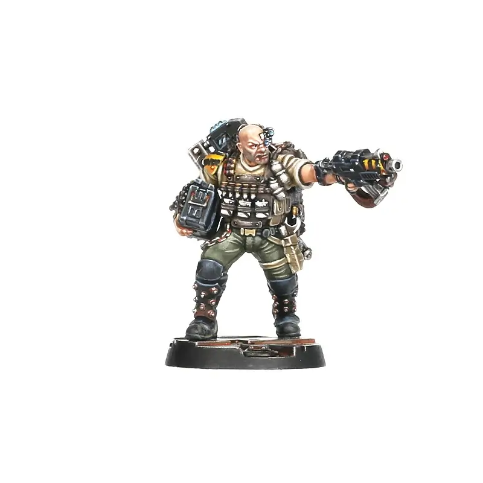

|  M  | WS  | BS  |  S  |  T  |  W  |  I  |  A  | Ld  | Cl  | Wil | Int |
| :-: | :-: | :-: | :-: | :-: | :-: | :-: | :-: | :-: | :-: | :-: | :-: |
| 5"  | 4+  | 3+  |  3  |  3  |  1  | 5+  |  1  | 6+  | 7+  | 6+  | 7+  |

**Skills:** [Munitioneer](/docs/gang-fighters-and-their-weaponry/skills/#5-munitioneer).  
**Weapons:** [Boltgun](/docs/armoury/basic-weapons#boltgun) or [combat shotgun](/docs/armoury/basic-weapons#combat-shotgun) (salvo & shredder), [power hammer](/docs/armoury/close-combat#power-hammer) or [power sword](/docs/armoury/close-combat#power-sword).  
**Wargear:** [Mesh armour](/docs/armoury/armour#mesh-armour).  
**Special Rules:** Gun-smith.

Special Rules

**Gun-smith:** If a gang has an Ammo-jack, its weapons are regularly serviced and their ammo stocks are carefully maintained. As such, fighters from the gang can re-roll any failed Ammo checks that roll a natural 1. The Ammo-jack does not have to take part in the battle for the gang to receive this bonus, but if they are not available for
the battle, for example, if they are In Recovery or have been Captured, the bonus
does not apply.

If a gang has more than one Ammo-jack, the bonus increases. A gang with two Ammo-jacks can re-roll failed Ammo checks that roll a natural 1 or 2. A gang with three can re-roll failed Ammo checks that roll a natural 1, 2 or 3.

Equipment

An Ammo-jack may be armed with either a boltgun or combat shotgun with salvo and
shredder ammo, and with either a power hammer or power sword. All Ammo-jacks
are equipped with mesh armour.

Lore

_As gangs become more experienced, they discover the importance of regular weapon checks. Running out of ammunition or suffering a gun jam in the middle of a firefight is just not acceptable for a gang that wishes to be taken seriously._

_Source: Published in all House of X books_

</FighterCard>

<FighterCard cost="75">

### 0-1 Apprentice Clan Chymist

**_Escher Only_**

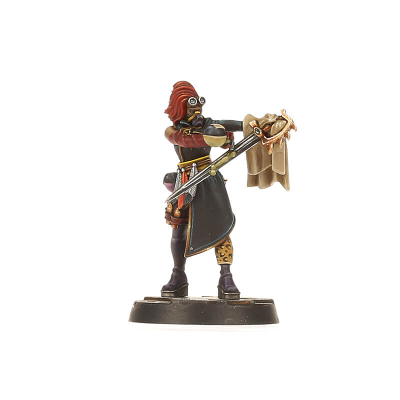

|  M  | WS  | BS  |  S  |  T  |  W  |  I  |  A  | Ld  | Cl  | Wil | Int |
| :-: | :-: | :-: | :-: | :-: | :-: | :-: | :-: | :-: | :-: | :-: | :-: |
| 5"  | 5+  | 5+  |  2  |  3  |  1  | 3+  |  1  | 7+  | 8+  | 8+  | 6+  |

<WeaponStats>

| Weapon        | Rg S | Rg L | Ac S | Ac L |  S  | AP  |  D  | Am  | Traits                                                                                                                                                                                                                                 |
| :------------ | :--: | :--: | :--: | :--: | :-: | :-: | :-: | :-: | :------------------------------------------------------------------------------------------------------------------------------------------------------------------------------------------------------------------------------------- |
| Needle pistol |  4"  |  9"  |  +2  |  -   |  -  | -1  |  -  | 6+  | <Tooltip type="traits" content="scarce">Scarce</Tooltip>, <Tooltip type="traits" content="sidearm">Sidearm</Tooltip>, <Tooltip type="traits" content="silent">Silent</Tooltip>, <Tooltip type="traits" content="toxin">Toxin</Tooltip> |

</WeaponStats>

**Skills:** [Fixer](/docs/gang-fighters-and-their-weaponry/skills/#3-fixer).  
**Special Rules:** Experimental Elixers, Last Rites.

    
Special Rules

**Experimental Elixirs:** A gang with an Apprentice Clan Chymist reduces the cost of
Chem-Alchemy Elixirs (see page 93) by D6x10 to a minimum of 10 credits. Roll each
time a Chem-Alchemy Elixir is purchased.

**Last Rites:** If one of the gang’s Escher Gang Matriarchs or Escher Gang Queens is
killed (i.e., rolls a Memorable Death result or a Critical Injury result and is not saved
by the doc) then the player may roll a D6. If the result is equal to or lower than the
number of advances the fighter has, the player may add a Death-maiden to their
gang. The newly added Death-maiden retains none of the dead fighter’s

Lore

_Escher Clan Chymists often spend their apprenticeships in the underhive alongsideHouse gangs. On the front lines, they learn the best ways to concoct and apply toxins, as well as having fighters to experiment on with their elixirs and potions. Shouldthe chance present itself, an Apprentice Clan Chymist might also participate inthecreation of an Escher Death-maiden, bringing one of the gang’s fallen fighters backfrom the dead._

_Source: House of Blades_

</FighterCard>

<FighterCard cost="50">

### 0-1 Bigby Crumb, Ratling Slopper

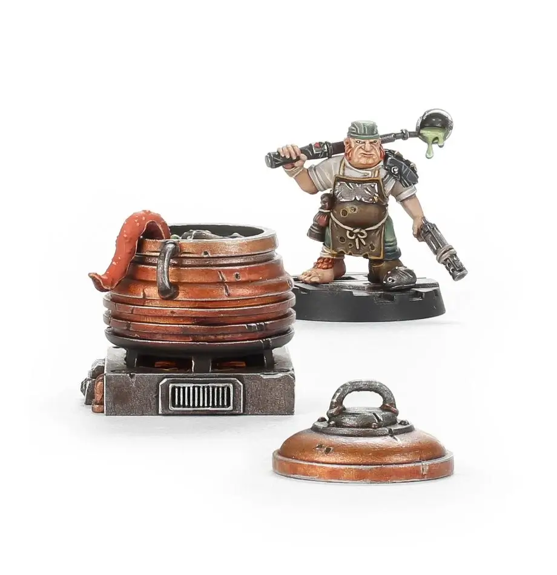

|  M  | WS  | BS  |  S  |  T  |  W  |  I  |  A  | Ld  | Cl  | Wil | Int |
| :-: | :-: | :-: | :-: | :-: | :-: | :-: | :-: | :-: | :-: | :-: | :-: |
| 4"  | 5+  | 4+  |  2  |  2  |  1  | 2+  |  1  | 7+  | 7+  | 8+  | 5+  |

<WeaponStats>

| Weapon                | Rg S | Rg L | Ac S | Ac L |  S  | AP  |  D  | Am  | Traits                                                                                                                     |
| :-------------------- | :--: | :--: | :--: | :--: | :-: | :-: | :-: | :-: | :------------------------------------------------------------------------------------------------------------------------- |
| Slop pot ladle (club) |  -   |  E   |  -   |  -   |  S  | +1  |  2  |  -  | <Tooltip type="traits" content="melee">Melee</Tooltip>                                                                     |
| Stub gun              |  6"  | 12"  |  +2  |  -   |  3  |  -  |  1  | 4+  | <Tooltip type="traits" content="plentiful">Plentiful</Tooltip>, <Tooltip type="traits" content="sidearm">Sidearm</Tooltip> |

</WeaponStats>

**Skills:** [Lie Low](/docs/gang-fighters-and-their-weaponry/skills/#5-lie-low).  
**Special Rules:** Slop Pot, Grub's Up, Part of the Crew.

Special Rules

**Slop Pot:** When Bigby Crumb is hired, he brings along
his Slop Pot. The Slop Pot is represented by its own
model and is placed within 2" of Bigby when he is
deployed on the battlefield. The Slop Pot may be moved
in the same way as a Loot casket (see the Necromunda
Rulebook) and counts as cover.

While within 2" of the Slop Pot, Bigby may perform the
Add Ingredients (Basic) action. When he performs this
action, choose one of the following effects:

- **Stinger Spore Stew:** Until the end of this round, friendly fighters within 2" of the Slop Pot count as having an assist when making Recovery tests (see the Necromunda Rulebook).
- **Frenzon Fondue:** Until the end of this round, friendly fighters within 2" of the Slop Pot gain the Nerves of Steel and True Grit skills.
- **Tentacle Surprise:** Until the start of Bigby’s next activation, the Slop Pot counts as a Beast’s Lair (see the Necromunda Rulebook). Note that Bigby does not trigger the Beast.

**Slopper:** Bigby Crumb is a Slopper Hanger-on and follows the Grub’s Up rule for aiding fighters In Recovery. If hired, he counts as the one Slopper a gang may include.

> **Grub’s Up:** At the end of the Spend Experience step of the pre-battle sequence, roll a D6 for each of the gang’s fighters that is In Recovery. On a roll of 6, a constant supply of good food has helped them recover more quickly – the fighter’s In Recovery box on the gang roster is cleared, and they are now available for this battle.

**Part of the Crew:** Unlike other Hangers-on, this fighter
is always ready for a fight. As long as this fighter is part
of the gang roster, they are treated just like a regular
Ganger for the purposes of selecting a crew. Therefore,
this fighter may be chosen or randomly selected as part
of their gang’s starting crew just like any other Ganger.
However, just like any other Hanger-on, this fighter
cannot gain any Experience or Advancements and,
should they suffer a Lasting Injury that would make a
change to their Fighter card, this fighter is removed from
the gang roster just like any other Hanger-on.

Lore

_Bigby Crumb was once the head chef to the Archduke of House Greim, brought in from the agri-world of Pravium Secundus especially for the job. As Bigby will freely admit, he has since fallen on hard times. As the Ratling slopper tells it, he was expelled from the spire after an unfortunate incident involving a Threadneedle Worm Surprise pie. Rumours persist that the dismissal had less to do with exploding pies and more to do with the Duchess of Greim’s dislike of Ratlings – who she claimed were far too small to be trustworthy. Whatever the reason for Bigby being turfed out of the spire, the nobility’s loss was the underhive’s gain. Down in the stinking depths of Hive Primus, Ratlings don’t usually warrant a second glance, especially in places like Sump City or Heretic’s Hole, where Ogryns and mutants regularly rub shoulders with Beastmen and wyrds. It was here, in the very depths of the hive, that Bigby found a new life turning aggressive sump flora and fauna into quite passable soups and stews._

_Unlike most sloppers, who pass themselves off as culinary experts just because they know how to siphon a water still, Bigby can actually cook. This has put him in high demand among the gangs of hive bottom. The price for hiring Bigby, though, is often joining him on one of his legendary (and equally dangerous) ingredient hunts, the Ratling delving deep into the badzones of the underhive in his search for exotic plants and animals to fill his slop pot. Some say he is merely looking to add new recipes to his repertoire, though others claim Bigby’s hunts have more to do with creating the perfect dish, one good enough to win his way back into the spire._

_Source: The Book of the Outcast_

</FighterCard>

<FighterCard cost="110">

### 0-1 Brute Handler

**_Goliath: 55 credits_**

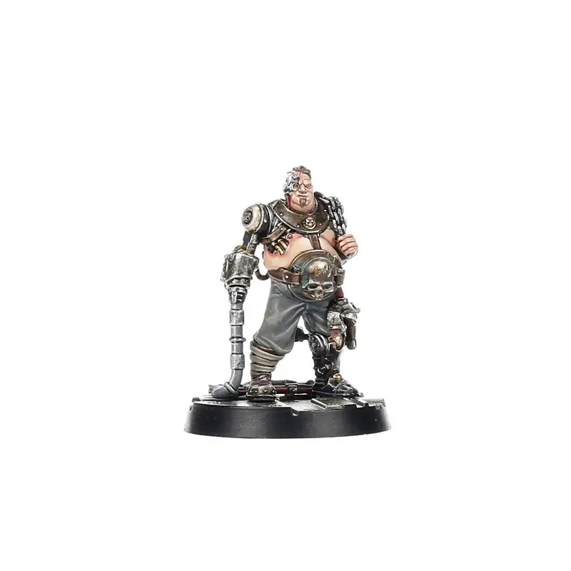

|  M  | WS  | BS  |  S  |  T  |  W  |  I  |  A  | Ld  | Cl  | Wil | Int |
| :-: | :-: | :-: | :-: | :-: | :-: | :-: | :-: | :-: | :-: | :-: | :-: |
| 4"  | 4+  | 5+  |  3  |  4  |  1  | 4+  |  1  | 7+  | 6+  | 8+  | 8+  |

<WeaponStats>

| Weapon     | Rg S | Rg L | Ac S | Ac L |  S  | AP  |  D  | Am  | Traits                                                                                                                                                                         |
| :--------- | :--: | :--: | :--: | :--: | :-: | :-: | :-: | :-: | :----------------------------------------------------------------------------------------------------------------------------------------------------------------------------- |
| Shock whip |  E   |  3"  |  -1  |  -   | S+1 |  -  |  1  |  -  | <Tooltip type="traits" content="melee">Melee</Tooltip>, <Tooltip type="traits" content="shock">Shock</Tooltip>, <Tooltip type="traits" content="versatile">Versatile</Tooltip> |

</WeaponStats>

**Skills:** [Iron Jaw](/docs/gang-fighters-and-their-weaponry/skills/#6-iron-jaw).  
**Special Rules:** Training, Part of the Crew.

Special Rules

**Training:** A gang with a Brute Handler can train their Brutes between games.
Provided the Brute is not In Recovery, the controlling player can make a Willpower
check for any of their Brutes, using the Brute’s unmodified Willpower. If the check
is failed, the Brute gains D3 Experience. If the check is passed, the Brute proves too
wilful and the training doesn’t work. A Brute Handler can only train one Brute at
a time.

In addition, if a Standing and Active Brute Handler is on the battlefield, and within
3" of a friendly Brute, the Brute gains the Nerves of Steel skill and can re-roll any
Leadership, Cool, Willpower or Intelligence checks it is required to make.

**Part of the Crew:** Unlike other Hangers-on, this fighter is always ready for a
fight. As long as this fighter is part of the gang roster, they are treated just like a
regular Ganger for the purposes of selecting a crew. Therefore, this fighter may
be chosen or randomly selected as part of their gang’s starting crew just like any
other Ganger.

However, just like any other Hanger-on, this fighter cannot gain any Experience or
Advancements and, should they suffer a Lasting Injury that would make a change
to their Fighter card, this fighter is removed from the gang roster just like any other
Hanger-on.

Lore

_Brutes are typically savage and dull-witted, herded into battle by gangs to increase their firepower and intimidate their enemies. Even those Brutes with the sense to listen to their leader’s commands in combat still need guidance and training, and Goliath Brute Handlers are ex-pit fighters or factorum overseers and know how to get the most out of muscle._

_Source: House of Chains_

</FighterCard>

<FighterCard cost="75">

### 0-1 Bullet Merchant

**_Orlock: 25 credits_**

|  M  | WS  | BS  |  S  |  T  |  W  |  I  |  A  | Ld  | Cl  | Wil | Int |
| :-: | :-: | :-: | :-: | :-: | :-: | :-: | :-: | :-: | :-: | :-: | :-: |
| 5"  | 5+  | 4+  |  3  |  3  |  1  | 4+  |  1  | 8+  | 8+  | 8+  | 6+  |

<WeaponStats>

| Weapon     | Rg S | Rg L | Ac S | Ac L |  S  | AP  |  D  | Am  | Traits                                                                                                                           |
| :--------- | :--: | :--: | :--: | :--: | :-: | :-: | :-: | :-: | :------------------------------------------------------------------------------------------------------------------------------- |
| Autopistol |  4"  | 12"  |  +1  |  -   |  3  |  -  |  1  | 4+  | <Tooltip type="traits" content="rapid-fire">Rapid Fire (1)</Tooltip>, <Tooltip type="traits" content="sidearm">Sidearm</Tooltip> |
| _or_       |
| Stub gun   |  6"  | 12"  |  +2  |  -   |  3  |  -  |  1  | 4+  | <Tooltip type="traits" content="plentiful">Plentiful</Tooltip>, <Tooltip type="traits" content="sidearm">Sidearm</Tooltip>       |

</WeaponStats>

**Skills:** [Fast Shot](/docs/gang-fighters-and-their-weaponry/skills/#1-fast-shot).  
**Weapons:** Autopistol or Stub Gun, and a single additional ammo for that weapon.  
**Special Rules:** High Calibre Hook-up.

Special Rules

**High Calibre Hook-up:** While a gang includes a Bullet Merchant, they treat all types of
ammo available through the Trading Post or the Black Market as Common. In addition,
any of these types of ammo that have the Limited trait replace that Trait with the
Scarce trait.

Lore

_Every gang needs a good bullet merchant. While an ammo-jack can see to the gang’s weapons, they are not true connoisseurs of calibre. A bullet merchant deals in all kinds of ammunition, whether it is stub rounds, plasma flasks or bolt shells, providing underhivers with the best stock available, often dug out fresh from the corpse of some unfortunate ganger._

_Source: House of Iron_

</FighterCard>

<FighterCard cost="50">

### 0-1 Chem Dealer

_**Goliath: 25 credits**_

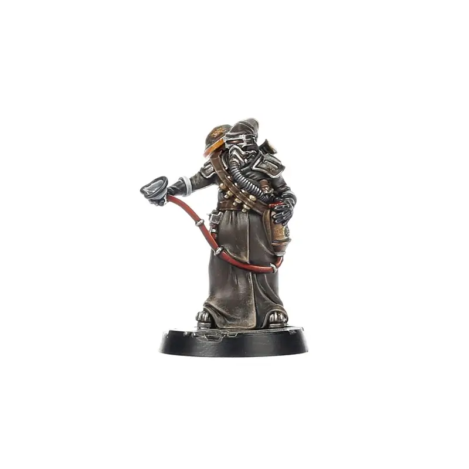

|  M  | WS  | BS  |  S  |  T  |  W  |  I  |  A  | Ld  | Cl  | Wil | Int |
| :-: | :-: | :-: | :-: | :-: | :-: | :-: | :-: | :-: | :-: | :-: | :-: |
| 5"  | 4+  | 4+  |  3  |  3  |  1  | 4+  |  1  | 7+  | 7+  | 8+  | 7+  |

<WeaponStats>

| Weapon   | Rg S | Rg L | Ac S | Ac L |  S  | AP  |  D  | Am  | Traits                                                                                                                     |
| :------- | :--: | :--: | :--: | :--: | :-: | :-: | :-: | :-: | :------------------------------------------------------------------------------------------------------------------------- |
| Stub gun |  6"  | 12"  |  +2  |  -   |  3  |  -  |  1  | 4+  | <Tooltip type="traits" content="plentiful">Plentiful</Tooltip>, <Tooltip type="traits" content="sidearm">Sidearm</Tooltip> |

</WeaponStats>

**Skills:** [Fixer](/docs/gang-fighters-and-their-weaponry/skills/#3-fixer).  
**Equipment:** A Chem Dealer is armed with a stub gun. All Chem Dealers are equipped with a
single dose of any Chem, chosen from the Black Market.  
**Special Rules:** Steady Supply.

Special Rules

**Steady Supply:** A gang with a Chem Dealer counts all Chems as Common
availability when buying them from the Trading Post or Black Market. Chem
Dealers can also, in a pinch, acquire Chems ‘on consignment’ during the pre-battle
sequence of a game. This allows the gang to buy a single dose or any Chem, or
items containing Chems, such as a single stimm-slug stash or medicae kit, without
expending any credits. However, during the post-battle actions step of the postbattle
sequence, the gang must pay for these items. If the gang cannot or will not
pay for any item, the Chem Dealer is removed from the gang’s roster. Should this
happen, news of the bad deal gets around, and the gang cannot hire another Chem
Dealer Hanger-on for the remainder of the current campaign.

Lore

_Chems are a vital resource in the underhive, and many gangs don’t like to leave acquiring them to chance. A Chem Dealer is a dedicated supplier for a gang and, for a bit of protection and some creds, provides a gang with chems when they need them. Of course, while Chem Dealers are not as vulnerable to criminal reprisals as freelancers, when a deal goes sour they can just as easily end up with a stub round in their brain._

_Source: House of Chains_

</FighterCard>

<FighterCard cost="60">

### 0-1 Claim Jumper

_**Ironhead Squat Prospectors only**_

|  M  | WS  | BS  |  S  |  T  |  W  |  I  |  A  | Ld  | Cl  | Wil | Int |
| :-: | :-: | :-: | :-: | :-: | :-: | :-: | :-: | :-: | :-: | :-: | :-: |
| 4"  | 3+  | 4+  |  3  |  4  |  1  | 4+  |  2  | 7+  | 6+  | 6+  | 5+  |

<WeaponStats>

| Weapon              | Rg S | Rg L | Ac S | Ac L |  S  | AP  |  D  | Am  | Traits                                                                                                                                                                                  |
| :------------------ | :--: | :--: | :--: | :--: | :-: | :-: | :-: | :-: | :-------------------------------------------------------------------------------------------------------------------------------------------------------------------------------------- |
| Gem extractor       |  -   |  E   |  -   |  -   | S+1 | -1  |  2  |  -  | <Tooltip type="traits" content="melee">Melee</Tooltip>, <Tooltip type="traits" content="power-pack">Power Pack</Tooltip>                                                                |
| Ironhead autopistol |  4"  | 12"  |  +1  |  -   |  3  |  -  |  1  | 4+  | <Tooltip type="traits" content="rapid-fire">Rapid Fire (1)</Tooltip>, <Tooltip type="traits" content="sidearm">Sidearm</Tooltip>                                                        |
| Power fist          |  -   |  E   |  -   |  -   | S+2 | -2  |  2  |  -  | <Tooltip type="traits" content="melee">Melee</Tooltip>, <Tooltip type="traits" content="power">Power</Tooltip>, <Tooltip type="traits" content="pulverise">Pulverise</Tooltip>          |
| Power maul          |  -   |  E   |  -   |  -   | S+2 | -1  |  1  |  -  | <Tooltip type="traits" content="melee">Melee</Tooltip>, <Tooltip type="traits" content="power">Power</Tooltip>                                                                          |
| Frag grenades       |  -   | Sx3  |  -   |  -   |  3  |  -  |  1  | 4+  | <Tooltip type="traits" content="blast">Blast (3")</Tooltip>, <Tooltip type="traits" content="grenade">Grenade</Tooltip>, <Tooltip type="traits" content="knockback">Knockback</Tooltip> |
| Smoke grenades      |  -   | Sx3  |  -   |  -   |  -  |  -  |  -  | 4+  | <Tooltip type="traits" content="grenade">Grenade</Tooltip>, <Tooltip type="traits" content="smoke">Smoke</Tooltip>                                                                      |

</WeaponStats>

**Skills:** [Fearsome](/docs/gang-fighters-and-their-weaponry/skills/#2-fearsome), [Iron Jaw](/docs/gang-fighters-and-their-weaponry/skills/#6-iron-jaw).  
**Wargear:** [Mesh armour](/docs/armoury/armour#mesh-armour), [Techmite Autoveyor](#techmite-autoveyor).  
**Special Rules:** Seize the Prize, Part of the Crew.

Special Rules

**Seize the Prize:** During the Post-battle sequence this fighter may perform the Claim Jump Post-battle action.

- **Claim Jump:** Roll a D6. On a result of 5+ choose a Territory controlled by your opponent – immediately gain the boons from that Territory (this does not prevent the Territory’s owner gaining the Boons).

**Part of the Crew:** Unlike other Hangers-on, this fighter is always ready for a fight. As long as this fighter is part
of the gang roster, they are treated just like a regular Ganger for the purposes of selecting a crew. Therefore,
this fighter may be chosen or randomly selected as part of their gang’s starting crew just like any other Ganger.

However, just like any other Hanger-on, this fighter cannot gain any Experience or Advancements and, should
they suffer a Lasting Injury that would make a change to their Fighter card, this fighter is removed from the
gang roster just like any other Hanger-on.

Lore

_Necromunda is an exhausted world, its mineral wealth all but spent, and even its rich pools of waste chems or seams of scrap are jealously guarded by those who mine them. In such an environment, it is individuals such as the Claim Jumper who help the Ironhead Squat Prospectors find the best places to set up their great mining rigs. Grizzled loners used to operating far from their clan, Claim Jumpers have a nose for fermented toxic waste or crystallised promethium run-off, among a hundred other valuable resources unique to the outlands. Where a less experienced Squat might see only the shifting ashen face of Necromunda, the Claim Jumper detects tiny tells, like discolouration in dust dunes or the faint scent of rotting ferrosteel, pointing the way to a worthy find. Like all Squat technical or mining specialists, the Claim Jumper is aided by a Techmite drone of their own creation – in this case a Techmite Autoveyor. Autoveyors are as much a pet as tools, with their own unique machine intelligence. This allows them to hunt down minerals and treasure the Claim Jumper might have missed, using their drill appendage to bore into the ground (or sealed containers) and return to their master with their find – much like a Cyber-mastiff loyally returning to its owner, kill clutched in its jaws._

_True to their name, a Squat Claim Jumper does not limit their explorations to unclaimed minerals and wealth. More often than the Clan Houses would like to admit, Squat Prospectors, led by a Claim Jumper, have moved in on one of their newly staked mining sites, stripping it bare before they can properly set up shop. House Orlock in particular has clashed with the Squats over such breaches of claim – the Squats themselves operating outside of the rigid Clan and Noble House structure and so less concerned with contracts made between humans. As such, a Claim Jumper comes more heavily armed than one might expect, carrying power weapons, grenades and firearms, both for seeing off local wildlife or Ash Waste Nomads, but also in case they run into any rival prospectors._

_Source: The Aranthian Succession: Ruins of Jardlan_

</FighterCard>

<FighterCard cost="-">

### Techmite Autoveyor

**Ironhead Squat Claim Jumper only**

|  M  | WS  | BS  |  S  |  T  |  W  |  I  |  A  | Ld  | Cl  | Wil | Int |
| :-: | :-: | :-: | :-: | :-: | :-: | :-: | :-: | :-: | :-: | :-: | :-: |
| 4"  | 4+  | 4+  |  3  |  3  |  1  | 4+  |  1  | 8+  | 5+  | 6+  | 6+  |

<WeaponStats>

| Weapon | Rg S | Rg L | Ac S | Ac L |  S  | AP  |  D  | Am  | Traits                                                 |
| :----- | :--: | :--: | :--: | :--: | :-: | :-: | :-: | :-: | :----------------------------------------------------- |
| Drill  |  -   |  E   |  -   |  -   |  S  | -1  |  1  |  -  | <Tooltip type="traits" content="melee">Melee</Tooltip> |

</WeaponStats>

**Skills:** [There's Always Another Secret](/docs/gang-fighters-and-their-weaponry/skills/gang-specific-skills#6-theres-always-another-secret).  
**Wargear:** [Flak armour](/docs/armoury/armour#flak-armour).  
**Special Rules:** Tech Bypass.

Special Rules

**Tech Bypass:** A Techmite Autoveyor may perform the Bypass Loot Casket (Basic) action and when rolling to determine the contents, the dice may be re-rolled.

**Skill Access:** Should a Techmite Autoveyor become a Specialist, it has access to the following skill sets: Cunning (Primary), Agility (Seconary).

Lore

_Ironhead Squats are naturally skilled with technology of all kinds. Most will create their own automated companions, the little robotic creatures designed to aid them in a myriad of tasks, from hunting to mineral detection. Collectively these robots are known as Techmites, though the Squats themselves tend to give them designations depending on their specialisation or place of manufacture such as the Jortlan K-12 Oculium Bot or the Svardish MkIII Auto-shifter. The Autoveyor is one of these specialisations, its complex sensor array keyed to helping Claim Jumpers hunting down ore and chem seams while out in the wastes, or crawling into tiny spaces looking for hidden wealth._

_Source: The Aranthian Succession: Ruins of Jardlan_

</FighterCard>

<FighterCard cost="100">

### 0-1 Cogitator Core Servitor

**Van Saar Only**

|  M  | WS  | BS  |  S  |  T  |  W  |  I  |  A  | Ld  | Cl  | Wil | Int |
| :-: | :-: | :-: | :-: | :-: | :-: | :-: | :-: | :-: | :-: | :-: | :-: |
| 3"  | 6+  |  -  |  3  |  4  |  1  | 6+  |  1  | 12+ | 3+  | 5+  | 3+  |

**Special Rules:** Mind in the Machine, Hostile Environment, Security Measures.

Special Rules

**Mind in the Machine:** In any scenario in which a gang that has a Cogitator Core
Servitor is the defender, the gang is able to exert tremendous control over the
battlefield. At the end of any End phase, the gang may turn the lights on or off at will.
If the gang chooses to turn the lights off, the Pitch Black rules immediately come into
effect. If the gang chooses to turn the lights on, the Pitch Black rules immediately
cease to apply.

**Hostile Environment:** In any scenario in which a gang that has a Cogitator Core
Servitor is the defender, after both sides have deployed but before the first round, the gang may place D3 [booby traps](/docs/armoury/booby-traps) (frag, krak or melta) anywhere on the battlefield that is not within 6" of an enemy fighter.

**Security Measures:** In any scenario in which a gang that has a Cogitator Core Servitor is the defender, any fighter belonging to the enemy gang must apply an additional -1 modifier to their Intelligence check when making an Access Terminal (Basic) action or a Bypass Loot Casket Lock (Basic) action.

Skill Access

A Cogitator Core Servitor has no skills.

Equipment

A Cogitator Core Servitor has no equipment.

Lore

_Despite the sanctions against the misuse of technology on Necromunda – and imposed by the Imperium – underhive gangs regularly adapt and adopt all manner of archaeo-devices for their own ends. Van Saar gangs are especially proficient at removing cogitator cores from the hive’s many monitoring and regulating systems – splicing them into the lobotomised minds of maintenance servitors, greatly enhancing their ability to oversee and control their gang turf._

_Source: House of Artifice_

</FighterCard>

<FighterCard cost="20">

### 0-1 Data-Scrivener

|  M  | WS  | BS  |  S  |  T  |  W  |  I  |  A  | Ld  | Cl  | Wil | Int |
| :-: | :-: | :-: | :-: | :-: | :-: | :-: | :-: | :-: | :-: | :-: | :-: |
| 5"  | 5+  | 5+  |  3  |  3  |  1  | 4+  |  1  | 8+  | 7+  | 7+  | 5+  |

**Skills:** [Gadgeteer](/docs/gang-fighters-and-their-weaponry/skills/gang-specific-skills#2-gadgeteer).  
**Weapons:** A Data-scrivener may be armed with either a [laspistol](/docs/armoury/pistols#laspistol) or a [las sub-carbine](/docs/armoury/pistols#las-sub-carbine).  
**Special Rules:** Data-hacked.

Special Rules

**Data-hacked:** Should any fighter belonging to a gang that has a Data-scrivener be
required to make an Intelligence check whilst the Data-scrivener is present upon the
battlefield, they may roll an additional D6 and discard the lowest roll.

Lore

_Necromunda’s hives are filled with barely-understood technologies, ancient cogitator systems and forgotten machines. Data-scriveners excel at both stealing data from these devices and systems as well as manipulating them for a gang. A good Data-scrivener can tap into a dome’s dormant workings and bring them to life, or turn them against the gang’s rivals._

_Source: House of Artifice_

</FighterCard>

<FighterCard cost="100">

### 0-1 Doctor Arachnos

**Rogue Doc (Dramatic Personae)**

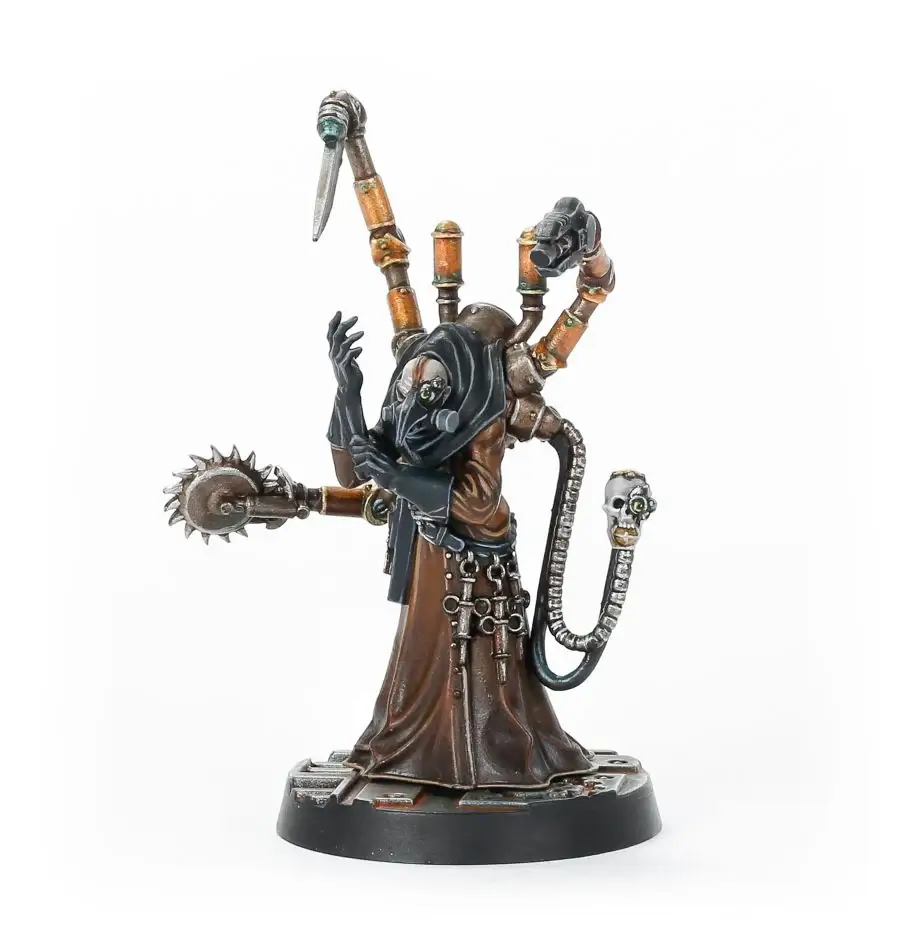

|  M  | WS  | BS  |  S  |  T  |  W  |  I  |  A  | Ld  | Cl  | Wil | Int |
| :-: | :-: | :-: | :-: | :-: | :-: | :-: | :-: | :-: | :-: | :-: | :-: |
| 5"  | 4+  | 4+  |  3  |  3  |  1  | 4+  |  2  | 8+  | 7+  | 7+  | 6+  |

<WeaponStats>

| Weapon                 | Rg S | Rg L | Ac S | Ac L |  S  | AP  |  D  | Am  | Traits                                                                                                                                                                         |
| :--------------------- | :--: | :--: | :--: | :--: | :-: | :-: | :-: | :-: | ------------------------------------------------------------------------------------------------------------------------------------------------------------------------------ |
| Laspistol              |  8"  | 12"  |  +1  |  -   |  3  |  -  |  1  | 2+  | <Tooltip type="traits" content="plentiful">Plentiful</Tooltip>, <Tooltip type="traits" content="sidearm">Sidearm</Tooltip>                                                     |
| Medical mechadendrites |  E   |  3"  |  +1  |  -   |  -  | -1  |  -  |  -  | <Tooltip type="traits" content="melee">Melee</Tooltip>, <Tooltip type="traits" content="toxin">Toxin</Tooltip>, <Tooltip type="traits" content="versatile">Versatile</Tooltip> |

</WeaponStats>

**Skills:** [Medicae](/docs/gang-fighters-and-their-weaponry/skills/#4-medicae).  
**Wargear:** [Mesh armour](/docs/armoury/armour#mesh-armour) (5+), [bio-scanner](/docs/armoury/personal-equipment#bio-scanner), [respirator](/docs/armoury/personal-equipment#respirator).  
**Special Rules:** Medical Mechadendrites, Part of the Crew, Rogue Doc.

    
Special Rules

**Medical Mechadendrites:** Doctor Arachnos’ medical
mechadendrites allow him to turn any location into
an impromptu operating theatre. During the Recovery
phase, if Doctor Arachnos is within 3" of a Seriously
Injured friendly fighter, instead of making a Recovery
check for the fighter, you can make an Intelligence check
for Doctor Arachnos. If the check is successful, the
fighter immediately recovers from their Serious Injury
just as if they had rolled a Flesh Wound on the Injury
dice. If the check is failed, the fighter goes Out of Action
instead. Doctor Arachnos can only aid one fighter in this
way each round.

**Part of the Crew:** Unlike other Hangers-on, this fighter
is always ready for a fight. As long as this fighter is part
of the gang roster, they are treated just like a regular
Ganger for the purposes of selecting a crew. Therefore,
this fighter may be chosen or randomly selected as part
of their gang’s starting crew just like any other Ganger.
However, just like any other Hanger-on, this fighter
cannot gain any Experience or Advancements and,
should they suffer a Lasting Injury that would make a
change to their Fighter card, this fighter is removed from
the gang roster just like any other Hanger-on.

**Rogue Doc:** Doctor Arachnos is a Rogue Doc Hangeron,
as described on page 41. If hired, he counts as one
of the two Rogue Docs a gang may include.

Lore

_Doctor Arachnos works out of the Six Clans ‘Cutting Room’ in Dust Falls. Both Proctor Clause Bauhein and Mistress of Coin Melerva pay the Doc well for his services, and even Narco Lord Balthazar Van Zep has been known to go to him to save the life of an especially valued associate. A slightly sinister figure, no one quite knows where Arachnos comes from; he just turned up one day in Dust Falls with his chirurgical assistant, Craven Bonesaw, in tow – the small misshapen creature thought to be the product of one of Doctor Arachnos’ experiments. However, good medical aid is hard to come by in the underhive, especially of the kind Arachnos offers, and so he does a fine trade in digging out bullets and patching up ruptured organs._

_The Doc also has a healthy sideline in gen-hancements and organ grafting. For a modest fee, Doc Arachnos will cut an underhiver open and make ‘improvements’ to their physiology. Most often, these are purely practical – like implanting a Goliath pulmonary system to allow the patient to brea the toxic air, or a set of Phyrr Cat eyes so they can see in the dark. More rarely, gang leaders come to Arachnos looking for cosmetic enhancements such as ripper jack teeth or ash devil claws (which look scary but make opening a bottle of Wild Snake a small feat!). Of course, all these exotic components need to come from somewhere, and the Doc regularly signs on with gangs going down into the depths of the underhive. While Arachnos can, and does, pay for unusual organs procured by gangers, he prefers to extract them himself – rather than receive them in the battered remains of a corpse-starch ration tin wrapped in whatever dirty rag the ganger could find._

_Source: The Book of the Outcast_

</FighterCard>

<FighterCard cost="20">

### 0-1 Dome Runner

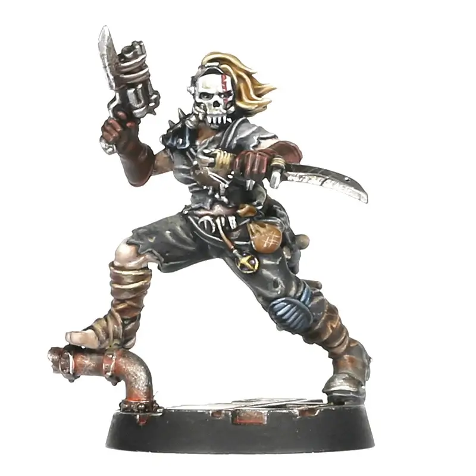

|  M  | WS  | BS  |  S  |  T  |  W  |  I  |  A  | Ld  | Cl  | Wil | Int |
| :-: | :-: | :-: | :-: | :-: | :-: | :-: | :-: | :-: | :-: | :-: | :-: |
| 5"  | 5+  | 5+  |  3  |  3  |  1  | 3+  |  1  | 10+ | 9+  | 7+  | 8+  |

**Skills:** [Lie Low](/docs/gang-fighters-and-their-weaponry/skills/#5-lie-low).  
**Weapons:** [Laspistol](/docs/armoury/pistols#laspistol) or [stub gun](/docs/armoury/pistols#stub-gun), [fighting knife](/docs/armoury/close-combat#fighting-knife) or [axe](/docs/armoury/close-combat#axe).  
**Special Rules:** Scout Ahead.

Special Rules

**Scout Ahead:** Whenever a fighter from a gang with a Dome Runner opens a Loot
casket, they may choose to re-roll the D6 to determine what the contents are.
However, they must accept the result of the re-roll, even if it is worse.

Equipment

A Dome Runner may be armed with either a laspistol or stub gun, and with either a
fighting knife or axe.

Lore

_A gang’s Turf is its primary source of income, but as it expands outwards, the gangers might find themselves in areas they’ve never even visited. Local guides, referred to as ‘Dome Runners’, are a regular sight among gangs wishing to root out this new turf’s hidden treasures._

_Source: Published in all House of X books_

</FighterCard>

<FighterCard cost="50">

### 0-1 Fixer

|  M  | WS  | BS  |  S  |  T  |  W  |  I  |  A  | Ld  | Cl  | Wil | Int |
| :-: | :-: | :-: | :-: | :-: | :-: | :-: | :-: | :-: | :-: | :-: | :-: |
| 5"  | 4+  | 4+  |  3  |  3  |  1  | 4+  |  1  | 7+  | 5+  | 8+  | 7+  |

<WeaponStats>

| Weapon      | Rg S | Rg L | Ac S | Ac L |  S  | AP  |  D  | Am  | Traits                                                     |
| :---------- | :--: | :--: | :--: | :--: | :-: | :-: | :-: | :-: | :--------------------------------------------------------- |
| Bolt pistol |  6"  | 12"  |  +1  |  -   |  4  | -1  |  2  | 6+  | <Tooltip type="traits" content="sidearm">Sidearm</Tooltip> |

</WeaponStats>

**Skills:** [Fixer](/docs/gang-fighters-and-their-weaponry/skills/#3-fixer).  
**Wargear:** [Mesh armour](/docs/armoury/armour#mesh-armour).

Special Rules

A gang allied to an organisation, such as the Merchants Guild or the Recidivists,
can subtract 2 from the dice roll when they Test the Alliance if they have a Fixer in
their gang. In addition, if the gang is ever outlawed as a result of their actions, they
can remove the Fixer from the gang roster to avoid becoming an Outlaw gang.

Lore

_Sometimes even the most successful gangs need someone who can just get things done, no questions asked. Fixers are troubleshooters with connections throughout the underhive, able to call in favours or settle debts on others’ behalf when someone is being obstinate. They are often found in the employ of settlement lords or Guilder families, but will also work for gangs._

_Source: The Book of Judgement_

</FighterCard>

<FighterCard cost="20">

### 0-1 Gang Lookout

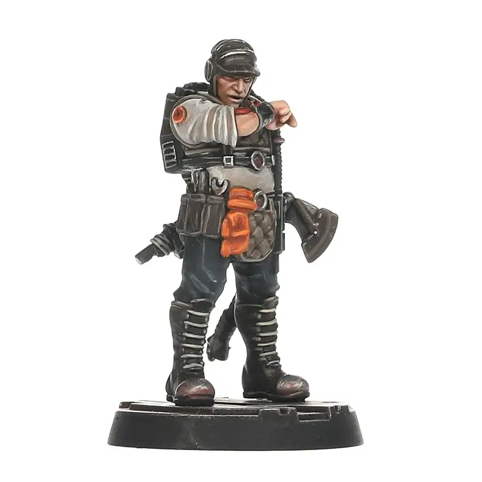

|  M  | WS  | BS  |  S  |  T  |  W  |  I  |  A  | Ld  | Cl  | Wil | Int |
| :-: | :-: | :-: | :-: | :-: | :-: | :-: | :-: | :-: | :-: | :-: | :-: |
| 5"  | 5+  | 4+  |  2  |  3  |  1  | 3+  |  1  | 9+  | 7+  | 5+  | 7+  |

**Skills:** [Evade](/docs/gang-fighters-and-their-weaponry/skills/#3-evade).  
**Weapons:** [Laspistol](/docs/armoury/pistols#laspistol) or [stub gun](/docs/armoury/pistols#stub-gun), [fighting knife](/docs/armoury/close-combat#fighting-knife) or [axe](/docs/armoury/close-combat#axe).  
**Special Rules:** Heads Up.

Special Rules

**Heads Up:** During Skirmish play, a gang with a look-out may add 1 to the dice roll to
determine which gang is the Attacker or Defender. Additionally, if a gang with a lookout
is the Defender in a scenario that uses the Sneak Attack rules, add 1 to all rolls
to determine if a Sentry spots an Attacker.

Equipment

A Gang Lookout may be armed with either a laspistol or stub gun, and with either a
fighting knife or axe.

Lore

_There are many hivers and settlement scum willing to keep watch on a gang’s borders and pass warnings of unwanted visitors along. These lookouts can warn of attacking rivals or interest from the Enforcers, and allow a gang a chance to escape._

_Source: Published in all House of X books_

</FighterCard>

<FighterCard cost="40">

### 0-1 Grease Monkey

**_Orlock Only_**

|  M  | WS  | BS  |  S  |  T  |  W  |  I  |  A  | Ld  | Cl  | Wil | Int |
| :-: | :-: | :-: | :-: | :-: | :-: | :-: | :-: | :-: | :-: | :-: | :-: |
| 5"  | 5+  | 5+  |  3  |  3  |  1  | 4+  |  1  | 8+  | 7+  | 7+  | 5+  |

<WeaponStats>

| Weapon                  | Rg S | Rg L | Ac S | Ac L |  S  | AP  |  D  | Am  | Traits                                                 |
| :---------------------- | :--: | :--: | :--: | :--: | :-: | :-: | :-: | :-: | :----------------------------------------------------- |
| Wrench (maul)           |  -   |  E   |  -   |  -   |  S  | +1  |  2  |  -  | <Tooltip type="traits" content="melee">Melee</Tooltip> |
| Blowtorch (hand flamer) |  T   |  -   |  -   |  -   |  3  |  -  |  1  | 5+  | <Tooltip type="traits" content="blaze">Blaze</Tooltip> |

</WeaponStats>

**Skills:** [Munitioneer](/docs/gang-fighters-and-their-weaponry/skills/#5-munitioneer).  
**Special Rules:** Overcharge.

Special Rules

**Overcharge:** A gang with a Grease Monkey can overcharge one of their Brutes, or
the jump boosters of their Wreckers, during the pre-battle sequence. An overcharged
Brute increases both its Movement and Attacks characteristics by D3 when it
activates (roll once and apply the results to both characteristics). However, if a natural
1 is rolled when rolling the D3, the Brute suffers a wound with no save possible. An
overcharged jump booster adds D6" to the Movement of a Wrecker (roll each time
the fighter is activated). If a natural 1 is rolled, then no extra Movement is
gained and the Wrecker may only perform a single action during its
activation, as they struggle to control their malfunctioning pack.

Lore

_Orlock gang hideouts are as much workshops as settlements, with all kinds of machinery being built, pulled apart or worked on. Orlock Grease Monkeys are the grimy workers who keep the Orlock’s servitors, vehicles and heavy gear functioning or, when the gang boss commands, overcharge it far past its safety limits._

_Source: House of Iron_

</FighterCard>

<FighterCard cost="30">

### 0-2 Narker

|  M  | WS  | BS  |  S  |  T  |  W  |  I  |  A  | Ld  | Cl  | Wil | Int |
| :-: | :-: | :-: | :-: | :-: | :-: | :-: | :-: | :-: | :-: | :-: | :-: |
| 5"  | 4+  | 5+  |  3  |  3  |  1  | 4+  |  1  | 7+  | 6+  | 9+  | 9+  |

<WeaponStats>

| Weapon         | Rg S | Rg L | Ac S | Ac L |  S  | AP  |  D  | Am  | Traits                                                                                                               |
| :------------- | :--: | :--: | :--: | :--: | :-: | :-: | :-: | :-: | :------------------------------------------------------------------------------------------------------------------- |
| Fighting Knife |  -   |  E   |  -   |  -   |  S  | -1  |  1  |  -  | <Tooltip type="traits" content="backstab">Backstab</Tooltip>, <Tooltip type="traits" content="melee">Melee</Tooltip> |

</WeaponStats>

**Skills:** [Lie Low](/docs/gang-fighters-and-their-weaponry/skills/#5-lie-low).

Special Rules

During the Determine Scenario step of the pre-battle sequence, a gang with
a ‘Narker can modify the final dice roll by 1; either increase or decrease the
result. If the gang has two ‘Narkers, the gang can instead modify this dice roll
by 2. If both gangs have ‘Narkers, they cancel each other out (i.e., a gang with
two ‘Narkers facing a gang with one would only count as having one ‘Narker
while their opponent would count as having none).

Lore

_Information is power in the underhive and a gang can benefit greatly from having some well-placed spies. ‘Narkers are professional information gatherers who frequent the local drinking holes, trading posts and rumour halls of the underhive before passing on the secrets they discover to employers._

_Source: The Book of Judgement_

</FighterCard>

<FighterCard cost="75">

### 0-1 Pit Trainer

**_Goliath Only_**

|  M  | WS  | BS  |  S  |  T  |  W  |  I  |  A  | Ld  | Cl  | Wil | Int |
| :-: | :-: | :-: | :-: | :-: | :-: | :-: | :-: | :-: | :-: | :-: | :-: |
| 5"  | 3+  | 4+  |  3  |  3  |  1  | 3+  |  2  | 7+  | 5+  | 8+  | 7+  |

<WeaponStats>

| Weapon         | Rg S | Rg L | Ac S | Ac L |  S  | AP  |  D  | Am  | Traits                                                                                                                                                                     |
| :------------- | :--: | :--: | :--: | :--: | :-: | :-: | :-: | :-: | :------------------------------------------------------------------------------------------------------------------------------------------------------------------------- |
| Chainsword     |  -   |  E   |  +1  |  -   |  S  | -1  |  1  |  -  | <Tooltip type="traits" content="melee">Melee</Tooltip>, <Tooltip type="traits" content="parry">Parry</Tooltip>, <Tooltip type="traits" content="rending">Rending</Tooltip> |
| Fighting Knife |  -   |  E   |  -   |  -   |  S  | -1  |  1  |  -  | <Tooltip type="traits" content="backstab">Backstab</Tooltip>, <Tooltip type="traits" content="melee">Melee</Tooltip>                                                       |

</WeaponStats>

**Skills:** [Mentor](/docs/gang-fighters-and-their-weaponry/skills/#4-mentor).  
**Special Rules:** Combat Ready.

Special Rules

**Combat Ready:** A gang containing a Pit Trainer can train fighters between battles.
Up to three fighters, who are not In Recovery, can be trained at once. A fighter who
undergoes training gains a random skill, generated from their Primary or Secondary
skill lists, for the next battle the fighter takes part in. This is a temporary skill, and is
removed from the fighter’s card at the end of the battle. If the generated skill is one
they already have, they may instead choose the temporary skill from their Primary
or Secondary skill lists.

However, when a fighter trains for the pit, there is a chance they will be injured. Roll
a D6 for each fighter in training. On a roll of 1, the fighter must immediately make a
roll on the Lasting Injury table and immediately apply the results. If a fighter suffers
an injury that puts them Into Recovery, they must miss the next battle.

Lore

_Pit fighters are rightly feared for their close combat abilities, and the best ones train constantly under Pit Trainers to improve their skills. Goliath gangs favour Pit Trainers over more conventional trainers, as they have a focus on melee combat and vicious takedowns, usually in the bloodiest way possible for the enjoyment of the crowds._

_Source: House of Chains_

</FighterCard>

<FighterCard cost="40">

### 0-1 Prize Fighter

**_Orlock Only_**

|  M  | WS  | BS  |  S  |  T  |  W  |  I  |  A  | Ld  | Cl  | Wil | Int |
| :-: | :-: | :-: | :-: | :-: | :-: | :-: | :-: | :-: | :-: | :-: | :-: |
| 5"  | 3+  | 5+  |  4  |  3  |  1  | 4+  |  1  | 8+  | 6+  | 7+  | 8+  |

**Skills:** [Iron Jaw](/docs/gang-fighters-and-their-weaponry/skills/#6-iron-jaw).  
**Equipment:** A Prize Fighter has no equipment.  
**Special Rules:** Bare Knuckle Fighter.

Special Rules

**Bare Knuckle Fighter:** In the Collect Income step of the post-battle sequence, a
gang with a Prize Fighter may enter them in a fight. If they do, roll two D6 and choose
the highest, then multiply the result by 10 to see how many credits the fighter earns
for the gang. If, however, a 1 is rolled on either of the D6, no money is made, and if
a double 1 is rolled, the Prize Fighter has been killed and must be removed from the
gang’s roster.

Lore

_Orlock gangs are fans of bare knuckle fights, there being something fundamentally Orlock about two fighters beating the hell out of each other with just their fists. Gangs often employ specially-trained pugilists for this task, pitting them against other gang’s fighters, or even putting them in the fighting pits to face off against slaves and beasts, armed only with their bare hands._

_Source: House of Iron_

</FighterCard>

<FighterCard cost="30">

### 0-1 Propagandist

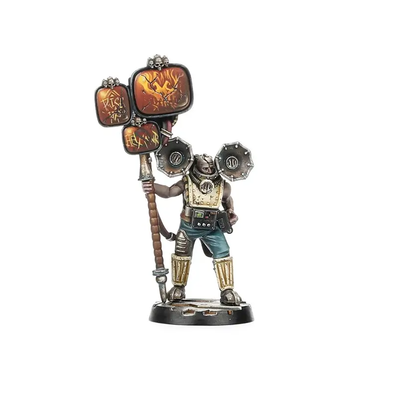

|  M  | WS  | BS  |  S  |  T  |  W  |  I  |  A  | Ld  | Cl  | Wil | Int |
| :-: | :-: | :-: | :-: | :-: | :-: | :-: | :-: | :-: | :-: | :-: | :-: |
| 4"  | 5+  | 4+  |  3  |  3  |  1  | 5+  |  1  | 7+  | 8+  | 8+  | 8+  |

<WeaponStats>

| Weapon    | Rg S | Rg L | Ac S | Ac L |  S  | AP  |  D  | Am  | Traits                                                                                                                     |
| :-------- | :--: | :--: | :--: | :--: | :-: | :-: | :-: | :-: | :------------------------------------------------------------------------------------------------------------------------- |
| Laspistol |  8"  | 12"  |  +1  |  -   |  3  |  -  |  1  | 2+  | <Tooltip type="traits" content="plentiful">Plentiful</Tooltip>, <Tooltip type="traits" content="sidearm">Sidearm</Tooltip> |
| _or_      |
| Stub gun  |  6"  | 12"  |  +2  |  -   |  3  |  -  |  1  | 4+  | <Tooltip type="traits" content="plentiful">Plentiful</Tooltip>, <Tooltip type="traits" content="sidearm">Sidearm</Tooltip> |

</WeaponStats>

**Skills:** [Inspirational](/docs/gang-fighters-and-their-weaponry/skills/#2-inspirational).

Special Rules

A gang with a Propagandist can make bold claims about their prowess
and righteousness over their enemies, though such boasts are not without
their dangers. In the pre-battle sequence a gang can declare they are using
their Propagandist to spread word of their impending victory. If they win the
game then they gain an extra D3 Reputation. If they lose the game, they must
reduce their Reputation by an additional 1.

A Propagandist also improves recruitment for the gang. When the gang adds
a Juve or similarly ranked fighter to their gang roll a D6. On a 6, the gang gains
an additional Juve or similarly ranked fighter for free.

Optional Rules: War of Words

:::note Designer's Commentary

Presented below are special rules that will allow you to recreate the events described in Twins of Two
Tunnels. If the Arbitrator wishes, these rules can be used during a campaign.

:::

**Rally Allies (Basic):** The Propagandist exalts the greatness of their gang and its leader. All friendly fighters within 12" of the Propagandist may add 1 to their Cool characteristic until the end of this round.

_Source: Apocrypha Necromunda: Twins of the Two Tunnels_

Lore

_The Imperial House, the Clan Houses and even criminals all use propaganda to spread their message throughout the hive. Specially trained individuals give speeches, paint slogans on walls and spread favourable rumours among the citizenry. These propagandists might be dedicated members of the faction they represent or simply professional rabble-rousers._

_Source: The Book of Judgement_

</FighterCard>

<FighterCard cost="90">

### 0-1 Psychoteric Thrall

**_Delaque Only_**

|  M  | WS  | BS  |  S  |  T  |  W  |  I  |  A  | Ld  | Cl  | Wil | Int |
| :-: | :-: | :-: | :-: | :-: | :-: | :-: | :-: | :-: | :-: | :-: | :-: |
| 6"  | 5+  | 5+  |  3  |  3  |  1  | 4+  |  1  | 9+  | 8+  | 7+  | 7+  |

<WeaponStats>

| Weapon         | Rg S | Rg L | Ac S | Ac L |  S  | AP  |  D  | Am  | Traits                                                                                                               |
| :------------- | :--: | :--: | :--: | :--: | :-: | :-: | :-: | :-: | :------------------------------------------------------------------------------------------------------------------- |
| Fighting Knife |  -   |  E   |  -   |  -   |  S  | -1  |  1  |  -  | <Tooltip type="traits" content="backstab">Backstab</Tooltip>, <Tooltip type="traits" content="melee">Melee</Tooltip> |
| _and_          |
| Autogun        |  8"  | 24"  |  +1  |  -   |  3  |  -  |  1  | 4+  | <Tooltip type="traits" content="rapid-fire">Rapid Fire (1)</Tooltip>                                                 |
| _or_           |
| Lasgun         | 18"  | 24"  |  +1  |  -   |  3  |  -  |  1  | 2+  | <Tooltip type="traits" content="plentiful">Plentiful</Tooltip>                                                       |
| _or_           |
| Shotgun        |
| - solid ammo   |  8"  | 16"  |  +1  |  -   |  4  |  -  |  2  | 4+  | <Tooltip type="traits" content="knockback">Knockback</Tooltip>                                                       |
| - scatter ammo |  4"  |  8"  |  +2  |  -   |  2  |  -  |  1  | 4+  | <Tooltip type="traits" content="scattershot">Scattershot</Tooltip>                                                   |

</WeaponStats>

**Skills:** [Evade](/docs/gang-fighters-and-their-weaponry/skills/#3-evade).  
**Equipment:** A Psychoteric Thrall may be armed with either an autogun, a lasgun or a shotgun with
solid and scatter ammo. All Psychoteric Thralls are also armed with a fighting knife.  
**Special Rules:** Psychoteric Echo, Disturbingly Familiar, Part of the Crew.

Special Rules

**Psychoteric Echo:** A gang with a Psychoteric Thrall can use it as the focal point
when a friendly Delaque fighter performs a Wyrd Power action. Whilst this fighter is
not Engaged or Seriously Injured, a friendly Delaque fighter that is within 12" of this
fighter may choose to channel a Wyrd Power through this fighter.

That fighter makes a Willpower check as normal and, if a
double 1 is rolled, it is that fighter that will suffer the
effects of Perils of the Warp. However, the effect
of the Wyrd Power is worked out from the model
representing the Psychoteric Thrall, rather than
from the model representing the fighter. In
other words, line of sight, distance, range
and so forth are all measured from the
Psychoteric Thrall, not from the fighter
using the Wyrd Power.

**Disturbingly Familiar:** When a Psychoteric Thrall is added to the gang, make a note
of its House of Origin. This may be either House Cawdor, Escher, Goliath, Orlock or
Van Saar. This represents the origin of the unfortunate Thrall. Any enemy fighter
that belongs to that House suffers a -2 modifier to Leadership and Willpower checks
made whilst within 6" of this fighter. Any enemy fighter that does not belong to that
House suffers only a -1 modifier to Leadership and Willpower checks made whilst
within 6" of this fighter.

**Part of the Crew:** Unlike other Hangers-on, this fighter is always ready for a fight. As
long as this fighter is part of the gang roster, they are treated just like a regular Ganger
for the purposes of selecting a crew. Therefore, this fighter may be chosen or randomly
selected as part of their gang’s starting crew just like any other Ganger.

However, just like any other Hanger-on, this fighter cannot gain any Experience or
Advancements and, should they suffer a Lasting Injury that would make a change
to their Fighter card, this fighter is removed from the gang roster just like any other
Hanger-on.

Lore

_Some individuals are connected to the Psychoterica even if they are not of House Delaque. These are often the lost souls of a hive, outcasts and dreamers who have no place in the brutality of Necromunda. Sometimes, a Delaque clan gang will take these wayward strays under their wing, tapping into their latent psychic energies and using them as conduits for the Psychoterica._

_Source: House of Shadow_

</FighterCard>

<FighterCard cost="100">

### 0-1 Ragnir Gunnstein

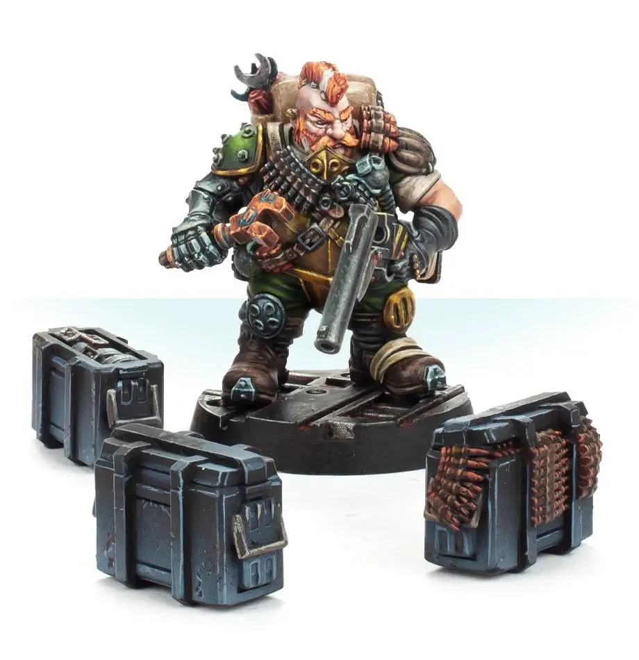

|  M  | WS  | BS  |  S  |  T  |  W  |  I  |  A  | Ld  | Cl  | Wil | Int |
| :-: | :-: | :-: | :-: | :-: | :-: | :-: | :-: | :-: | :-: | :-: | :-: |
| 3"  | 4+  | 3+  |  3  |  4  |  1  | 5+  |  1  | 9+  | 7+  | 6+  | 7+  |

<WeaponStats>

| Weapon        | Rg S | Rg L | Ac S | Ac L |  S  | AP  |  D  | Am  | Traits                                                             |
| :------------ | :--: | :--: | :--: | :--: | :-: | :-: | :-: | :-: | :----------------------------------------------------------------- |
| Shotgun       |
| - solid       |  8"  | 16"  |  +1  |  -   |  4  |  -  |  2  | 4+  | <Tooltip type="traits" content="knockback">Knockback</Tooltip>     |
| - scatter     |  4"  |  8"  |  +2  |  -   |  2  |  -  |  1  | 4+  | <Tooltip type="traits" content="scattershot">Scattershot</Tooltip> |
| Wrench (club) |  -   |  E   |  -   |  -   |  S  | +1  |  2  |  -  | <Tooltip type="traits" content="melee">Melee</Tooltip>             |

</WeaponStats>

**Skills:** [Munitioneer](/docs/gang-fighters-and-their-weaponry/skills/#5-munitioneer).  
**Wargear:** [Frag](/docs/armoury/grenades#frag-grenade) & [krak](/docs/armoury/grenades#krak-grenade) grenades, [respirator](/docs/armoury/personal-equipment#respirator), [light carapace (4+)](/docs/armoury/armour#carapace).  
**Special Rules:** Ammo-jack, Gang Fighter, Surplus Ammo.

Special Rules

**Ammo-jack:** Ragnir is an Ammo-jack Hanger-on, as described on page 39. If hired, he counts as one of the three Ammo-jacks a gang may include.

**Gang Fighter:** Unlike other Hangers-on, Ragnir is always ready for a fight. As long as he is part of the gang roster,
Ragnir is treated just like a regular Ganger for the purposes of selecting a crew. Therefore, he may be chosen or
randomly selected as part of his gang’s starting crew just like any other Ganger.

However, just like any other Hanger-on, Ragnir cannot gain any Experience or Advancements and, should he suffer
a Lasting Injury that would make a change to his Fighter card, he is removed from the gang roster just like any other
Hanger-on.

**Surplus Ammo:** Ragnir will always provide a surplus of ammunition before heading into action. Should he be
deployed as part of a starting crew, Ragnir’s controlling player may deploy D3 ammo caches.

Lore

_Ragnir Gunnstein was born a noble of the Mjolnir Stronghold on its home world of Valskalf and was destined to have his name written in the sagas of his people. On the eve of his one hundredth year, however, Ragnir fell into a fratricidal blood feud with a brother Hearthguard, and was exiled from Mjolnir for all time._

_As an itinerant wanderer, Gunnstein served as a mercenary under all manner of masters, but after many decades he found himself at the Ring of Selene void docks that orbit Necromunda. There he chose the wrong side in a feud between a House Goliath longshore gang and one of the many fanatical Cargo Cults for the rights to handle cargo passing through the vast zero-G freight halls. Fleeing the ensuing chaos, he was very nearly eaten alive by an Ur-Ghul infestation, before being chased off-station by an angry heretek cult whose nascent techno-heresy he inadvertently exposed._

_At that point, Gunnstein decided it was time to retire, and so he smuggled himself into Hive Primus and struck out for the underhive with the intention of setting himself up as a weaponsmith to fund what he hoped would be a very long and quiet old age. Of course, life rarely turns out as intended, and his retirement has proven every bit as eventful as his previous career. Nonetheless, he makes a comfortable living working with a variety of underhive gangs, his skill at maintaining weapons and his keen sense of honour ensuring his services are ever in high demand. Despite his status as a hanger-on, Gunnstein rarely remains at the hideout while his current employers head out to fight, and he is well known for insisting on accompanying his latest friends into battle. Few ever demand he remain at home, for even in his retirement Gunnstein is more than capable of teaching the youngsters a thing or two about fighting._

_Source: The Book of the Outcast_

</FighterCard>

<FighterCard cost="50">

### 0-2 Rogue Docs

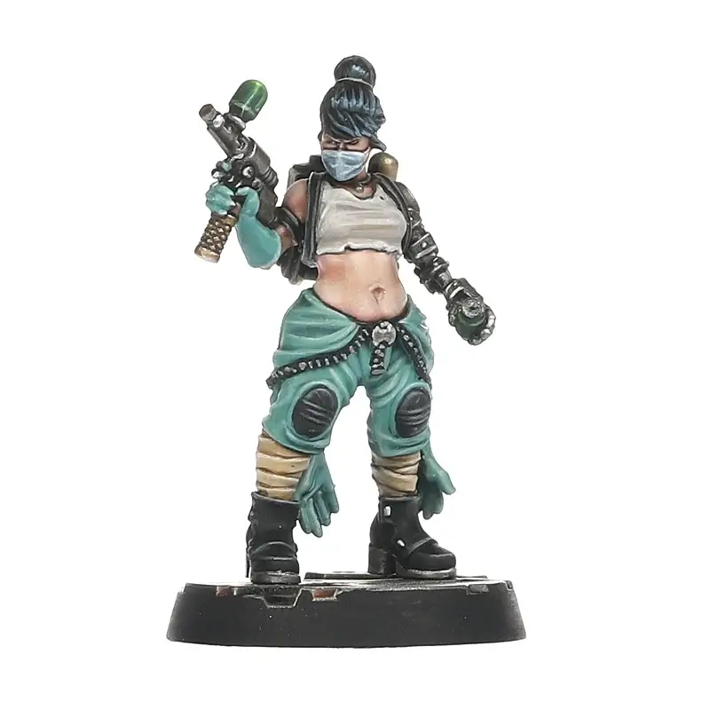

|  M  | WS  | BS  |  S  |  T  |  W  |  I  |  A  | Ld  | Cl  | Wil | Int |
| :-: | :-: | :-: | :-: | :-: | :-: | :-: | :-: | :-: | :-: | :-: | :-: |
| 5"  | 5+  | 5+  |  2  |  3  |  1  | 4+  |  1  | 9+  | 8+  | 7+  | 5+  |

**Skills:** [Medicae](/docs/gang-fighters-and-their-weaponry/skills/#4-medicae).  
**Weapons:** [Laspistol](/docs/armoury/pistols#laspistol) or [stub gun](/docs/armoury/pistols#stub-gun).  
**Wargear:** [Medicae kit](/docs/armoury/personal-equipment#medicae-kit).  
**Special Rules:** Patch Up.

Special Rules

**Patch Up:** If a gang has a Rogue Doc, it can make an additional Medical Escort
action in the post-battle sequence in addition to any other post-battle actions
performed by fighters with the Gang Hierarchy (X) special rule. This visit does not
cost any credits – however, a result of 6 on the table is treated as Stabilised rather
than a Full Recovery, due to the Rogue Doc’s comparatively limited supplies and the
lack of proper medicae technology.

If a gang has more than one Rogue Doc, it can make this additional action once for
each of them.

Equipment

A Rogue Doc may be armed with either a laspistol or stub gun. All Rogue Docs are
equipped with a medicae kit.

Lore

_Medical expertise is much sought-after in the underhive, and most of those who have such training sell their services at a not insignificant price._

_Source: Published in all House of X books_

</FighterCard>

<FighterCard cost="100">

### 0-1 Shivver

**_Escher Only_**

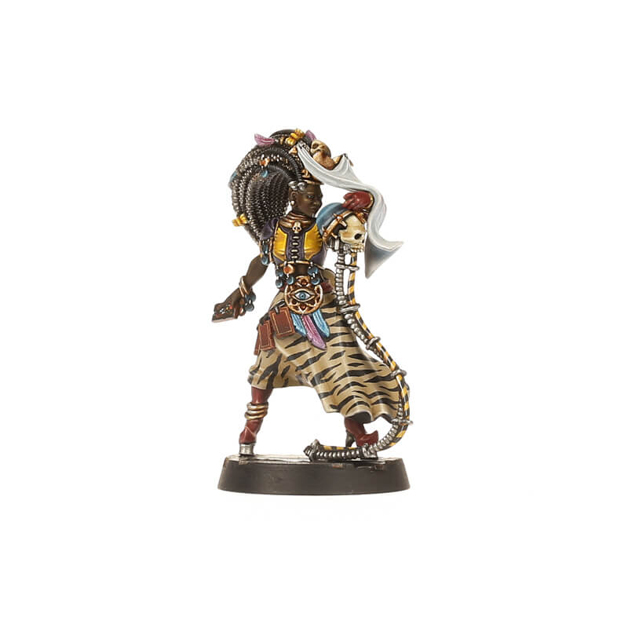

|  M  | WS  | BS  |  S  |  T  |  W  |  I  |  A  | Ld  | Cl  | Wil | Int |
| :-: | :-: | :-: | :-: | :-: | :-: | :-: | :-: | :-: | :-: | :-: | :-: |
| 5"  | 5+  | 5+  |  2  |  3  |  1  | 4+  |  1  | 8+  | 9+  | 5+  | 6+  |

**Skills:** [Fearsome](/docs/gang-fighters-and-their-weaponry/skills/#2-fearsome).  
**Equipment:** A Shivver has no equipment.  
**Special Rules:** Psyniscience.

Special Rules

**Psyniscience:** During the post-battle sequence, a single fighter with the Gang
Hierarchy (X) special rule that is able to perform a post-battle action may perform the
following post-battle action:

**Visit Shivver:** The Shivver looks into the fighter’s future, divining what lies ahead for
them and their sisters. Roll 2D6 and consult the table below:

|    2D6    | Result                                                                                                                                                                                                                                                                                   |
| :-------: | :--------------------------------------------------------------------------------------------------------------------------------------------------------------------------------------------------------------------------------------------------------------------------------------- |
|   **2**   | **Doom!:** The fighter performing this Visit Shivver post-battle action is so disheartened by their reading, they immediately go Into Recovery.                                                                                                                                          |
|  **3-4**  | **The Fates are Unclear:** Choose one of the following characteristics: Leadership, Willpower or Intelligence. For the duration of their next battle, the fighter performing this Visit Shivver post-battle action may re-roll any failed checks made against the chosen characteristic. |
|  **5-7**  | **Favourable Portents:** For the duration of their next battle, the fighter performing this Visit Shivver post-battle action may re-roll any hit rolls of a natural 1 when making ranged attacks, and may ignore the rules for Stray Shots against friendly fighters.                    |
|  **8-9**  | **A Great Victory:** If the gang of the fighter performing this Visit Shivver post-battle action wins their next battle, the fighter performing this Visit Shivver post-battle action earns an extra D6 XP.                                                                              |
| **10-11** | **A Mysterious Stranger:** The gang of the fighter performing this Visit Shivver post-battle action can hire a Bounty Hunter Hired Gun for free during the pre-battle sequence of their next battle. However, at the end of that battle, the Bounty Hunter automatically departs.        |
|  **12**   | **Fortune and Glory:** During the post-battle sequence of their next battle, the fighter performing this Visit Shivver post-battle action may double the amount of Experience they earn, and may double the amount of credits and Reputation their gang earns.                           |

Lore

_Shivvers and Hive Oracles are an important part of Escher society, and often gangs will call upon their services. A Hive Oracle may, if she sees fit, set up residence in a gang’s hideout, often operating out of strange many-hued wagons or tents, filled with the objects and artefacts of their craft. Between battles, a gang leader can visit the Shivver, hoping for a glimpse into their future. Sometimes these glimpses can save the gang from calamities or lead them to great riches, though other times they may be misleading, or even dangerous, resulting in disaster._

_Source: House of Blades_

</FighterCard>

<FighterCard cost="80">

### 0-1 Silberlant Sevos, Whisper Merchant

**_Delaque Only_**

|  M  | WS  | BS  |  S  |  T  |  W  |  I  |  A  | Ld  | Cl  | Wil | Int |
| :-: | :-: | :-: | :-: | :-: | :-: | :-: | :-: | :-: | :-: | :-: | :-: |
| 5"  | 5+  | 4+  |  2  |  3  |  1  | 4+  |  1  | 9+  | 7+  | 8+  | 5+  |

<WeaponStats>

| Weapon   | Rg S | Rg L | Ac S | Ac L |  S  | AP  |  D  | Am  | Traits                                                                                                                     |
| :------- | :--: | :--: | :--: | :--: | :-: | :-: | :-: | :-: | :------------------------------------------------------------------------------------------------------------------------- |
| Stub gun |  6"  | 12"  |  +2  |  -   |  3  |  -  |  1  | 4+  | <Tooltip type="traits" content="plentiful">Plentiful</Tooltip>, <Tooltip type="traits" content="sidearm">Sidearm</Tooltip> |

</WeaponStats>

**Skills:** Cold And Calculating (see below), [Lie Low](/docs/gang-fighters-and-their-weaponry/skills/#5-lie-low).  
**Wargear:** none.  
**Special Rules:** Vox Hack, Whisper Merchant, Useful Lies, Part of the Crew.

Special Rules

**Vox Hack:** Silberlant Sevos can perform the Gather Intelligence (Double) action:

- **Gather Intelligence (Double):** Make an Intelligence test for Silberlant Sevos. If the test is passed your opponent must reveal all gang tactics they have generated, if the test is failed your opponent must reveal a random gang tactic they have generated.

**Whisper Merchant:** Silberlant Sevos is a Whisper Merchant. If hired he counts as the one Whisper Merchant a
gang may include.

**Useful Lies:** During both the pre-battle or post-battle sequence, a gang with a Whisper Merchant may count
the result of a single D6 roll as a 6 when taking the following actions: Determine Scenario, Choose Crews
(when random crew size applies), Receive Rewards (including rewards from Territories), and Seek Rare or Illegal
equipment. This ability can be used only once in each sequence and, each time it is used, make a note on the
gang roster. Once this ability has been used six times, the Whisper Merchant calls in their debt and the gang
must pay the hiring fee again or remove the Whisper Merchant from their gang roster.

**Part of the Crew:** Unlike other Hangers-on, this fighter is always ready for a fight. As long as this fighter is part
of the gang roster, they are treated just like a regular Ganger for the purposes of selecting a crew. Therefore,
this fighter may be chosen or randomly selected as part of their gang’s starting crew just like any other Ganger.
However, just like any other Hanger-on, this fighter cannot gain any Experience or Advancements and, should
they suffer a Lasting Injury that would make a change to their Fighter card, this fighter is removed from the
gang roster just like any other Hanger-on.

Skills

**Cold And Calculating:** Once per round, when making a Cool or Willpower test, this fighter may make the test
against their Intelligence characteristic instead.

Lore

_As much as they would like their enemies to believe otherwise, the Delaque do not have a monopoly on the Necromundan secrets trade. Within Hive Primus, mysterious agents such as Nemo the Faceless move in the shadows dealing in rumours, while Hive Temenos boasts the Conclave of Truth, fallen priests whose sacrament is the lies they spread. Sevos the Infotek has made himself one of this esteemed company. An exile from House Van Saar, Sevos sought to merge his mind with the sacred STC, creating a synaptic-inload interface to extract his consciousness. Unfortunately for Sevos the STC rejected his attempts, leaving him shattered in both body and mind. His former brothers and sisters within the House of Artifice dumped his remains in the depths of the underhive, striking his true name from their records for his breaking of the Three Laws._

_While Sevos’ experiment might have failed to merge his mind with the STC, it did have unexpected results. While he lay in refuse, his body dying and his thoughts unravelling, he discovered he could see the electronic soul of the hive all around him. Not only could he see it, but he could also interact with its systems. Reaching out and taking control of a clade of maintenance servitors, he had the base creatures carry him to safety and bring nourishment for his failing body. Over cycles, he took control of more hive systems, using plundered tech to build himself a suspensor chair to carry his body and protect it from harm._

_It was not long before Sevos discovered that, in addition to manipulating nearby hive systems, he could also steal data secrets as they were transmitted along the electro highways of the towering city. Washing away any trace of his past, Sevos set himself up as a Whisper Merchant, growing rich from his trade in information. When the Great Darkness tore apart the social fabric of Necromunda, Sevos was one of the first to see it coming and took refuge in his underhive hideout, remotely manipulating events from the shadows. Later, when he heard the first whispers of the Prophet and the great pilgrimage that would follow, he saw an opportunity to fulfil his ambition to merge with the Van Saar STC… and take his revenge on the Clan that had left him to die._

_Source: The Aranthian Succession: Ruins of Jardlan_

</FighterCard>

<FighterCard cost="20">

### 0-1 Slopper

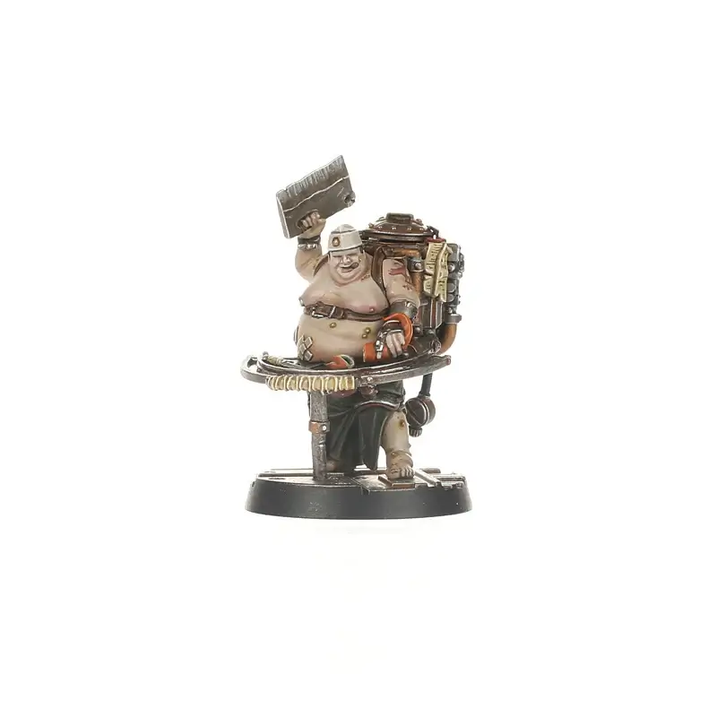

|  M  | WS  | BS  |  S  |  T  |  W  |  I  |  A  | Ld  | Cl  | Wil | Int |
| :-: | :-: | :-: | :-: | :-: | :-: | :-: | :-: | :-: | :-: | :-: | :-: |
| 4"  | 4+  | 4+  |  2  |  3  |  1  | 3+  |  1  | 9+  | 9+  | 5+  | 7+  |

**Weapons:** [Fighting knife](/docs/armoury/close-combat#fighting-knife).  
**Special Rules:** Grub's Up.

Special Rules

**Grub’s Up:** At the end of the Spend Experience step of the pre-battle sequence, roll
a D6 for each of the gang’s fighters that is In Recovery. On a roll of 6, a constant
supply of good food has helped them recover more quickly – the fighter’s In Recovery
box on the gang roster is cleared, and they are now available for this battle.

Equipment

A Slopper is armed with a fighting knife.

Lore

_Food in the underhive rarely holds any joy. Most meals consist of corpse-starch or nutri-slime, supplemented with synth-fats and vitamin shots. As such, anyone who can produce ‘real’ food from the local flora and fauna can expect a steady stream of credits._

_Source: Published in all House of X books_

</FighterCard>

<FighterCard cost="90">

### 0-2 Spyker

_**Delaque Only**_

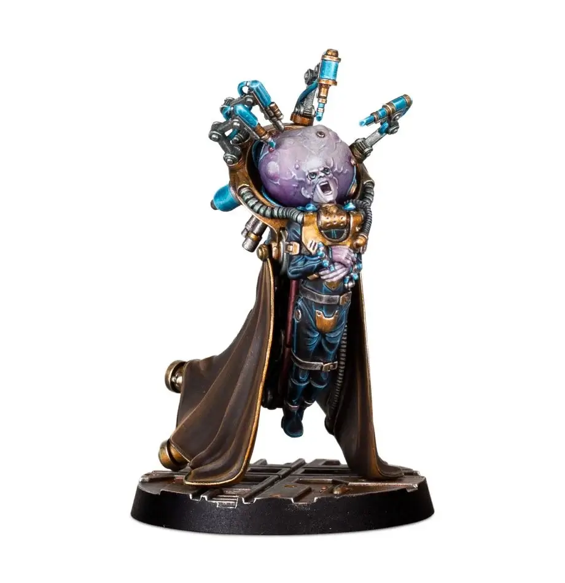

|  M  | WS  | BS  |  S  |  T  |  W  |  I  |  A  | Ld  | Cl  | Wil | Int |
| :-: | :-: | :-: | :-: | :-: | :-: | :-: | :-: | :-: | :-: | :-: | :-: |
| 6"  | 6+  | 6+  |  3  |  3  |  2  | 3+  |  1  | 5+  | 5+  | 4+  | 6+  |

**Skills:** A Spyker has no skills.  
**Equipment:** A Spyker carries no equipment.  
**Special Rules:** Flight, Part of the Crew, Non-sanctioned Psyker.

Special Rules

**Flight:** A Spyker ignores all terrain, may move freely between levels without
restriction, and can never fall. It may not, however, ignore impassable terrain
and may not end its movement with its base overlapping an obstacle or another
fighter’s base.

**Part of the Crew:** Unlike other Hangers-on, this fighter is always ready for a fight.
As long as this fighter is part of the gang roster, they are treated just like a regular
Ganger for the purposes of selecting a crew. Therefore, this fighter may be chosen or
randomly selected as part of their gang’s starting crew just like any other Ganger.

However, just like any other Hanger-on, this fighter cannot gain any Experience or
Advancements and, should they suffer a Lasting Injury that would make a change
to their Fighter card, this fighter is removed from the gang roster just like any other
Hanger-on.

**Non-sanctioned Psyker:** Should a fighter with this special rule be taken Out of
Action, the enemy gang is rewarded a bounty of D3x10 credits at the end of the
battle. Should a fighter with this special rule be captured and sold to the Guilders,
they are worth their full value.

Wyrd Powers

A Spyker is a Psyker and knows the following
Wyrd Powers:

- **Psychic Scream (Basic):** Any enemy fighters within
  3" of this Psyker must immediately pass a Nerve
  test, subtracting 1 from the result. Any enemy fighter
  that fails this test is immediately Broken and runs
  for cover.
- **Psychic Assault (Basic):** Nominate an enemy fighter
  anywhere within 18" of this Psyker. The nominated
  fighter must immediately take a Willpower check. If
  the check is passed, the fighter is Pinned. If the test
  is failed, the fighter loses 1 Wound and is Pinned. If
  this reduces the fighter to 0 Wounds, roll one Injury
  dice and apply the result.
- **Force Blast (Basic):** Any enemy fighters within 3" of
  this Psyker are immediately pushed D3+1" directly
  away. If this movement would push a fighter from a
  platform or into a pitfall, stop at the edge and take
  an Initiative test for them. If the test is passed, they
  are placed prone at the edge. If the test is failed,
  they will fall. If this movement is interrupted by
  a wall, or other impassable terrain, the fighter is
  immediately Pinned and takes a hit with a Strength
  equal to the number of inches rolled for the
  push distance.

Optional Rules: The Confluence of Shadows

:::note Designer's Commentary

Presented below are special rules that will allow you to recreate the events described in Sump City Sinking. If the Arbitrator wishes, these rules can be used by any Delaque gang during a campaign.

:::

During the Choose Crews step of the Pre-battle Sequence, any Spykers may choose to use the following wyrd powers instead of those presented in _Necromunda: House of Shadow_ (above).

**Crush (Basic):** Target a single enemy fighter or obstacle that is both within 12" and line of sight of this fighter and make a hit roll, using this fighter's BS. If a hit is scored, an obstacle is destroyed and removed from the battlefield, while an enemy fighter must make a save roll. If this save roll is successful, roll an injury dice and immediately apply the result against the fighter.

**Witchfire (Double):** All enemy models within 3" of this fighter suffer a S5, D2, AP-1 hit as if from a weapon with the Blaze trait.

**Mind Maze (Basic, Continuous):** Target a single Standing and Active enemy fighter that is both within 6" and line of sight of this fighter. The target must make an initiative test, if the test is failed they change their status to Prone and Pinned. Additionally, while this power is maintained, each time the target activates they must make an intelligence test, if the test is failed then any ranged or melee attack they perform during their activation suffers a -1 penalty to kit.

One additonal enemy fighter may be chosen as the target of this power for each friendly Delaque fighter within 3" of the Wyrd that is Standing and Active.

_Source: Apocrypha Necromunda: Sump City Sinking_

Lore

_Dosed up with concentrated Ghast solutions, an individual with a glimmer of psychic potential may be subjected to a forced ‘evolution’ by the Delaque. It is a process that can take months or years, the prospective Spyker strapped into a medicae harness as their body atrophies and their cranium expands. Those who don’t suffer catastrophic biological collapse or spontaneous (and fatal) cerebellum expansion, are conditioned by House Delaque to serve gang leaders._

_Source: House of Shadow_

</FighterCard>

<FighterCard cost="80">

### 0-1 Tech Merchant

**_Van Saar: 40 credits_**

|  M  | WS  | BS  |  S  |  T  |  W  |  I  |  A  | Ld  | Cl  | Wil | Int |
| :-: | :-: | :-: | :-: | :-: | :-: | :-: | :-: | :-: | :-: | :-: | :-: |
| 5"  | 5+  | 4+  |  3  |  3  |  1  | 4+  |  1  | 8+  | 8+  | 8+  | 6+  |

**Skills:** [Munitioneer](/docs/gang-fighters-and-their-weaponry/skills/#5-munitioneer).  
**Equipment:** A Tech-merchant may be armed with either a master-crafted laspistol or a mastercrafted
las sub-carbine.  
**Special Rules:** Techno-Baubles, Friends in the Trade.

Special Rules

**Techno-baubles:** If a gang has a Tech-merchant, it may reduce the Rare and/or
Illegal value of any item in the Trading Post or the Black Market by 2, to a minimum
of 7+. If this reduction would cause the Rare or Illegal value to fall below 7+, the item
instead becomes Common.

**Friends in the Trade:** During every post-battle sequence, the cost of one item found
in the Trading Post or Black Market may be reduced by D3x10 credits, to a minimum
of 20 credits.

Lore

_Throughout the underhive there are men and women who deal exclusively in tech. Often they set up tech bazaars in towns and holesteads, peddling their wares while purporting to know exactly what secret functions they hold – and some aren’t even lying! Some gangs will hire on a Tech-merchant so as to have better access to the tech bazaar or to help them sell archaeotech finds._

_Source: House of Artifice_

</FighterCard>

<FighterCard cost="50">

### 0-3 Underhive Traders

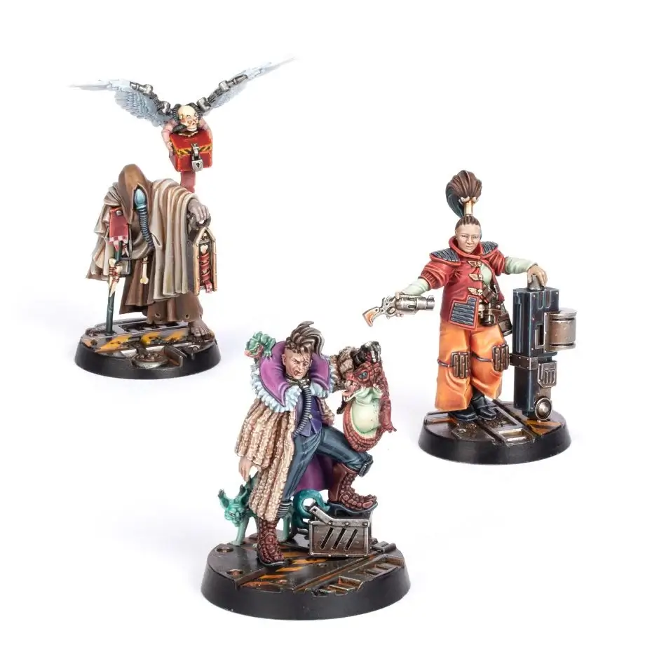

|  M  | WS  | BS  |  S  |  T  |  W  |  I  |  A  | Ld  | Cl  | Wil | Int |
| :-: | :-: | :-: | :-: | :-: | :-: | :-: | :-: | :-: | :-: | :-: | :-: |
| 5"  | 4+  | 4+  |  3  |  3  |  1  | 4+  |  1  | 8+  | 7+  | 7+  | 7+  |

**Skills:** [Lie Low](/docs/gang-fighters-and-their-weaponry/skills/#5-lie-low).  
**Special Rules:** The Finest Merchandise, Specialist Product.

Special Rules

**The Finest Merchandise:** Having an Underhive
Trader around means the gang has access to all
manner of goods. More importantly, they can use
the Trader’s connections to find rare goods. An
Underhive Trader can make the Trade action
during the post-battle sequence just as if they
were a Leader.

**Specialist Product:** Most Underhive Traders have their own specialities and when
hired on to the gang players must choose one of the following Trader types, gaining the
additional benefits listed here:

- **Relicmonger:** A purveyor of religious trinkets, a Relicmonger can adorn a gang’s
  fighters with blessed tokens – some of which might, very occasionally, actually do
  something. Once per battle, when a fighter with blessed tokens is Seriously Injured
  or taken Out of Action, roll a D6. On a result of 6, the fighter can ignore the result.
- **Beastwrangler:** A procurer and tamer of Exotic Beasts, a Beastwrangler can train
  a gang’s exotic pets while they rest in the gang’s hideout. At the start of each
  campaign week, add 1 XP to each Exotic Beast in the gang.
- **Gun-smyth:** Able to procure the best guns in the underhive, Gun-smyths are highly
  valued by gangs looking to gain an edge over their opponents. A gang that has a
  Gun-smyth can upgrade one ranged weapon purchased from the Trading Post or
  Black Market to have the Mater-crafted trait at no extra cost. Each Gun-smyth can
  do this once per post-battle sequence.
- **Connected Trader:** A Connected Trader has spent a lifetime building up a web of
  contacts they can use to move items. If a gang has a Connected Trader then once
  per post-battle sequence for each Connected Trader they control, they may double
  the credits they gain for selling items in their Stash. In addition, they may freely
  trade credits and items in their Stash with other gangs participating in the same
  campaign; note that both gangs must agree in order for a trade to happen.

Equipment

- A Relicmonger is armed with a maul (club).
- A Beastwrangler is armed with a laspistol.
- A Gun-smyth is armed with a bolt pistol, stub pistol and shotgun.
- A Connected Trader is armed with a master-crafted lasgun.

Skills

- A Relicmonger has the Fearsome skill.
- A Beastwrangler has the Overseer skill.
- A Gun-smyth has the Marksman skill.
- A Connected Trader has the Savvy Trader skill.

Lore

_Necromunda is a world built upon commerce. From the lowliest clanner to the lords of the spire, goods are bought, sold or traded constantly. A canny trader can make their fortune if they know where to sell their wares, and the underhive is often a rich source of customers – whether it is for cheap ammo, exotic pets or even religious artefacts._

_Source: Book of the Outcast_

</FighterCard>

<FighterCard cost="60">

### 0-1 Whisper Merchant

**_Delaque: 30 credits_**

|  M  | WS  | BS  |  S  |  T  |  W  |  I  |  A  | Ld  | Cl  | Wil | Int |
| :-: | :-: | :-: | :-: | :-: | :-: | :-: | :-: | :-: | :-: | :-: | :-: |
| 5"  | 5+  | 4+  |  3  |  3  |  1  | 4+  |  1  | 9+  | 7+  | 8+  | 5+  |

**Skills:** [Lie Low](/docs/gang-fighters-and-their-weaponry/skills/#5-lie-low).  
**Weapons:** Stub Gun.  
**Special Rules:** Useful Lies.

Special Rules

**Useful Lies:** During both the pre-battle or post-battle sequence, a gang with a
Whisper Merchant may count the result of a single D6 roll as a 6 when taking the
following actions: Determine Scenario, Choose Crews (when random crew size
applies), Receive Rewards (including rewards from Territories), and Seek Rare or
Illegal equipment. This ability can be used only once in each sequence and, each
time it is used, make a note on the gang roster. Once this ability has been used six
times, the Whisper Merchant calls in their debt and the gang must pay the hiring fee
again or remove the Whisper Merchant from their gang roster.

Lore

_Rumours aplenty can be found in the Hall of Lies in Hive Primus though, for the richest source of information, a gang should enlist its own Whisper Merchant. Professional rumour-mongers, these shadowy individuals deal in all kinds of truths, gathering juicy information on rivals but also more esoteric pieces of intel that might benefit the gang._

_Source: House of Shadow_

</FighterCard>

## Outlaw Hangers-on

<FighterCard cost="30">

### 0-1 Agitator

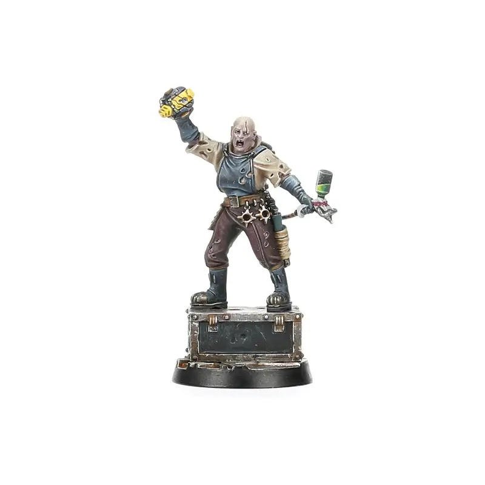

|  M  | WS  | BS  |  S  |  T  |  W  |  I  |  A  | Ld  | Cl  | Wil | Int |
| :-: | :-: | :-: | :-: | :-: | :-: | :-: | :-: | :-: | :-: | :-: | :-: |
| 5"  | 4+  | 4+  |  3  |  3  |  1  | 4+  |  1  | 6+  | 7+  | 7+  | 8+  |

**Skills:** [Inspirational](/docs/gang-fighters-and-their-weaponry/skills/#2-inspirational).  
**Weapons:** Laspistol or Stub Gun.  
**Special Rules:** Agitator, Outlaw.

Special Rules

A gang with an Agitator can make bold claims about their prowess and
righteousness over their enemies, though such boasts are not without their
dangers. In the pre-battle sequence a gang can declare they are using their
Agitator to spread word of their impending victory. If they win the game then
they gain an extra D3 Reputation. If they lose the game, they must reduce their
Reputation by an additional 1.

An Agitator also improves recruitment for the gang. When the gang rolls to see if
they get a free fighter from a Territory, such as those provided by a Settlement, they
may roll twice and choose the result they want.

**Outlaw:** An Agitator can only be hired by Outlaw gangs.

Optional Rules: War of Words

:::note Designer's Commentary

Presented below are special rules that will allow you to recreate the events described in Twins of Two
Tunnels. If the Arbitrator wishes, these rules can be used during a campaign.

:::

**Rile ‘em Up (Basic):** The Agitator fires up their allies, extolling the glory that awaits them. All friendly fighters
within 12" of the Agitator may add 1" to their Movement characteristic until the end of this round.

_Source: Apocrypha Necromunda: Twins of the Two Tunnels_

Lore

_Cults and criminals often use propaganda to spread their message throughout the hive. Specially trained individuals give speeches, paint slogans on walls and spread subversive rumours among the citizenry. These propagandists might be devout followers of the cult, but can equally be skilled orators and liars working for their own selfish ends._

_Source: Book of Ruin_

</FighterCard>

<FighterCard cost="20">

### 0-2 Arthromite Herder

**_Ash Wastes Nomads only_**

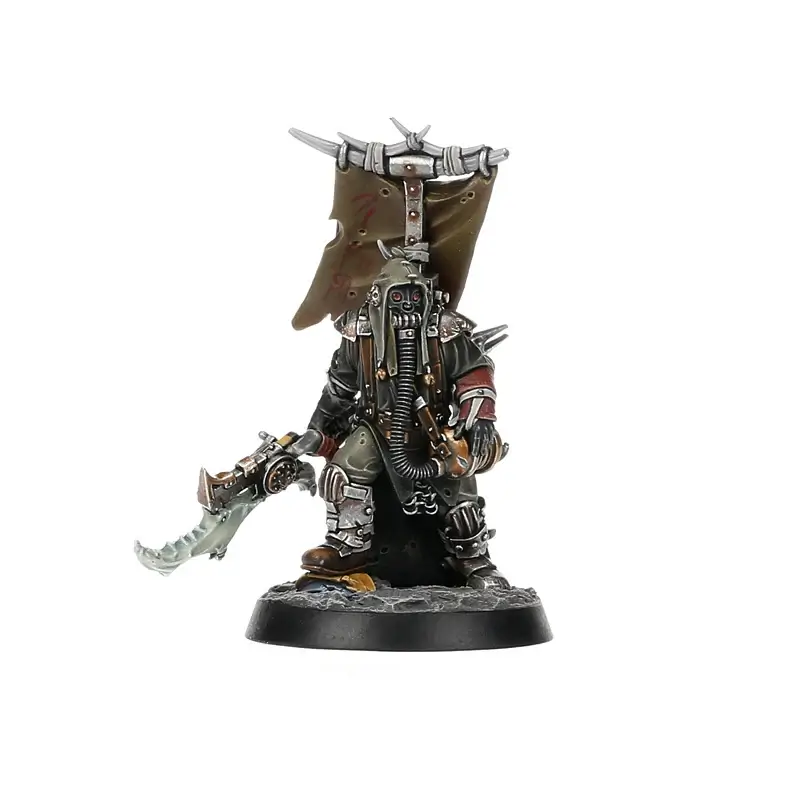

|  M  | WS  | BS  |  S  |  T  |  W  |  I  |  A  | Ld  | Cl  | Wil | Int |
| :-: | :-: | :-: | :-: | :-: | :-: | :-: | :-: | :-: | :-: | :-: | :-: |
| 5"  | 3+  | 4+  |  3  |  3  |  1  | 4+  |  1  | 7+  | 5+  | 6+  | 7+  |

<WeaponStats>

| Weapon          | Rg S | Rg L | Ac S | Ac L |  S  | AP  |  D  | Am  | Traits                                                 |
| :-------------- | :--: | :--: | :--: | :--: | :-: | :-: | :-: | :-: | :----------------------------------------------------- |
| Hunters polearm |  -   |  E   |  -   |  -   | S+1 | -1  |  1  |  -  | <Tooltip type="traits" content="melee">Melee</Tooltip> |

</WeaponStats>

**Skills:** Born to the Wastes.  
**Wargear:** [Mesh armour](/docs/armoury/armour#mesh-armour), Ash Cloak.  
**Special Rules:** Arthromite Whisperer, Training Program.

Special Rules

**Arthromite Whisperer:** During the Post-battle Sequence a Nomad Arthromite
Herder may tend to the wounds of an Arthromite Duneskuttler. If the Arthromite
Duneskuttler is Critically Injured, it goes into Recovery; otherwise roll a D6, on a 3+
the Arthromite Duneskuttler heals any lasting injuries it has and goes into Recovery.
This cannot be performed in the same Post-battle Sequence as the Training
Program ability.

**Training Program:** During the Post-battle Sequence, a Nomad Arthromite Herder
may attempt to train an Arthromite Duneskuttler; make an Intelligence test for the
Nomad Arthromite Herder, if successful, the Arthromite Duneskuttler earns D3
XP. This cannot be performed in the same Post-battle Sequence as the Arthromite
Whisperer ability.

Lore

_The Ash Waste Nomads have a strange affinity for the creatures of the wasteland, especially the Dustback Helamites that they ride into battle. More insidious than these surface-running creatures are the massive insects that live beneath the ground. Known commonly as Arthromites, these huge creatures often lie in wait for unwitting prey, burrowing under the surface of ash dunes and leaping to terrible life when a traveller or even a vehicle moves over it. The creature then overpowers their catch, tearing and biting before ultimately dragging it beneath the sand or ash._

_Even on their own an Arthromite can be more than a match for a human, and Nomad Arthromite herders will train these creatures to do their bidding. Clad in the discarded exoskeletons of their charges, an Arthromite herder is often accompanied by an Arthromite Duneskuttler – sending them charging toward their foes with little more than a gesture of their hunters polearm, the Duneskuttlers falling upon the hapless target seconds before the herder themself joins the fray. Though Duneskuttlers are by far from the most common insects to be found in the command of a herder, there are rumours of even larger more terrible beasts that they can control – with herders often travelling deep into the wastes and returning with horrors seldom seen in civilised lands._

_Source: Book of the Outlands_

</FighterCard>

<FighterCard cost="20">

### 0-1 Cadaver Merchant

|  M  | WS  | BS  |  S  |  T  |  W  |  I  |  A  | Ld  | Cl  | Wil | Int |
| :-: | :-: | :-: | :-: | :-: | :-: | :-: | :-: | :-: | :-: | :-: | :-: |
| 4"  | 4+  | 4+  |  3  |  3  |  1  | 4+  |  1  | 8+  | 6+  | 7+  | 8+  |

**Skills:** [Fearsome](/docs/gang-fighters-and-their-weaponry/skills/#2-fearsome).  
**Weapons:** Chainaxe.  
**Special Rules:** Cadaver Merchant, Outlaw.

Special Rules

A gang with a Cadaver Merchant can sell their dead for profit. If a member of the
gang dies (not including Hired Guns, Hangers-on, Brutes or Exotic Beasts), either
by rolling a Memorable Death result on the Lasting Injury table, or Critical Injury
that is not healed by the doc, then they can be sold to the Cadaver Merchant for
D3x10 credits.

A Cadaver Merchant can also acquire bodies for the gang. In an Uprising
Campaign a gang with a Cadaver Merchant gains an additional portion of Meat in
the post-battle sequence.

**Outlaw:** A Cadaver Merchant can only be hired by Outlaw gangs

Lore

By Imperial writ the Corpse Guild lays claim to the dead of the hives. This ancient law does not, however, stop enterprising individuals from dealing in corpses, selling them on to rogue docs or other more nefarious individuals in need of human remains. And sometimes the bodies aren't quite dead yet…

_Source: Book of Ruin_

</FighterCard>

<FighterCard cost="30">

### 0-1 Flagellator

**_Cawdor only_**

|  M  | WS  | BS  |  S  |  T  |  W  |  I  |  A  | Ld  | Cl  | Wil | Int |
| :-: | :-: | :-: | :-: | :-: | :-: | :-: | :-: | :-: | :-: | :-: | :-: |
| 4"  | 4+  | 6+  |  3  |  3  |  1  | 5+  |  1  | 9+  | 6+  | 7+  | 9+  |

<WeaponStats>

| Weapon | Rg S | Rg L | Ac S | Ac L |  S  | AP  |  D  | Am  | Traits                                                                                                               |
| :----- | :--: | :--: | :--: | :--: | :-: | :-: | :-: | :-: | :------------------------------------------------------------------------------------------------------------------- |
| Flail  |  -   |  E   |  -   |  +1  | S+1 |  -  |  1  |  -  | <Tooltip type="traits" content="entangle">Entangle</Tooltip>, <Tooltip type="traits" content="melee">Melee</Tooltip> |

</WeaponStats>

**Skills:** [Fearsome](/docs/gang-fighters-and-their-weaponry/skills/#2-fearsome).  
**Special Rules:** Purification through Pain, Outlaw.

Special Rules

**Purification through Pain:** During the pre-battle sequence, after setting up the
battlefield but before choosing crews, a gang with a Flagellator may attempt to
bring one of its fighters out of Recovery. The chosen fighter immediately makes a
Toughness check. If this check is passed, the fighter leaves Recovery and may be
included in the crew for this battle. However, this fighter begins the battle with
one Flesh Wound.

**Outlaw:** A Flagellator can only be hired by Outlaw gangs.

Lore

_Purification through pain is a common belief of the Redemption, and gangs sometimes employ specialist flagellators to motivate and ‘heal’ their members. A wounded ganger, or one suffering from some underhive malady, may well forget their injuries and get back in the fight if staying in the gang’s hideout means regular whippings._

_Source: House of Faith_

</FighterCard>

<FighterCard cost="40">

### 0-1 Heretek

|  M  | WS  | BS  |  S  |  T  |  W  |  I  |  A  | Ld  | Cl  | Wil | Int |
| :-: | :-: | :-: | :-: | :-: | :-: | :-: | :-: | :-: | :-: | :-: | :-: |
| 5"  | 5+  | 4+  |  3  |  3  |  1  | 4+  |  1  | 9+  | 7+  | 7+  | 5+  |

**Skills:** [Munitioneer](/docs/gang-fighters-and-their-weaponry/skills/#5-munitioneer).  
**Weapons:** Grav gun or plasma gun.  
**Wargear:** [Mesh armour](/docs/armoury/armour#mesh-armour).  
**Special Rules:** Heretek, Outlaw.

Special Rules

If a gang includes a Heretek then it can have them enhance one of the gang’s
weapons before a game. At the end of Step 5 of the pre-battle sequence, select one
fighter from your crew. One of the weapons carried by the fighter gains either the
Blaze, Concussion, Power, Rad-phage or Shock trait, as chosen by the controlling
player. The weapon also gains the Unstable trait, or the Reckless trait if it has the
Melee trait as well. These traits last until the end of the battle.

**Outlaw:** A Heretek can only be hired by Outlaw gangs.

Lore

_Hereteks are reckless inventors who subvert the sacred teachings of the Adeptus Mechanicus. They tinker with weapons and wargear, often building their own devices using combinations of Imperial, xenos and archaeo-technologies. The results are often as dangerous to the wielder as they are to their enemies._

_Source: Book of Ruin_

</FighterCard>

<FighterCard cost="70">

### 0-1 Hive Preacher

**_Cawdor only_**

|  M  | WS  | BS  |  S  |  T  |  W  |  I  |  A  | Ld  | Cl  | Wil | Int |
| :-: | :-: | :-: | :-: | :-: | :-: | :-: | :-: | :-: | :-: | :-: | :-: |
| 4"  | 4+  | 6+  |  3  |  3  |  1  | 4+  |  1  | 5+  | 6+  | 5+  | 8+  |

<WeaponStats>

| Weapon            | Rg S | Rg L | Ac S | Ac L |  S  | AP  |  D  | Am  | Traits                                                                                                                                                                               |
| :---------------- | :--: | :--: | :--: | :--: | :-: | :-: | :-: | :-: | :----------------------------------------------------------------------------------------------------------------------------------------------------------------------------------- |
| Two-handed hammer |  -   |  E   |  -   |  -1  | S+1 |  -  |  3  |  -  | <Tooltip type="traits" content="knockback">Knockback</Tooltip>, <Tooltip type="traits" content="melee">Melee</Tooltip>, <Tooltip type="traits" content="unwieldy">Unwieldy</Tooltip> |

</WeaponStats>

**Skills:** [Inspirational](/docs/gang-fighters-and-their-weaponry/skills/#2-inspirational).  
**Special Rules:** Sermon, Part of the Crew, Outlaw.

Special Rules

**Sermon:** A gang with a Hive Preacher may roll a D6 at the end of any pre-battle
sequence and add this many Faith dice (see page 97) to their Faith dice pool. In
addition, if a Hive Preacher is on the battlefield and not Seriously Injured, then they
count as three fighters when determining the number of Cawdor fighters generating
Faith dice in the End phase.

**Part of the Crew:** Unlike other Hangers-on, this fighter is always ready for a fight.
As long as this fighter is part of the gang roster, they are treated just like a regular
Ganger for the purposes of selecting a crew. Therefore, this fighter may be chosen or
randomly selected as part of their gang’s starting crew just like any other Ganger.
However, just like any other Hanger-on, this fighter cannot gain any Experience or
Advancements and, should they suffer a Lasting Injury that would make a change
to their Fighter card, this fighter is removed from the gang roster just like any other
Hanger-on.

**Outlaw:** A Hive Preacher can only be hired by Outlaw gangs.

Lore

_Underhive settlements are filled with hivers claiming to be preachers and priests of the Imperial Creed, and the Redemption is no different. A Cawdor gang might attract one of these maniacal dome preachers, blessing them before battle, or simply wandering around their hideout spouting religious dogma and getting everyone riled up._

</FighterCard>

<FighterCard cost="25">

### 0-1 Proxy

|  M  | WS  | BS  |  S  |  T  |  W  |  I  |  A  | Ld  | Cl  | Wil | Int |
| :-: | :-: | :-: | :-: | :-: | :-: | :-: | :-: | :-: | :-: | :-: | :-: |
| 5"  | 5+  | 5+  |  3  |  3  |  1  | 4+  |  1  | 7+  | 8+  | 7+  | 6+  |

**Skills:** [Evade](/docs/gang-fighters-and-their-weaponry/skills/#3-evade).  
**Weapons:** Laspistol or Stub Gun.  
**Special Rules:** Proxy, Outlaw.

Special Rules

An Outlaw gang with a Proxy can sell captives to the Guilders and may use
the Trading Post. However, each time they do so they must roll a D6, and on
a result of 5+ the action fails. The gang can also attempt to make an Alliance
with the Merchants Guild or the Imperial House. If it does, before the Alliance
is formed roll a D6. On a 6, the Alliance fails and the Proxy is removed from the
gang’s roster, otherwise the Alliance is formed as normal. If an Outlaw gang
is ever required to Test the Alliance with the Merchants Guild or the Imperial
House then the Alliance is automatically ended without the need to roll.

**Outlaw:** A Proxy can only be hired by Outlaw gangs.

Lore

_Outlaws and cults are hunted gangs within the underhive, and cannot deal openly with the Guilders or the Imperial House for fear of retribution. Proxies are otherwise respectable underhivers with connections to nefarious organisations, and will willingly sell captives, buy goods or beguile allies in the name of an outlaw or cult gang._

_Source: The Book of Judgement_

</FighterCard>

<FighterCard cost="40">

### 0-1 Scabber

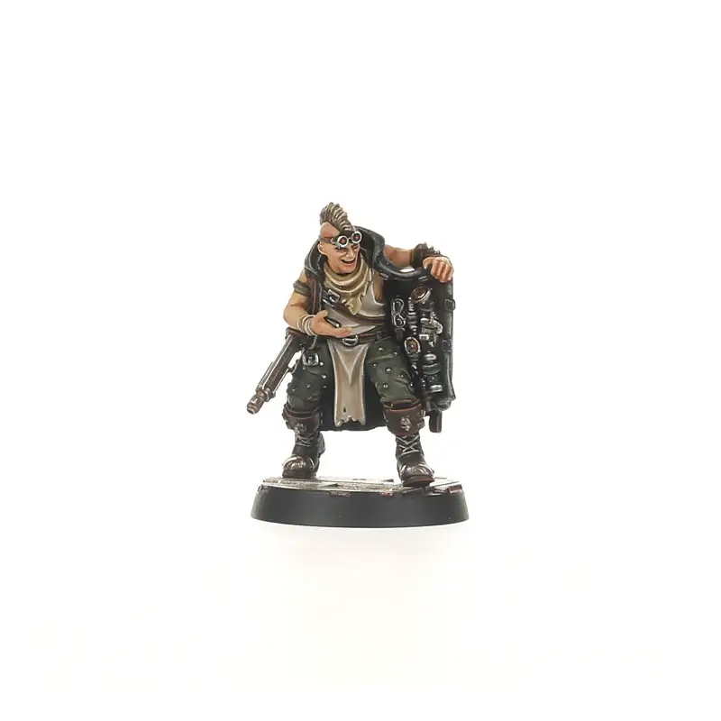

|  M  | WS  | BS  |  S  |  T  |  W  |  I  |  A  | Ld  | Cl  | Wil | Int |
| :-: | :-: | :-: | :-: | :-: | :-: | :-: | :-: | :-: | :-: | :-: | :-: |
| 4"  | 5+  | 4+  |  3  |  3  |  1  | 4+  |  1  | 7+  | 8+  | 8+  | 6+  |

**Skills:** [Savvy Trader](/docs/gang-fighters-and-their-weaponry/skills/#6-savvy-trader).  
**Weapons:** Shotgun (solid & scatter).  
**Special Rules:** Scabber, Outlaw.

Special Rules

When a gang with a Scabber sells a piece of Illegal equipment in the postbattle
sequence, it gains the item’s value less D3x10 credits (to a minimum of
5). A Scabber, provided they are not in Recovery, can make a Trade action in
the post-battle sequence provided the gang is visiting the Black Market.

**Outlaw:** A Scabber can only be hired by Outlaw gangs.

Lore

_Even the roughest backwater settlement is wary of dealing in illegal goods lest the wrath of the Guilders fall upon it. This is where Scabbers come in; men and women willing to deal in anything that might turn a profit. Scabbers are also useful when it comes to procuring illegal equipment, as they often have connections with the Cold Trade._

_Source: The Book of Judgement_

</FighterCard>
