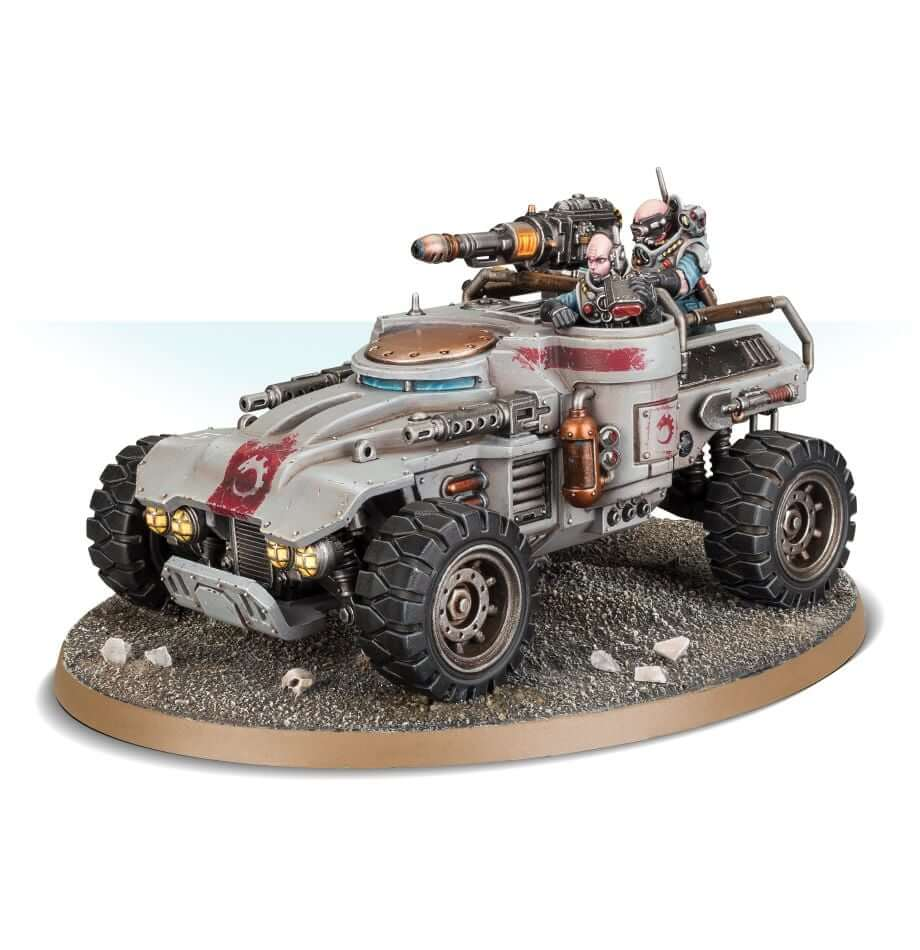

# Ridgerunner

<VehicleCard cost="95">

### Ridgerunner

| M   | Front | Side | Rear | HP  | Hnd | Sv  |
| --- | ----- | ---- | ---- | --- | --- | --- |
| 7”  | 5     | 4    | 4    | 3   | 7+  | 5+  |

**Locomotion:** Wheeled.  
**Weapon Hardpoints:** 2. Hull: Crew Operated, Front Arc; Rear Platform: Passeger Operated, Front Arc.  
**Existing Upgrades:** Transport bed.

#### Upgrade Slots

| Body | Drive | Engine |
| :--: | :---: | :----: |
|  2   |   3   |   2    |

#### Transport Bed

Fighters and loot in this dedicated area don't fall off if
the vehicle moves, Swerves or Jack-knifes (Loss of Control).

</VehicleCard>

## Equipment

This page lists the _starting_ equipment available for vehicles. More equipment can be purchased during a campaign (see [Trading Post: Vehicles](/docs/armoury/vehicle-upgrades)).

### Weapons

| Weapons                        | Credits |
| ------------------------------ | ------- |
| **Heavy Weapons**              |
| Twin-linked                    | 145     |
| Mining laser                   | 125     |
| Missile launcher (frag & krak) | 165     |
| Mortar                         | 115     |

### Vehicle Upgrades

| Vehicle Upgrades       | Credits |
| ---------------------- | ------- |
| **Body Upgrades**      |
| Crash cage             | 15      |
| Escape hatches         | 10      |
| Speed fins             | 10      |
| Transport bed          | inc.    |
| **Drive Upgrades**     |
| All-wheel steering     | 10      |
| Emergency brake        | 10      |
| Redundant drive system | 15      |
| Tyre claws             | 10      |
| **Engine Upgrades**    |
| Engine shell           | 15      |
| Gas promethium engine  | 25      |
| Nitro burner           | 15      |

### Wargear

| Item            | Credits |
| --------------- | ------- |
| Flare launchers | 10      |
| Headlights      | 15      |
| Kill switch     | 15      |
