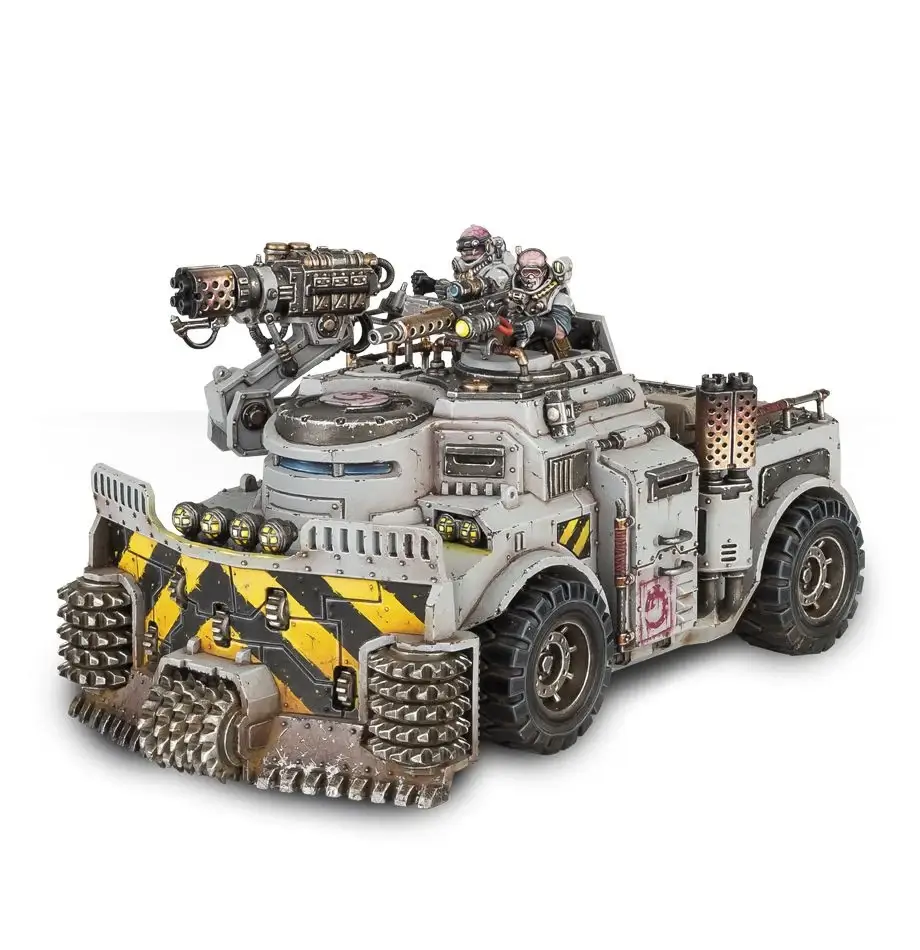

# Rockgrinder

<VehicleCard cost="145">

### Rockgrinder

| M   | Front | Side | Rear | HP  | Hnd | Sv  |
| --- | ----- | ---- | ---- | --- | --- | --- |
| 5”  | 7     | 7    | 6    | 4   | 8+  | 4+  |

**Locomotion:** Wheeled.  
**Weapon Hardpoints:** 2. Hull: Crew Operated, Front & Left Arc; Rear Platform: Passenger Operated, Front & Right Arc.  
**Existing Upgrades:** Transport bed.

#### Upgrade Slots

| Body | Drive | Engine |
| :--: | :---: | :----: |
|  3   |   3   |   3    |

#### Transport Bed

Fighters and loot in this dedicated area don't fall off if
the vehicle moves, Swerves or Jack-knifes (Loss of Control).

</VehicleCard>

## Equipment

This page lists the _starting_ equipment available for vehicles. More equipment can be purchased during a campaign (see [Trading Post: Vehicles](/docs/armoury/vehicle-upgrades)).

### Weapons

| Weapons                  | Rock |
| ------------------------ | ---- |
| **Heavy Weapons**        |      |
| Autocannon (twin-linked) | 185  |
| Heavy flamer             | 195  |
| Heavy stubber            | 130  |
| Mining laser             | 125  |
| Seismic cannon           | 140  |

### Vehicle Upgrades

| Vehicle Upgrades       | Rock |
| ---------------------- | ---- |
| **Body Upgrades**      |      |
| Ablative armour        | 15   |
| Escape hatches         | 10   |
| Rockgrinder ram        | 30   |
| Transport bed          | inc. |
| Weapons stash          | 20   |
| **Drive Upgrades**     |      |
| Emergency brake        | 10   |
| Pneumatic radials      | 30   |
| Redundant drive system | 15   |
| Tyre claws             | 10   |
| **Engine Upgrades**    |      |
| Easy turnover          | 5    |
| Engine shell           | 15   |
| Nitro burner           | 15   |
| Smoke vents            | 25   |

### Wargear

| Item            | Credits |
| --------------- | ------- |
| Flare launchers | 10      |
| Headlights      | 15      |
| Smoke launchers | 20      |
