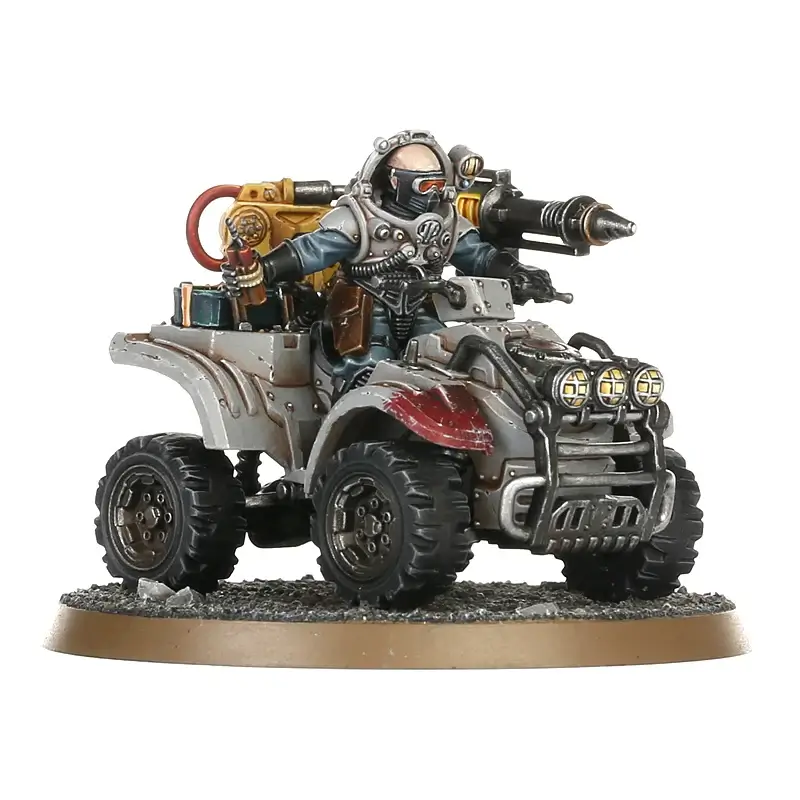

# Wolfquad

<VehicleCard cost="70">

### Wolfquad

| M   | Front | Side | Rear | HP  | Hnd | Sv  |
| --- | ----- | ---- | ---- | --- | --- | --- |
| 8”  | 3     | 3    | 3    | 2   | 5+  | 5+  |

**Locomotion:** Wheeled.

**Weapon Hardpoints:** 1. Crew Operated, Front & Left Arc.

#### Upgrade Slots

| Body | Drive | Engine |
| :--: | :---: | :----: |
|  1   |   2   |   2    |

#### Agile

Can make 1 extra turn (up to 90°) when moving
(before, during or after).

</VehicleCard>

## Equipment

This page lists the _starting_ equipment available for vehicles. More equipment can be purchased during a campaign (see [Trading Post: Vehicles](/docs/armoury/vehicle-upgrades)).

### Weapons

| Weapons           | Credits |
| ----------------- | ------- |
| **Heavy Weapons** |
| Heavy flamer      | 195     |
| Heavy stubber     | 130     |
| Mining laser      | 125     |

### Vehicle Upgrades

| Vehicle Upgrades    | Credits |
| ------------------- | ------- |
| **Body Upgrades**   |
| Reinforced armour   | 20      |
| Speed fins          | 10      |
| **Drive Upgrades**  |
| All-wheel steering  | 10      |
| Emergency brake     | 10      |
| **Engine Upgrades** |
| Easy turnover       | 5       |
| Nitro burner        | 15      |
| Smoke vents         | 25      |

### Wargear

| Item            | Credits |
| --------------- | ------- |
| Flare launchers | 10      |
| Headlights      | 15      |
