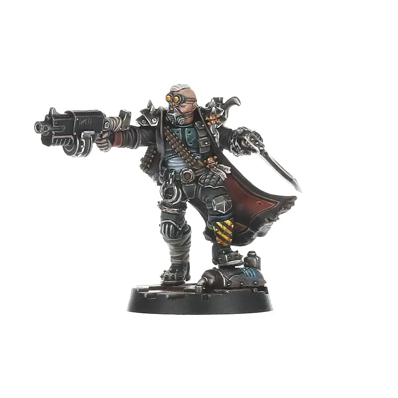

****# Bounty Hunters

All Bounty Hunters (unnamed and Dramatis Personae) have the following special rules:

#### Dead, Not Alive

Any gang, Outlaw or otherwise, that employs a Bounty Hunter may claim a reward from the authorities for troublesome enemies they bring in dead. During the post-battle sequence, when an opponent deletes a dead fighter from their roster, the gang that hired the Bounty Hunter immediately claims half of that fighter’s value, rounded up to the nearest 5 credits, as a reward.

#### Claiming Bounties

Any gang, Outlaw or otherwise, that employs a Bounty Hunter may claim a reward from the authorities for enemy fighters they help to Capture. If during the Wrap-up the recruiting gang captures an enemy fighter, roll a D6 in the
Receive Rewards step of the post-battle sequence. On the roll of a 3 or higher, the Bounty Hunter recognises the Captive as a particularly wanted individual. The gang is given their cut of the reward for keeping this dangerous miscreant off the streets, immediately receiving D6x10 credits.

#### “We’ll Get Our Bit…”

If a Bounty Hunter does not generate additional income during a campaign battle via the Dead, Not Alive or Claiming Bounties special rules, there is a strong chance they will stick around until they do, whether the gang wants
them to or not:

- If, at the end of the Update Roster step of the post-battle sequence, only one of
  the Dead, Not Alive or Claiming Bounties special rules has been used, roll a D6. If
  the result is a 4 or higher, the Bounty Hunter is dissatisfied with their earnings and
  is available for the recruiting gang’s next battle for free. If the result is a 1-3, they
  take their credits and leave.
- If neither the Dead, Not Alive or Claiming Bounties special rules are used, there is
  no need to roll and the Bounty Hunter is automatically available for the recruiting
  gang’s next battle for free.
- If, however, both the Dead, Not Alive and Claiming Bounties special rules are used
  during the post-battle sequence, the Bounty Hunter, happy with their payment,
  automatically leaves.
- If a Bounty Hunter that is available for the next battle for free in this way is not
  used, they will automatically leave. In other words, they must be used in the next
  battle, or be lost.
- If a Bounty Hunter is taken Out of Action during a campaign battle, they are
  considered to have automatically rolled a result of 12-26 Out Cold on the Lasting
  Injuries table.

<FighterCard cost="80">

## 0-1 Bounty Hunters

A gang can recruit no more than one Bounty Hunter at a time. To represent the great variety of Bounty Hunters active on Necromunda, the recruiting player chooses one of the following profiles to use:

|  M  | WS  | BS  |  S  |  T  |  W  |  I  |  A  | Ld  | Cl  | Wil | Int |
| :-: | :-: | :-: | :-: | :-: | :-: | :-: | :-: | :-: | :-: | :-: | :-: |
| 5”  | 3+  | 3+  |  3  |  3  |  2  | 3+  |  1  | 7+  | 5+  | 6+  | 6+  |
| 3”  | 3+  | 4+  |  3  |  4  |  2  | 5+  |  1  | 5+  | 7+  | 5+  | 5+  |
| 4”  | 3+  | 4+  |  3  |  4  |  1  | 4+  |  2  | 7+  | 6+  | 7+  | 8+  |

**Special Rules:** Outlaw, “You Get What You Pay For”, [Dead, Not Alive](#dead-not-alive), [Claiming Bounties](#claiming-bounties), [“We’ll Get Our Bit…”](#well-get-our-bit).

Special Rules

**Outlaw:** A Bounty Hunter hired by an Outlaw gang is automatically an Outlaw
themselves. In addition to the equipment options listed opposite, Outlaw Bounty
Hunters may purchase Common items and any item with a Rare or Illegal value of 10
or below from the Black Market.

**“You Get What You Pay For”:** Unlike other fighters, Bounty Hunters are not counted
during the Choose Crew step of the pre-battle sequence. Instead, at the end of this
step, any Bounty Hunters available to the gang may be added to the crew, regardless
of the Crew Selection method in use. This may take the number of fighters in a
starting crew above the number specified by the scenario.

Skills

A Bounty Hunter may take either three skills determined at random, or one skill determined at random and one skill chosen by the recruiting player. Each skill is chosen from the following skill sets: Agility, Brawn, Combat, Cunning, Ferocity, or Shooting. To determine a random skill, the player declares which skill set they are generating the skill from, and rolls a D6, re-rolling if the Bounty Hunter already has that skill. Choosing a skill is a simple matter of picking the desired skill from the sets available.

Equipment

In addition to their hiring fee, a Bounty Hunter may purchase up to 150 credits worth of weapons and Wargear from your gang's equipment list and from the Trading Post (note that, in addition, Outlaw Bounty Hunters may purchase items from the Black Market, as described previously). They may be armed with up to five weapons, only one of which may have the Unwieldy trait. A weapon with the Unwieldy trait counts as two weapons choices. Note that the value of these weapons and Wargear should be included when determining Gang Rating.

Lore

_Bounty Hunters are amongst the toughest and most dangerous of all underhivers. They survive perilous conditions, living out in the wastes, pursuing their quarry through the tunnels and ruins. Bounty Hunters are loners who neither need, nor want, to be associated with a gang. They will hire their services to a gang leader, though, if thereare no decent bounties to be had or if their interests are aligned, but such allegiances tend to be temporary._

_Bounties are displayed at all Trading Posts, offering rewards to anyone who brings in outlaw leaders, gangs, mutants and other criminal types. The rewards offered are good, but the job is a perilous one and many Bounty Hunters die out in the wastes, slain by the outlaws and mutants they set out to hunt._

_Bounty Hunters are drawn from a wide range of backgrounds. Some were once gangers, still bearing the trappings of their former Clan House. Many Abhumans also find the life of a Bounty Hunter suits them well, for the Blood Warrant that serves as license and writ allows them to go where others of their kind might ordinarily be barred. Thus it is not uncommon to see Beastmen, Squats and other stable Abhuman strains operating as Bounty Hunters far from those areas set aside for their kind._

_Source: Published in all House of X books_

</FighterCard>

#### Cawdor

In addition to normal equipment (Trading Post & Black Market), choose equipment from the leader's list depending on the alignment of the hiring gang.
Law Abiding: Cawdor Leader.
Outlaw: Redemptionist Leader.

|                                | House: Law Abiding | House: Outlaw        | Non-house: Law Abiding | Non-house: Outlaw |
| :----------------------------- | ------------------ | -------------------- | ---------------------- | ----------------- |
| Trading Post (Rarity)          | Any                | Any                  | 10 or below            | 10 or below       |
| Black Market (Rarity/Legality) | -                  | 10 or below          | -                      | 10 or below       |
| House Equipment List           | Leader             | Leader               | -                      | -                 |
| Cawdor                         | Cawdor Leader      | Redemptionist Leader | -                      | -                 |

### Generic Bounty Hunter Equipment List

[View the Equipment list for a generic Bounty Hunter here](/docs/gangs/gang-additions/hired-guns/bounty-hunters/bounty-hunter-equipment-list).

## Named Bounty Hunters

| Bounty Hunter                                                                    | Restriction                |                    Cost |
| :------------------------------------------------------------------------------- | :------------------------- | ----------------------: |
| [Yageloth, Master of Whispers](#yageloth-the-master-of-whispers)                 | -                          |                     120 |
| [Urson Grimjarl](#urson-grimjarl-jardlan-nomad-hunter)                           | Ironhead Squat Prospectors |                     160 |
| [Betti Banshee](#betti-banshee)                                                  | Escher                     |                     170 |
| [Ashwood Stranger](#ashwood-stranger)                                            | -                          |                     170 |
| [Hagar Freelord](#hagar-freelord-outcasts-leader)                                | -                          |                     180 |
| [Wilcox ‘Wild Snake’ Cinderjack](#wilcox-wild-snake-cinderjack)                  | Orlock                     |                     190 |
| [Calthyxis, The Ghost of Primus](#calthyxis-the-ghost-of-primus)                 | Delaque                    |                     195 |
| [The Headsman, Thane’s Executioner](#the-headsman-house-cawdor-executioner)      | Cawdor                     |                     210 |
| [Krotos Hark](#krotos-hark)                                                      | -                          |                     220 |
| [The Deserter](#the-deserter)                                                    | -                          |                     225 |
| [Yar Umbra](#yar-umbra)                                                          | -                          |                     230 |
| [Yolanda Skorn](#yolanda-skorn)                                                  | -                          |                     230 |
| [Gor Half-horn](#gor-half-horn)                                                  | -                          |                     235 |
| [Kria Kytoro, Death Maiden](#kria-kytoro-death-maiden)                           | Escher                     |                     240 |
| [Vespa ‘Minx’ Merdena, Orlock Wild Child](#vespa-minx-merdena-orlock-wild-child) | Orlock (Vehicle)           |                     245 |
| [Servalen & Hardcase Cyber-Mastiff](#servalen-scrutinator-primus)                | -                          |                     240 |
| [Arbelesta & Aramista](#arbelesta--aramista-shadows-of-catallus)                 | -                          |                 250,250 |
| [Ortruum 8-8](#ortruum-8-8)                                                      | -                          |                     250 |
| [Gorshiv Hammerfist](#gorshiv-hammerfist)                                        | -                          |                     260 |
| [Eyros Slagmyst](#eyros-slagmyst)                                                | -                          |                     270 |
| [Attilus the Axe, Pit Tyrant](#attilus-the-axe-pit-tyrant)                       | Goliath                    |                     275 |
| [Belladonna](#belladonna)                                                        | -                          |                     275 |
| [Grendl Grendlsen](#grendl-grendlsen)                                            | -                          |                     280 |
| [Von Buren, Rogue Archeotek](#von-buren-the-rogue-archeotek)                     | Van Saar                   |                     285 |
| [Thaetos 23-2 Wyrdlock](#thaetos-23-2-wyrdlock)                                  | -                          |                     285 |
| [Baertrum Arturos III](#baertrum-arturos-iii)                                    | -                          |                     290 |
| [Freikstorn Strix](#freikstorn-strix)                                            | -                          |                     290 |
| [Djangar ‘Gunfists’, Over-tyrant](#djangar-gunfists-over-tyrant)                 | Goliath                    |                     290 |
| [Apollus Kage](#apollus-kage)                                                    | -                          |                     305 |
| [Vorgen Mortz & Rex Spires](#vorgen-mortz--rex-spires)                           | -                          |                305, 315 |
| [Lisbeth, The Iron Angel](#lisbeth-the-iron-angel)                               | Van Saar                   |                     315 |
| [Mortanna Shroud](#mortanna-shroud)                                              | -                          |                     330 |
| [Kal Jericho & Scabs](#kal-jericho)                                              | -                          | 340, 200 (440 combined) |
| [Slate Merdena, Orlock Road Boss](#slate-merdena-orlock-road-boss)               | Orlock                     |                     360 |

<FighterCard cost="120">

## Yageloth, the Master of Whispers

**_Delaque only_**

|  M  | WS  | BS  |  S  |  T  |  W  |  I  |  A  | Ld  | Cl  | Wil | Int |
| :-: | :-: | :-: | :-: | :-: | :-: | :-: | :-: | :-: | :-: | :-: | :-: |
| 5”  | 3+  | 4+  |  3  |  3  |  2  | 4+  |  2  | 7+  | 4+  | 4+  | 5+  |

**Skills:** [Infiltrate](/docs/gang-fighters-and-their-weaponry/skills/#4-infiltrate).  
**Weapons:** Psychoteric blade.  
**Wargear:** [Mesh armour](/docs/armoury/armour#mesh-armour), [respirator](/docs/armoury/personal-equipment#respirator).

#### Envoy of the Silent Ones

- No credits bonus for captured or dead enemies after the battle (unlike normal Bounty Hunters).
- Will automatically leave after the battle (does not join subsequent battles for free).

#### Creature of Shadows

- Immune to attacks without Strength (Toxin etc.).
- If suffering a Serious Injury:
  - Ignore the Serious Injury.
  - Removed from the battlefield.
  - Return in the End phase, anywhere within 5" of a friendly fighter and at least 1" from any enemy.

#### Wyrd Powers (Unsanctioned)

Choose 5 Psychoteric Wyrd Powers (from any disciplines).

_All Delaque have heard the call of the Silent Ones echoing up from the depths of Necromunda, but few have ever journeyed to its source to see what is really down there and returned. Even within the Star Chamber there are doubts such a feat is even possible, though Yageloth’s very existence would seem to prove it can be done. A living embodiment of the Psychoterica, Yageloth is a shadow within the underhive of Hive Primus, arriving suddenly to further the agendas of House Delaque, before vanishing just as swiftly. A true master of whispers, such is the power of the Psychoterica contained within Yageloth that the agent’s half-heard words can break the minds of those who hear them and the truth is but a fluid construct within the whisperer’s hands – shaped as Yageloth sees fit. It is said that, by manipulating the essence of the Psychoterica, he can even transcend his corporeal form, literally becoming nothing more than shadow._

_Source: House of Shadow_

</FighterCard>

<FighterCard cost="160">

## Urson Grimjarl, Jardlan Nomad Hunter

_It takes a certain kind of Squat to live the life of a nomad hunter. Urson Grimjarl, older brother of Orrin Grimjarl, long ago left the Jardlan Holdfast to wander the wasteland hunting nomads for bounties. In the decades he has travelled the Great Equatorial Wastes and beyond, he has earned a reputation for having an uncanny ability to track down and kill even the most cunning nomad raiders. This has made him a target to the wasteland tribes, and more than once nomad champions have sought to make their name by hunting down the ornery old Squat – usually with fatal results for the nomad._

_Years ago, Urson was offered the stewardship of Jardlan by his and Orrin’s father, Harro Grimjarl, when the elder Squat sought to take the Graven Path – joining with the elders who tend to the Ironhead Ancestral Core. Ultimately Urson rejected the running of the Clan, passing it on to one of the other Squat families of Jardlan. Even when Urson learnt of the destruction of his ancestral home, he merely spat in the dust and carried on with his work. It was only after an encounter with Orrin that Urson decided to help guide the younger Grimjarl and his companions back to their holdfast, perhaps as a last favour to Harro or maybe because, like Orrin, if he was to be the last of Jardlan he might exact some vengeance from those that had ended his line._

_An exceptional hunter, Urson is a dangerous and canny opponent. And, one does not survive long as a nomad hunter in the ash wastes without the ability to get the drop on one’s foes. To this end, Urson carries a powerful Jardlan ‘longshot’ hunting rifle. The grizzled old hunter is also never without a pair of Techmite Oculi, the small mechanical companions held aloft on whirring fans with an array of pict lenses for finding hidden enemies, even in the midst of billowing ash storms._

|  M  | WS  | BS  |  S  |  T  |  W  |  I  |  A  | Ld  | Cl  | Wil | Int |
| :-: | :-: | :-: | :-: | :-: | :-: | :-: | :-: | :-: | :-: | :-: | :-: |
| 5"  | 4+  | 3+  |  3  |  4  |  2  | 4+  |  1  | 6+  | 5+  | 6+  | 6+  |

<WeaponStats>

| Weapon                                       | Rg S | Rg L | Acc S | Acc L | Str | Ap  |  D  | Ammo | Traits                                                                                                                                                                                           |
| :------------------------------------------- | :--: | :--: | :---: | :---: | :-: | :-: | :-: | :--: | :----------------------------------------------------------------------------------------------------------------------------------------------------------------------------------------------- |
| Jardlan  'longshot'  hunting rifle | 18"  | 48"  |   -   |  +1   |  5  | -2  |  2  |  4+  | <Tooltip type="traits" content="rapid-fire">Rapid Fire (1)</Tooltip>, <Tooltip type="traits" content="rending">Rending</Tooltip>                                                                 |
| Ironhead  stub gun                      |  6"  | 12"  |  +2   |   -   |  3  |  -  |  1  |  4+  | <Tooltip type="traits" content="plentiful">Plentiful</Tooltip>, <Tooltip type="traits" content="rapid-fire">Rapid Fire (1)</Tooltip>, <Tooltip type="traits" content="sidearm">Sidearm</Tooltip> |
| Frag  grenades                          |  -   | Sx3  |   -   |   -   |  3  |  -  |  1  |  4+  | <Tooltip type="traits" content="blast">Blast (3")</Tooltip>, <Tooltip type="traits" content="grenade">Grenade</Tooltip>, <Tooltip type="traits" content="knockback">Knockback</Tooltip>          |
| Krak  grenades                          |  -   | Sx3  |   -   |  -1   |  6  | -2  |  2  |  4+  | <Tooltip type="traits" content="demolition">Demolitions</Tooltip>, <Tooltip type="traits" content="grenade">Grenade</Tooltip>                                                                    |
| Smoke  grenades                         |  -   | Sx3  |   -   |   -   |  3  |  -  |  1  |  4+  | <Tooltip type="traits" content="blast">Blast (\*")</Tooltip>, <Tooltip type="traits" content="grenade">Grenade</Tooltip>, <Tooltip type="traits" content="smoke">Smoke</Tooltip>                 |

</WeaponStats>

**Skills:** [Clamber](/docs/gang-fighters-and-their-weaponry/skills/#2-clamber), [Overwatch](/docs/gang-fighters-and-their-weaponry/skills/#6-overwatch), [Precision Shot](/docs/gang-fighters-and-their-weaponry/skills/#5-precision-shot).  
**Wargear:** [Mesh armour](/docs/armoury/armour#mesh-armour), [respirator](/docs/armoury/personal-equipment#respirator), [Techmite Oculi](#techmite-oculi), [proximity auspex](/docs/armoury/personal-equipment#proximity-auspex).

#### Hunter for Hire

Urson Grimjarl is a Bounty Hunter
that may be hired by any Law-abiding gang. As such,
he is subject to the “You Get What You Pay For”,
Dead, Not Alive, Claiming Bounties and “We’ll Get
Our Bit…” special rules.

#### Oculi Command

When Urson Grimjarl is deployed on the battlefield, a Techmite Oculi is also deployed
within 3" of him. If, during his activation, there are no
Techmite Oculi on the battlefield, Urson Grimjarl may
perform the Deploy Oculi (Double) action:

- **Deploy Oculi (Double):** Place a Techmite Oculi in base contact of Urson Grimjarl.

_Source: The Aranthian Succession: Ruins of Jardlan_

</FighterCard>

<FighterCard cost="-">

### Techmite Oculi

**Urson Grimjarl only**

|  M  | WS  | BS  |  S  |  T  |  W  |  I  |  A  | Ld  | Cl  | Wil | Int |
| :-: | :-: | :-: | :-: | :-: | :-: | :-: | :-: | :-: | :-: | :-: | :-: |
| 7"  | 5+  | 5+  |  2  |  3  |  1  | 4+  |  1  | 8+  | 5+  | 6+  | 6+  |

<WeaponStats>

| Weapon    | Rg S | Rg L | Acc S | Acc L | Str | Ap  |  D  | Ammo | Traits                                                 |
| :-------- | :--: | :--: | :---: | :---: | :-: | :-: | :-: | :--: | :----------------------------------------------------- |
| 2x pincer |  -   |  E   |   -   |   -   |  2  |  -  |  1  |  -   | <Tooltip type="traits" content="melee">Melee</Tooltip> |

</WeaponStats>

**Skills:** [Escape Artist](/docs/gang-fighters-and-their-weaponry/skills/#2-escape-artist), [Evade](/docs/gang-fighters-and-their-weaponry/skills/#3-evade).  
**Wargear:** [Flak armour](/docs/armoury/armour#flak-armour).

#### Flight

A Techmite Oculi ignores all terrain, may move
freely between levels without restriction, and can
never fall. It may not, however, ignore impassable
terrain and may not end its movement with its base
overlapping an obstacle or another fighter’s base.

#### Target Paint

Whilst a Techmite Oculi is within 6" of an enemy model, Urson Grimjarl reduces any negative to hit modifiers due to cover by 1.

#### Scout Drone

Techmite Oculi can range further from Urson Grimjarl than most Exotic Beasts. Techmite Oculi must remain within 18" of Urson Grimjarl rather
than 3".

_Source: The Aranthian Succession: Ruins of Jardlan_

</FighterCard>

<FighterCard cost="170">

## Betti Banshee

**_Escher only_**

|  M  | WS  | BS  |  S  |  T  |  W  |  I  |  A  | Ld  | Cl  | Wil | Int |
| :-: | :-: | :-: | :-: | :-: | :-: | :-: | :-: | :-: | :-: | :-: | :-: |
| 7”  | 3+  | 4+  |  4  |  3  |  2  | 2+  |  3  | 8+  | 7+  | 6+  | 7+  |

**Skills:** [Parry](/docs/gang-fighters-and-their-weaponry/skills/#4-parry).  
**Weapons:** Customer Power Blade (x2).  
**Wargear:** [Mesh armour](/docs/armoury/armour#mesh-armour).

#### Banshee Wail

Other fighters activating within 6” must pass a Willpower test or can only take a single action during the activation.

When this fighter makes a Charge (Double) action, other fighters can't make Reaction attacks against this fighter (during the activation).

_When gang queen Betti Volt of the Scrapharrow Harlots got her throat ripped out by a ‘zerker, she could have let it ruin her day. Instead, she stuck her bolter in the ‘zerker’s groin and held the trigger down until there was no more ‘zerker. Of course this didn’t change the fact that she had lost a good portion of her neck, along with the ability to talk. Fortunately for Betti, her sisters rushed her to the local doc, who as it turned out had just ‘salvaged’ avox-hailer from an old devotional servitor. A few surgical staples and a lot of chems later, Betti’s lower jaw and neck had been transformed into a yawning mass of vox-outputs and cables. It took a while for the gang queen to get used to the strange mechanical voice now emanating from her throat, as well as the spontaneous hymns that would blare out from her at in opportune times, but soon enough, her mechanical voice was echoing through the underhive. Then, the first time she charged into battle, she discovered she could unleash a true cacophony of screams far louder than anything possible with a biological voicebox. This sonic assault did a great job at striking terror into her enemies, giving her plenty of time to gut them with her custom power blades._

_Source: House of Blades_

</FighterCard>

<FighterCard cost="170">

## Ashwood Stranger

|  M  | WS  | BS  |  S  |  T  |  W  |  I  |  A  | Ld  | Cl  | Wil | Int |
| :-: | :-: | :-: | :-: | :-: | :-: | :-: | :-: | :-: | :-: | :-: | :-: |
| 5”  | 4+  | 2+  |  3  |  3  |  3  | 3+  |  2  | 8+  | 3+  | 5+  | 7+  |

**Skills:** [Gunfighter](/docs/gang-fighters-and-their-weaponry/skills/#2-gunfighter), [Fast Shot](/docs/gang-fighters-and-their-weaponry/skills/#1-fast-shot), [Hip Shooting](/docs/gang-fighters-and-their-weaponry/skills/#3-hip-shooting).  
**Weapons:** Custom stub gun (with normal dumdum), Custom autopistol, Nomad Blade (same as Long Blade).  
**Wargear:** Flak.

#### Quick Draw

When targeted by a shooting attack while Ready, make a ranged attack against the attacker with any equipped weapon (this does not remove Ready).

#### Where He Needs to Be (Outcast Leader)

Can always be included in a Random crew (taking up 1 slot as normal).

_The underhive has no shortage of loners, criminals and exiles, many wandering from settlement to settlement trying to keep a low profile or keep to themselves as they make a living. The hooded gunfighter known as Ashwood, or more commonly as simply ‘Stranger’, is one such fighter. Where Ashwood came from or what he is looking for remains a mystery, the nomad blade he wears on his back hinting at his long travels between the hive cities. Wherever he comes from, however, the gunfighter does have a habit of turning up wherever the Palanite Enforcers are making their presence known. Quite unlike most of his peers, Ashwood is a force for justice within the underhive, often settling debts or righting wrongs, especially when the wrong party is powerless to settle them themselves. Sometimes Stranger even has followers, though these are just as mysterious as their boss, and like to cover their faces and seldom speak._

_There are some who reckon Ashwood to have once been an Enforcer himself, and certainly the custom ‘equalizer’ stub pistol he carries is surprisingly similar to Palanite manufacture. Then there is the fact he has a habit of bringing rogue Enforcers down, when even the Merchant Guild won’t put a bounty on their heads. Not that all Enforcers are Ashwood’s enemies, and from time to time it is said the good ones even throw in with the Stranger, if their goals align – for a while at least. The one thing that is in no doubt about Ashwood is when his job is done he disappears back into the outlands, becoming just another soul wandering the wastes of the underhive._

_Source: The Book of the Outcast_

</FighterCard>

<FighterCard cost="180">

## Hagar Freelord, Outcasts Leader

|  M  | WS  | BS  |  S  |  T  |  W  |  I  |  A  | Ld  | Cl  | Wil | Int |
| :-: | :-: | :-: | :-: | :-: | :-: | :-: | :-: | :-: | :-: | :-: | :-: |
| 4”  | 4+  | 4+  |  3  |  3  |  2  | 4+  |  2  | 6+  | 5+  | 6+  | 7+  |

**Skills:** [Overseer](/docs/gang-fighters-and-their-weaponry/skills/#5-overseer).  
**Weapons:** 2x plasma pistol.  
**Wargear:** [Mesh armour](/docs/armoury/armour#mesh-armour) (5+), [respirator](/docs/armoury/personal-equipment#respirator).

#### Ex-guilder Armouries (Outcast Leader)

New Gangers (when hired) can buy items with Rarity 8 or less from the Trading Post.

#### Well-connected

Can spend a post-battle action to gain credits:

- Outcast: D6x10.
- Bounty Hunter: D3x10.

_Once the ruler of Port Mad Dog, Hagar is now an exile from the Merchant Guild. He was exiled from his Guilder family when his children turned against him during the long Night of Bullets. It was as the Ash Wastes Nomad tribes stormed the loading platforms of the settlement that his two sons and three daughters seized the chance to rid themselves of their father – conspiring to send him and his most loyal followers out into the wastes to deal with the threat. When they returned, Hagar discovered his offspring had laid the raid at his feet, along with plenty of other damning evidence over failing to pay the Imperial House its due, and so in one dark night cycle Hagar was outcast from his post._

_Since that time, the disgraced Guilder has been trying to win his position back – as well as seek revenge upon his children. He has even gone so far as to form the Mercator Umbrus, a shadow counterpart of the Mercator Gelt that deals in the criminal and outland economies of the underhive. His time as an outcast leader has also made Hagar even meaner, if such a thing were possible, and he has become lean and cruel in his disposition, not to mention an excellent shot with the paired plasma pistols he wears. His followers are likewise well equipped, benefiting from the wealth and connections of their leader, and often wear armour and carry weapons far above the station of such lowly outcast fighters._

_Source: The Book of the Outcast_

</FighterCard>

<FighterCard cost="190">

## Wilcox ‘Wild Snake’ Cinderjack

**_Orlock only_**

| M     | WS  | BS  | S   | T   | W   | I   | A   | Ld  | Cl  | Wil | Int |
| ----- | --- | --- | --- | --- | --- | --- | --- | --- | --- | --- | --- |
| D6+1” | 4+  | 4+  | 3   | 3   | 2   | 4+  | 2   | 7+  | 6+  | 8+  | 8+  |

**Skills:** [Unstoppable](/docs/gang-fighters-and-their-weaponry/skills/#6-unstoppable).  
**Weapons:** Mono-blade (Melee, +1 acc, Str S, AP -2, D1), Snake-thrower (Template, Am 4+, Blaze, Toxin).  
**Wargear:** [Mesh armour](/docs/armoury/armour#mesh-armour), [lho sticks](/docs/armoury/personal-equipment#lho-sticks).

#### Heavy Drinker

Ignores intoxicated and insane conditions.

#### Potent Fumes

All fighters activating within 3” gain the intoxicated condition:

- Change movement to D6” (roll for each Move/Charge action).
- -1 hit modifier to non-Melee weapons.

_Wilcox ‘Wild Snake’ Cinderjack is the brew master of Hive Primus. As mad as a bag of Ripper Jacks, he is said to test every bottle of Wild Snake to come out of the Primus distilleries personally, and spends his days in a partially-drunken stupor. This is probably why some Orlock gang bosses are able to convince him to ‘help them out’ dealing with enemies of the clan. When this occurs, Wilcox sobers up as best he can, straps on his mono-blade and takes up his snake-thrower to dispense some justice. A large bear of a man, he is an intimidating sight kitted out for battle, his snake-thrower rig (adapted from a stolen House Escher chem-thrower) hissing and bubbling with fermenting Wild Snake. Those poor souls unfortunate enough to get in Wilcox’s way get a face full of snake juice, the caustic liquid enough to render them insensate. If they are particularly unlucky, he might even set them alight with a flick of his lho stick._

_In recent times, Wilcox has led his own expeditions into the underhive. Word is the brew master is looking for a rare bottle of Merdena M.39 Wild Snake, said to have been lost during the great hive quake of 387. In his more lucid moments, Wilcox claims if he could find such a bottle he could unravel its secrets and create an all-new vintage of Wild Snake._

_Source: House of Iron_

</FighterCard>

<FighterCard cost="195">

## Calthyxis, The Ghost of Primus

**_Delaque only_**

|  M  | WS  | BS  |  S  |  T  |  W  |  I  |  A  | Ld  | Cl  | Wil | Int |
| :-: | :-: | :-: | :-: | :-: | :-: | :-: | :-: | :-: | :-: | :-: | :-: |
| 6”  | 2+  | 3+  |  3  |  3  |  2  | 2+  |  3  | 7+  | 5+  | 6+  | 7+  |

**Skills:** Faceless, [Infiltrate](/docs/gang-fighters-and-their-weaponry/skills/#4-infiltrate), [Overwatch](/docs/gang-fighters-and-their-weaponry/skills/#6-overwatch).  
**Weapons:** Auto-needler, Whisperblade.  
**Wargear:** Armoured undersuit, [mesh armour](/docs/armoury/armour#mesh-armour), [respirator](/docs/armoury/personal-equipment#respirator).

#### Face of a Killer

Choose 2 skills from Agility, Brawn, Combat, Cunning, Ferocity, Shooting and Obfuscation (before each battle).

_Calthyxis is a myth in Hive Primus, a horror story that no one truly wants to believe. Countless murders and assassinations have been attributed to Calthyxis, especially if they were seemingly impossible to execute. Some even claim Calthyxis was the first of the Faceless, created centuries ago using a cocktail of Escher chems and Delaque dark psychic energy. These same individuals point out kill patterns, grisly calling cards and eerily similar murder scenes all as evidence for their theory. House Delaque, to no one’s surprise, has never disputed the existence of Calthyxis, nor do they take credit for the kills the assassin supposedly makes in their name. It is difficult to dispute that if Calthyxis does exist, the killer is not doing the work of the House of Shadow, as many of the victims’ deaths have allowed the Delaque to advance their own agendas or expand their power. To outsiders, Calthyxis remains a mystery, a useful scapegoat for their own killings, or a way for clan overlords to justify their failures to House masters._

_The truth, like most things on Necromunda, is both far more terrifying and bizarre than any underhive drunkard might dream up. Years ago, there was an assassin who was known to the Delaque as Calthyxis. A devoted member of the clan and servant of the Psychoterica, Calthyxis killed for House Delaque and used its tools of murder without doubt or remorse. When the Star Chamber began experimenting with the transformative chems to create the Faceless, Calthyxis was among the first to undergo the harrowing procedures. The results made Calthyxis an even more formidable assassin, the ability to alter one’s face and stature key to getting to targets once thought impossible. Like all things, even an assassin as talented as Calthyxis met their match, and was slain during a mission. The assassin’s body was returned to the clan and it was then a wondrous and terrible discovery was made – Calthyxis’ face had taken on a life of its own. Cutting the face from the body, the Delaque preserved the relic, encoded with the genetic memory of Calthyxis passed from mind to flesh by the Psychoterica. Since that day, many have worn the face of Calthyxis, and all have been exceptional killers._

_Source: House of Shadow_

</FighterCard>

<FighterCard cost="210">

## The Headsman, House Cawdor Executioner

**_Cawdor only_**

|  M  | WS  | BS  |  S  |  T  |  W  |  I  |  A  | Ld  | Cl  | Wil | Int |
| :-: | :-: | :-: | :-: | :-: | :-: | :-: | :-: | :-: | :-: | :-: | :-: |
| 5”  | 3+  | 6+  |  4  |  3  |  3  | 3+  |  3  | 7+  | 7+  | 6+  | 9+  |

**Skills:** [Combat Master](/docs/gang-fighters-and-their-weaponry/skills/#2-counter-attack), [Fearsome](/docs/gang-fighters-and-their-weaponry/skills/#2-fearsome), [Inspirational](/docs/gang-fighters-and-their-weaponry/skills/#2-inspirational), [Rain of Blows](/docs/gang-fighters-and-their-weaponry/skills/#5-rain-of-blows).  
**Weapons:** Two-handed axe.  
**Wargear:** [Light carapace (4+)](/docs/armoury/armour#carapace), [stimm-slug stash](/docs/armoury/personal-equipment#stimm-slug-stash).

#### Iconic Figure

Counts as a Champion:

- Group Activation (1).
- Leading by Example (6").

#### Articles of Faith (1)

- Generates a number of Faith dice (as shown in parentheses).
- Can perform Articles of Faith (Path of the Fanatic).

_The red right hand of the Thane of Cawdor, Executioners stand among the inner circle of the Clan House enforcing the will of the Cult of the Redemption upon believers and unbelievers alike. The identities of these grim killers are known only to the Thane, their faces always hidden behind heavy hoods or masks. Each Executioner is instead recognised by the means of justice he hands out, like the Hangman clad in his cloak of nooses, the Scourge and his barbed whips, or the Immolator wreathed in smoke and flame._

_Of all the Thane’s Executioners, few are as terrifying to the faithful as the Headsman and his great bloodstained axe. When the Ashmire Wyrd Covens sought to wrest control of the Primus North Sector-Theta 9 scrapping yards, the Headsman turned the local Cawdor gang’s fear into rage and piled the dome high with mutie skulls. When the Delaque of Logan’s Reach unleashed their spyker assassins against the faithful, the Headsman showed the House of Shadow the true meaning of terror. And when killers from the spire came to unseat the Thane himself, it was the Headsman who painted the Cathedral of Woes red with the blood of unbelievers._

_Source: House of Faith_

</FighterCard>

<FighterCard cost="220">

## Krotos Hark

|  M  | WS  | BS  |  S  |  T  |  W  |  I  |  A  | Ld  | Cl  | Wil | Int |
| :-: | :-: | :-: | :-: | :-: | :-: | :-: | :-: | :-: | :-: | :-: | :-: |
| 4”  | 3+  | 4+  |  3  |  4  |  2  | 4+  |  2  | 7+  | 4+  | 7+  | 4+  |

**Skills:** [Headbutt](/docs/gang-fighters-and-their-weaponry/skills/#4-headbutt), [Inspirational](/docs/gang-fighters-and-their-weaponry/skills/#2-inspirational), [Munitioneer](/docs/gang-fighters-and-their-weaponry/skills/#5-munitioneer).  
**Weapons:** Stub cannon, knife.  
**Wargear:** Armoured undersuit, furnace plates.

_Not all Goliaths emerge from the flesh vats disciplined and subservient. Once in a thousand cycles, something goes awry and an aberration is born. Usually these failed gestations are quickly purged, but sometimes the mutation is more subtle. Krotos Hark was born with that most dangerous of gifts: intelligence. He was clever enough to hide his keen mind, and managed to survive long enough to make his way into one of the House gangs. Rather than fight his way up to leadership, something he could certainly have done, he set his sights on a grander destiny._

_Hark is a skilled armourer, and valued among gangs for his ability to improve the weapons and gear of those willing to pay. His own furnace plate armour has been hardened against all manner of weapons, while his mask not only hides his identity from his former masters, but can turn aside rounds. Though Hark remains tight-lipped about his ultimate ambitions, it has not gone unnoticed that he seems to be gathering allies and contacts every time he works a contract of fills a bounty. He also seems to take a special interest in jobs that oppose House Goliath. All of this makes some speculate that perhaps Hark is looking to make a permanent change of management among his old bosses._

_Source: Gang War 2_

</FighterCard>

<FighterCard cost="225">

## The Deserter

|  M  | WS  | BS  |  S  |  T  |  W  |  I  |  A  | Ld  | Cl  | Wil | Int |
| :-: | :-: | :-: | :-: | :-: | :-: | :-: | :-: | :-: | :-: | :-: | :-: |
| 4”  | 3+  | 4+  |  3  |  4  |  2  | 4+  |  2  | 7+  | 6+  | 7+  | 8+  |

**Skills:** [Medicae](/docs/gang-fighters-and-their-weaponry/skills/#4-medicae), [Mentor](/docs/gang-fighters-and-their-weaponry/skills/#4-mentor), [Overseer](/docs/gang-fighters-and-their-weaponry/skills/#5-overseer) (Any).  
**Weapons:** Shotgun (solid & scatter), knife, frag grenades.  
**Wargear:** Armoured undersuit, Flak.

_No one knows the real name of the Deserter, only that by his tattoos he once served in the legendary Necromundan 8th. The crazy old soldier lives downhive in a booby-trapped warren, with every approach a deadly killing ground. Leaders often need to send at least a few Juves when contracting the Deserter, as he can be a little trigger happy when it comes to those who knock on his door. The skills he brings to a fight, however, are always worth it, and there are few individuals as talented when it comes to laying traps or setting ambushes._

_Why the authorities tolerate the Deserter is a mystery to underhive gangs. Some believe he was a disgraced general that lost his entire regiment in some off-world war, and was given the choice of execution or exile to hive bottom. Others reckon he was a war hero, greviously wounded (as his skill plate seems to attest), who wandered down from the spire after losing his memory. Then there are those who say he is called the Deserter because that is just what he is, and Helmawr's cronies simply stopped trying to bring him in after their enforcers kept failing to come back. Whatever the truth, the Deserter is a cantankerous old fighter that gang fighters underestimate at their peril!_

_Source: Gang War 2_

</FighterCard>

<FighterCard cost="230">

## Yar Umbra

|  M  | WS  | BS  |  S  |  T  |  W  |  I  |  A  | Ld  | Cl  | Wil | Int |
| :-: | :-: | :-: | :-: | :-: | :-: | :-: | :-: | :-: | :-: | :-: | :-: |
| 4”  | 4+  | 2+  |  3  |  4  |  2  | 3+  |  1  | 7+  | 5+  | 7+  | 7+  |

**Skills:** [Infiltrate](/docs/gang-fighters-and-their-weaponry/skills/#4-infiltrate), [Marksman](/docs/gang-fighters-and-their-weaponry/skills/#4-marksman), [Overwatch](/docs/gang-fighters-and-their-weaponry/skills/#6-overwatch).  
**Weapons:** Long las (infra-sight), knife.  
**Wargear:** Flak, [photo-goggles](/docs/armoury/personal-equipment#photo-goggles), [respirator](/docs/armoury/personal-equipment#respirator).

_Vast quantities of off-world trade comes to Necromunda via the Eye of Selene. Carrying these cargoes are all manner of ships, their crews often made up of void-born spacers who spend their lives traversing the inky galactic wilds. Yar Umbra cam to Hive Primus on the chartist vessel the Halcyon Dawn. Unfortunately for Yar, when his ship left he was not on it, for he was intentionally marooned by the deck master for some unknown infraction, which, some say, was centred around what it is that he hides beneath his hood._

_Embittered by his abandonment, Yar yearns to return to the stars, and has turned his talents to claiming bounties, in the hopes of one day obtaining passage on a vessel and hunting down the Halcyon Dawn. In the iterim, Yar has found that though he despises his planet-bound existence, he is very much at home in the confined tunnels of Necromunda. The stinking depths of a hive are much the same as those of a void ship (if even a bit more forgiving), and equipped with enviro-filters and gas-plugs, Yar is well-protected from local hazards. Darkness is also an environment Yar knows well, and with his custom maw-pattern longlas even a flicker of movement is enough for the void-born sniper to bring down his prey._

_Source: Gang War 2_

</FighterCard>

<FighterCard cost="230">

## Yolanda Skorn

|  M  | WS  | BS  |  S  |  T  |  W  |  I  |  A  | Ld  | Cl  | Wil | Int |
| :-: | :-: | :-: | :-: | :-: | :-: | :-: | :-: | :-: | :-: | :-: | :-: |
| 5”  | 3+  | 3+  |  3  |  3  |  2  | 3+  |  1  | 7+  | 5+  | 6+  | 6+  |

**Skills:** [Combat Master](/docs/gang-fighters-and-their-weaponry/skills/#2-counter-attack), [Fearsome](/docs/gang-fighters-and-their-weaponry/skills/#2-fearsome), [Parry](/docs/gang-fighters-and-their-weaponry/skills/#4-parry).  
**Weapons:** Stub gun, stiletto knife, frag grenades.  
**Wargear:** Flak, [photo-goggles](/docs/armoury/personal-equipment#photo-goggles), [respirator](/docs/armoury/personal-equipment#respirator).

_There is usually little mercy for ganger who challenge their leaders and fail, and most end their days rotting at the bottom of the Sump. Sometimes, though, a rival is so impressive, simple execution seems like a waste. This was the case for the Escher Bounty Hunter Yolanda Skorn. The Leader of her former gang, the Bloodmaidens, looked into her crazed eyes, even as she grinned through sheets of blood from her freshly carved exile scars and decided nothing so cruel and beautiful could be taken from this world._

_Skorn's missing hand, lost in the duel, was replaced with a whirring cybernetic, and she adopted a veil to hide her facial scars (mostly so they didn't unsettle her allies), before setting off on a journey of murder and mayhem. As anyone who has met her will attest, Skorn is quite insane. She constantly talks to her weapons, doors, the walls and anything else that crosses her path. She also enjoys close-in kills, sometimes pulling aside her veil so her enemies can see her scars 'smile' before they die. Understandably, Yolanda Skorn's reputation precedes her most places she goes, and the mere sight of her can send some enemies running. It also means she seldom stay with the one employer for long, as there is only so many times a gang leader can wake up with Skorn's staring eyes an inch from their face before deciding enough is enough._

_Source: Gang War 2_

</FighterCard>

<FighterCard cost="235">

## Gor Half-horn

|  M  | WS  | BS  |  S  |  T  |  W  |  I  |  A  | Ld  | Cl  | Wil | Int |
| :-: | :-: | :-: | :-: | :-: | :-: | :-: | :-: | :-: | :-: | :-: | :-: |
| 4”  | 3+  | 4+  |  4  |  4  |  2  | 4+  |  1  | 5+  | 6+  | 6+  | 6+  |

**Skills:** [Berserker](/docs/gang-fighters-and-their-weaponry/skills/#1-berserker), [Bull Charge](/docs/gang-fighters-and-their-weaponry/skills/#1-bull-charge), [Fearsome](/docs/gang-fighters-and-their-weaponry/skills/#2-fearsome).  
**Weapons:** Shotgun (solid & scatter), plasma pistol, stub gun, chainsword, knife.  
**Wargear:** Flak.

_Gor Half-horn is a Beastman - a mutant of the strain Homo Sapiens Variatus - and as such is possessed of horribly animalistic features and an unpredictable and violent temperament. These characteristics serve to make Gor a figure of dread in the underhive, but equally, they make him a target for every raving zealot he encounters. As a sanctioned Bounty Hunter, Gor is entitled, in theory at least, to go wherever he will in persuit of his targets; in reality, he has often found himself the quarry, though so far none have bested him._

_Because it is so rare for a Beastman to be sanctioned as a Bounty Hunter, Gor has become the subject of numerous legends throughout the underhive. Some say he was once a member of an Abhuman Auxilia attached to an Astra Militarum regiment, and the sole survivor of a battle of apocalyptic proportions. Others whisper that he was once in the employ of an Inquisitor, whose service he fled for a life among the damned. Some have even claimed that he was not born an abhuman at all, but a noble scion who developed hideous mutations in his adolescence and fled downhive lest he be put to death by his own kin. None dares to equire of Gor himself what the truth might be, for all know his response would be swift and fatal._

_Source: Gang War 2_

</FighterCard>

<FighterCard cost="240">

## Kria Kytoro, Death Maiden

**_Escher only_**

|  M  | WS  | BS  |  S  |  T  |  W  |  I  |  A  | Ld  | Cl  | Wil | Int |
| :-: | :-: | :-: | :-: | :-: | :-: | :-: | :-: | :-: | :-: | :-: | :-: |
| 5”  | 3+  | 3+  |  3  |  3  |  3  | 3+  |  2  | 6+  | 5+  | 6+  | 6+  |

**Skills:** [Infiltrate](/docs/gang-fighters-and-their-weaponry/skills/#4-infiltrate), [Precision Shot](/docs/gang-fighters-and-their-weaponry/skills/#5-precision-shot), [Step Aside](/docs/gang-fighters-and-their-weaponry/skills/#6-step-aside).  
**Weapons:** Long las (infra-sight), autopistol, throwing knives, stiletto knife.  
**Wargear:** [Mesh armour](/docs/armoury/armour#mesh-armour), Chem-synth.

</FighterCard>

<FighterCard cost="245">

## Vespa ‘Minx’ Merdena, Orlock Wild Child

**_Orlock only. Vehicle_**

| M   | Front/Side/Rear | W   | Hnd | Sv  | Bs  | Ld  | Cl  | Wil | Int |
| --- | --------------- | --- | --- | --- | --- | --- | --- | --- | --- |
| 9"  | 4 / 3 / 3       | 3   | 3+  | 5+  | 3+  | 6+  | 7+  | 5+  | 6+  |

<WeaponStats>

| Weapon          | Rg S | Rg L | Acc S | Acc L | Str | Ap  |  D  | Ammo | Traits                                                                                                                                                                                                                        |
| :-------------- | :--: | :--: | :---: | :---: | :-: | :-: | :-: | :--: | :---------------------------------------------------------------------------------------------------------------------------------------------------------------------------------------------------------------------------- |
| Mischief        |
| - frag rockets  | 24"  | 48"  |  +1   |   -   |  4  | -1  |  1  |  6+  | Arc (front), <Tooltip type="traits" content="blast">Blast (5")</Tooltip>, Crew-operated, <Tooltip type="traits" content="knockback">Knockback</Tooltip>, <Tooltip type="traits" content="rapid-fire">Rapid Fire (1)</Tooltip> |
| - krak rockets  | 24"  | 48"  |  +1   |   -   |  6  | -2  |  3  |  6+  | Arc (front), Crew-operated, <Tooltip type="traits" content="rapid-fire">Rapid Fire (1)</Tooltip>                                                                                                                              |
| Custom stub gun | 12"  | 24"  |  +2   |   -   |  3  |  -  |  1  |  4+  | <Tooltip type="traits" content="plentiful">Plentiful</Tooltip>, <Tooltip type="traits" content="sidearm">Sidearm</Tooltip>                                                                                                    |

</WeaponStats>

**Skills:** [Jink](/docs/gang-fighters-and-their-weaponry/skills/#1-jink), [Trick Shot](/docs/gang-fighters-and-their-weaponry/skills/#6-trick-shot).  
**Type:** Wheeled.

#### Dedicated Gunner

Can move full distance (instead of half) during Move & Shoot.

#### Agile

Can make 1 extra turn (up to 90°) when moving (before, during or after).

_The kid sister of Margo Merdena, and equal youngest of Slate’s twelve daughters, Vespa is a loose cannon – quite literally! After getting involved in the family business she joined the Sump Dogs out of Dust Falls, but in hardly any time at all was causing trouble for the clan in Hive Primus; killing people she shouldn’t and starting fights with Guilders and Enforcers alike. To temper her rebellious nature, her father sent her out into the wastes where she would hopefully do less damage. This turned out to be a vain hope, as no sooner had Vespa arrived in Cinderak City than she fell in with a ‘bad’ crowd of outland Orlocks and began raiding convoys all across the Great Equatorial Wastes – perhaps in an effort to impress her older sister, the Road Boss._

_As a concession to Vespa’s wild nature, Slate sent one of his old crew, Big Pete Plainsman, to look out for his little girl. Of course, it didn’t take very long for Vespa to wrap the old ganger around her little finger, with Pete regularly driving her quad while Vespa hung off the back laying down barrages with her belt-fed rocket launcher, ‘Mischief’. When Vespa can get Pete sober enough to drive, he is an exceptional driver, throwing himself between danger and his precocious charge should the need arise._

_Source: The Aranthian Succession: Cinderak Burning_

</FighterCard>

<FighterCard cost="240">

## Servalen & Hardcase Cyber-Mastiff

### Servalen, Scrutinator-Primus

|  M  | WS  | BS  |  S  |  T  |  W  |  I  |  A  | Ld  | Cl  | Wil | Int |
| :-: | :-: | :-: | :-: | :-: | :-: | :-: | :-: | :-: | :-: | :-: | :-: |
| 5”  | 4+  | 4+  |  3  |  3  |  2  | 4+  |  1  | 6+  | 7+  | 6+  | 4+  |

**Skills:** [Got Your Six](/docs/gang-fighters-and-their-weaponry/skills/gang-specific-skills#1-got-your-six).  
**Weapons:** Scrutinator stub gun (infra-sight & excrutiator rounds).  
**Wargear:** Flak, armoured undersuit, magnacles, [respirator](/docs/armoury/personal-equipment#respirator).

#### Psychic Null (Pariah)

- Can Disrupt Wyrd Powers (as if being a Psyker).

All fighters within 6" suffer the following (friend & foe):

- Psychic powers can't be manifested.
- -2 modifier to Cool tests.

#### Investigator

Can't be targeted by Tactics (can be affected if this fighter is not specifically targeted).

### Hardcase Cyber-mastiff

|  M  | WS  | BS  |  S  |  T  |  W  |  I  |  A  | Ld  | Cl  | Wil | Int |
| :-: | :-: | :-: | :-: | :-: | :-: | :-: | :-: | :-: | :-: | :-: | :-: |
| 5”  | 3+  |  -  |  3  |  4  |  1  | 4+  |  2  | 8+  | 6+  | 7+  | 8+  |

**Skills:** Threat Response.  
**Weapons:** Shock bite (Str S, AP -1, D 1, Rending, Shock).  
**Wargear:** Hardcase (Light Carapace & [respirator](/docs/armoury/personal-equipment#respirator)).

#### Tenacious

If taken Out of Action while not yet activated this round, this fighter is not removed from the battlefield until after completing its activation.

#### Loyal Protector

While Standing (Active or Engaged) and within 3” of its owner, enemy fighters may not make a Coup de Grace against the owner.

#### Faithful Protector

When activated, if the owner is Engaged and within 6”, this fighter can immediately move into B2B with any fighters Engaging the owner (counts as a free action).

</FighterCard>

## Arbelesta & Aramista, Shadows of Catallus

_Arbelesta Raen Catallus and Aramista Dae Catallus are twin siblings of the Great House Catallus. When a schism within the House saw hundreds murdered or driven into exile, the twins found themselves on opposite sides of the conflict. Sent by her parents to kill her brother Aramista, Arbelesta instead sided with him, the two taking on a legion of House assassins. Of course, one does not simply walk away from noble obligations, especially during a civil war and the twins were branded Transgratia de Sanquine – Traitors to the Blood. Every would-be assassin to cross their path ended their days on the end of one of Aramista’s blades or as another notch on Arbelesta’s gunstock. In mockery of their estranged parents, the pair donned Catallus Carnivàle Mirror Masks depicting the faces of their father and mother. Eventually, the division within Catallus was healed and the bloodshed within its halls returned to normal levels. Without the chaos of open conflict to hide them, the twins were hounded out of the spire, escaping downhive only by virtue of their murderous talents._

_Thriving in the lawless wilds of the underhive, the pair quickly earned a reputation as effective and pitiless Bounty Hunters. Aramista’s skills as a duellist and Arbelesta’s talent as a sniper – honed picking off hive repair crews from her spire balcony – allowed them to command a high price for their services, while their spire-tech gave them an edge over their foes. Their masterwork weapons, along with the masks they still wore – each one incorporating miniaturised respirators and photonic enhancers capable of turning the gloom of the underhive into stark day – turned them into apex predators of the Badzones. In time people started calling them the Shadows of Catallus, Aramista appearing like a phantom from the darkness to challenge enemies with his blades, while Arbelesta remained hidden, making sure her brother’s opponents never got close to laying a blade upon him._

<FighterCard cost="250">

### Arbelesta Raen Catallus

|  M  | WS  | BS  |  S  |  T  |  W  |  I  |  A  | Ld  | Cl  | Wil | Int |
| :-: | :-: | :-: | :-: | :-: | :-: | :-: | :-: | :-: | :-: | :-: | :-: |
| 5”  | 6+  | 2+  |  3  |  3  |  2  | 3+  |  1  | 7+  | 7+  | 6+  | 6+  |

**Skills:** [Infiltrate](/docs/gang-fighters-and-their-weaponry/skills/#4-infiltrate), [Precision Shot](/docs/gang-fighters-and-their-weaponry/skills/#5-precision-shot), [Trick Shot](/docs/gang-fighters-and-their-weaponry/skills/#6-trick-shot).  
**Weapons:** Needle long rifle, needle pistol.  
**Wargear:** Chem-synth, mesh, [photo-goggles](/docs/armoury/personal-equipment#photo-goggles), [respirator](/docs/armoury/personal-equipment#respirator), infra-sight (needle long rifle).

#### Unique Partnership (Aramista)

Can be hired alongside the other Bounty Hunter, allowing the gang to field 2 Bounty Hunters instead of 1.

#### Slotted

If Aramista is hit and wounded by an enemy Fight (Basic) action, make a single Shoot (Basic) action against that fighter if all conditions are true:

- Arbelesta is not Prone.
- Target in Arbelesta’s line of sight.

This is not affected by nor affects Ready markers.

_Source: The Book of Peril_

</FighterCard>

<FighterCard cost="250">

### Aramista Dae Catallus

|  M  | WS  | BS  |  S  |  T  |  W  |  I  |  A  | Ld  | Cl  | Wil | Int |
| :-: | :-: | :-: | :-: | :-: | :-: | :-: | :-: | :-: | :-: | :-: | :-: |
| 5”  | 2+  | 6+  |  3  |  3  |  3  | 3+  |  3  | 7+  | 7+  | 6+  | 6+  |

**Skills:** [Combat Master](/docs/gang-fighters-and-their-weaponry/skills/#2-counter-attack), [Impetuous](/docs/gang-fighters-and-their-weaponry/skills/#3-impetuous), [Rain of Blows](/docs/gang-fighters-and-their-weaponry/skills/#5-rain-of-blows).  
**Weapons:** Stiletto sword, stiletto knife..  
**Wargear:** Chem-synth, [displacer field](/docs/armoury/field-armour#displacer-field), mesh, [photo-goggles](/docs/armoury/personal-equipment#photo-goggles), [respirator](/docs/armoury/personal-equipment#respirator).

#### Unique Partnership (Arbelesta)

Can be hired alongside the other Bounty Hunter, allowing the gang to field 2 Bounty Hunters instead of 1.

#### Bodyguard (Arbelesta)

If the other fighter is within 2” and hit by a ranged attack, the hit and all its effects can be transferred to this fighter.

_Source: The Book of Peril_

</FighterCard>

<FighterCard cost="250">

## Ortruum 8-8

|  M  | WS  | BS  |  S  |  T  |  W  |  I  |  A  | Ld  | Cl  | Wil | Int |
| :-: | :-: | :-: | :-: | :-: | :-: | :-: | :-: | :-: | :-: | :-: | :-: |
| 4”  | 5+  | 5+  |  3  |  3  |  2  | 4+  |  1  | 6+  | 7+  | 5+  | 5+  |

**Skills:** [Fearsome](/docs/gang-fighters-and-their-weaponry/skills/#2-fearsome).

#### Wyrd Powers (Unsanctioned)

**Telekinesis:** Force Blast (Basic).  
**Telepathy:** Mind Lock (Basic), Premonition (Simple).

#### Flight

Ignores all terrain, moves freely between levels without restriction and can never fall. May not ignore impassable terrain or walls and may not end its movement with its base overlapping an obstacle or the base of another fighter.

#### Team Work

Does not take up the Bounty slot (another Bounty Hunter may be hired in addition).

#### Soul Hound

Before the battle begins, nominate one enemy fighter (Leader, Champion, Juve, Specialist or equivalent). This is the one Ortruum 8-8 has been sent to track down. The fighter must be deployed on the table at the start of the battle, and must therefore be included in your opponent’s crew, however that is selected.

For the duration of the battle, all shooting attacks made against the nominated fighter gain a +1 modifier on hit rolls. Additionally, the nominated fighter may not use the Infiltrate or Lie Low skills for the duration of this battle.

</FighterCard>

<FighterCard cost="260">

## Gorshiv Hammerfist

|  M  | WS  | BS  |  S  |  T  |  W  |  I  |  A  | Ld  | Cl  | Wil | Int |
| :-: | :-: | :-: | :-: | :-: | :-: | :-: | :-: | :-: | :-: | :-: | :-: |
| 4”  | 2+  | 4+  |  5  |  4  |  3  | 3+  |  4  | 6+  | 4+  | 7+  | 8+  |

<WeaponStats>

| Weapon                                       | Rg S | Rg L | Acc S | Acc L | Str | Ap  |  D  | Ammo | Traits                                                                                                                                                                   |
| :------------------------------------------- | :--: | :--: | :---: | :---: | :-: | :-: | :-: | :--: | :----------------------------------------------------------------------------------------------------------------------------------------------------------------------- |
| 'Wreck and Ruin' - paired power hammers |  -   |  E   |   -   |   -   | S+1 | -2  |  2  |  -   | <Tooltip type="traits" content="melee">Melee</Tooltip>, <Tooltip type="traits" content="paired">Paired</Tooltip>, <Tooltip type="traits" content="power">Power</Tooltip> |
| Stub gun                                     |  6"  | 12"  |  +2   |   -   |  3  |  -  |  1  |  4+  | <Tooltip type="traits" content="plentiful">Plentiful</Tooltip>, <Tooltip type="traits" content="sidearm">Sidearm</Tooltip>                                               |

</WeaponStats>

**Skills:** [Bull Charge](/docs/gang-fighters-and-their-weaponry/skills/#1-bull-charge), [Walk It Off](/docs/gang-fighters-and-their-weaponry/skills/gang-specific-skills#6-walk-it-off).  
**Wargear:** [Flak armour](/docs/armoury/armour#flak).

#### Combat Chems Stash

Can roll a D6 when activated to modify the Attack
characteristic (until the end of the round):

| &nbsp;&nbsp;D6&nbsp;&nbsp; | Result |
| :------------------------: | :----- |
|             1              | A = 1  |
|             2              | +1 A   |
|            3-4             | +2 A   |
|            5-6             | +3 A   |

#### Implacable

- Never Pinned when hit by ranged attacks.
- Never moved by skills or traits.

_Over the years Doc Shiv has created some impressive specimens but none quite as glorious as Gorshiv Hammerfist. The leader of Shiv’s Crushers and arguably the most powerful Stimmer to ever bear the title, Gorshiv was, and still is, Doc Shiv’s greatest success story. If rumours are to be believed, the doc made Gorshiv from the parts of a dozen failed experiments, grafting together bone and muscle before pumping it full of her own brew of genetic-stimulants. From this success other Stimmers were created, though Gorshiv retains the honour of being the first of his kind, a fact he is more than willing to remind other Goliaths of when they get out of line – usually with an extremely brutal beating. Gorshiv is also fanatically loyal to Shiv, perhaps because she is his creator, or maybe because Shiv keeps injecting Gorshiv with her own blend of stimms and growth-chems. Their partnership has seen Shiv rise high in the ranks of the House of Chains, or about as high as a non Goliath can, and Gorshiv himself become a role model for Goliath gangers everywhere._

_When Shiv first created Gorshiv he was little more than a thug looking to make trouble – now, years later, the Stimmer is a towering murder machine wielding a pair of power hammers especially designed for his massive fists. Particularly savage, even by the standards of his own kind, Gorshiv has risen so high as to gain the notice of the Over-tyrant himself. Though Stimmers seldom become Alphas or Tyrants, Varran no doubt has big plans for his most brutal fighter._

_Source: The Aranthian Succession: Cinderak Burning_

</FighterCard>

<FighterCard cost="270">

## Eyros Slagmyst

_Eyros was once an underhive dome-rigger from Cogtown, one of the sweating, emaciated souls responsible for repairing the rusting pipe networks that fed the dismal settlement. When the Eye-Blight came to Cogtown, and its population began to die, Eyros and a group of dome-riggers set off into the underhive to find the scrap-tech to save their town. Deep down in the sump wells, close to hive bottom, the scavenging party found a vault of hidden treasures, among them a wonderous contraption that could extract life-giving water from almost anything. It was Eyros who donner the strange archaeo-rig, its syringes and bone-flutes burrowing into his flesh until all his organs pulsed in time with the machine. Unfortunately for Eyros, though it gave him strength and life, it also gave him a burning thirst._

_As it turned out, while water can be found in many things, few things in Necromunda have quite as much as humans. After Eyros had drained his companions, he returned to Cogtown and left only dust and scrap in his wake. He soon discovered that the potent fluids concocted in the harness could also be dispensed to his allies, and it was not long before Eyros began selling his services and 'water' to gangs in exchange for fresh subjects to drink from. These days it is hard to tell how much of Eyros is left under the archaeo-cybernetics that have taken root within him, his features hidden under writhing wires and pitted armour. There is also no telling what Eyros will become once the archaeotech is done with him._

|  M  | WS  | BS  |  S  |  T  |  W  |  I  |  A  | Ld  | Cl  | Wil | Int |
| :-: | :-: | :-: | :-: | :-: | :-: | :-: | :-: | :-: | :-: | :-: | :-: |
| 4”  | 3+  | 4+  |  3  |  4  |  2  | 5+  |  1  | 5+  | 7+  | 5+  | 5+  |

**Skills:** [Iron Jaw](/docs/gang-fighters-and-their-weaponry/skills/#6-iron-jaw), [Nerves of Steel](/docs/gang-fighters-and-their-weaponry/skills/#4-nerves-of-steel), [True Grit](/docs/gang-fighters-and-their-weaponry/skills/#5-true-grit).  
**Weapons:** Laspistol, knife, frag grenades.  
**Wargear:** Armoured undersuit, [bio-booster](/docs/armoury/personal-equipment#bio-booster), furnace plates, [medicae kit](/docs/armoury/personal-equipment#medicae-kit), [photo-goggles](/docs/armoury/personal-equipment#photo-goggles).

_Source: Gang War 2_

</FighterCard>

<FighterCard cost="275">

## Attilus the Axe, Pit Tyrant

**_Goliath only_**

_Goliath fighters take to the pit like rats take to carrion. Most end their days bleeding out on the arena floor, or moving on to lead gangs, or don the mantle of an Alpha, but for some, the pit becomes home. Attilus the Axe has been the reigning champion of the House of Pain arena for over a hundred great-cycles, far longer than any to come before him. A forge master from the Fist of Hive Primus, Attilus began his life bent over a lathe-anvil, crafting brute cleavers and renderizers for the clan. When the great Goliath blacksmith forged his masterpiece, a chainaxe cyber arm of prodigious size and sharpness, he trusted no one but himself to test its blade in the pit. Dubbed the God Cleaver, Attilus hacked off his own arm so he could fix the monstrosity in place, turning himself into as savage a pit fighter as the clan had ever seen._

_Attilus and his axe arm drew huge crowds from Hive City, and over a gruesome season of murder, Attilus rose to become the star pit fighter of the House of Pain, turning the arena red with his kills. The Spyder-Twins, Willowfex the Reaper and the Slave Ogryn Hammerstein all fell to God Cleaver. Huge sums were offered for beasts from Hive Bottom just to test Attilus’ skills, and led to the pit fighter earning a new title: Attilus the Undefeated. These days Attilus still fights in the pits, but can be coaxed away by a Goliath gang – for the right price._

|  M  | WS  | BS  |  S  |  T  |  W  |  I  |  A  | Ld  | Cl  | Wil | Int |
| :-: | :-: | :-: | :-: | :-: | :-: | :-: | :-: | :-: | :-: | :-: | :-: |
| 5”  | 2+  | 4+  |  5  |  4  |  2  | 3+  |  4  | 8+  | 5+  | 7+  | 6+  |

**Skills:** [Bull Charge](/docs/gang-fighters-and-their-weaponry/skills/#1-bull-charge), Iron Man, Unleash the Beast.  
**Weapons:** Stub gun, god cleaver.  
**Wargear:** Furnace plates.

#### Undefeated

Can ignore the first Out of Action result suffered on the Injury dice (Attilus has no concept of defeat, as he’s never been bested in close combat).

_Source: House of Chains_

</FighterCard>

<FighterCard cost="275">

## Belladonna

|  M  | WS  | BS  |  S  |  T  |  W  |  I  |  A  | Ld  | Cl  | Wil | Int |
| :-: | :-: | :-: | :-: | :-: | :-: | :-: | :-: | :-: | :-: | :-: | :-: |
| 6”  | 2+  | 5+  |  3  |  3  |  2  | 3+  |  2  | 7+  | 7+  | 6+  | 6+  |

**Skills:** [Berserker](/docs/gang-fighters-and-their-weaponry/skills/#1-berserker), [Combat Master](/docs/gang-fighters-and-their-weaponry/skills/#1-combat-master), [True Grit](/docs/gang-fighters-and-their-weaponry/skills/#5-true-grit).  
**Weapons:** Plasma pistol, power axe, stiletto knife & knife.  
**Wargear:** [Light carapace (4+)](/docs/armoury/armour#carapace).

</FighterCard>

<FighterCard cost="280">

## Grendl Grendlsen

_As a banner-jarl in the famed Vega Rams mercenary company, Grendl came to Necromunda with the Rogue Trader Lord Constant Gerrit of the Arcadius dynasty's guard of honour. But while his leige was entertained in the undreamed-of luxury of Lord Helmawr's spire-palace, the Abhuman members of his household, including the entire complement of the Vega Rams, were required to remain in the Strager's tower, as they were forbiddden to set foot in the hive proper. In some ways, it is fortunate for Grendl that he was not present when the wing of the Helmawr Palace-spire in which Constant Gerrit was being housed was destroyed by a low-yield atomic charge planted by a rival House; yet in others it was unfortunate, for in the subsequent household purge, Grendl was forced to flee, seeking sanctuary in the anonymous squalor of the underhive._

_Despite the dire circumstances of his coming to Hive Primus, Grendl Grendlsen quickly established a new life, finding gainful employ as a bodyguard to various underhive figures. At length, he earned the right to practice as a sanctioned Bounty Hunter, and now serves any master who will pay his fee. Grendl is faming for protecting his charges from their rivals and subsequently claiming the bounty on the would-be assassins' heads, and so far there has been no shortage of foolhardy eager to test his skills, and his infamous hammer._

|  M  | WS  | BS  |  S  |  T  |  W  |  I  |  A  | Ld  | Cl  | Wil | Int |
| :-: | :-: | :-: | :-: | :-: | :-: | :-: | :-: | :-: | :-: | :-: | :-: |
| 3”  | 3+  | 4+  |  3  |  3  |  3  | 5+  |  1  | 5+  | 7+  | 5+  | 5+  |

**Skills:** [Combat Master](/docs/gang-fighters-and-their-weaponry/skills/#1-combat-master), [Iron Jaw](/docs/gang-fighters-and-their-weaponry/skills/#6-iron-jaw), [Nerves of Steel](/docs/gang-fighters-and-their-weaponry/skills/#4-nerves-of-steel).  
**Weapons:** Boltgun, power hammer, frag grenades.  
**Wargear:** Armoured undersuit, Flak.

_Source: Gang War 2_

</FighterCard>

<FighterCard cost="285">

## Von Buren the Rogue Archeotek

**_Van Saar only_**

|  M  | WS  | BS  |  S  |  T  |  W  |  I  |  A  | Ld  | Cl  | Wil | Int |
| :-: | :-: | :-: | :-: | :-: | :-: | :-: | :-: | :-: | :-: | :-: | :-: |
| 4"  | 4+  | 2+  |  3  |  2  |  3  | 5+  |  2  | 6+  | 5+  | 7+  | 3+  |

<WeaponStats>

| Weapon    | Rg S | Rg L | Acc S | Acc L | Str | Ap  |  D  | Ammo | Traits                                                                                                                                                                               |
| :-------- | :--: | :--: | :---: | :---: | :-: | :-: | :-: | :--: | :----------------------------------------------------------------------------------------------------------------------------------------------------------------------------------- |
| Rad gun   |  -   |  T   |   -   |   -   |  2  | -2  |  1  |  4+  | <Tooltip type="traits" content="rad-phage">Rad-phage</Tooltip>, <Tooltip type="traits" content="template">Template</Tooltip>                                                         |
| Rad blade |  -   |  E   |   -   |   -   |  S  | -1  |  1  |  -   | <Tooltip type="traits" content="backstab">Backstab</Tooltip>, <Tooltip type="traits" content="melee">Melee</Tooltip>, <Tooltip type="traits" content="rad-phage">Rad-phage</Tooltip> |

</WeaponStats>

**Skills:** [Cold & Calculating](/docs/gang-fighters-and-their-weaponry/skills/gang-specific-skills#1-cold--calculating), [Fast Shot](/docs/gang-fighters-and-their-weaponry/skills/#1-fast-shot), [Gadgeteer](/docs/gang-fighters-and-their-weaponry/skills/gang-specific-skills#2-gadgeteer).  
**Wargear:** [Light carapace armour](/docs/armoury/armour#carapace), [armoured bodyglove](/docs/armoury/armour#armoured-bodyglove), [bio-booster](/docs/armoury/personal-equipment#bio-booster), [filter plugs](/docs/armoury/personal-equipment#filter-plugs), [medicae kit](/docs/armoury/personal-equipment#medicae-kit), [photo-goggles](/docs/armoury/personal-equipment#photo-goggles), [respirator](/docs/armoury/personal-equipment#respirator).  
**Special Rules:** Master of Cyberteknika, Heart of Iron, Van Saar Archeotek, “You Get What You Pay For”, Dead, Not Alive, Claiming Bounties, “We’ll Get Our Bit…”.

Special Rules

**Master of Cyberteknika:** When hired, Von Buren may choose any three items of Cyberteknika worth up to 200
credits in total to be equipped with. This does not cost any credits and does not increase the fighter’s value.

**Heart of Iron:** Should Von Buren suffer a hit from a weapon with the Rad-phage trait, roll an additional D6 as normal.
However, on a roll of 3 or higher, he does not suffer an additional Flesh Wound. Instead, Von Buren may discard a Flesh Wound he
has already suffered. In addition, the Heart of Iron grants any ranged weapon carried by Von Buren that has the Rad-phage trait the Plentiful trait as well.

**Van Saar Archeotek:** Von Buren is a Bounty Hunter that can only be hired by House Van Saar gangs. He is subject to the “You
Get What You Pay For”, Dead, Not Alive, Claiming Bounties and “We’ll Get Our Bit…” special rules.

Lore

_Not all Archeoteks are content to follow the Three Laws. Especially when it comes to the innovation of technologies not born of the STC. Among these, perhaps the most infamous is the Rogue Archeotek known as Von Buren. Once one of the great minds of the Clan House, the Archeotek was a favourite of Duke Otto, and moved among the very highest circles of the House of Artifice. Like so many before him, however, Von Buren’s genius became his downfall as he began using the output of the STC for his own bizarre experiments and creations. The most successful of these was the Heart of Iron, a complex cyberteknika rad-sink and power source Von Buren implanted into his own body. Using the Heart of Iron made the Archeotek almost immune to the exotic energies of the STC, as well as granting him a near limitless supply of energy to drive his weapons and wargear. When the inner circles of the Archeoteks learned of the invention, Von Buren was cast out, for fear he would take the STC for his own._

_By the time of his exile Von Buren had surpassed the limited imagination of his peers, and left without quarrel, taking with him much of his research and a handful of his most promising students. Since becoming an outcast, Von Buren has travelled extensively across Necromunda, selling his inventions to gangs, Guilders and lords, and allying with gangs seeking out lost archaeotech. Some of his students have become great Archeoteks themselves, like Lydar the Technomatrix of Ceres, while others have succumbed to less noble pursuits like Freikstorn Strix, the augmented bounty hunter. As for Von Buren himself, kept unnaturally young and strong by the Heart of Iron, he continues to dig into the past of his clan, perhaps seeking the very secrets of its creation._

_Source: House of Artifice_

</FighterCard>

<FighterCard cost="285">

## Thaetos 23-2 Wyrdlock

_Thaetos, Imperial designation 23-2, was a Mutie wyrdling recovered from the depths of Bighole. While in transit to the Edge Lord’s offal foundries, Thaetos exhibited a spontaneous display of psychic power, bursting the brains of a dozen other prisoners and three guards. This outburst would have earned Thaetos a swift bullet to the brain had not a Guild Slaver been witness to it. Locking the babbling Wyrd into a null-collar and then shoving him in a stasis casket for good measure, the Guilder took Thaetos back to Hive Primus, where he was sold to the Psykanarium. After a number of purification surgeries, Thaetos was deemed close enough to ‘norm’ standards to begin his indoctrination._

_Fitted with a surgically attached respirator and motive-inhibitor, Thaetos is constantly fed a cocktail of mind-scrubbing chems to keep him locked in a docile state. Psykanarium keepers can alter Thaetos’ moods with these chems, and trigger his telepathic abilities to dispatch Lord Helmawr's enemies. Before being sent on a mission for the Psykanarium, the Wyrd undergoes extensive cognitive conditioning, so that he will act out the will of his keepers or an allied gang without conscience or hesitation._

|  M  | WS  | BS  |  S  |  T  |  W  |  I  |  A  | Ld  | Cl  | Wil | Int |
| :-: | :-: | :-: | :-: | :-: | :-: | :-: | :-: | :-: | :-: | :-: | :-: |
| 5”  | 5+  | 5+  |  3  |  3  |  2  | 3+  |  1  | 7+  | 7+  | 6+  | 7+  |

**Skills:** [Fearsome](/docs/gang-fighters-and-their-weaponry/skills/#2-fearsome).  
**Wargear:** [respirator](/docs/armoury/personal-equipment#respirator).

#### Wyrd Powers (Unsanctioned)

**Pyromancy:** Scouring (Basic).  
**Telepathy:** Maddening Visions (Basic).  
**Telekinesis:** Levitation (Basic), Continuous Effect.

#### Team Work

Does not take up the Bounty slot (another Bounty Hunter may be hired in addition).

_Source: The Book of Peril_

</FighterCard>

<FighterCard cost="290">

## Baertrum Arturos III

|  M  | WS  | BS  |  S  |  T  |  W  |  I  |  A  | Ld  | Cl  | Wil | Int |
| :-: | :-: | :-: | :-: | :-: | :-: | :-: | :-: | :-: | :-: | :-: | :-: |
| 5”  | 3+  | 3+  |  3  |  3  |  2  | 3+  |  2  | 6+  | 5+  | 6+  | 5+  |

**Skills:** [Disarm](/docs/gang-fighters-and-their-weaponry/skills/#3-disarm), [Escape Artist](/docs/gang-fighters-and-their-weaponry/skills/#2-escape-artist), [Nerves of Steel](/docs/gang-fighters-and-their-weaponry/skills/#4-nerves-of-steel).  
**Weapons:** Artisan needle pistol with auto loader, Stiletto knife.  
**Wargear:** Infra-sight, [light carapace (4+)](/docs/armoury/armour#carapace).

</FighterCard>

<FighterCard cost="290">

## Freikstorn Strix

_Freikstorn Strix is an exile of House Van Saar and former Clan Archetek. Ancient by the standards of his House at the age of 47 Terran solar cycles, Strix has converted his bodysuit into an armoured life-support cradle, and replaced his limbs with powerful cybernetics. Many of his body modifications are of Strix’s own invention, mixing the Van Saar’s STC technologies with the more common tech of the Imperium. Strix must routinely prey upon enemies for the parts to keep himself alive, sometimes throwing his lot in with gangs if there is the promise of technology or a hefty score of creds._

_Strix’s jet pack assembly, the Strixian harness and ornithoptical combat kit or S.H.O.C.K. wing, allows him to soar across the battlefield, leaping high over the reach of his foes as he assails them with his pneumatic-claw gun. Perhaps Strix’s greatest weapon though is the fear he engenders in his foes, and many believe he is not human at all, but some mechanical hunting horror unleashed by the noble houses for their own dark amusement._

|  M  | WS  | BS  |  S  |  T  |  W  |  I  |  A  | Ld  | Cl  | Wil | Int |
| :-: | :-: | :-: | :-: | :-: | :-: | :-: | :-: | :-: | :-: | :-: | :-: |
| 6”  | 5+  | 4+  |  3  |  3  |  2  | 4+  |  2  | 8+  | 7+  | 8+  | 10+ |

**Skills:** [Catfall](/docs/gang-fighters-and-their-weaponry/skills/#1-catfall), [Clamber](/docs/gang-fighters-and-their-weaponry/skills/#2-clamber), [Mighty Leap](/docs/gang-fighters-and-their-weaponry/skills/#4-mighty-leap), [Sprint](/docs/gang-fighters-and-their-weaponry/skills/#6-sprint).  
**Weapons:** Harpoon launcher, autopistol, knife.  
**Wargear:** Armoured bodyglove, flak, S.H.O.C.K wing (combines drop rig, grapnel launcher and grav-chute).

_Source: The Book of Peril_
</FighterCard>

<FighterCard cost="290">

## Djangar ‘Gunfists’, Over-tyrant

**_Goliath only_**

_Over-tyrants don’t retire, and those few that expire from old age are by far the exception. Djangar was Over-tyrant for over 10 world cycles before Varran Gor, falling in single combat to Varran’s predecessor. And fall is what he did. During the challenge, the Over-tyrant and his opponent duelled in the Sky-Pit, the open arena that hangs out from the edge of the Fist over the toxic clouds below. A devastating blow sent Djangar tumbling out into the abyss, his rival declaring victory even before the former Over-tyrant disappeared from sight. Yet Djangar didn’t die. Through some quirk of fate, the Goliath rolled down the side of the hive, his massive body slammed and smashed from one level to the next, until at last he came to rest on the roof of a departing ash-hauler. When Djangar came to, his body broken in countless places and his face mangled beyond recognition, he had no memory of who he was, or where he had come from._

_Out in the wastes Djangar made a new name for himself as a hired gun, wielding a pair of custom stub cannon, his face covered by a ragged hood. Djangar ‘Gunfists,’ as he became known, found his travels slowly leading him back to Hive Primus, though he didn’t know why. When at least he entered the hive, selling his services to gangs and Guilders, his memory remained cloudy, but a few recognised the old Over-tyrant. Now there are forces moving to take advantage of Djangar’s return, and it seems likely a showdown is coming between the massive gunfighter and Varran Gor._

|  M  | WS  | BS  |  S  |  T  |  W  |  I  |  A  | Ld  | Cl  | Wil | Int |
| :-: | :-: | :-: | :-: | :-: | :-: | :-: | :-: | :-: | :-: | :-: | :-: |
| 4”  | 3+  | 3+  |  4  |  5  |  3  | 4+  |  3  | 6+  | 4+  | 6+  | 7+  |

**Skills:** [Gunfighter](/docs/gang-fighters-and-their-weaponry/skills/#2-gunfighter).  
**Weapons:** 2x Custom stub cannons.  
**Wargear:** Furnace plates.

#### Storm of Fire

The custom stub cannons gain Rapid Fire (1) if no moves are made during the activation.

_Source: House of Chains_

</FighterCard>

<FighterCard cost="305">

## Apollus Kage

_Bounty Hunters come to their profession by many routes. Some are drawn to the life by the promise of creds or cracking skulls, others are driven to it by exile, debts or a thirst for revenge. Then there are men like Apollus Kage, who were destined for it from the moment of their birth. Coming up through the ranks of House Orlock, Apollus was a Sump Dogs prospect with a talent for mayhem. Out on the Spider Points of the Palantine Cluster, the young Orlock made a name for himself taking convoys and seeing off scavies – often only with his fists. Apollus might have had a future with the Orlocks if he could have learned to follow orders, but it was not to be. After a failed leadership challenge against Roky for control of the Sump Dogs, Apollus decided it was time to go freelance._

_Apollus Kage is a real hard case, who can take a beating and keep on coming. More than a few marks have thought that they had Apollus dead to rights, only to find the big man’s bolter pressed against their temple moments later. It is this reputation that makes him popular with the Guilders, especially when it comes to executing troublesome contracts out in the Badzones. Apollus doesn’t scare easy and will take jobs many other Bounty Hunters won’t. Of course, despite the creds he’s made working for the Guilders and gangs, or the fun he’s had along the way, Apollus still holds a grudge against the Sump Dogs and House Orlock. It’s a grudge that won’t go away, probably until he gets his chance for a rematch with his old gang leader._

|  M  | WS  | BS  |  S  |  T  |  W  |  I  |  A  | Ld  | Cl  | Wil | Int |
| :-: | :-: | :-: | :-: | :-: | :-: | :-: | :-: | :-: | :-: | :-: | :-: |
| 5”  | 4+  | 3+  |  3  |  4  |  3  | 2+  |  2  | 7+  | 7+  | 6+  | 7+  |

**Skills:** [Hip Shooting](/docs/gang-fighters-and-their-weaponry/skills/#3-hip-shooting), [True Grit](/docs/gang-fighters-and-their-weaponry/skills/#5-true-grit).  
**Weapons:** Enforcer Boltgun, Shotgun (solid, scatter, executioner), knife, frag grenades.  
**Wargear:** [Mesh armour](/docs/armoury/armour#mesh-armour), [photo-goggles](/docs/armoury/personal-equipment#photo-goggles), [respirator](/docs/armoury/personal-equipment#respirator).

_Source: The Book of Peril_

</FighterCard>

## Vorgen Mortz & Rex Spires

<FighterCard cost="305">

### Vorgen ‘Gunner’ Mortz

_Clad in flak armour decorated with the insignia of the Necromundan 8th, it is clear that Vorgen used to have some affiliation to the legendary regiment. Though his exact origins are unknown, most tales paint him as a man who sampled the delights of the underhive and found them preferable to military life. Deserting his post and taking up the life of a Bounty Hunter, Vorgen plies his deadly trade with his trademark Echon pattern Mark III assault stubber, affectionately named ‘Holy Terror’. Sporting a modified backpack ammo pack that easily feeds Vorgen a seemingly endless supply of bullets, and is able to quickly load new types at a moment’s notice, he can maintain a steady stream of firepower. When not seeking out a particular individual, Vorgen hires himself out to Guilder caravans and gang holdings, defending them from any assailants; amongst his most notable actions was his single-handed defence of an Orlock ore mine against an assault by the Furnace Kroks._

_Recently, Vorgen has formed a partnership with Rex Spires, both having a preference for unsubtle methods. The partnership works because neither has any agenda other than credits and mayhem, two languages spoken throughout the underhive._

| M       | WS  | BS  | S     | T   | W   | I       | A   | Ld  | Cl  | Wil | Int |
| ------- | --- | --- | ----- | --- | --- | ------- | --- | --- | --- | --- | --- |
| 4” (5”) | 2+  | 3+  | 5 (3) | 4   | 2   | 4+ (3+) | 2   | 7+  | 7+  | 8+  | 8+  |

**Skills:** [Marksman](/docs/gang-fighters-and-their-weaponry/skills/#4-marksman), [Regroup](/docs/gang-fighters-and-their-weaponry/skills/#6-regroup).  
**Weapons:** Heavy stubber (standard & tracer), knife.  
**Wargear:** Flak, servo harness (partial).

#### Second Profile

The profile in parentheses is without servo harness (partial).

#### Unique Partnership (Rex Spires)

Can be hired alongside the other Bounty Hunter, allowing the gang to field 2 Bounty Hunters instead of 1.

_Source: The Book of Peril_

</FighterCard>

<FighterCard cost="315">

### Rex Spires

_Rex’s bounty hunting career started in the scrap heaps of the underhive, pilfering anything valuable in a desperate search for credits to break free of his drudgery. His freedom was delivered in the form of a nearby manufactorum explosion tearing through the hive dome. It took three days for Rex to claw his way from the rubble. Ranting about the epiphany granted in the moment of the explosion, he scavenged materials to fashion crude explosives with and set off to recapture that feeling._

_Realising that claiming bounties was the most reliable way to maintain a steady supply of his precious explosives, Rex became the first choice for anyone needing an enemy to be eliminated in a dramatic fashion. Few, if any, of his targets come back in one piece, and none can deny that Rex’s methods are efficient, enemies and allies alike scattering when his explosives start flying._

|  M  | WS  | BS  |  S  |  T  |  W  |  I  |  A  | Ld  | Cl  | Wil | Int |
| :-: | :-: | :-: | :-: | :-: | :-: | :-: | :-: | :-: | :-: | :-: | :-: |
| 5”  | 4+  | 5+  |  3  |  3  |  2  | 4+  |  1  | 7+  | 7+  | 8+  | 7+  |

**Skills:** [Evade](/docs/gang-fighters-and-their-weaponry/skills/#3-evade), [Lie Low](/docs/gang-fighters-and-their-weaponry/skills/#5-lie-low).  
**Weapons:** Frag trap, melta trap, blasting charge, demo charge, knife.  
**Wargear:** Flak.

#### Demolitions

Place up to 3 booby traps (frag & melta) in the pre-battle sequence.

#### Unique Partnership (Vorgen Mortz)

Can be hired alongside the other Bounty Hunter, allowing the gang to field 2 Bounty Hunters instead of 1.

_Source: The Book of Peril_

</FighterCard>

<FighterCard cost="315">

## Lisbeth the Iron Angel

**_Van Saar only_**

|  M  | WS  | BS  |  S  |  T  |  W  |  I  |  A  | Ld  | Cl  | Wil | Int |
| :-: | :-: | :-: | :-: | :-: | :-: | :-: | :-: | :-: | :-: | :-: | :-: |
| 5”  | 4+  | 4+  |  5  |  4  |  3  | 4+  |  3  | 5+  | 5+  | 7+  | 6+  |

<WeaponStats>

| Weapon                                                             | Rg S | Rg L | Acc S | Acc L | Str | Ap  |  D  | Ammo | Traits                                                                                                                               |
| :----------------------------------------------------------------- | :--: | :--: | :---: | :---: | :-: | :-: | :-: | :--: | :----------------------------------------------------------------------------------------------------------------------------------- |
| Twin-linked  heavy las carbine  (Arachni-rig servo-suit) | 15"  | 30"  |  +1   |   -   |  4  |  -  |  1  |  4+  | <Tooltip type="traits" content="plentiful">Plentiful</Tooltip>, <Tooltip type="traits" content="rapid-fire">Rapid Fire (3)</Tooltip> |
| Rad gun                                                            |  -   |  T   |   -   |   -   |  2  | -2  |  1  |  4+  | <Tooltip type="traits" content="rad-phage">Rad-phage</Tooltip>, <Tooltip type="traits" content="template">Template</Tooltip>         |
| Servo arm (x3)                                                     |  E   |  3"  |   -   |  +1   |  S  |  -  |  1  |  -   | <Tooltip type="traits" content="melee">Melee</Tooltip>, <Tooltip type="traits" content="versatile">Versatile</Tooltip>               |

</WeaponStats>

**Skills:** [Bull Charge](/docs/gang-fighters-and-their-weaponry/skills/#1-bull-charge), [Nerves of Steel](/docs/gang-fighters-and-their-weaponry/skills/#4-nerves-of-steel).  
**Wargear:** [Van Saar arachni-rig servo-suit](/docs/gangs/gang-lists/house-van-saar/#0-1-arachni-rig-servo-suit-brute).  
**Special Rules:** Arachno-Cybertiknika Savant, House Van Saar Bounty Hunter, “You Get What You Pay For”, Dead, Not Alive, Claiming Bounties, “We’ll Get Our Bit…”.

Special Rules

**Arachno-Cybertiknika Savant:** Lisbeth ignores any negative Movement modifiers caused by moving through difficult terrain and adds 2" to her Movement when moving vertically (for example, when climbing up a ladder or other vertical surface). In addition, she may re-roll failed Initiative checks to see if she falls when she goes from Standing to Prone within 1/2" of the edge of a level or platform. Should Lisbeth ever fall, half the distance (rounding fractions up) for the purposes of determining the Strength, AP and Damage of the hit she suffers.

**House Van Saar Bounty Hunter:** Lisbeth the Iron Angel is a Bounty Hunter that can only be hired by House Van Saar gangs. She is subject to the “You Get What You Pay For”, Dead, Not Alive, Claiming Bounties and “We’ll Get Our Bit…” special rules.

Lore

_Lisbeth was only 16 when she first climbed into the harness of an arachni-rig. As a young clanner, she and her father joined a group of Van Saar green hivers heading for a new life in the underhive. Somewhere down-hive of Dust Falls, they were attacked by mutie raiders, hundreds of starving mutant cannibals pouring out of the shadows to fall upon the uphivers. Lisbeth’s father, a former artisan of the Montari Artifice House, hastened to don his prized arachni-rig but was killed by a stray round, even as young Lisbeth hurried to strap him in. The young Van Saar quickly climbed into the rig herself, and in that first battle found her true calling. When the last mutie finally died howling under her mechanical claws, the battlefield was littered with dead and dismembered raiders, and she was covered from head to toe in their blood. The green hivers hailed her as a hero, and when they finally reached the promised domes outside the Bone-dry near Rust Town, Lisbeth was already getting offers of work._

_Less than two cycles later, Lisbeth was known in the underhive of Hive Primus as the Iron Angel, an avenging techno-terror that preys upon outlaws, raiders and monsters of all kinds. She still works primarily for her own kind, joining Van Saar gangs if their interests align with her own. Mostly though, she takes jobs to repair her custom arachni-rig or make improvements to it, all the while hunting down the leader of the raiders who killed her father – a rogue psyker known as Alyce Shivver._

_Source: House of Artifice_

</FighterCard>

<FighterCard cost="330">

## Mortanna Shroud

_The daughter of a Guilder, Mortanna Shroud was sold to Helmawr’s Psykanarium when upon her coming of age her family discovered her emergent psychic ‘talents’ and handed her overfor a handsome reward. Classified a ‘Lambda’ level psyker, and thus of little interest to the Adeptus Astra Telepathica, the wardens of the Psykanarium worked to increase her abilities and ensure her obedience. Implanted with a neuro-reliquary, a collar made of the bones and skulls of dead psykers, Mortanna found a host of new abilities at her command, from conjuring flame from nothing to wrapping herself in a shield of superheated air. Unfortunately for Shroud, the neuro-reliquary resonates to the psychic frequencies used by the wardens, and can be used to inflict pain or even death upon her should she disobey them. When the skulls of the reliquary begin to chatter, Mortanna knows that her unseen masters disapprove of her actions, and she should desist immediately or face the consequences._

_Despite the psychic chain coiled around her neck, Mortanna takes great pleasure in her work. She enjoys the fearful way hivers look at her or the nervous glances of Helmawr’s hunters and Enforcers when she works alongside them. Most of all though, Mortanna enjoys burning things, seeing in the screaming faces of her enemies those of her parents. Perhaps most worrying of all is that Mortanna has begun to talk to the skulls of her neuro-reliquary, the ancient dead psykers promising her freedom if she only just listens to their whispered advice…_

|  M  | WS  | BS  |  S  |  T  |  W  |  I  |  A  | Ld  | Cl  | Wil | Int |
| :-: | :-: | :-: | :-: | :-: | :-: | :-: | :-: | :-: | :-: | :-: | :-: |
| 5”  | 4+  | 5+  |  3  |  3  |  1  | 3+  |  2  | 7+  | 7+  | 6+  | 6+  |

**Skills:** [Escape Artist](/docs/gang-fighters-and-their-weaponry/skills/#2-escape-artist).  
**Weapons:** Laspistol.  
**Wargear:** Flak, [refractor field](/docs/armoury/field-armour#refractor-field).

#### Wyrd Powers (Unsanctioned)

**Biomancy:** Hammerhand (Basic), Continuous Effect.  
**Pyromancy:** Scouring (Basic).  
**Telekinesis:** Assail (Basic).

#### Psychic Chains

If taken Out of Action, immediately before removed, all enemy fighters within D6” suffer a S1 Seismic automatic hit.

_Source: The Book of Peril_

</FighterCard>

## Kal Jericho & Scabs

<FighterCard cost="340">

### Kal jericho

_If style were a man then it would undoubtedly be Kal Jericho. With easy good looks and an even easier charm, Kal has a reputation for being as fast with his mouth as he is with his guns, the former getting him into trouble as often as the latter gets him out of it. A legend in his own lifetime, the self-proclaimed suavest Bounty Hunter in the underhive has claimed more bounties and made more enemies than almost any other hired gun in Hive Primus. Kal might attribute his success to being possessed of peerless skills and a survivor’s instinct for trouble, though ask his adversaries and they’ll tell you Kal leads a charmed life._

_Somehow since making his way into the underhive, Kal has gotten out of more scrapes than Lord Helmawr has wigs, each one more impressive than the last (a bit like Lord Helmawr’s wigs). No one knows for sure where Kal comes from, or why someone of his obvious good breeding, education and upstanding personal hygiene decided to make the rotting underbelly of Hive Primus as his home, but there is no shortage of tales told about him. Common wisdom has it that Kal is an exiled noble or off-world adventurer, fleeing from some dark past. Some claim he is a planetary lord in exile, come to Necromunda to hide from his crimes, others say he was once a great hero of the Imperium, betrayed and exiled from his command. Then there are those who posit that Kal is an illegitimate son of Lord Helmawr, and the last true-born successor to the Helmawr line. Of course, he could just as easily be another hive scum with an exceptional talent for lying._

_What isn’t in dispute is that Kal has no shortage of powerful enemies. From the psychopathic ex-pit slave, Vandal Feg; the fanatical Redemptionist, Cardinal Crimson; or the shadowy spymaster, Nemo the Faceless, there is a long line of Necromunda’s baddest and meanest looking to claim the Bounty Hunter’s head. Of course, Kal is not without his friends, like his trusty half-Ratskin sidekick Scabs or robotic mastiff, Wotan. Then there are those like the rogue noble-woman-turned-outlaw, Yolanda Catallus, who enjoys an off-again on-again relationship with Kal, sometimes fighting at his side, other times trying to put a bullet between his eyes. All of these reasons are doubtless why Kal prefers the lawless settlements and shadowy Badzones of the underhive, where there is always coin to be made and he can stay one step ahead of his adversaries._

|  M  | WS  | BS  |  S  |  T  |  W  |  I  |  A  | Ld  | Cl  | Wil | Int |
| :-: | :-: | :-: | :-: | :-: | :-: | :-: | :-: | :-: | :-: | :-: | :-: |
| 5”  | 3+  | 2+  |  3  |  3  |  3  | 2+  |  3  | 7+  | 5+  | 6+  | 6+  |

**Skills:** [Combat Master](/docs/gang-fighters-and-their-weaponry/skills/#2-counter-attack), [Gunfighter](/docs/gang-fighters-and-their-weaponry/skills/#2-gunfighter), [Inspirational](/docs/gang-fighters-and-their-weaponry/skills/#2-inspirational), [Spring Up](/docs/gang-fighters-and-their-weaponry/skills/#5-spring-up), [Step Aside](/docs/gang-fighters-and-their-weaponry/skills/#6-step-aside).  
**Weapons:** 2x Master-crafted hotshot laspistols (custom), long blade (same as: duelling sabre).  
**Wargear:** [Filter plugs](/docs/armoury/personal-equipment#filter-plugs), flak, strip kit.

#### ‘A Charmed Life’ (Same as Precognition)

- 3+ save (unmodifiable by AP).
- 4+ save (bonus, invulnerable) against Blast/Template only. If successful, this fighter does not count as being hit.

#### “Come Along Scabs!”

If Scabs is also hired:

- If rolling for “We’ll Get Our Bit…”, roll a single D6 for both.

_Source: The Book of Peril_

</FighterCard>

<FighterCard cost="200">

### Scabs

_Life is hard in the underhive, and even more so for Houseless drifters like Scabs. A product of two worlds, Scabs carries his Ratskin heritage both as a blessing and a curse. Most ‘civilised’ underhivers view the boil-covered scum as a Badzones savage and an outlander, never fully accepting him into their settlements and holesteads. This is probably why Scabs turned to a violent life as a hired gun and wastelands guide to make creds, and also why when he fell in with Kal Jericho he returned the Bounty Hunter’s easy acceptance with unfailing loyalty. Kal saw in Scabs something the scum had never seen in himself; a talented scout with a keen eye for danger and a good heart. Over the years, Scabs has proven his worth to Kal time and time again, the scum’s level-headed pragmatism tempering his master’s bon vivant attitude with a healthy dose of caution, often saving the pair from sump-spawned horrors and humourless gangers among countless other perilous situations._

_Of course, as Scabs’ own reputation has grown, he has had many of his own adventures – especially during those periods when Kal mysteriously disappears uphive or even further afield for weeks or months at a time. Either alone or in the company of other gangs or hired guns, Scabs has proven he can hold his own. Scabs’ Ratskin blood might make him an outcast in most underhivers’ eyes but it gives him a connection to the hive he has used to his advantage numerous times – his ‘nose’ finding paths through seemingly impassable Badzones or tracking foes across the shifting wastes of hive bottom. And when Kal isn’t around, Scabs sometimes even teams up with Yolanda Catallus, perhaps because she feels sorry for the half-Ratskin, or maybe she is just looking for an in with Kal – or another chance to put a blade between his ribs!_

|  M  | WS  | BS  |  S  |  T  |  W  |  I  |  A  | Ld  | Cl  | Wil | Int |
| :-: | :-: | :-: | :-: | :-: | :-: | :-: | :-: | :-: | :-: | :-: | :-: |
| 5”  | 5+  | 3+  |  3  |  3  |  2  | 3+  |  2  | 7+  | 7+  | 6+  | 7+  |

**Skills:** [Clamber](/docs/gang-fighters-and-their-weaponry/skills/#2-clamber), [Escape Artist](/docs/gang-fighters-and-their-weaponry/skills/#2-escape-artist), [Infiltrate](/docs/gang-fighters-and-their-weaponry/skills/#4-infiltrate).  
**Weapons:** Plasma gun, stub gun.  
**Wargear:** [Filter plugs](/docs/armoury/personal-equipment#filter-plugs), flak.

#### “Come Along Scabs!”

If Kal is also hired:

- The cost is reduced to 100 credits (instead of 200).

Additionally, Scabs counts as a Bounty Hunter (instead of Hive Scum) and gains the associated special rules (Dead, Not Alive, Claiming Bounties and “We’ll Get Our Bit…”).

If rolling for “We’ll Get Our Bit…”, roll a single D6 for both.

#### Gifted Forager

In the post-battle sequence, add +1 to the Seek Rare Equipment roll when visiting the Trading post.

_Source: The Book of Peril_

</FighterCard>

<FighterCard cost="360">

## Slate Merdena, Orlock Road Boss

**_Orlock only_**

### Slate Merdena

_The Sump Dogs are one of the hardest gangs to ever ride the ash roads of the Spider Points, and their success can be attributed to one man: Slate Merdena. As a Juve out of Sumptown, Slate built his first runner out of scrap, and took down his first Waster caravan before he could shave. It wasn’t long before he had his own crew, and not long after that a gang of riders he called the Sump Dogs, in memory of his hometown. Soon, the Sump Dogs boasted gangs from one end of the Palatine Cluster to the other and Slate was infamous for giving beaten Orlock leaders a choice between donning his colours or taking a short ride on the end of chain behind his war-rig. Despite his successes, when the masters of House Orlock called Slate to court for his well-earned place among them, he refused – unwilling to give up the road. Not wanting to lose such a talented fighter, or perhaps concerned what Slate might do if they trifled with him, they instead made him a Road Boss – a master of multiple gangs and an agent for the House masters themselves._

_Slate controls a dozen Hive Primus Ash Gates in the name of House Orlock, and a dozen more have made deals with his fighters for protection. Over the years, countless other gangs have tried to take him out, and Slate has earned a reputation as being nigh unkillable – having survived bullets to the chest, blades between his shoulders and even being hurled under the wheels of his own rig. Though time has taken its toll on Slate, evidenced by the dust visor he wears to hide his ash-burned eyes, he still radiates power. Often the mere sight of Slate and his faithful Cyber-mastiff Macula are enough to send his enemies running – lest they end their days as a mile marker on the Spider Points, like so many before them._

|  M  | WS  | BS  |  S  |  T  |  W  |  I  |  A  | Ld  | Cl  | Wil | Int |
| :-: | :-: | :-: | :-: | :-: | :-: | :-: | :-: | :-: | :-: | :-: | :-: |
| 5”  | 2+  | 3+  |  3  |  4  |  3  | 3+  |  3  | 4+  | 5+  | 4+  | 5+  |

**Skills:** [Fearsome](/docs/gang-fighters-and-their-weaponry/skills/#2-fearsome), [Iron Will](/docs/gang-fighters-and-their-weaponry/skills/#3-iron-will), [Nerves of Steel](/docs/gang-fighters-and-their-weaponry/skills/#4-nerves-of-steel).  
**Weapons:** Power hammer, custom plasma pistol, frag grenades.  
**Wargear:** [Mesh armour](/docs/armoury/armour#mesh-armour), [photo-goggles](/docs/armoury/personal-equipment#photo-goggles).

### Macula (Cyber-Mastiff)

|  M  | WS  | BS  |  S  |  T  |  W  |  I  |  A  | Ld  | Cl  | Wil | Int |
| :-: | :-: | :-: | :-: | :-: | :-: | :-: | :-: | :-: | :-: | :-: | :-: |
| 5”  | 3+  |  -  |  3  |  3  |  2  | 4+  |  2  | 7+  | 6+  | 8+  | 9+  |

**Skills:** [Combat Master](/docs/gang-fighters-and-their-weaponry/skills/#1-combat-master).  
**Weapons:** Savage bite (Str S, AP -2, D 1, Disarm).

#### Watchdog

If the owner is a sentry, attackers can be spotted outside the vision arc. Add 1+ modifier to spotting (a 1 before modifiers still fails).

#### Loyal Protector

While Standing (Active or Engaged) and within 3” of its owner, enemy fighters may not make a Coup de Grace against the owner.

</FighterCard>

---
📄↔🤖

---

---
📄↔🤖

---
