# Hive Scum

A gang can recruit 0-5 Hive Scum at a time, including generic Hive Scum (listed directly below). If a gang is Law-abiding, they recruit from the Law-abiding list, and if they are Outlaws then they recruit from the Outlaws list. Any generic Hive Scum recruited by an Outlaw gain are also deemed Outlaws.

<FighterCard cost="30">

### 0-5 Hive Scum

|  M  | WS  | BS  |  S  |  T  |  W  |  I  |  A  | Ld  | Cl  | Wil | Int |
| :-: | :-: | :-: | :-: | :-: | :-: | :-: | :-: | :-: | :-: | :-: | :-: |
| 5”  | 4+  | 4+  |  3  |  3  |  1  | 4+  |  1  | 8+  | 8+  | 8+  | 8+  |

**Special Rules:** Outlaw, “You Get What You Pay For”.

Special Rules

**Outlaw:** A Hive Scum hired by an Outlaw gang is automatically an Outlaw
themselves. In addition to the equipment options listed below, Outlaw Hive Scum
may purchase Common items and any item with a Rare or Illegal value of 7 or below
from the Black Market.

**“You Get What You Pay For”:** Unlike other fighters, Hive Scum are not counted
during the Choose Crew step of the pre-battle sequence. Instead, at the end of this
step, any Hive Scum available to the gang may be added to the crew, regardless of
the Crew Selection method in use. This may take the number of fighters in a starting
crew above the number specified by the scenario.

Equipment

Hive Scum may purchase up to 60 credits worth of weapons and Wargear from the
Hive Scum equipment list. They may be armed with up to three weapons, only one of
which may have the Unwieldy trait, and this counts as two weapons choices. Note
that the value of these weapons and Wargear should be included when determining
Gang Rating.

#### Hive Scum Equipment Lists

 

Weapons

| Item                              | Credits |
| :-------------------------------- | ------: |
| **BASIC WEAPONS**                 |
| Autogun                           |      15 |
| Reclaimed autogun                 |      10 |
| Lasgun                            |      15 |
| Sawn-off shotgun                  |      15 |
| Shotgun with solid & scatter ammo |      30 |
| Throwing knives                   |      10 |
| **PISTOLS**                       |
| Autopistol                        |      10 |
| Reclaimed autopistol              |       5 |
| Laspistol                         |      10 |
| Stub gun                          |       5 |
| - dumdum rounds                   |      +5 |
| **CLOSE COMBAT WEAPONS**          |
| Axe                               |      10 |
| Chainsword                        |      25 |
| Fighting knife                    |      10 |
| Flail                             |      20 |
| Maul (club)                       |      10 |
| Two-handed axe\*                  |      25 |
| Two-handed hammer\*               |      35 |

Wargear

| Item                                                        | Credits |
| :---------------------------------------------------------- | ------: |
| **GRENADES**                                                |
| Blasting charges                                            |      35 |
| Frag grenades                                               |      30 |
| Krak grenades                                               |      45 |
| Smoke grenades                                              |      15 |
| **ARMOUR**                                                  |
| Flak armour                                                 |      10 |
| Hazard suit                                                 |      10 |
| Mesh armour                                                 |      15 |
| **PERSONAL EQUIPMENT**                                      |
| Armoured undersuit                                          |      25 |
| Drop rig                                                    |      10 |
| Filter plugs                                                |      10 |
| Photo-goggles                                               |      35 |
| **WEAPON ACCESSORIES**                                      |
| Telescopic sight† (Pistols, Basic and Special Weapons only) |      25 |

Lore

_Hive Scum, or Scummers, are masterless or itinerant hivers who will fight for anyone who offers them coin. Many are drunkards and down-and-outs, but even these have their uses and, despite appearances, are quite capable of holding their own in a fight. Others are mercenaries who travel from zone to zone, making few friends or commitments, earning whatever easy money is around before moving on. Scum are too wild and independent to submit to the leadership of anyone for very long, and they hire out their services as they feel like it. Despite their carefree lifestyle and happy-go-lucky attitude, Scummers are good fighters, so their services are always in demand. Many end up working for the Guilders, but there are always a few willing to tag along with a gang for a share of the spoils._

_Hive Scum are especially valuable to a newly-founded gang, especially one whose fighters may be neither numerous nor especially experienced. In general, more established gangs eschew their services, preferring to rely on their own in the heat of battle. Nonetheless, Hive Scum are considered of great value as cannon fodder…_

_Source: Published in all House of X books_

</FighterCard>

## List of Law-abiding Hive Scum

<FighterCard cost="90">

### Mad Dog Mono

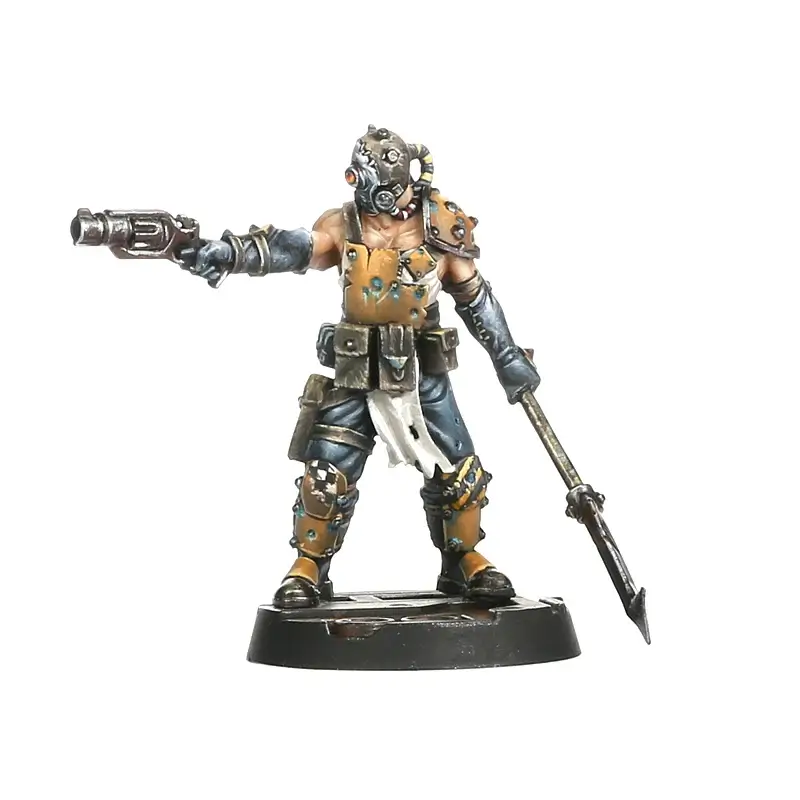

|  M  | WS  | BS  |  S  |  T  |  W  |  I  |  A  | Ld  | Cl  | Wil | Int |
| :-: | :-: | :-: | :-: | :-: | :-: | :-: | :-: | :-: | :-: | :-: | :-: |
| 5”  | 3+  | 4+  |  3  |  3  |  1  | 3+  |  1  | 8+  | 7+  | 8+  | 8+  |

**Skills:** [Dodge](/docs/gang-fighters-and-their-weaponry/skills/#3-dodge), [Escape Artist](/docs/gang-fighters-and-their-weaponry/skills/#2-escape-artist).  
**Weapons:** Stub gun, grab hook.  
**Wargear:** Furnace plates (boiler plate armour), [respirator](/docs/armoury/personal-equipment#respirator).

</FighterCard>

<FighterCard cost="90">

### Tess ‘Arc-up’

**_Forge Born. Goliath only_**

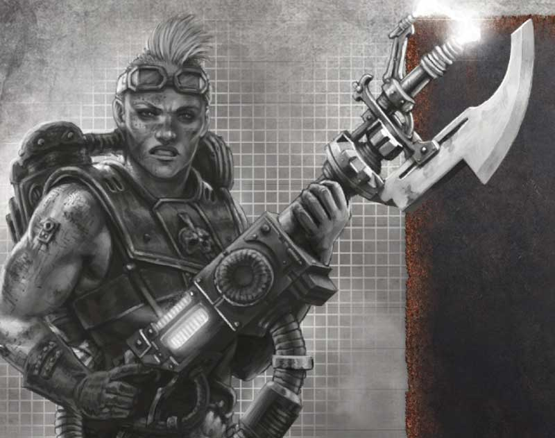

_Tess is reckless, even for a Goliath Forge-born. So reckless in fact that she has been a prospect far longer than most, even the most savage Vatborn Goliath gangs finding her too dangerous to have around for long. Somehow though, Tess has survived every dumb thing she has ever done, whether it is climbing the hive shell barehanded, her custom storm- welder slung over her back and the ash winds trying to snatch her away into oblivion, or taking on whole gangs all by herself, charging into their ranks before letting loose with her weapon. Tess doesn’t know why she is the way she is, though those who have fought alongside her – and lived – suspect it is the lightning in her blood. Tess’ batch suffered a vat malfunction during their gestation, a grid overload pumping hundreds of gigawatts of electricity into her amneotank. Of all her vat brothers and sisters, Tess alone survived, and even from birth she displayed strange qualities. Faster and more erratic than other Goliaths, she quickly took to the role of a shell-runner, climbing the hive’s sides and repairing its plasteel and ceramite skin, usually under the most horrific of circumstances. Her quick reactions and boundless energy kept her alive when many of her peers perished in ash storms or fatal falls. The danger of the shell though was not enough for Tess, and she soon started hiring herself to gangs for underhive brawls. Her skill with a storm- welder and fearlessness has made her respected by many gangs, though none have seen fit to sign her on. Tess is gathering a following of her own, however, and the day may yet come when she runs her own crew, filled with wild prospects like herself._

|  M  | WS  | BS  |  S  |  T  |  W  |  I  |  A  | Ld  | Cl  | Wil | Int |
| :-: | :-: | :-: | :-: | :-: | :-: | :-: | :-: | :-: | :-: | :-: | :-: |
| 6”  | 4+  | 4+  |  3  |  4  |  1  | 2+  |  1  | 8+  | 5+  | 7+  | 7+  |

**Skills:** [Clamber](/docs/gang-fighters-and-their-weaponry/skills/#2-clamber), [Sprint](/docs/gang-fighters-and-their-weaponry/skills/#6-sprint).  
**Weapons:** Storm-welder.  
**Wargear:** Furnace plates.

#### Wired

Can re-roll Initiative tests (enhanced nervous system making reflexes lightning fast).

_Source: House of Chains_

</FighterCard>

<FighterCard cost="105">

### Grub Targeson

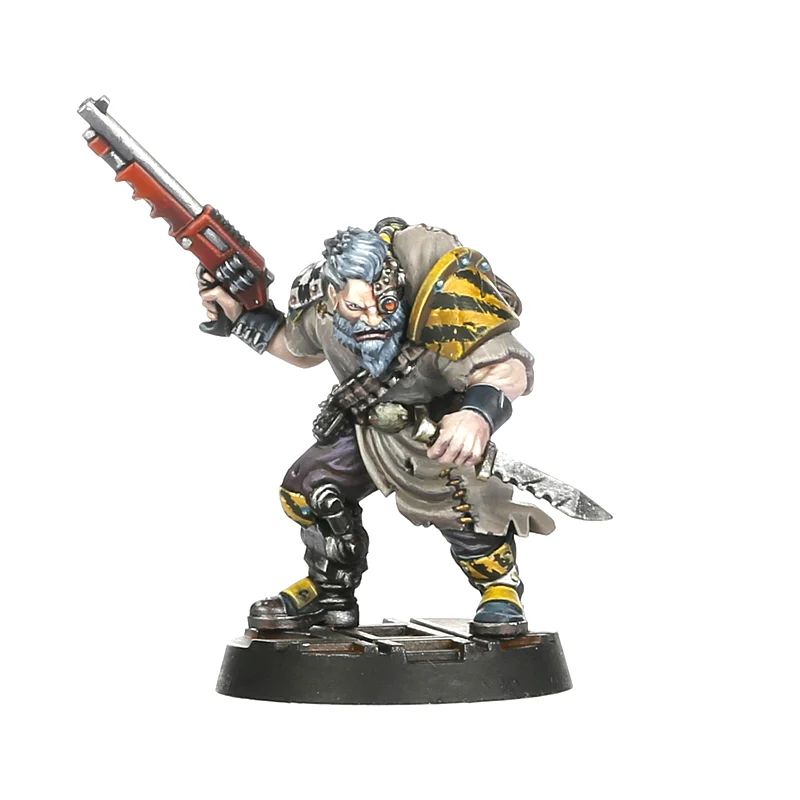

|  M  | WS  | BS  |  S  |  T  |  W  |  I  |  A  | Ld  | Cl  | Wil | Int |
| :-: | :-: | :-: | :-: | :-: | :-: | :-: | :-: | :-: | :-: | :-: | :-: |
| 4”  | 4+  | 3+  |  3  |  3  |  1  | 4+  |  1  | 8+  | 8+  | 8+  | 6+  |

**Skills:** [Backstab](/docs/gang-fighters-and-their-weaponry/skills/#1-backstab), [Evade](/docs/gang-fighters-and-their-weaponry/skills/#3-evade), [Infiltrate](/docs/gang-fighters-and-their-weaponry/skills/#4-infiltrate).  
**Weapons:** Shotgun (scatter, executioner), Frag grenades, Knife.  
**Wargear:** Flak.

</FighterCard>

<FighterCard cost="200">

### Scabs

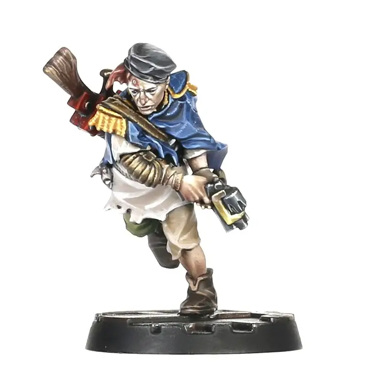

_Life is hard in the underhive, and even more so for Houseless drifters like Scabs. A product of two worlds, Scabs carries his Ratskin heritage both as a blessing and a curse. Most ‘civilised’ underhivers view the boil-covered scum as a Badzones savage and an outlander, never fully accepting him into their settlements and holesteads. This is probably why Scabs turned to a violent life as a hired gun and wastelands guide to make creds, and also why when he fell in with Kal Jericho he returned the Bounty Hunter’s easy acceptance with unfailing loyalty. Kal saw in Scabs something the scum had never seen in himself; a talented scout with a keen eye for danger and a good heart. Over the years, Scabs has proven his worth to Kal time and time again, the scum’s level-headed pragmatism tempering his master’s bon vivant attitude with a healthy dose of caution, often saving the pair from sump-spawned horrors and humourless gangers among countless other perilous situations._

_Of course, as Scabs’ own reputation has grown, he has had many of his own adventures – especially during those periods when Kal mysteriously disappears uphive or even further afield for weeks or months at a time. Either alone or in the company of other gangs or hired guns, Scabs has proven he can hold his own. Scabs’ Ratskin blood might make him an outcast in most underhivers’ eyes but it gives him a connection to the hive he has used to his advantage numerous times – his ‘nose’ finding paths through seemingly impassable Badzones or tracking foes across the shifting wastes of hive bottom. And when Kal isn’t around, Scabs sometimes even teams up with Yolanda Catallus, perhaps because she feels sorry for the half-Ratskin, or maybe she is just looking for an in with Kal – or another chance to put a blade between his ribs!_

|  M  | WS  | BS  |  S  |  T  |  W  |  I  |  A  | Ld  | Cl  | Wil | Int |
| :-: | :-: | :-: | :-: | :-: | :-: | :-: | :-: | :-: | :-: | :-: | :-: |
| 5”  | 5+  | 3+  |  3  |  3  |  2  | 3+  |  2  | 7+  | 7+  | 6+  | 7+  |

**Skills:** [Clamber](/docs/gang-fighters-and-their-weaponry/skills/#2-clamber), [Escape Artist](/docs/gang-fighters-and-their-weaponry/skills/#2-escape-artist), [Infiltrate](/docs/gang-fighters-and-their-weaponry/skills/#4-infiltrate).  
**Weapons:** Plasma gun, Stub gun.  
**Wargear:** Flak, [filter plugs](/docs/armoury/personal-equipment#filter-plugs).

#### “Come Along Scabs!”

If Kal is also hired:

The cost is reduced to 100 credits (instead of 200).

Additionally, Scabs counts as a Bounty Hunter (instead of Hive Scum) and gains the associated special rules (Dead, Not Alive, Claiming Bounties and “We’ll Get Our Bit…”).

If rolling for “We’ll Get Our Bit…”, roll a single D6 for both.

#### Gifted Forager

In the post-battle sequence, add +1 to the Seek Rare Equipment roll when visiting the Trading post.

_Source: The Book of Peril_

</FighterCard>

<FighterCard cost="115">

### D060-K13

**_Orlock only_**

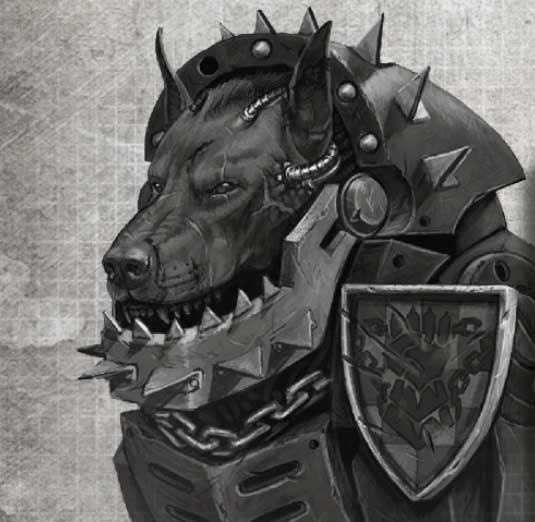

_The art of creating cyber-mastiffs is far from exact, and not all cyber-mastiffs are created equal. Some are merely slightly enhanced versions of underhive mongrels, while others, such as D060-K13, are technological terrors. Built from the remains of one of Lord Morrow’s scrap hounds, the hardcase cyber-mastiff D060-K13 was designed by the outcast Van Saar Archeotek Von Buren. Buren built 13 such dogs for the Orlocks as part of his payment for their protection from his clan, all exceptionally large specimens and each equipped with the added gifts of enhanced exo-armour and a collection of concealed digi-weapons._

_Of these beasts, D060-K13 is the only one known to still function. After years of faithful service to Lord Morrow, D060-K13 vanished into the wastes, following the call of some imagined voice and making newfriends at every stop, before disappearing once more. Even today, after many years, stories still filter back to Crucible that tell of the cyber-mastiff turning up to help gangs in need, before disappearing again into the outlands or underhive._

|  M  | WS  | BS  |  S  |  T  |  W  |  I  |  A  | Ld  | Cl  | Wil | Int |
| :-: | :-: | :-: | :-: | :-: | :-: | :-: | :-: | :-: | :-: | :-: | :-: |
| 5”  | 3+  | 4+  |  3  |  4  |  1  | 4+  |  1  | 8+  | 7+  | 7+  | 8+  |

**Skills:** Big Brother.  
**Weapons:** Shock Bite, Digi-autopistol, Digi-hand flamer, Digi-frag grenade.  
**Wargear:** Hardcase: [light carapace (4+)](/docs/armoury/armour#carapace) & [respirator](/docs/armoury/personal-equipment#respirator).

#### Tenacious

If taken Out of Action while not yet activated this round, this fighter is not removed from the battlefield until after completing its activation.

#### Digi-Weapon Arsenal

When activating, choose a single digi-weapon (to arm). No other digi weapon can be used until the start of this fighter’s next activation.

#### Wandering Hound

This is an individual fighter (not a pet and not attached to another fighter).

_Source: House of Iron_

</FighterCard>

<FighterCard cost="90">

### Rattus Tatterskin

**_Cawdor only_**

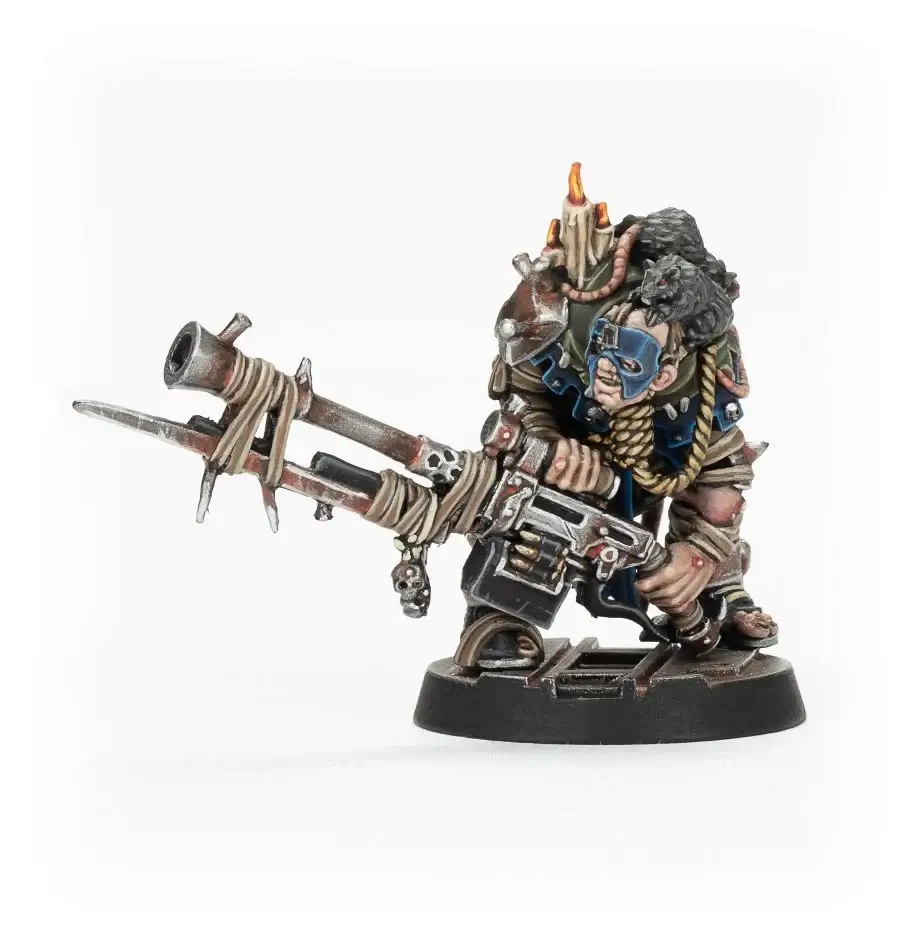

_Within the Redemption the worship of false idols is a grievous heresy, and the Word-Keepers are swift to punish those who see the divine in unsanctioned places. This, of course, does not stop members of Clan Cawdor from making effigies to the God-Emperor from hive detritus or building shrines beneath particularly auspicious looking gunk- stains. Then there are men such as Rattus Tatterskin, who hear the Emperor’s voice in the incessant squeaking of his rats. Tatterskin claims to have spoken with the spirit of the Emperor, who he says inhabits the body of a gigantic rat, deep in the depths of the underhive. The ‘Emperor’ sent some of his servants to Tatterskin, so that the Cawdor scum might understand his divine will. As it turns out, the divine will of the Rat-Emperor is that the hive be purged of the enemies of the Redemption, something Tatterskin has taken to with great vigour._

|  M  | WS  | BS  |  S  |  T  |  W  |  I  |  A  | Ld  | Cl  | Wil | Int |
| :-: | :-: | :-: | :-: | :-: | :-: | :-: | :-: | :-: | :-: | :-: | :-: |
| 5”  | 4+  | 4+  |  3  |  3  |  1  | 4+  |  1  | 8+  | 5+  | 6+  | 8+  |

**Skills:** [Fearsome](/docs/gang-fighters-and-their-weaponry/skills/#2-fearsome).  
**Weapons:** Heavy Stubber.  
**Wargear:** Flak.

#### My Little Friends

Enemies ending an activation in B2B suffer D6 S1 hits.
When activated, pass a Willpower test or gain Insanity (until the start of his next activation).

#### Articles of Faith (1)

Generates a number of Faith dice (as shown in parentheses).
Can perform Articles of Faith (Path of the Doomed).

#### Questionable Morals

Can be hired regardless of alignment (Law Abiding & Outlaw).

_Source: House of Faith_

</FighterCard>

## List of Outlaw Hive Scum

<FighterCard cost="100">

### Queen Lorsha, Hive Scum

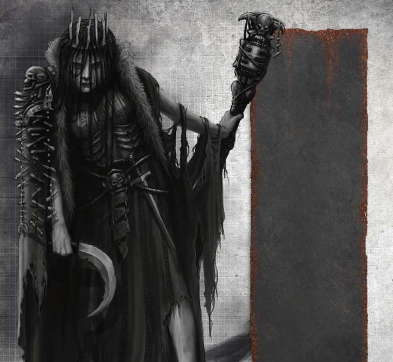

_Once, Lorsha was a Pale Consort of the Mercator Pallidus, but when her family was struck down by the neuron plague and Lorsha was somehow spared she could not bring herself to dispatch her now-undead brothers and sisters. Instead she herded them downhive, seeking out a remote settlement to call home. Eventually Lorsha and her family came upon the town of Skullhole, a collective of hard-working holesteaders living in the depths of the badzones. After foolishly opening their gates for the former Pale Consort, the locals were then given the choice to succumb to the plague or feed Lorsha’s family, and it was not long before Lorsha alone drew breath within Skullhole._

_For a time all was well in Skullhole. Lorsha kept her family fed on unsuspecting travellers and lost gangers while making sure they didn’t wander off into the badzones and get lost. Then the voices started. At first Lorsha thought it was her family talking to her and welcomed the break in their long silence. But in time she came to realise it was someone else, or something else, communing with her from the beyond. The voice convinced her she should spread the neuron plague to others and that everyone deserved the blessing of its terrible sickness. Leaving Skullhole behind Lorsha took up her bone sceptre and knives, the ancient implements of the Pale Consorts, and set out to find allies who would help her spread the disease that still burned in her veins._

|  M  | WS  | BS  |  S  |  T  |  W  |  I  |  A  | Ld  | Cl  | Wil | Int |
| :-: | :-: | :-: | :-: | :-: | :-: | :-: | :-: | :-: | :-: | :-: | :-: |
| 5”  | 4+  | 6+  |  3  |  3  |  2  | 3+  |  2  | 7+  | 6+  | 8+  | 7+  |

<WeaponStats>

| Weapon         | Rg S | Rg L | Ac S | Ac L |  S  | AP  |  D  | Am  | Traits                                                                                                                 |
| :------------- | :--: | :--: | :--: | :--: | :-: | :-: | :-: | :-: | :--------------------------------------------------------------------------------------------------------------------- |
| Bone Sceptre   |  E   |  2"  |  -1  |  -   | S+1 |  -  |  1  |  -  | <Tooltip type="traits" content="melee">Melee</Tooltip>, <Tooltip type="traits" content="versatile">Versatile</Tooltip> |
| Flensing Knife |  -   |  E   |  -   |  -   |  S  | -1  |  1  |  -  | <Tooltip type="traits" content="melee">Melee</Tooltip>, <Tooltip type="traits" content="rending">Rending</Tooltip>     |

</WeaponStats>

**Skills:** [Bloodlust](/docs/gang-fighters-and-their-weaponry/skills/gang-specific-skills#2-bloodlust), [Step Aside](/docs/gang-fighters-and-their-weaponry/skills#6-step-aside)  
**Wargear:** Disturbing Aura (counts as a [Cutter’s Mask](/docs/gangs/gang-lists/corpse-grinder-cult/#cutter-champion)).

#### Special Rules

**Outlaw:** Queen Lorsha of Skullhole is an Outlaw Hired Gun.

_Source: The Book of Ruin_

</FighterCard>

<FighterCard cost="105">

### Psyreena Skar

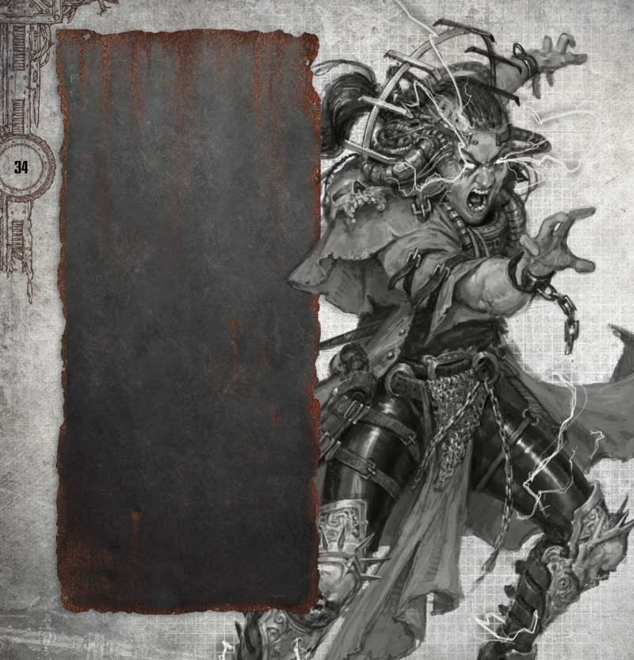

_A gang has to be truly desperate to hire Psyreena Skar. Unstable and unpredictable, she sells her fickle psychic gifts to gangs willing to pay her price – though offers no guarantees as to what will happen when she opens her mind to the Warp. Even when attempting to suppress her powers Psyreena is uncomfortable to be around; always muttering to herself, arguing with her shadow or telling those she’s just met how sorry she is about their impending demise. Psyreena was not always so broken, however, and not so long ago she was a Holesteader’s daughter working the ashwash below Dust Falls._

_One day, when digging in the furthest point of her Da’s holestead, she found a strange ornate jar buried in the ash. It looked far too fine to have come from the underhive, and so she took it back to her father thinking they might be able to sell it to the local Guilders for a few creds. That evening, as the family sat around their rad-hearth admiring Psyreena’s find, the jar mysteriously opened. Peering inside, they discovered a strange pinkish substance suffused with a fragrant smell. Psyreena’s little brother was the first to scoop out a mouthful and within moments the starving family was feasting on the contents. Unbeknownst to the family, the relic was one of the lost jars of Mung, and the contents the preserved brain of Kookym Corleepyn, Astropath to the lost House of Mung. This oddity might have passed unnoticed by the family if not for the latent psychic spark it awoke in Psyreena. Reflexively she opened her mind to the Immaterium and in that moment incinerated her family and their holestead in a single explosion of power. Since that day she has wandered the underhive as an unsanctioned psyker, staying ahead of the authorities and selling her services to those more afraid of their enemies than having a loose cannon like Psyreena around._

|  M  | WS  | BS  |  S  |  T  |  W  |  I  |  A  | Ld  | Cl  | Wil | Int |
| :-: | :-: | :-: | :-: | :-: | :-: | :-: | :-: | :-: | :-: | :-: | :-: |
| 5”  | 3+  | 4+  |  3  |  3  |  2  | 3+  |  2  | 6+  | 5+  | 7+  | 6+  |

**Weapons:** Knife.  
**Wargear:** Flak.

#### Wyrd Powers (Unsanctioned)

**Telekinesis:** Psychic Shockwave (Basic).

_Source: The Book of Judgement_

</FighterCard>

<FighterCard cost="115">

### Jorth Slither

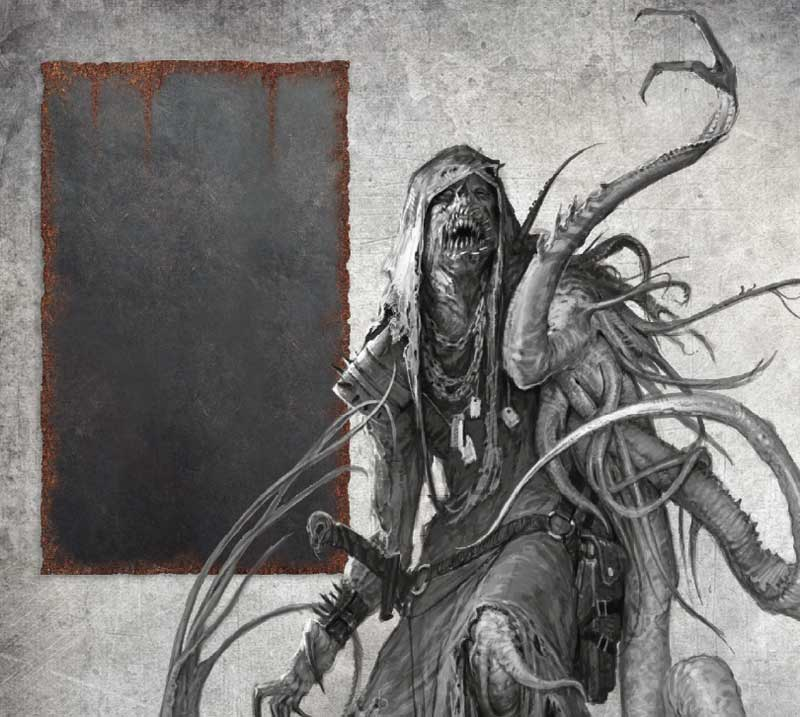

_Jorth Slither is an entrepreneur of underhive enterprise, if there is a chance to make some creds then Jorth is never far away, though it often gets him into trouble. After being turfed out of his Guilder family, he headed off down- hive looking for a good score. What he found was a corpse surrounded by goo. Without the good sense to leave the find alone, Jorth started rummaging around in the corpse’s pockets. His last conscious thought was his hand closing around something slimy and warm before his brain switched off. When Jorth came to the first thing he did was reach up to feel his head, that his right arm was now a long knot of tentacles was his first clue something was amiss. To his horror, one side of his torso had been consumed by some alien growth; twitching tentacles bursting out of his flesh like a thicket of worms. Some men might have been broken by such a turn of events. Jorth, however, saw opportunity instead of madness. It was not long before he was running Scab Town for the Black Network, joining gangs not afraid of working with a mutie and rallying the malformed against Imperial authority._

|  M  | WS  | BS  |  S  |  T  |  W  |  I  |  A  | Ld  | Cl  | Wil | Int |
| :-: | :-: | :-: | :-: | :-: | :-: | :-: | :-: | :-: | :-: | :-: | :-: |
| 5”  | 3+  | 5+  |  3  |  3  |  2  | 5+  |  2  | 8+  | 6+  | 9+  | 8+  |

<WeaponStats>

| Weapon          | Rg S | Rg L | Ac S | Ac L |  S  | AP  |  D  | Am  | Traits                                                                                                                                                                 |
| :-------------- | :--: | :--: | :--: | :--: | :-: | :-: | :-: | :-: | :--------------------------------------------------------------------------------------------------------------------------------------------------------------------- |
| Autopistol      |  4"  | 12"  |  +1  |  -   |  3  |  -  |  2  | 4+  | <Tooltip type="traits" content="rapid-fire">Rapid Fire (1)</Tooltip>, <Tooltip type="traits" content="sidearm">Sidearm</Tooltip>                                       |
| Throwing knives | Sx2  | Sx4  |  -   |  -1  |  S  | -1  |  -  | 5+  | <Tooltip type="traits" content="scarce">Scarce</Tooltip>, <Tooltip type="traits" content="toxin">Toxin</Tooltip>                                                       |
| Shock baton     |  -   |  E   |  -   |  -   |  S  |  -  |  1  |  -  | <Tooltip type="traits" content="melee">Melee</Tooltip>, <Tooltip type="traits" content="parry">Parry</Tooltip>, <Tooltip type="traits" content="shock">shock</Tooltip> |

</WeaponStats>

**Skills:** [Backstab](/docs/gang-fighters-and-their-weaponry/skills/#1-backstab), [True Grit](/docs/gang-fighters-and-their-weaponry/skills/#5-true-grit).  
**Wargear:** [filter plugs](/docs/armoury/personal-equipment#filter-plugs), [lho sticks](/docs/armoury/personal-equipment#lho-sticks).

#### Special Rules

Outlaw: Jorth Slither is an Outlaw Hired Gun.

_Source: The Book of Ruin_

</FighterCard>

<FighterCard cost="120">

### Cor ‘Two-Guns’ Coran

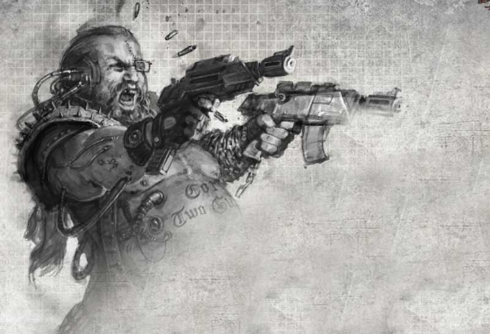

_In the underhive, obesity is often a sign of status. Massive Chain Lords, hulking crime bosses and rotund guilders all display their wealth by proving not only do they have enough to eat, but they can actually eat to excess. Then there are those like Cor ‘Two-Guns’ Coran, who are just fat – or big boned as he insists. A clanless gutter-born bullet scavenger from Dead End Pass, Cor probably wouldn’t have ever amounted to much if it hadn’t been for a chance encounter with a Ratskin shaman out in the badzones. While hunting in the ash drifts for usable rounds, Cor came upon an ancient Ratskin surrounded by slavering ripper jacks. In a rare moment of bravery and selflessness Cor ran to the old man’s aid, saving him from the rippers’ jaws. In return the shaman told Cor he had looked into his soul and seen he was the offspring of a mighty hero of the underhive and destined for greatness. Cor immediately made the leap of logic that the shaman could only be talking of none other than Bull Gorg, ex-pit fighter and once overlord of Dead End Pass. Surely the hefty Bull, with whom Cor undoubtedly shared a physique, had to be his father, and it was up to Cor to carry on the legacy of Bull’s failed servile uprising._

_Unwilling to cut off his arms and replace them with chainsaws like his ‘father’, Cor instead took up a pair of battered autopistols, earning him the nickname Two-Guns – a nickname he largely gave himself and is forced to constantly remind people of. Allying himself with Balthazar’s Black Network, Cor enthusiastically fights for the rights of the common people in Dead End Pass and has made a name for himself as a rabble rouser. The Narco Lords are more than willing to placate Cor with promises that his jobs are in the spirit of Bull’s ‘free’ underhive if it means ‘Two-Guns’ continues to make life hard for the Guilders._

|  M  | WS  | BS  |  S  |  T  |  W  |  I  |  A  | Ld  | Cl  | Wil | Int |
| :-: | :-: | :-: | :-: | :-: | :-: | :-: | :-: | :-: | :-: | :-: | :-: |
| 4”  | 6+  | 4+  |  4  |  3  |  2  | 4+  |  1  | 7+  | 7+  | 8+  | 8+  |

**Skills:** [Gunfighter](/docs/gang-fighters-and-their-weaponry/skills/#2-gunfighter), [Inspirational](/docs/gang-fighters-and-their-weaponry/skills/#2-inspirational).  
**Weapons:** 2x Autopistol (with manstopper).  
**Wargear:** Forged Guilder Seal.

_Source: The Book of Judgement_

</FighterCard>

<FighterCard cost="125">

### Jonny Razor

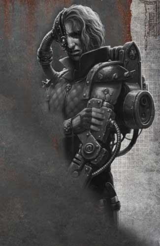

_Jonny is one of the rare few to ever cross Balthazar Van Zep and live to tell the tale. A low level street dealer from Guilder Crossing, Jonny was ‘absorbed’ by Balthazar’s Black Network when the latter took over Dust Falls. Who was in charge of the local chem trade didn’t mean a lot to a scrut like Jonny, and for a time he managed to avoid the attention of his betters. Then, one fateful day Jonny got in the way of Lothar Hex. Ordinarily such a mishap would have meant a free bolt round lobotomy, but on this day, Jonny accidentally stumbled out of a drinking hole and knocked Hex down, saving the infamous killer from a sniper’s bullet. Dragged before Balthazar, Jonny would still have likely faced summary skinning or ash blasting if not for the presence of Erasmus the Mangler, Balthazar’s resident rogue doc. The Mangler happened to be looking for test subjects, after he had acquired a broken Murder Servitor via the Cold Trade and wanted to see if he could graft its limbs onto a live person. As Balthazar was in a rare good mood, he agreed, and Jonny was dragged off to the Mangler’s operating table._

_Whether it was Erasmus’ fear of failing Balthazar, or just natural underhive hardiness, Jonny survived the operation, stumbling out of the doc’s workshop with a bladed cyber arm, a whirring bionic eye and numerous internal ‘upgrades’. Taking the name Jonny Razor, for his deadly new appendage, the scummer headed back to Guilder Crossing. Within a few cycles he had risen up the ranks, due in no small part to his new gifts. It was also at this time Jonny discovered the ‘obedience’ organs the Mangler had put inside him, his own body rebelling against him if he tried to go against the Narco Lord’s wishes. Now Balthazar loans Jonny out to gangs for extra muscle, and to show off the benefits and drawbacks of loyalty to the Black Network._

|  M  | WS  | BS  |  S  |  T  |  W  |  I  |  A  | Ld  | Cl  | Wil | Int |
| :-: | :-: | :-: | :-: | :-: | :-: | :-: | :-: | :-: | :-: | :-: | :-: |
| 5”  | 2+  | 6+  |  3  |  3  |  2  | 5+  |  2  | 8+  | 7+  | 9+  | 9+  |

**Skills:** [Combat Master](/docs/gang-fighters-and-their-weaponry/skills/#1-combat-master), [Evade](/docs/gang-fighters-and-their-weaponry/skills/#3-evade).  
**Weapons:** Bladed Cyber Arm (same as Gem extractor), Throwing knives.  
**Wargear:** Flak, [photo-goggles](/docs/armoury/personal-equipment#photo-goggles).

_Source: The Book of Judgement_

</FighterCard>

<FighterCard cost="130">

### Estus Jet

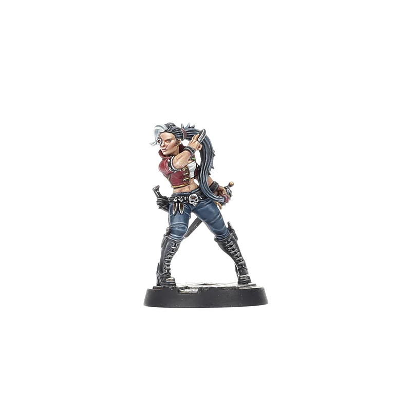

_As Esmerelda, Holdmother of the Dust Falls Deep 9 Orphanarium, tells it, she found Jet under an overturned cart in the aftermath of what appeared to be a Ratskin ambush on some green hivers. There was little left of the hivers, the area splattered in blood and littered with body parts. The only clue to the child’s identity was a tarnished collar around her neck, the only legible letters on it \_EST SU_JE_T. Jet was taught all the skills she needed to survive by Esmerelda. These were skills all the girls of the Deep 9 learned, like how to break someone’s neck with a dropkick, the kill points on an ash devil, and how to tell the difference between Second Best that’ll kill you and Second Best that will only make you blind. The best of Esmerelda’s girls could then expect good jobs as Guilder guards, or hired guns – with creds going back to Esmerelda of course. Jet, however, decided to take another path._

_Using her talents she got in with the Archwerks Overboss Gideon Scav to become his right-hand woman. It was not long before Jet was running Gideon’s racket out of Dust Falls and moving shipments of counterfeit wargear and weapons. This gave her ample opportunities to indulge in her favoured pastime – killing fools. She claims to sell the fastest bullets in the underhive, and challenges any potential customers to prove her wrong. Unsurprisingly, between Jet yelling ‘RUN!’ and her squeezing the trigger, her claims have remained intact._

|  M  | WS  | BS  |  S  |  T  |  W  |  I  |  A  | Ld  | Cl  | Wil | Int |
| :-: | :-: | :-: | :-: | :-: | :-: | :-: | :-: | :-: | :-: | :-: | :-: |
| 5”  | 4+  | 5+  |  3  |  3  |  2  | 4+  |  1  | 7+  | 7+  | 8+  | 8+  |

**Skills:** [Combat Master](/docs/gang-fighters-and-their-weaponry/skills/#2-counter-attack), [Parry](/docs/gang-fighters-and-their-weaponry/skills/#4-parry).  
**Weapons:** Autopistol, throwing knives, stiletto knife.  
**Wargear:** Flak.

_Source: The Book of Judgement_

</FighterCard>

<FighterCard cost="145">

### Vunder Gorvos

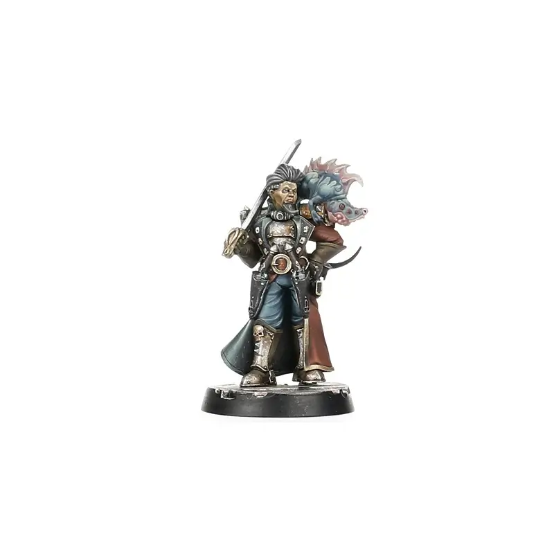

_Vunder is part of the self-styled nobility of the underhive. Decades ago three crime families took over Two Tunnels, Draek’s Gantry and the Grey Wastes Trading Post. Together they formed a triumvirate to rule over the three settlements and the dozen or so surrounding domes between the Dust Falls drop and the Ash Gates interchange. Against the odds, the families didn’t turn on each other or fall prey to criminal rivals. Instead, they managed to endure until their children grew up to inherit the lands of their parents. The Gorvos family runs Two Tunnels alongside the Faebrun and Kaorka clans, and Vunder is heir apparent to the Gorvos line. Unfortunately for the Gorvos family, Vunder is an idiot._

_Clad in underhive finery, Vunder genuinely believes himself a hive noble. He apes any uphive fashions or affectations he happens to hear about, and goes out his way to antagonise Guilders and Enforcers who don’t properly ‘respect’ his position. Needless to say, he is universally despised and has survived only by virtue of his linage. Vunder’s sister, Gaen, has been working for years to rid her family of him. On the pretext of having him prove his noble superiority, Gaen organises ‘alliances’ with local gangs, whereby Vunder will accompany them on business important to the family. So far, Vunder has been ‘hired’ out to numerous local factions, though much to Gaen’s frustration, has yet to get himself killed._

|  M  | WS  | BS  |  S  |  T  |  W  |  I  |  A  | Ld  | Cl  | Wil | Int |
| :-: | :-: | :-: | :-: | :-: | :-: | :-: | :-: | :-: | :-: | :-: | :-: |
| 5”  | 2+  | 5+  |  3  |  3  |  2  | 4+  |  1  | 8+  | 7+  | 8+  | 9+  |

**Skills:** [Rain of Blows](/docs/gang-fighters-and-their-weaponry/skills/#5-rain-of-blows), [Step Aside](/docs/gang-fighters-and-their-weaponry/skills/#6-step-aside).  
**Weapons:** 2x stub guns, shotgun (solid & scatter), sword.  
**Wargear:** Flak.

_Source: The Book of Judgement_

</FighterCard>

<FighterCard cost="150">

### Gaen ‘The Gunk Queen’ Gorvos

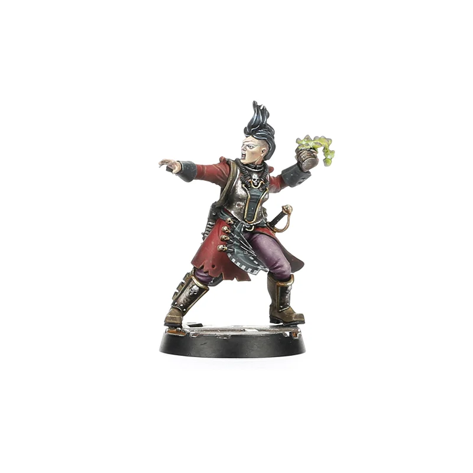

_It’s difficult to find entitled and spoiled underhivers, given the crushing poverty and endemic violence of their surroundings – though they do exist. Gaen ‘the Gunk Queen’ Gorvos is one such anomalous individual; a pauper princess who has risen to control the notorious Gorvos clan of the Two Tunnels triumvirate. Gaen shares some of the traits of a junk noble with her brother Vunder, though unlike Vunder, she has no delusions about the world she inhabits. She knows the only way for the Gorvos clan to hold onto power is through fear and violence; that and getting rid of her stupid brother. While Vunder swans about pretending to be Two Tunnels royalty (if there were such a thing), Gaen is getting on with the business of making creds._

_It is not for her overuse of ‘McSkav’s Mohawk Grease’ that Gaen is called the Gunk Queen. One of Gorvos’ major holdings is the Two Tunnels’ Gunk Tank, a vast reserve of fermented run-off from Hive City that has kept the settlement in creds for centuries. As the Gunk Queen of Two Tunnels, Gaen makes it her personal mission to oversee the gunk trade and crack down on anyone with designs on her turf. She often hires on to gangs to oversee operations personally, furnishing her companions with gunk rounds and gunk bombs if they run off the competition. For the last few years Gaen has been involved in a clandestine war with the crime boss Balthazar, who has his own designs on Two Tunnels. More than one of Balthazar’s agents has even gotten a first-hand look at the prize their employer is trying to claim – as Gaen personally drowns them in the gunk tank. Recently, the conflict has escalated as Gaen’s brother Vunder has been (quite unwillingly) working with Balthazar’s gangs, forcing Gaen to redouble her efforts to rid herself of her annoying sibling._

|  M  | WS  | BS  |  S  |  T  |  W  |  I  |  A  | Ld  | Cl  | Wil | Int |
| :-: | :-: | :-: | :-: | :-: | :-: | :-: | :-: | :-: | :-: | :-: | :-: |
| 5”  | 5+  | 4+  |  3  |  3  |  2  | 4+  |  1  | 7+  | 6+  | 8+  | 7+  |

**Skills:** [Backstab](/docs/gang-fighters-and-their-weaponry/skills/#1-backstab), [Nerves of Steel](/docs/gang-fighters-and-their-weaponry/skills/#4-nerves-of-steel).  
**Weapons:** Autogun, throwing knives, sword, gunk bomb.  
**Wargear:** [Mesh armour](/docs/armoury/armour#mesh-armour).

#### Gorvos Twins (Twins of the Two Tunnels)

This fighter can be chosen as an Outcast Leader with the following effects:

- **Gaen Gorvos:** Leader with Mastermind (skill set)
- **Vunder Gorvos:** Champion with Survivor (skill set).
- **Affiliation:** Recidivist (Criminal Organisation).
- **Gunk Bombs:** All members of the gang can take Gunk Bombs for 20 credits.

_Source: The Book of Judgement_

</FighterCard>

<FighterCard cost="280">

### Abomination of Badzone 12

**_Chaotic only_**

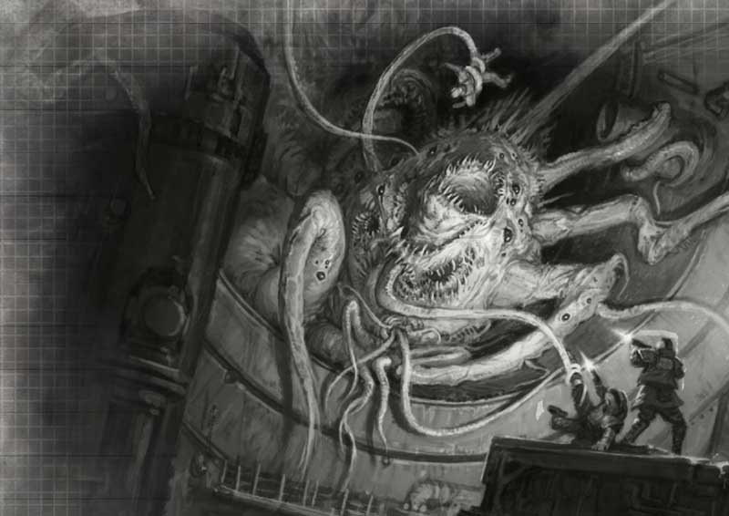

_There are things that live in the depths of the hive that defy explanation or classification. These are horrors so vile that they seem to instinctively seek the darkness as if they know their very presence is anathema to the light of the God-Emperor. The Abomination of Badzone 12 is such a stain upon decency and reason. A crawling, slithering, staggering thing of claws and tentacles and eyes, the Abomination lives in the depths of Hive Primus. In the dark cycles of power-down it sometimes creeps up from its lair, looking for more satisfying fare than mutant or rat. Blood-spattered holesteads and ravaged caravans are left in its wake, possessions and goods left behind, but every scrap of meat and bone consumed._

_The Abomination has even destroyed fledgling settlements, those who thought themselves safe from raiders only to perish beneath the claws of the gigantic spawn._

_Underhive rumour has it that the Abomination is the remains of the Cult of the Sump Mother, a malefic church based upon the worship of the sump as a living god. Fused by their profane deity into a single howling entity, the Abomination feeds upon itself in its madness, fanged mouths biting into screaming faces as scythed limbs drag it through the hive. Sometimes cults lure the Abomination out with promises of food, intent on loosing it against their foes. Though this is not without peril, and the cult might just as easily find themselves to be the Abomination’s prey._

|  M  | WS  | BS  |  S  |  T  |  W  |  I  |  A  | Ld  | Cl  | Wil | Int |
| :-: | :-: | :-: | :-: | :-: | :-: | :-: | :-: | :-: | :-: | :-: | :-: |
| 4”  | 3+  |  -  |  5  |  5  |  4  | 5+  |  4  |  -  |  -  |  -  |  -  |

<WeaponStats>

| Weapon                                        | Rg S | Rg L | Ac S | Ac L |  S  | AP  |  D  | Am  | Traits                                                                                                                                                                                                                                                 |
| :-------------------------------------------- | :--: | :--: | :--: | :--: | :-: | :-: | :-: | :-: | :----------------------------------------------------------------------------------------------------------------------------------------------------------------------------------------------------------------------------------------------------- |
| Ferocious Jaws                                |  -   |  E   |  -   |  -   |  S  | -1  |  1  |  -  | <Tooltip type="traits" content="melee">Melee</Tooltip>, <Tooltip type="traits" content="rending">Rending</Tooltip>                                                                                                                                     |
| Claws, tentacles and other strange appendages |  E   |  2"  |  -   |  -   | S+1 | -2  |  2  |  -  | <Tooltip type="traits" content="knockback">Knockback</Tooltip>, <Tooltip type="traits" content="melee">Melee</Tooltip>, <Tooltip type="traits" content="pulverise">Pulverise</Tooltip>, <Tooltip type="traits" content="versatile">Versatile</Tooltip> |

</WeaponStats>

**Skills:** [Fearsome](/docs/gang-fighters-and-their-weaponry/skills/#2-fearsome), [True Grit](/docs/gang-fighters-and-their-weaponry/skills/#5-true-grit), [Unstoppable](/docs/gang-fighters-and-their-weaponry/skills/#6-unstoppable).  
**Wargear:** The ever-mutating hide of the Abomination of Badzone 12 grants it a save equivalent to wearing [heavy carapace armour](/docs/armoury/armour#carapace).

#### Special Rules

**Mindless Beast:** The only actions the Abomination of Badzone 12 can make are Move, Charge, Fight and Coup de Grace. Any Cool or Willpower checks made for the Abomination of Badzone 12 automatically pass, but any Leadership or Intelligence checks automatically fail.

**Outlaw:** The Abomination of Badzone 12 is an Outlaw Hired Gun.

**Chaotic:** The Abomination of Badzone 12 can only be hired by Corpse Grinder Cult, Helot Chaos Cults or Chaos Corrupted gangs.

#### Mindless Beast

Can only make Move, Charge, Fight and Coup de Grace actions. Automatically passes Cool & Willpower tests. Automatically fails Leadership and Intelligence tests.

_Source: The Book of Ruin_

</FighterCard>
