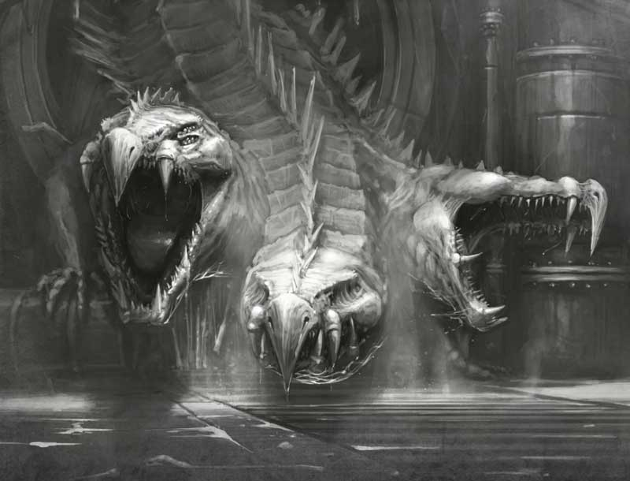

# Hired Fighters

A gang can hire any number of Hired Fighters. A “Hired Fighter” is hired in the same way as any Hired Guns. Note that these are not subject to any of the special rules associated with Bounty Hunters or Hive Scum.

<FighterCard cost="175">

## Old Three-Eyes

**_Goliath only_**

_There is a story, told most often by itinerant fungus farmers deep in their cups, or by hucksters keen for a mark, that describes what some call the ‘Mother of the Sumps’ – the first and greatest of all the Sumpkrocs. They claim that the beast that eventually came to be known as Old Three-eyes started out as a cute, if somewhat snappy, pet, purchased by an uphive noble from an off-world trader for a sum that would make a Guilder wince. The pet was gifted to the noble’s favourite daughter in celebration of her majority, but within the year the creature had grown to such a size that she threatened her mistress’ life and limb. After the pet ate the governess and three of the House Yeomen, she was forced down a sluice-tube, never to bother the House again._

_A hardy beast of muscle and tooth, the creature survived the ordeal and was later discovered in the underhive by members of House Goliath, having grown huge (not to mention sprouting two additional heads). Goliath gangers captured the beast, though not without loss, and turned her over to the House masters, who cloned her and brought into existence the line from which all underhive Sumpkrocs are bred. The original creature, so the stories say, grew so large she escaped the breeding chambers and fled into the depths of the Sump. There, the drunken fungus farmers claim, she resides to this day, a monster capable of slaughtering entire gangs._

_It is said that bold Goliath gangs can even lure Old Three-eyes out of her lair with the right kind of bait (a trussed-up Delaque does the job nicely!). Of course, once the lumbering three-headed beast enters the fray, the gang is advised to keep their distance._

| M   | WS  | BS  | S   | T   | W   | I   | A   | Ld  | Cl  | Wil | Int |
| :-: | :-: | :-: | :-: | :-: | :-: | :-: | :-: | :-: | :-: | :-: | :-: |
| 4”  | 2+  | -   | 4   | 4   | 3   | 5+  | 3   | 8+  | 4+  | 6+  | 10+ |

**Skills:** [Impetuous](/docs/gang-fighters-and-their-weaponry/skills/#3-impetuous), [Nerves of Steel](/docs/gang-fighters-and-their-weaponry/skills/#4-nerves-of-steel), [Hurl](/docs/gang-fighters-and-their-weaponry/skills/#5-hurl).  
**Weapons:** Ferocious Jaws (same as Flensing knife).  
**Wargear:** Scaly hide 1 (same as [Light carapace armour](/docs/armoury/armour#carapace)).

#### Unpredictable

- Can't be included in Group Activations.
- Can't benefit from Leading By Example.
- All attacks have reckless.

#### Mother of Sumpkrocs

Any Sumpkroc within 6” can use this fighter’s Cool & Willpower.

_Source: House of Chains_

</FighterCard>
