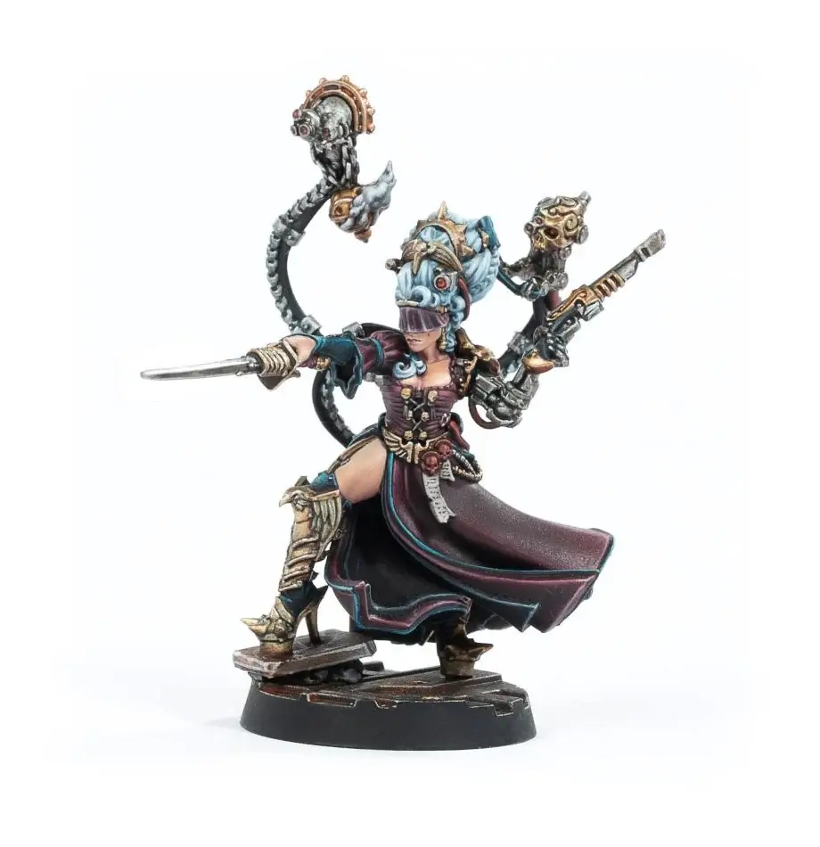

# Criminals

## List of Criminal organisations

- [Cold Traders](#cold-traders-600)
- [Imperial Imposters](imperial-imposters.md)
- [Narco Lords](#narco-lords)
- [Psi-syndica](#psi-syndica-150)
- [Rogue Factoria](#rogue-factoria-315)
- [Fallen Houses](#fallen-houses-305250)

## Cold Traders (600)

**Strong alliance: Escher**

_There is always a market for off-world goods, especially those prohibited by the Imperium. Cold Traders ensure a steady supply of this contraband for any who can meet their price, and House Escher maintains close ties to the Cold Trade for its abundance of off-world goods and services. The Great Houses regularly turn a blind eye to these criminal activities if it means they have access to exotic pets and strange and wondrous xenos artefacts._

### Benefits

#### Void-Born Bounty Hunters

### Xenos Artifacts

Leaders and Champions can purchase the following from the House Equipment List (while allied):

- Sling gun: 55.
- Armourweave: 20.

#### Smuggler Shore Party

_The Cold Trade deals with all manner of alien and void born scum. These vile individuals normally cling to the fringes of the Imperium for fear of extermination or imprisonment. However, the Imperium is vast and even on a populous world such as Necromunda, renegades and smugglers of all kinds can be found lurking in the shadows. For the most part they keep to the underhive and as far from the Imperial authorities of the spire as they can get. The underhive is also a natural den of criminals among which Cold Traders and their shipmates draw little attention, allowing them to conduct business with a minimum of attention from the Imperial House._

_A Smuggler Shore Party is a gathering of renegades centred on a powerful Cold Trader. This could be anything from a disgraced Rogue Trader or Chartist ship captain to an alien corsair or xenos void lord. The Shore Party itself comprises every kind of spacer scum that can be imagined, including Imperial Navy deserters, feral stow aways and abhuman adventurers, all of which have thrown their lot in with the Cold Trader for the promise of fortune and glory._

<FighterCard cost="215">

### 1 Cold Trader (Leader)

|  M  | WS  | BS  |  S  |  T  |  W  |  I  |  A  | Ld  | Cl  | Wil | Int |
| :-: | :-: | :-: | :-: | :-: | :-: | :-: | :-: | :-: | :-: | :-: | :-: |
| 4”  | 4+  | 3+  |  3  |  3  |  2  | 4+  |  2  | 7+  | 6+  | 6+  | 6+  |

**Skills:** [Step Aside](/docs/gang-fighters-and-their-weaponry/skills/#6-step-aside), [Overseer](/docs/gang-fighters-and-their-weaponry/skills/#5-overseer) (Faction only).  
**Weapons:** Sling gun, stiletto knife.  
**Wargear:** Armourweave, [bio-booster](/docs/armoury/personal-equipment#bio-booster).

</FighterCard>

<FighterCard cost="85">

### 1 Bosun (Champion)

|  M  | WS  | BS  |  S  |  T  |  W  |  I  |  A  | Ld  | Cl  | Wil | Int |
| :-: | :-: | :-: | :-: | :-: | :-: | :-: | :-: | :-: | :-: | :-: | :-: |
| 4”  | 4+  | 4+  |  2  |  3  |  1  | 4+  |  1  | 8+  | 7+  | 6+  | 6+  |

**Skills:** [Dodge](/docs/gang-fighters-and-their-weaponry/skills/#3-dodge).  
**Weapons:** Shotgun (solid & scatter), knife.  
**Wargear:** [Mesh armour](/docs/armoury/armour#mesh-armour).

</FighterCard>

<FighterCard cost="300">

### 2 Void-born Scum (Gangers - Bodyguard)

|  M  | WS  | BS  |  S  |  T  |  W  |  I  |  A  | Ld  | Cl  | Wil | Int |
| :-: | :-: | :-: | :-: | :-: | :-: | :-: | :-: | :-: | :-: | :-: | :-: |
| 4”  | 3+  | 4+  |  5  |  5  |  3  | 4+  |  2  | 8+  | 7+  | 7+  | 7+  |

**Skills:** Bodyguard, Indentured Fighter.  
**Weapons:** Knife. Choose either Autopistol or Laspistol (choose individually).

</FighterCard>

:::note
An exception for this alliance:

- The Bosun is labeled "Champion" but has Leading By Example (12”) equivalent to a Leader.

:::

### Drawbacks

#### Press Ganged

Preferred scenarios (attacker):

- The Hit.
- Escort Mission.
- The Last Stand.

**Test-trigger:** Option to choose a scenario. **→** Roll a D6.

|| D6 | Result
A | **1-3** | Attack in a preferred scenario. **Test-trigger:** Include the allies in the crew.
B | **4-6 ** | Choose freely.

#### Imperial Entanglements

**Test-trigger:** After fielding allies in a battle. **→** 1 random friendly Gang Fighter (not In Recovery) must miss the next battle (lay low to avoid investigation).

## Narco Lords

**Strong alliance: Goliath**

_Chems are a vital commodity on Necromunda and a hugely profitable enterprise for criminal organisations from the tip of the spire to the depths of the underhive. House Goliath relies upon chems for its very existence, and those they cannot gain by legal means, they make up for by using their extensive connections to the hive Narco Lords._

### Benefits

#### Narco Scum

D3+2 Hive Scum (in addition to any standard Hive Scum).

#### Abundant Supply

Chems (Black Market):

- -2 Rarity/Legality.
- Supplier never runs out.

### Drawbacks

#### Courier Work

Preferred scenarios: Downtown Dust-up, Ghast Harvest, The Hit.

**Test-trigger:** Option to choose a scenario. **→** Roll a D6:

|   D6    | Result                                                                   |
| :-----: | :----------------------------------------------------------------------- |
| **1-3** | Attack in a preferred scenario. The allies must be included in the crew. |
| **4-6** | Choose freely.                                                           |

#### Payment Due

**Test-trigger:** Earning any credits as a scenario reward. **→** Pay D3x10 to the allies.

## Psi-syndica (150)

**Strong alliance: Delaque**

_There are few greater crimes on Necromunda than the concealment or trafficking of psykers, though this does not stop recidivists from dealing in these powerful individuals._

_Psykers are of particular interest to the House of Shadow, and so it is little wonder that many of their gangs and agents deal directly with the Psi-Syndica, either buying their wares or providing them with raw material._

### Benefits

#### Psychic Awakening

While becoming allied, a fighter can gain the following:

- Unsanctioned Psyker.
- 1 Random Psychoteric Wyrd Power from a chosen discipline (Darkness, Delusion, Madness).

If the alliance is broken, pay the fighter’s value in credits or remove the fighter.

<FighterCard cost="150">

### Mind-locked Wyrd (Unsancioned Psyker)

_The penalty for harbouring rogue psykers on Necromunda is swift and brutal. That the psykers themselves are quietly taken away, even as those around them are being executed, says more about Lord Helmawr’s laws than it does about those of the Imperium. After the tithes to the Imperium, and the culling of those psykers deemed too dangerous to even transport off-world, there remains a substantial quantity that slips between the cracks. Many of these end up collared and conditioned in the employ of the Imperial House, but many more escape into the underhive. Those that survive their ‘gifts’ might even make something of themselves._

_Mind-locked Wyrds are unsanctioned psykers who have been broken to the will of the Psi-Syndica. Via various means of psychic modification and cranial implants, the Wyrd’s will is subsumed by their new masters, transforming them into foot soldiers for the criminal lords. This also allows the Psi-Syndica to send the rogue psykers to aid their allies, confident the Wyrds will not betray them. Mind-locked Wyrds are also deeply unsettling individuals, even by the standards of the underhive, and gangers tend not to enjoy spending much time with them. The edge they can bring to battle, however, is undeniable; after all, who wouldn’t want the ability to look inside their enemy’s minds and pluck out their battle plan, project protective force fields to defend their fighters or simply sweep an enemy away with a wave of telekinetic force!_

|  M  | WS  | BS  |  S  |  T  |  W  |  I  |  A  | Ld  | Cl  | Wil | Int |
| :-: | :-: | :-: | :-: | :-: | :-: | :-: | :-: | :-: | :-: | :-: | :-: |
| 4”  | 5+  | 3+  |  3  |  3  |  2  | 4+  |  1  | 8+  | 6+  | 4+  | 9+  |

**Skills:** [Fearsome](/docs/gang-fighters-and-their-weaponry/skills/#2-fearsome).  
**Wargear:** [Mesh armour](/docs/armoury/armour#mesh-armour).  
**Wyrd Power:** Choose 3 of the following:

- Pyromancy: Scouring (Basic).
- Telekinesis: Assail (Basic), Force Blast (Basic).
- Telepathy: Maddening Visions (Basic), Hypnosis (Basic), Unbreakable Will (Basic).

</FighterCard>

### Drawbacks

#### Dark Dreams

**Test-trigger:** Starting a battle. **→** Pass a Willpower test for a random friendly fighter (not In Recovery), or that fighter can't be part of the crew for this battle.

**Test-trigger:** Playing Ghast Harvest. **→** Include the ally in the crew.

#### Psykanarium Attention

**Test-trigger:** A friendly Psyker used any psychic power in the battle. **→** After the battle, roll D6 +1 per friendly Unsanctioned Psyker that fought in the battle. On a 7+, suffer a Lasting Injury for a random friendly fighter.

## Rogue Factoria (315)

**Strong alliance: Cawdor**

_Counterfeit weaponry and wargear are lucrative enterprises for a criminal organisation, and have the added benefit of keeping their allies well-equipped with ordnance. As natural scavengers and notorious misers, the more nefarious elements of House Cawdor make great use of the Rogue Factoria and their many knock-off weapons and wargear._

### Benefits

#### Bounteous Productions

If included in a battle:

- Before the battle, set-up 2 Loot caskets (instead of 1) if the scenario doesn't specify any special instructions for Loot caskets.

#### Bargain Ordnance (Counterfeit Weapons)

Can buy counterfeit weapons at the Black Market:

- -2 Rarity.
- Counts as Illegal with Legality equal to the modified Rarity.
- -20% cost (rounded down to nearest 5 credits).
- Melee weapons gain Reckless.
- Ranged weapons gain Unstable.
- Fighters armed with counterfeit weapons are worth full value when sold to the Guilders.

#### Hedge Armourers

+1 free Ammo-jack while allied (not counting towards the normal limit).

#### Factoria Work Gangs

_Factoria work gangs are motley groups of miscreants gathered from wherever their Rogue Factoria masters can scrounge them. Some are criminals working off debts to their underhive bosses, while others are escapees from uphive who came to the underhive seeking freedom and wealth but have found a life much like their old one. These irregular fighters are armed with a wide array of cheap counterfeit weaponry, often taken from the cast-offs of the factory line. So armed, they are then pressed into service as ad hoc militia for their masters. The life of a Rogue Factoria worker is of little consequence to the Factoria’s crime lords and they are often used as fodder to protect the manufactoria plants. Sometimes, should it be required, they might be loaned out to allied gangs to act as expendable troops in Necromunda’s endless intergang warfare._

<FighterCard cost="160">

### 1 Factoria Overseer (Leader)

|  M  | WS  | BS  |  S  |  T  |  W  |  I  |  A  | Ld  | Cl  | Wil | Int |
| :-: | :-: | :-: | :-: | :-: | :-: | :-: | :-: | :-: | :-: | :-: | :-: |
| 4”  | 4+  | 3+  |  3  |  3  |  2  | 4+  |  2  | 8+  | 7+  | 6+  | 6+  |

**Skills:** [Commanding Presence](/docs/gang-fighters-and-their-weaponry/skills/#1-commanding-presence), [Overseer](/docs/gang-fighters-and-their-weaponry/skills/#5-overseer) (Faction only).  
**Weapons:** Auto/plasma pistol (combi), shock baton.  
**Wargear:** [Mesh armour](/docs/armoury/armour#mesh-armour).

</FighterCard>

<FighterCard cost="80">

### 1 Work Party Boss (Champion)

|  M  | WS  | BS  |  S  |  T  |  W  |  I  |  A  | Ld  | Cl  | Wil | Int |
| :-: | :-: | :-: | :-: | :-: | :-: | :-: | :-: | :-: | :-: | :-: | :-: |
| 4”  | 5+  | 4+  |  2  |  3  |  1  | 4+  |  1  | 7+  | 6+  | 6+  | 6+  |

**Skills:** [Iron Will](/docs/gang-fighters-and-their-weaponry/skills/#3-iron-will).  
**Weapons:** Laspistol, shock whip.  
**Wargear:** [Mesh armour](/docs/armoury/armour#mesh-armour).

</FighterCard>

<FighterCard cost="75">

### 3 Factoria Workers (Gangers - Bodyguard)

|  M  | WS  | BS  |  S  |  T  |  W  |  I  |  A  | Ld  | Cl  | Wil | Int |
| :-: | :-: | :-: | :-: | :-: | :-: | :-: | :-: | :-: | :-: | :-: | :-: |
| 4”  | 5+  | 5+  |  3  |  3  |  1  | 4+  |  1  | 8+  | 8+  | 8+  | 8+  |

**Skills:** Bodyguard, Indentured Fighter.  
**Weapons:** Choose (individually) either Autogun (reclaimed) or Autopistol (reclaimed) and knife.

</FighterCard>

### Drawbacks

#### Eye of the Omnissiah

If including fighters with Counterfeit weapons, the opponent may include a Bounty Hunter for free.

#### Factoria Workers

**Test-trigger:** Playing The Hit, Escort Mission or Last Stand. **→** Include the allies in the crew.

**Test-trigger:** Include Counterfeit weapons in a battle. **→** Include the allies in the crew.

## Fallen Houses (305/250)

**Strong alliance: Orlock**

_Necromunda’s long history is littered with disgraced nobles and fallen houses. Most have faded into memory, though some remain eager to reclaim their lost glory. House Orlock’s rebellious underclasses have often allied themselves with one such fallen house or another, something the ruling families encourage – provided the disgraced noble in question can be controlled._

### Benefits

#### Rebellion

If winning a battle against:

- Law Abiding gangs: D6x10 credits.
- Enforcers or gangs allied with Guilds or Imperial House:
- 2D6x10 credits.
- +1 Reputation.

#### Rebel Lord

Choose a Revel Lord:

- Generic (305)
- Lady Credo (250)

<FighterCard cost="305">

### 1 Generic Rebel Lord

_The Noble Lords of Necromunda are powerful individuals of a kind to rival the elite of the Imperium. Hundreds of generations of selective breeding and genetic manipulation combined with access to almost limitless wealth has transformed them into living demi-gods cloaked in mortal form. When a Great House falls these mighty lords are almost always hunted to extinction, lest they escape into the wilds of Necromunda and become rebels. The bounties placed on the heads of these fantastically dangerous souls are often enough to raise a common ganger up from the brutality of the underhive and give them a life of privilege and plenty in the upper reaches of Hive City. This is how dangerous they are to the continuance of the ruling Houses and their masters._

_Each Rebel Lord is a deadly adversary of the Imperial House who might come to their allies’ aid if it serves their interests; usually if it involves the restoration of their personal glory. Augmented with bionics or biometics, their bodies are more resilient, while the faded opulence of their clothes hide an armourer’s vault of digi-weapons and rarefied combat tech. More dangerous than their masterwork firearms or energy blades, however, is their will. A Rebel Lord is more than a mere villain – for they are among the last of their line and burn with vengeance to see the Imperial House brought down._

|  M  | WS  | BS  |  S  |  T  |  W  |  I  |  A  | Ld  | Cl  | Wil | Int |
| :-: | :-: | :-: | :-: | :-: | :-: | :-: | :-: | :-: | :-: | :-: | :-: |
| 4”  | 3+  | 3+  |  3  |  3  |  3  | 3+  |  2  | 7+  | 6+  | 6+  | 6+  |

**Skills:** Choose 2 skills (Agility, Combat, Cunning or Shooting).  
**Weapons:** 2x digi lasers. Bolt pistol or Master-crafted needle pistol. Power sword, stiletto sword or thunder hammer.  
**Wargear:** [Mesh armour](/docs/armoury/armour#mesh-armour). [Displacer field](/docs/armoury/field-armour#displacer-field) or [refractor field](/docs/armoury/field-armour#refractor-field).

</FighterCard>

<FighterCard cost="250">

### Lady Credo, Rebel Lord

_For those who move among the shadows of Necromunda, the name Lady Credo is a familiar one. Countless threads of sedition against the Imperial House weave their way back to the enigmatic matriarch of House Credo, and she is a master of pulling the strings of others to do her bidding. In fact, it was her husband, Constantine Credo, the Last Patriarch, who succumbed to her wiles and gave over control of the remnants of his House to her, becoming another general in her rebel armies. Since appearing from the wastes only a few years ago, Lady Credo has been massing the Fallen Houses and spreading dissension against Lord Helmawr. Clearly of noble birth and bearing, some say she is one of Helmawr’s children returned to usurp him, while others claim she is descended from a far older and more powerful bloodline. Whatever the truth, Lady Credo is a power to be reckoned with, and under her tutelage the outcasts of Necromunda are growing in strength._

_Far from a cowering noble conducting war from the shadows, Lady Credo is a formidable warrior in her own right. Her skill with a power sabre has cut down countless challengers to her cause, while her speed and resilience speak to hidden bio-mechanical implants or gen-hancement of the highest order. She is also seldom seen without a pair of custom servo-skulls hovering over her shoulders. The two constructs – dubbed Sinestus and Dexterus by the lady – give her an exceptional view of the battlefield and help her find her foes, wherever they might hide._

|  M  | WS  | BS  |  S  |  T  |  W  |  I  |  A  | Ld  | Cl  | Wil | Int |
| :-: | :-: | :-: | :-: | :-: | :-: | :-: | :-: | :-: | :-: | :-: | :-: |
| 5”  | 3+  | 3+  |  3  |  3  |  3  | 2+  |  2  | 5+  | 5+  | 6+  | 6+  |

**Skills:** [Dodge](/docs/gang-fighters-and-their-weaponry/skills/#3-dodge), [Iron Will](/docs/gang-fighters-and-their-weaponry/skills/#3-iron-will), [Parry](/docs/gang-fighters-and-their-weaponry/skills/#4-parry).  
**Weapons:** Laspistol (master-crafted), Power Sabre (master-crafted).  
**Wargear:** [Light carapace armour](/docs/armoury/armour#carapace) (same as armourweave cloak),
refractor field, [photo-goggles](/docs/armoury/personal-equipment#photo-goggles).

#### Heir to the Outlands

Friendly Outcast & Outlaw fighters within 8" can use Lady Credo's Ld & Cool.

#### Sinestus & Dextrus

A pair of custom servo-skulls grants Lady Credo the following:

- 360° vision arc.
- [photo-goggles](/docs/armoury/personal-equipment#photo-goggles).

_Source: The Book of the Outcast_

</FighterCard>

### Drawbacks

#### For the Cause

**Test-trigger:** Challenged (for a Resource) by Enforcers or a gang allied with a Guild or Imperial House. **→** Accept Challenge.

**Test-trigger:** Fighting against Enforcers or gangs allied with a Guild or Imperial House. **→** Include the allies in the crew.

#### Ancient Oaths

**Test-trigger:** After any battle. **→** Pay D3x10 to the allies.
