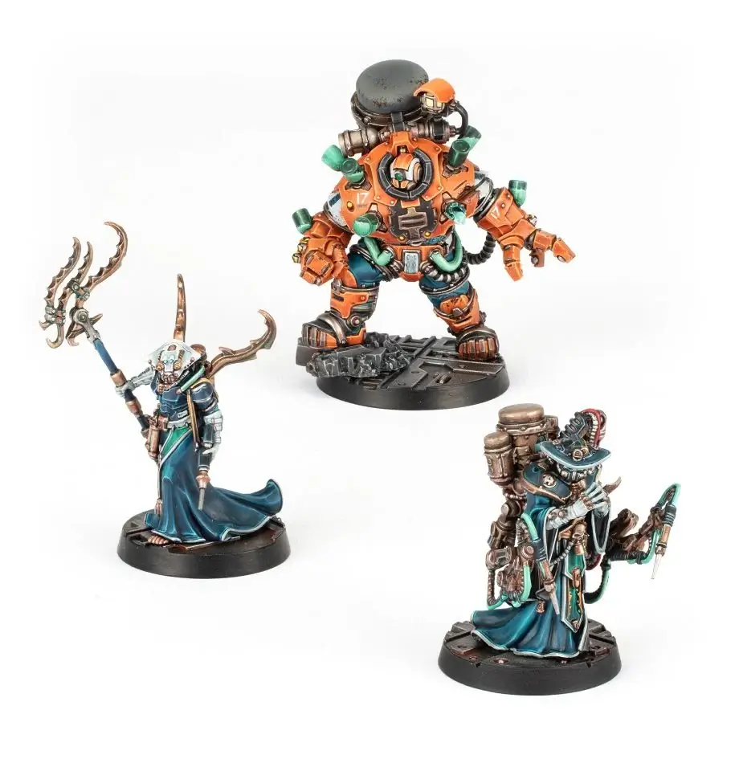
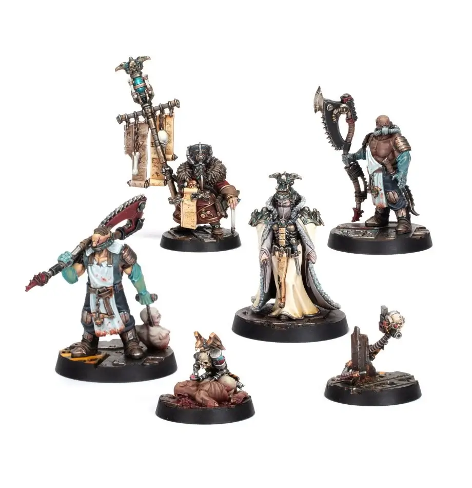
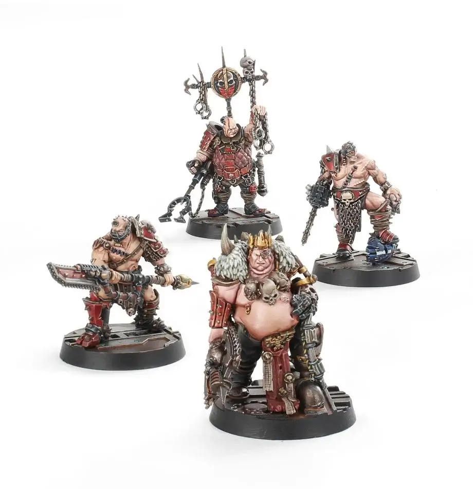

# Merchant Guilds

## List of Merchant Guilds

- [Promethium Guild](promethium-guild.md)
- [Guild of Coin/Toll Collectors](#guild-of-coin--toll-collectors-520)
- [Iron Guild](#iron-guild)
- [Water Guild](#water-guild-435)
- [Corpse Guild](#corpse-guild-550)
- [Slave Guild](#slave-guild-710)

### Representatives

Most Guild Alliance Representatives consist of 3 or 4 fighters:

- 1 Leader (Guild Procurator)
- 1 Champion (Guild Factotum)
- 1-2 Gangers (Bodyguards)

### Guild Drawbacks

Each Alliance gives unique drawbacks. All Guild Alliances have the following drawback:

#### Guard Duty

Preferred scenarios:

- Looters (3D)
- Smash & Grab (2D)
- Caravan Heist
- Escort Mission

If defending in a preferred scenario, apply all the following:

- The allies must be included.
- Roll for Aid:
  - Success: No effect.
  - Failed: Test the Alliance (the gang is unhappy about this forced interference).

**Test-trigger:** Option to choose a scenario. → Roll a D6:

- 1-3: Apply all of the following:
  - Defend in a preferred scenario.
  - The allies must be included.
  - Roll for Aid:
    - Success: Test avoided.
    - Failed: Test the Alliance (the gang is unhappy about this forced interference).
- 4-6: Choose freely.

## Guild of Coin / Toll Collectors (520)

**Strong alliance: Orlock**

_On Necromunda, every road, byway, tunnel and gate are owned by the Imperial House. These are the arteries of its trade and much of its power and, as a result, each one is carefully controlled. The Guild of Coin taxes and controls these pathways for Lord Helmawr, and acts as guardians to the many trails and tunnels that link the levels of a hive together, or link hive clusters across the toxic wastes. Clad in glittering cloaks of keys, with staves graven with passwords and hung with tokens of their long journeys, each Master of Coin is a keeper of the ways. While these agents of the Guild often oversee the comings and goings of prospectors, Clan House work crews and Ash Waste expeditions, ensuring that the Imperial House gets its due, many ply the Badzones, keeping the connections between the settlements alive. Masters of Coin regularly recruit gangs for underhive expeditions, for what the keepers find, they can trade, and if they are fortunate enough to forge a new route through the Badzones then they can claim taxes on all who use it._

_Masters of Coin are almost always accompanied by Skinflints, miserly coin counters who test and tally the creds gathered by their masters before stowing them in armoured trade-coffers. These coffers are carried by the master’s Grovellers, indentured oath-breakers. Some Grovellers even have this precious knowledge carved, branded or tattooed onto their flesh, acting as living documents for their master to refer to – or, should the need arise, flay off to give to an expedition leader._

### Benefits

#### Aid

**Success level:** 11 or less.  
**Fighters:** Toll Collectors.

#### Tollways

Gain an additional D6x10 credits when receiving scenario rewards.

### Drawbacks

#### Guard Duty

#### Collecting Tolls

**Test-trigger:** Gained any credits as a scenario reward. **→** Pay D3x10 credits (or the full reward gained if it was less than the result of the roll).

### Fighters

<FighterCard cost="245">

### 1 Master of Coin (Leader - Guild Procurator)

|  M  | WS  | BS  |  S  |  T  |  W  |  I  |  A  | Ld  | Cl  | Wil | Int |
| :-: | :-: | :-: | :-: | :-: | :-: | :-: | :-: | :-: | :-: | :-: | :-: |
| 5”  | 4+  | 4+  |  3  |  3  |  2  | 3+  |  1  | 6+  | 5+  | 7+  | 5+  |

**Skills:** [Escape Artist](/docs/gang-fighters-and-their-weaponry/skills/#2-escape-artist), [Overseer](/docs/gang-fighters-and-their-weaponry/skills/#5-overseer) (Faction only).  
**Weapons:** Laspistol, power knife.  
**Wargear:** [Displacer field](/docs/armoury/field-armour#displacer-field), gun skull.

</FighterCard>

<FighterCard cost="125">

### 1 Skinflint (Champion - Guild Factotum)

|  M  | WS  | BS  |  S  |  T  |  W  |  I  |  A  | Ld  | Cl  | Wil | Int |
| :-: | :-: | :-: | :-: | :-: | :-: | :-: | :-: | :-: | :-: | :-: | :-: |
| 5”  | 4+  | 4+  |  3  |  3  |  1  | 4+  |  1  | 7+  | 6+  | 7+  | 6+  |

**Skills:** [Lie Low](/docs/gang-fighters-and-their-weaponry/skills/#5-lie-low).  
**Weapons:** Plasma Pistol, Knife.  
**Wargear:** [Mesh armour](/docs/armoury/armour#mesh-armour), Cult Icon.

</FighterCard>

<FighterCard cost="150">

### 2 Grovellers (Gangers - Bodyguard)

|  M  | WS  | BS  |  S  |  T  |  W  |  I  |  A  | Ld  | Cl  | Wil | Int |
| :-: | :-: | :-: | :-: | :-: | :-: | :-: | :-: | :-: | :-: | :-: | :-: |
| 4”  | 4+  | 5+  |  3  |  3  |  1  | 4+  |  1  | 8+  | 8+  | 7+  | 7+  |

**Skills:** [Lie Low](/docs/gang-fighters-and-their-weaponry/skills/#5-lie-low), Bodyguard, Indentured Fighter.  
**Weapons:** Knife, Choose either Long Rifle or Shotgun (solid & scatter) (individual loadouts).

</FighterCard>

### Highways and Byways (When Joining the Battle)

Before determining a scenario where this alliance is taking part, when defending, pass a Leadership test for the Leader to steal the initiative from the enemy. Use the Ambush or Trap scenario as the attacker.

## Iron Guild

**Strong alliance: Delaque**

_The Iron Guild deals in the raw materials of Necromunda, whether that is the ore dug from beneath the Spoil or the huge surplus of weapons and ordnance that circulate the hives._

_House Delaque has its tendrils in many industries, their subtle influence felt throughout the Merchant Guilds. The Iron Guild, in particular, has come under their sway in recent centuries, the House of Shadow eager to control the supply and demand for its goods._

### Benefits

#### Aid

**Success level:** 9 or less.  
**Fighters:** Wandering Scum (D3+2 generic Hive Scum)

#### Guns, Guns, Guns

- Trading Post bonuses for ranged weapons:
- -2 Rarity.
- -D3x10 cost (minimum 5 credits).
- Optional: Test the Alliance to have D3x20 discount instead (minimum 5 credits).

### Drawbacks

#### Guard Duty

#### Militia Surplus

**Test-trigger:** One or more fighters died. **→** All weapons & wargear carried by dead fighters must be given to the Iron Guild.

## Water Guild (435)

**Strong alliance: Escher**

_Water is one of the great resources of a hive, and it falls to the Water Guild to procure it, distribute it and profit from it – not necessarily in that order. House Escher has very close ties with the Water Guild, built up over centuries of the two organisations dominating the Necromunda chem trade. Pure water, or even water of a decent grade, is vital to the creation of the most potent chems, and for a share of the profits, the Water Guild makes sure House Escher never goes wanting._

### Benefits

#### Aid

**Success level:** 10 or less.  
**Fighters:** Nautican Syphoning Delegation.

#### Pure Water Supply

Gain a free Slopper. If the gang already has a Slopper, fighters come out of Recovery on 5+ instead of 6+.

### Drawbacks

#### Guard Duty

#### Water Levies

**Test-trigger:** Gained any credits as a scenario reward. **→** Pay D3x10 credits (or the full reward gained if it was less than the result of the roll).

### Fighters

<FighterCard cost="185">

### 1 Master Nautican (Leader - Guild Procurator)

_On Necromunda water is squeezed from every available source, the precious liquid gathered, refined and traded by the Merchant Guild. Master Nauticans are the representatives of the Water Guild when it comes to the procurement of drinkable water, their entourages travelling the hive bedecked in piped harnesses, sloshing tanks and esoteric exsanguination devices. Invigorated by a concentration of clean water and purifying chems, the eyes of a Master Nautican burn with drug-induced purpose, while their muscles twitch underneath a forest of tubes, each one connected to a tank or bottle._

_While a Water Harvester might enlist the aid of a gang for protection (and as a ready supply of recyclable fluids), they are seldom seen without their own personal attendants. These include Syphonites who carry bladed exsanguination staves to bleed water from their victims or the hulking Subnautican Behemoths in their armoured diving suits. Syphonites both oversee the harvesting and refining of water, speaking the litanies of the guild to bless the water in the name of the God-Emperor by invoking the names of the ‘Ancient Sees’, believed to have been things once looked upon by the Emperor. The Subnauticans are the divers that keep the cisterns and reservoirs of Hive Primus functioning, but also double as able and heavily armoured bodyguards for the Master Nautican should the need arise._

|  M  | WS  | BS  |  S  |  T  |  W  |  I  |  A  | Ld  | Cl  | Wil | Int |
| :-: | :-: | :-: | :-: | :-: | :-: | :-: | :-: | :-: | :-: | :-: | :-: |
| 4”  | 4+  | 4+  |  3  |  3  |  2  | 4+  |  1  | 7+  | 7+  | 6+  | 6+  |

**Skills:** [Step Aside](/docs/gang-fighters-and-their-weaponry/skills/#6-step-aside), [Overseer](/docs/gang-fighters-and-their-weaponry/skills/#5-overseer) (Faction only).  
**Weapons:** Needle pistol, stiletto knife.  
**Wargear:** [Mesh armour](/docs/armoury/armour#mesh-armour), [bio-booster](/docs/armoury/personal-equipment#bio-booster), [stimm-slug stash](/docs/armoury/personal-equipment#stimm-slug-stash).

</FighterCard>

<FighterCard cost="90">

### 1 Syphonite  (Champion - Guild Factotum)

|  M  | WS  | BS  |  S  |  T  |  W  |  I  |  A  | Ld  | Cl  | Wil | Int |
| :-: | :-: | :-: | :-: | :-: | :-: | :-: | :-: | :-: | :-: | :-: | :-: |
| 4”  | 5+  | 4+  |  2  |  3  |  1  | 4+  |  1  | 8+  | 8+  | 6+  | 6+  |

**Skills:** [Dodge](/docs/gang-fighters-and-their-weaponry/skills/#3-dodge).  
**Weapons:** Needle Rifle, stiletto knife.  
**Wargear:** [Mesh armour](/docs/armoury/armour#mesh-armour), Cult Icon.

</FighterCard>

<FighterCard cost="160">

### 1 Subnautican  (Gangers - Bodyguard)

|  M  | WS  | BS  |  S  |  T  |  W  |  I  |  A  | Ld  | Cl  | Wil | Int |
| :-: | :-: | :-: | :-: | :-: | :-: | :-: | :-: | :-: | :-: | :-: | :-: |
| 4”  | 3+  | 5+  |  5  |  5  |  3  | 4+  |  2  | 8+  | 6+  | 7+  | 7+  |

**Skills:** Beserker, Bodyguard, Indentured Fighter.  
**Weapons:** Open Fists.  
**Wargear:** Hazard Suit, armoured undersuit.

</FighterCard>

### Water Harvest (When Joining the Battle)

After a battle where this alliance is taking part, if the Leader has not gone Out of Action, add +1 to the Capture roll for each Guild member that has not gone Out of Action.

If an enemy is Captured, the Captured fighter’s gang can pay the full value as ransom. If not, the Captured fighter may be sold to the Guilders for full value immediately, denying the Captured fighter’s gang any rescue.

## Corpse Guild (550)

**Strong alliance: Cawdor**

_Without the recycled flesh of the dead provided by the Corpse Guild, and processed by the Corpse Grinders, Necromunda would starve to death in a matter of weeks. House Cawdor has always enjoyed close ties to the Corpse Guild. Given the number of bodies littering the rubbish heaps and landfills of Necromunda, the existence of such close bonds is unsurprising._

### Benefits

#### Aid

**Success level:** 9 or less.  
**Fighters:** Corpse Harvesting Party.

#### Extra Corpse-starch Rations

Can re-roll Lasting Injury rolls (apply the 2nd result).

### Drawbacks

#### Guard Duty

#### Meat for the Grinders

**Test-trigger:** One or more friendly fighters suffered a Critical Injury. **→** A random fighter who suffered a Critical Injury can't have a Medical Escort and is removed from the gang (as if died).

### Fighters

<FighterCard cost="160">

### 1 Pale Consort (Leader - Guild Procurator)

_Recycled meat is vital to the existence of Necromunda, and the Merchant Guild is continually acquiring fresh sources for the Corpse Grinders. Pale Consorts and Bone Scriveners are corpse prospectors, ever scouring the hives looking for new and plentiful veins of dead meat to be turned into the next batch of corpse-starch rations. Hidden behind macabre masks, often with ornamental rebreathers to block out the stench of their work, Pale Consorts and their Bone Scriveners use a collection of ancient surgical tools to determine the worth of their catch. Often, they will be seen exploring the aftermath of battles between gangs, or stalking the streets of a settlement savaged by outlanders, stooping over the dead._

_Pale Consorts might be prospectors of fallow flesh, but when they find a likely specimen, they are not the ones to mine it. Following in the Pale Consort’s footsteps are the hulking shadows of Corpse Grinders, representing the interests of their organisation, which stands as the principal beneficiary of the Merchant Guild’s efforts. Unlike the Pale Consorts and Scriveners, each Corpse Grinder is a muscular butcher, their arms grown strong in the execution of their grim work. Armed with saws and serrated blades, these brutes either haul the corpses whole into their body carts or hack away the best pieces for the ration factories to refine. Should a Pale Consort be threatened, Corpse Grinders also make for able bodyguards, their razor-toothed tools as proficient against the living as the dead._

|  M  | WS  | BS  |  S  |  T  |  W  |  I  |  A  | Ld  | Cl  | Wil | Int |
| :-: | :-: | :-: | :-: | :-: | :-: | :-: | :-: | :-: | :-: | :-: | :-: |
| 4”  | 5+  | 4+  |  3  |  3  |  1  | 4+  |  1  | 7+  | 8+  | 7+  | 6+  |

**Skills:** [Fearsome](/docs/gang-fighters-and-their-weaponry/skills/#2-fearsome), [Overseer](/docs/gang-fighters-and-their-weaponry/skills/#5-overseer) (Faction only).  
**Weapons:** Laspistol, knife.  
**Wargear:** [Mesh armour](/docs/armoury/armour#mesh-armour), Medi skull, [respirator](/docs/armoury/personal-equipment#respirator).

</FighterCard>

<FighterCard cost="120">

### 1 Bone Scrivener (Champion - Guild Factotum)

|  M  | WS  | BS  |  S  |  T  |  W  |  I  |  A  | Ld  | Cl  | Wil | Int |
| :-: | :-: | :-: | :-: | :-: | :-: | :-: | :-: | :-: | :-: | :-: | :-: |
| 4”  | 5+  | 4+  |  3  |  3  |  1  | 5+  |  1  | 7+  | 8+  | 8+  | 7+  |

**Skills:** [Fearsome](/docs/gang-fighters-and-their-weaponry/skills/#2-fearsome).  
**Weapons:** Stiletto knife.  
**Wargear:** Gun skull, [respirator](/docs/armoury/personal-equipment#respirator), Cult Icon.

</FighterCard>

<FighterCard cost="270">

### 2 Corpse Grinders (Gangers - Bodyguard)

|  M  | WS  | BS  |  S  |  T  |  W  |  I  |  A  | Ld  | Cl  | Wil | Int |
| :-: | :-: | :-: | :-: | :-: | :-: | :-: | :-: | :-: | :-: | :-: | :-: |
| 4”  | 3+  | 5+  |  4  |  3  |  2  | 4+  |  2  | 8+  | 7+  | 8+  | 8+  |

**Skills:** [Crushing Blow](/docs/gang-fighters-and-their-weaponry/skills/#3-crushing-blow), Bodyguard, Indentured Fighter.  
**Weapons:** Chain Glaive.  
**Wargear:** Flak.

</FighterCard>

### This One's Still Moving

After a battle where the allies joined, roll a D6 for any fighters that went Out of Action and suffered a Critical Injury (Lasting Injury 61-65). On a 6, change the result to a Memorable Death (Lasting Injury 66). The fighter has suddenly stopped moving and is claimed by the Corpse Grinders. Any weapons and Wargear (including armour) is added to the allied gang’s stash.

## Slave Guild (710)

**Strong alliance: Goliath**

### Benefits

#### Aid

**Success level:** 10 or less.  
**Fighters:** Slaver Entourage.

#### Weapon Training

Before each battle, a Leader or Champion may choose a temporary Primary skill (only lasts for a single battle).

### Drawbacks

#### Guard Duty

#### Slaves for the Pit

When capturing fighters, choose one of the following:

- Immediately give the Captured fighters to the Slave Guild.
- Test the Alliance (to do one of the following)
  - Keep
  - Sell to Guilders (as normal).
- Break the Alliance (to do the following):
  - Deny Rescue Mission and ransom the Captive’s gang for half the value (rounded down to nearest 5 credits).

### Fighters

<FighterCard cost="280">

### 1 Chain Lord (Leader - Guild Procurator)

_Slavery is so common on Necromunda as to be utterly banal to its inhabitants – after all, for those born into the servitude of the Clan Houses, what sympathy is there for those who must live their lives in chains? Chain Lords and their Shaklemen are the bloated fight masters and slave drivers of the Merchants Guild, readily dealing in both human flesh and human misery. The greatest Chain Lords trade in entire domes, settlements or manufactorums of slaves, sealing the fate of thousands with a single sweep of their hand. For most though, they bring their merchandise with them, dragging lines of bent-backed men and women to market. Chain Lords are often huge and idle souls, who have never had to lift a finger for their own comfort, their needs constantly seen to by a gaggle of servants, while their Shaklemen enact their will. Hung with chains and trinkets, Chain Lords are nonetheless dangerous adversaries, their wealth affording them many hidden weapons and fiendish augmentations._

_Of course, it is rare a Chain Lord would ever need to defend themselves. Principal among the Chain Lords’ charges are pit slaves, often heavily augmented so that they might better entertain the crowds of the arenas. These warriors, often psycho-conditioned for maximum aggression and loyalty, are as hounds upon the leash, ready to be loosed should a word be spoken or gesture be made. Other slaves also act as personal attendants to the Chain Lord, and more than a few captured gangers have found themselves reluctantly serving at the side of a Chain Lord with a compliance collar around their neck._

|  M  | WS  | BS  |  S  |  T  |  W  |  I  |  A  | Ld  | Cl  | Wil | Int |
| :-: | :-: | :-: | :-: | :-: | :-: | :-: | :-: | :-: | :-: | :-: | :-: |
| 4”  | 3+  | 6+  |  4  |  4  |  2  | 4+  |  2  | 7+  | 6+  | 7+  | 96+ |

**Skills:** [Hurl](/docs/gang-fighters-and-their-weaponry/skills/#5-hurl), [Overseer](/docs/gang-fighters-and-their-weaponry/skills/#5-overseer) (Faction only).  
**Weapons:** Choose: Chain glaive or Shock whip and chainaxe.  
**Wargear:** [Light carapace armour](/docs/armoury/armour#carapace), [bio-booster](/docs/armoury/personal-equipment#bio-booster), [stimm-slug stash](/docs/armoury/personal-equipment#stimm-slug-stash).

</FighterCard>

<FighterCard cost="190">

### 1 Shakleman (Champion - Guild Factotum)

|  M  | WS  | BS  |  S  |  T  |  W  |  I  |  A  | Ld  | Cl  | Wil | Int |
| :-: | :-: | :-: | :-: | :-: | :-: | :-: | :-: | :-: | :-: | :-: | :-: |
| 4”  | 4+  | 5+  |  3  |  3  |  2  | 4+  |  1  | 8+  | 7+  | 7+  | 86+ |

**Skills:** [Disarm](/docs/gang-fighters-and-their-weaponry/skills/#3-disarm).  
**Weapons:** Harpoon launcher, shock stave.  
**Wargear:** Flak, Cult Icon.

</FighterCard>

<FighterCard cost="240">

### 2 Pit Fighters (Gangers - Bodyguard)

|  M  | WS  | BS  |  S  |  T  |  W  |  I  |  A  | Ld  | Cl  | Wil | Int |
| :-: | :-: | :-: | :-: | :-: | :-: | :-: | :-: | :-: | :-: | :-: | :-: |
| 5”  | 4+  | 6+  |  3  |  3  |  1  | 4+  |  2  | 8+  | 7+  | 8+  | 10+ |

**Skills:** [Rain of Blows](/docs/gang-fighters-and-their-weaponry/skills/#5-rain-of-blows), Bodyguard, Indentured Fighter.  
**Weapons:** Chain Glaive.  
**Wargear:** Flak, [stimm-slug stash](/docs/armoury/personal-equipment#stimm-slug-stash).

</FighterCard>

### A Promised Fighter

After a battle where the allies joined, if at least one friendly Gang Fighter took an enemy fighter Out of Action with a close combat attack or Coup de Grace, randomize one such fighter and roll a D6:

|   D6    | Result                                                                                                                                       |
| :-----: | :------------------------------------------------------------------------------------------------------------------------------------------- |
|  **1**  | The fighter (including weapons and Wargear) is lost (the Chain Lord is impressed and claims that fighter for a career in the fighting pits). |
| **2-5** | Nothing happens.                                                                                                                             |
|  **6**  | Gain D3x10 credits.                                                                                                                          |
